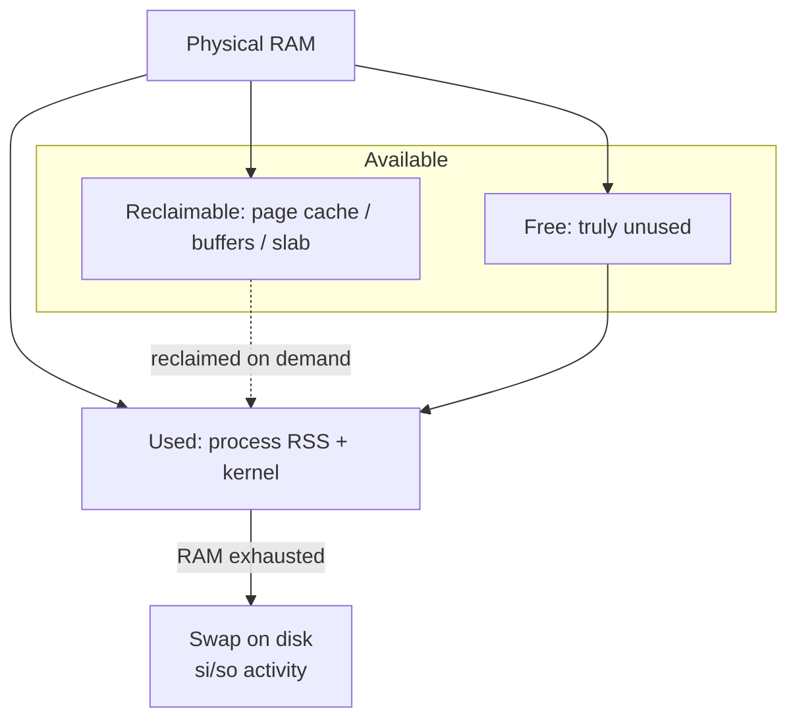

# Memory Management in Linux

## Overview

Memory management is central to monitoring system performance, capacity planning, and troubleshooting. On a healthy Linux host, the kernel aggressively uses "free" RAM for page cache and buffers, so raw free memory is rarely the right metric — you must reason about *available* memory, swap pressure, and per-process usage instead. This note collects the essential command-line tools (`free`, `vmstat`, `iostat`, and `lsof`) for observing and diagnosing memory and I/O behaviour on production systems.

> [!NOTE]
> Linux deliberately keeps RAM busy: cache and buffers are reclaimable on demand. A low `free` value with high `available` is normal and healthy — it is not a leak.

## Concepts

| Term | Meaning |
|------|---------|
| **Used** | Memory actively held by processes and the kernel |
| **Free** | Completely unused memory (usually small and expected) |
| **Buff/Cache** | Reclaimable page cache, buffers, and slab — reused instantly when apps need RAM |
| **Available** | Best estimate of memory available for new processes *without swapping* |
| **Swap** | Disk-backed overflow used when physical RAM is exhausted |
| **RSS** | Resident Set Size — physical RAM a process currently occupies |

## Architecture

Linux treats physical RAM as a tiered resource. Anonymous process memory and the kernel take priority, while the page cache and buffers opportunistically fill whatever RAM is left over. Because cache and buffers are *reclaimable*, the kernel can hand that memory back to a process instantly — which is why **available** memory, not **free** memory, is the number that matters. Only when reclaimable memory is exhausted does the kernel fall back to disk-backed **swap**, and sustained swapping is the classic signal of memory pressure.



> [!IMPORTANT]
> `Available` ≈ `Free` + most of `Buff/Cache`. A host can show almost no `free` memory yet be perfectly healthy, because the cache is reclaimable. Alert on falling `available` and rising swap, never on low `free`.

## Commands

### Checking Memory Usage with `free`

The `free` command displays available and used memory in the system.

- Shows memory usage in a human-readable format:

```bash
free -h
```

- Displays memory usage in gigabytes:

```bash
free -g
```

- Displays memory usage in megabytes:

```bash
free -m
```

- Displays memory usage in kilobytes:

```bash
free -k
```

> [!TIP]
> Add `-s <seconds>` to poll continuously (e.g. `free -h -s 2`) and watch the `available` column trend during a load test.

### Monitoring System Performance with `vmstat`

The `vmstat` command provides detailed system performance statistics, including CPU, memory, and disk usage.

- Displays CPU and memory usage statistics:

```bash
vmstat
```

- Shows active and inactive memory:

```bash
vmstat -a
```

- Displays disk statistics:

```bash
vmstat -d
```

- Shows statistics in kilobytes:

```bash
vmstat -S k
```

- Shows statistics in megabytes:

```bash
vmstat -S M
```

- Continuous monitoring: 5 reports every 4 seconds:

```bash
vmstat 4 5
```

- Same as above but in megabytes:

```bash
vmstat -S M 4 5
```

- Includes timestamp in output (megabytes with time):

```bash
vmstat -t 4 5 -S M
```

> [!IMPORTANT]
> In `vmstat` output, sustained non-zero values in the `si`/`so` (swap in/out) columns indicate the system is actively swapping — a strong signal of memory pressure that hurts performance.

### Disk and CPU Performance with `iostat`

The `iostat` command helps analyze CPU and disk I/O performance.

- Install `iostat` if not available:

```bash
yum install sysstat
```

- Displays CPU and disk performance statistics:

```bash
iostat
```

- Updates the statistics 5 times at 4-second intervals:

```bash
iostat 4 5
```

> [!NOTE]
> **📸 Screenshot**
> _Capture: Terminal running `iostat 4 5` showing repeating CPU utilization and per-device tps/kB_read/kB_wrtn columns updating every four seconds_

### Listing Open Files with `lsof`

The `lsof` (List Open Files) command displays files opened by processes. Because Linux treats sockets, pipes, and devices as files, `lsof` is equally useful for tracing network connections and file-descriptor leaks.

- Install `lsof` if not available:

```bash
yum install lsof
```

#### Basic Usage

- Lists all open files:

```bash
lsof
```

- Shows open files for user root:

```bash
lsof -u root
```

- Shows open files for user armour:

```bash
lsof -u armour
```

- Displays open files for root, without resolving hostnames:

```bash
lsof -u root -n
```

#### Checking Network Connections

- Lists all open network connections:

```bash
lsof -i
```

- Same as above, but without resolving hostnames:

```bash
lsof -i -n
```

- Lists open TCP connections:

```bash
lsof -n -i TCP
```

- Lists open UDP connections:

```bash
lsof -n -i UDP
```

- Shows processes using port 22 (SSH):

```bash
lsof -n -i TCP:22
```

- Shows processes on ports 80 (HTTP), 443 (HTTPS), 22 (SSH):

```bash
lsof -n -i TCP:80,443,22
```

- Displays TCP connections within port range 80–500:

```bash
lsof -n -i TCP:80-500
```

- Shows UDP connections on port 53 (DNS):

```bash
lsof -n -i UDP:53
```

#### Managing Open File Descriptors

- Lists open files for process ID 6020:

```bash
lsof -n -p 6020
```

- Displays open network files for process 1571:

```bash
lsof -n -i -p 1571
```

- Shows IPv4 connections:

```bash
lsof -n -i 4
```

- Shows IPv6 connections:

```bash
lsof -n -i 6
```

#### Killing Processes with `lsof`

Kill all processes owned by user armour:

```bash
kill -9 `lsof -t -u armour`
```

> [!WARNING]
> `kill -9` sends `SIGKILL`, which terminates processes immediately with no chance to flush buffers or clean up. Killing *all* of a user's processes can log them out and drop their sessions — prefer a targeted `SIGTERM` (`kill <pid>`) first.

## Examples

Diagnose a suspected memory leak on a busy server:

```bash
# 1. Snapshot memory and confirm swap is being consumed
free -h

# 2. Watch swap-in / swap-out and run queue over time
vmstat -t 4 5 -S M

# 3. Rule out disk I/O as the bottleneck
iostat 4 5

# 4. Find which process holds the most open descriptors
lsof -n | awk '{print $1, $2}' | sort | uniq -c | sort -rn | head
```

## Best Practices

- Track **available** memory, not free memory — the kernel intentionally caches with spare RAM.
- Baseline `vmstat` and `iostat` under normal load so anomalies stand out during incidents.
- Investigate file-descriptor growth early: leaking descriptors eventually hits `ulimit -n` and causes "Too many open files" errors.
- Install `sysstat` and enable its collector (`sar`) for historical trend data instead of point-in-time snapshots.

## Security Considerations

- `lsof -i` is a fast triage tool during incident response: it maps listening sockets and active connections to owning PIDs and users, exposing rogue listeners or reverse shells.
- Restrict who can read `/proc/<pid>` and run process-listing tools; on multi-tenant hosts, mount `/proc` with `hidepid=2` so users cannot enumerate other users' processes.
- Unexplained processes with open network files, or a user owning far more processes than expected, warrant investigation before you `kill` them.

## Troubleshooting

| Symptom | Likely Cause | First Check |
|---------|--------------|-------------|
| System sluggish, high `si`/`so` | Swapping under memory pressure | `vmstat 4 5`, `free -h` |
| "Too many open files" | Descriptor leak / low `ulimit` | `lsof -n -p <pid>`, `ulimit -n` |
| Disk-bound, not CPU-bound | I/O saturation | `iostat 4 5` (watch `%util`) |
| Port already in use | Stale process holding the port | `lsof -n -i TCP:<port>` |

## Summary of Memory & Process Monitoring Commands

| Command | Purpose |
|---|---|
| `free -h` | Show memory usage in human-readable format |
| `vmstat 4 5` | Monitor CPU and memory stats every 4s, 5 times |
| `iostat` | View CPU and disk performance |
| `lsof -u armour` | List files opened by user armour |
| `lsof -n -i TCP:22` | Show processes using port 22 (SSH) |
| `kill -9 \`lsof -t -u armour\`` | Kill all processes owned by armour |

## References

| Source | Covers |
|--------|--------|
| `man free` | Human-readable RAM/swap summary and its columns |
| `man vmstat` | Virtual-memory, swap-in/swap-out, and system activity |
| `man iostat` | CPU and per-device I/O statistics (part of sysstat) |
| `man lsof` | Open files and mappings held by a process |
| sysstat project documentation | `iostat`, `sar`, `mpstat` historical performance data |

## Related

- [Process-Management-in-Linux](Process-Management-in-Linux.md) — processes consume the memory tracked here.
- [Service-Management-in-Linux](Service-Management-in-Linux.md) — services are long-running processes with their own memory footprint.
- [Linux Administration & Server Hardening](../Readme.md) — Linux administration & server hardening hub.
