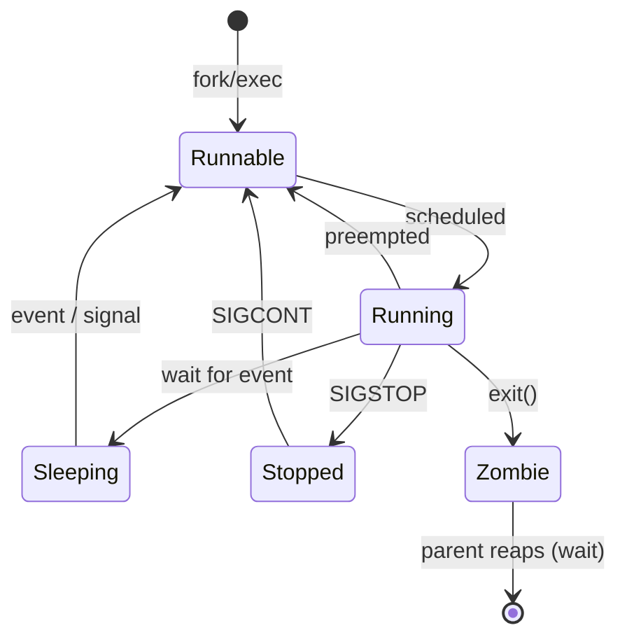

# Process Management in Linux

## Overview

Process management in Linux involves monitoring, controlling, and terminating processes to ensure system stability and performance. Every running program is a process identified by a unique PID, owned by a user, and assigned a scheduling priority. Administrators use a small, dependable toolkit — job control, `ps`, `top`/`htop`, and the `kill` family — to inspect what is running and to reclaim resources from misbehaving or runaway programs. This note covers the most commonly used commands and their usage.

## Concepts

| Term | Meaning |
|------|---------|
| **PID** | Unique numeric Process ID assigned by the kernel |
| **Foreground job** | Attached to the terminal; holds the shell until it exits |
| **Background job** | Detached from the terminal (`&`); shell remains usable |
| **Signal** | Asynchronous notification sent to a process (e.g. `SIGTERM`, `SIGKILL`) |
| **Daemon** | Long-running background service with no controlling terminal |
| **Zombie** | Terminated child not yet reaped by its parent |

### Process Signals

| Signal | Number | Effect |
|--------|--------|--------|
| `SIGTERM` | 15 | Polite request to terminate; process can clean up (default for `kill`) |
| `SIGKILL` | 9 | Immediate, unconditional kill; cannot be caught or ignored |
| `SIGHUP` | 1 | Hang-up; often used to make daemons reload config |
| `SIGSTOP` / `SIGCONT` | 19 / 18 | Pause / resume a process |

> [!TIP]
> Always try the default `SIGTERM` (`kill <pid>`) before escalating to `SIGKILL` (`kill -9`). `SIGKILL` gives the process no chance to flush data or release locks, which can corrupt files or leave stale lockfiles.

## Architecture

Every process moves through a small set of kernel states over its lifetime. The `STAT` column in `ps` and the `S` column in `top` report the current state, and reading it correctly is the fastest way to explain why a process is stuck, unkillable, or lingering as a zombie.

| State | `ps` code | Meaning |
|-------|:---------:|---------|
| Running / Runnable | `R` | Executing on a CPU or waiting in the run queue |
| Interruptible sleep | `S` | Waiting for an event; can be woken by a signal (the common idle state) |
| Uninterruptible sleep | `D` | Blocked in a kernel call (usually I/O); **cannot** be killed until it returns |
| Stopped | `T` | Suspended by a job-control signal (`SIGSTOP`, Ctrl+Z) |
| Zombie | `Z` | Exited but not yet reaped by its parent; holds only a PID slot |



> [!WARNING]
> A process in **`D` (uninterruptible sleep)** ignores every signal, including `SIGKILL` — it is blocked inside the kernel, typically on stuck disk or NFS I/O. It cannot be forced to die; you must clear the underlying I/O (or reboot). Do not keep hammering `kill -9`.

## Commands

### Running Commands in Background & Foreground

- Run in foreground:

```bash
ping 8.8.8.8
```

- Run in background:

```bash
ping 8.8.8.8 &
```

- Send output to `/dev/null` and run in background:

```bash
ping 8.8.8.8 > /dev/null &
```

```bash
seq 100000000000000000000000 > /dev/null &
```

### Managing Jobs

- List background jobs:

```bash
jobs
```

- Bring the last job to the foreground:

```bash
fg
```

- Bring job number 2 to the foreground:

```bash
fg %2
```

> [!NOTE]
> Job control is per-shell. `jobs`, `fg`, and `%n` only see jobs started from the current shell session — they do not list system-wide processes. Use `ps` or `top` for that.

### Viewing Processes with `ps`

- Current shell processes:

```bash
ps
```

- Detailed process info:

```bash
ps -l
```

- All processes with CPU/memory usage (BSD style):

```bash
ps aux
```

- All processes (standard style):

```bash
ps -e
```

- Tree view of processes:

```bash
ps -axjf
```

- Processes owned by root:

```bash
ps -U root -u root u
```

- Processes owned by user `armour`:

```bash
ps -U armour -u armour u
```

### Monitoring Processes in Real-Time

- View real-time running processes:

```bash
top
```

- Install `htop` (modern alternative):

Debian/Ubuntu

```bash
apt install htop
```

RHEL/CentOS

```bash
yum install htop
```

- Interactive process monitor:

```bash
htop
```

- Show tree structure:

```bash
htop -t
```

- Show processes for a specific user:

```bash
htop -u armour
```

- Monitor a specific PID:

```bash
htop -p 2780
```

> [!NOTE]
> **📸 Screenshot**
> _Capture: htop running in a terminal showing color-coded per-core CPU meters, a memory/swap gauge, and a sortable process list with PID, USER, CPU%, and MEM% columns_

### Killing Processes

- Kill by PID:

```bash
kill 2526
```

- Force kill (SIGKILL):

```bash
kill -9 1891
```

- Killall instances of a command:

```bash
yum install psmisc
```

```bash
killall seq
```

```bash
killall gdm
```

- Kill processes using regex pattern:

```bash
killall -r firefox
```

- Kill processes owned by user `armour`:

```bash
killall -u armour
```

- Kill by process name:

```bash
pkill ping
```

- Kill all processes for a user:

```bash
pkill -u armour
```

- Kill exact process name owned by a user:

```bash
pkill -u armour -x ping
```

> [!WARNING]
> `killall gdm` and `pkill -u <user>` are blunt instruments. Killing the display manager or every process a user owns will terminate active sessions. Double-check the target with `pgrep -a <name>` before running the kill.

## Examples

Find and stop a runaway process consuming CPU:

```bash
# 1. Identify the top CPU consumer
ps aux --sort=-%cpu | head

# 2. Confirm the exact process by name
pgrep -a seq

# 3. Ask it to stop gracefully first
kill 2526

# 4. Only if it ignores SIGTERM, force it
kill -9 2526
```

## Best Practices

- Escalate signals gradually: `SIGTERM` first, `SIGKILL` only as a last resort.
- Prefer `pkill`/`killall` with the most specific match possible (`pkill -u user -x name`) to avoid collateral damage.
- Use `htop` for interactive triage (sorting, filtering, tree view) and `ps aux` for scriptable, reproducible snapshots.
- For long-running background work over SSH, use `tmux`, `screen`, or `nohup` so the job survives disconnection.

## Security Considerations

- Process listings reveal command lines, which may leak secrets passed as arguments (passwords, tokens). Prefer environment variables or files over command-line credentials.
- On multi-tenant systems, mount `/proc` with `hidepid=2` so unprivileged users cannot enumerate or inspect other users' processes.
- Unexpected processes, especially ones owning network connections or running from `/tmp`, warrant investigation during incident response — correlate with `lsof -p <pid>` and the executable path.

## Troubleshooting

| Symptom | Likely Cause | First Check |
|---------|--------------|-------------|
| Process won't die | Uninterruptible sleep (`D` state) on I/O | `ps -eo pid,stat,cmd`; wait for I/O or reboot |
| High load, idle CPU | Processes blocked on disk/NFS | `top` load average vs `%wa` |
| Orphaned/zombie processes | Parent failed to reap children | `ps aux | grep 'Z'`; restart/kill parent |
| Job lost after logout | Ran without `nohup`/`tmux` | Re-run under `tmux` or `nohup ... &` |

## Summary of Process Management Commands

| Command | Purpose |
|---------------|----------------------------------------|
| `jobs` | List background jobs |
| `fg` | Bring a job to the foreground |
| `ps aux` | View all processes |
| `top` / `htop` | Monitor system processes in real-time |
| `kill PID` | Terminate a process by PID |
| `killall name` | Kill all instances of a process |
| `pkill name` | Kill by process name |

## References

| Source | Covers |
|--------|--------|
| `man ps` | Snapshot process listing, output formats, and sort keys |
| `man kill` | Sending signals to a process by PID |
| `man pkill` / `man pgrep` | Matching and signalling processes by name/attributes |
| `man killall` | Signalling every process matching a name |
| `man top` | Interactive real-time process and load monitor |
| htop project documentation | The `htop` interactive monitor (tree, filter, per-core meters) |

## Related

- [Memory-Management-in-Linux](Memory-Management-in-Linux.md) — the memory footprint of the processes managed here.
- [Service-Management-in-Linux](Service-Management-in-Linux.md) — managing daemon processes via init systems.
- [Linux Administration & Server Hardening](../Readme.md) — Linux administration & server hardening hub.
