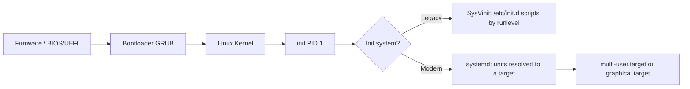

# Service Management in Linux

## Overview

Service management in Linux refers to controlling background processes (services, or *daemons*) that handle system functions such as networking, logging, and web hosting. Services can be managed using different init systems depending on the Linux distribution: **SysVinit** (legacy), **chkconfig** (runlevel control on SysVinit), and **systemd** (the modern standard on virtually all current distributions).

Managing services is a fundamental part of system administration. Services are background processes that provide core functionality such as networking, web hosting, and logging, and they must be started, stopped, monitored, and configured to launch (or not) at boot.

## Concepts

### Key Features of Linux Services

- Run as background processes (daemons) without direct user interaction.
- Controlled by init systems like SysVinit or systemd.
- Configuration files are usually in `/etc`.
- Logs are typically stored under `/var/log`.

### Init System at a Glance

`systemd` is process 1 (PID 1) on modern systems. It parses *unit* files, resolves their dependencies, and brings the system up to a target state. SysVinit, by contrast, ran ordered shell scripts under `/etc/init.d/` selected by numeric runlevels.



## Architecture

### Managing Services with SysVinit (`/etc/init.d/`)

Legacy method used in older Debian-based or SysVinit-enabled systems (Debian/Ubuntu before systemd, RHEL ≤ 6). Each service is a shell script that accepts verbs like `start`, `stop`, and `status`.

- List available service scripts:

```bash
cd /etc/init.d/
```

```bash
ls -lh /etc/init.d/
```

- View specific service script:

```bash
cat /etc/init.d/apache2
```

- Check status:

```bash
/etc/init.d/apache2 status
```

- Start service:

```bash
/etc/init.d/apache2 start
```

- Stop service:

```bash
/etc/init.d/apache2 stop
```

- Restart service:

```bash
/etc/init.d/apache2 restart
```

- Reload configuration:

```bash
/etc/init.d/apache2 force-reload
```

### Managing Services with the `service` Command (Legacy)

Wrapper command for SysVinit scripts (on systemd hosts it redirects to `systemctl`):

- Check status:

```bash
service apache2 status
```

- Start service:

```bash
service apache2 start
```

- Stop service:

```bash
service apache2 stop
```

- Restart service:

```bash
service apache2 restart
```

- Reload configuration:

```bash
service apache2 reload
```

## Commands

### Managing Services with `systemctl` (systemd)

Modern distributions like RHEL 7+, CentOS 7+, Ubuntu 16.04+, and Debian Jessie+ use **systemd**.

- Checking service status:

```bash
systemctl status httpd.service
```

- Starting and stopping:

```bash
systemctl start httpd.service
```

```bash
systemctl stop httpd.service
```

- Restart and reload:

```bash
systemctl restart httpd.service
```

```bash
systemctl reload httpd.service
```

> [!TIP]
> `restart` stops and starts the daemon (dropping connections); `reload` asks it to re-read config without restarting. Prefer `reload` for zero-downtime config changes where the service supports it.

- Manage startup behavior:

```bash
systemctl enable httpd.service
```

```bash
systemctl disable httpd.service
```

```bash
systemctl is-enabled httpd.service
```

> [!IMPORTANT]
> `start`/`stop` affect the service *right now*; `enable`/`disable` control whether it launches *at boot*. They are independent — enabling a service does not start it in the current session (use `systemctl enable --now` to do both).

- All active services:

```bash
systemctl list-units --type=service
```

- Running services:

```bash
systemctl list-units --type=service --state=running
```

- Failed services:

```bash
systemctl list-units --type=service --state=failed
```

- Prevents running, even manually:

```bash
systemctl mask bluetooth
```

- Re-enable service:

```bash
systemctl unmask bluetooth
```

- Service logs:

```bash
journalctl -u httpd.service
```

- Last 1 hour logs:

```bash
journalctl -u httpd.service --since "1 hour ago"
```

- Live logs:

```bash
journalctl -u httpd.service -f
```

> [!NOTE]
> **📸 Screenshot**
> _Capture: Terminal output of `systemctl status httpd.service` showing the green "active (running)" line, main PID, memory usage, and the most recent journal log lines for the unit_

### chkconfig (SysVinit Runlevel Management)

Used to enable/disable services at specific runlevels in SysVinit-based systems.

- Show all services:

```bash
chkconfig --list
```

- Enable/disable service:

```bash
chkconfig httpd on
```

- Disable network service:

```bash
chkconfig httpd off
```

- Runlevel example (3 = multi-user, text mode):

```bash
chkconfig --list | grep 3:on
```

```bash
chkconfig --level 35 httpd on
```

```bash
chkconfig --level 0126 network off
```

## Configuration

### Linux Runlevels (SysVinit)

| Runlevel | Meaning |
|:--------:|---------|
| **0** | Shutdown |
| **1** | Single user mode (maintenance) |
| **2** | Multi-user (no networking on some distros) |
| **3** | Multi-user (text mode, networking) |
| **4** | Reserved (custom use) |
| **5** | Multi-user with GUI |
| **6** | Reboot |

> [!NOTE]
> Under systemd, runlevels map to *targets*: runlevel 3 ≈ `multi-user.target`, runlevel 5 ≈ `graphical.target`. Query the current target with `systemctl get-default`.

### Anatomy of a systemd Unit File

Unit files under `/etc/systemd/system/` (admin overrides) and `/usr/lib/systemd/system/` (packaged defaults) describe how a service is started, its dependencies, and when it launches. A minimal service unit:

```ini
[Unit]
Description=Example application service
After=network.target

[Service]
Type=simple
ExecStart=/usr/local/bin/myapp --config /etc/myapp/config.yml
Restart=on-failure
User=myapp

[Install]
WantedBy=multi-user.target
```

| Section | Key directives | Purpose |
|---------|----------------|---------|
| `[Unit]` | `Description`, `After`, `Requires`, `Wants` | Metadata and ordering/dependency relationships |
| `[Service]` | `Type`, `ExecStart`, `Restart`, `User` | How the daemon runs and how failures are handled |
| `[Install]` | `WantedBy`, `Alias` | The target a service attaches to when `enable`d |

> [!TIP]
> After editing any unit file, run `systemctl daemon-reload` so systemd re-reads it before you `restart` the service. Run services under a dedicated non-root `User=` wherever possible to shrink the blast radius of a compromise.

## Examples

Deploy and lock down a web service so it starts at boot and cannot be started by accident when decommissioned:

```bash
# Enable and start Apache in one step, then verify
systemctl enable --now httpd.service
systemctl status httpd.service

# Later: fully disable a retired service so even a manual start fails
systemctl stop bluetooth
systemctl mask bluetooth
```

## Best Practices

- On modern systems, standardize on `systemctl` and `journalctl`; treat SysVinit/`chkconfig` as legacy-only.
- Use `mask` (not just `disable`) for services that must never run — masking symlinks the unit to `/dev/null` and blocks manual starts.
- Audit `systemctl list-units --type=service --state=failed` after every reboot and deployment.
- Keep the boot surface minimal: disable services you do not need. Fewer running daemons means a smaller attack surface (CIS Benchmark guidance).

## Security Considerations

- Every enabled network service is exposed attack surface. Disable or mask unused daemons (e.g. `bluetooth`, printing, RPC) per CIS Benchmarks.
- Review `systemctl list-unit-files --state=enabled` to confirm only intended services launch at boot; an unexpected enabled unit can be a persistence mechanism.
- Protect unit files. A writable `.service` file or a service running as root with a modifiable `ExecStart` is a privilege-escalation vector — keep `/etc/systemd/system/` and `/etc/init.d/` owned by root and non-world-writable.
- Use `journalctl -u <service>` during incident response to reconstruct a daemon's start/stop and crash history.

## Troubleshooting

| Symptom | Likely Cause | First Check |
|---------|--------------|-------------|
| Service won't start | Config error or port in use | `systemctl status <svc>`, `journalctl -u <svc>` |
| Enabled but not running after boot | Failed dependency | `systemctl list-dependencies <svc>` |
| Starts manually but not at boot | Not enabled | `systemctl is-enabled <svc>` |
| `mask` blocks a needed service | Left masked from earlier | `systemctl unmask <svc>` |

## Comparison: SysVinit vs systemd

| Action | SysVinit (service) | systemd (systemctl) |
| :-- | :-- | :-- |
| Start service | `service apache2 start` | `systemctl start apache2` |
| Stop service | `service apache2 stop` | `systemctl stop apache2` |
| Restart service | `service apache2 restart` | `systemctl restart apache2` |
| Reload config | `service apache2 reload` | `systemctl reload apache2` |
| Check status | `service apache2 status` | `systemctl status apache2` |
| Enable service | Not applicable | `systemctl enable apache2` |
| Disable service | Not applicable | `systemctl disable apache2` |

## References

| Source | Covers |
|--------|--------|
| `man systemctl` | Controlling the systemd system and service manager |
| `man journalctl` | Querying the systemd journal (per-unit logs, filters, follow) |
| `man systemd.service` | `.service` unit file syntax and `[Service]` directives |
| `man chkconfig` | Legacy SysVinit runlevel enable/disable |
| CIS Benchmarks | Guidance on disabling unnecessary services to reduce attack surface |

## Related

- [Process-Management-in-Linux](Process-Management-in-Linux.md) — services are managed processes with PIDs and signals.
- [Systemd-Timers-in-Linux](Systemd-Timers-in-Linux.md) — schedule service execution with systemd timer units.
- [Running-Custom-Scripts-on-Shutdown-Boot-Login-and-Logout-with-Systemd](Running-Custom-Scripts-on-Shutdown-Boot-Login-and-Logout-with-Systemd.md) — hook custom scripts into systemd lifecycle events.
- [Linux Administration & Server Hardening](../Readme.md) — Linux administration & server hardening hub.
