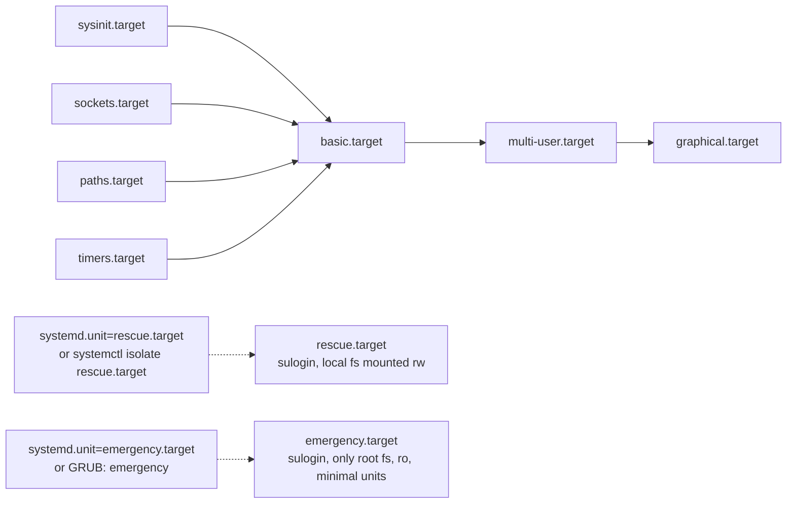

# Systemd Targets and Rescue Mode

**Targets** are systemd's replacement for SysV **runlevels** — named synchronization points that group units (services, mounts, sockets, other targets) into a system state such as multi-user or graphical. Understanding targets is essential for controlling boot behavior and for recovering a system via **rescue** or **emergency** mode when something goes wrong.

## Overview

| Concept | SysV equivalent | systemd unit |
| :-- | :-- | :-- |
| Default boot state | `/etc/inittab` `initdefault` | `systemctl get-default` / `set-default` |
| Single-user mode | runlevel 1 | `rescue.target` |
| Minimal recovery shell | (no direct equivalent) | `emergency.target` |
| Networked, no GUI | runlevel 3 | `multi-user.target` |
| Networked, with GUI | runlevel 5 | `graphical.target` |
| Halt / reboot | runlevel 0 / 6 | `poweroff.target` / `reboot.target` |

> [!NOTE]
> **Targets are groups, not stages**
> Unlike runlevels, which were strictly ordered numeric stages, a target is just a unit that other units declare a dependency on (`WantedBy=`, `Requires=`, `After=`). `systemd` still ships `runlevel0.target` … `runlevel6.target` as **symlink aliases** to the real targets, purely for backward compatibility with scripts and admins that think in runlevel numbers.

### Runlevel-to-Target Mapping

| Runlevel | Meaning | Target | Alias unit |
| :-- | :-- | :-- | :-- |
| 0 | Halt / power off | `poweroff.target` | `runlevel0.target` |
| 1, s, single | Single-user / maintenance | `rescue.target` | `runlevel1.target` |
| 2 | Multi-user, no display manager (historically) | `multi-user.target` | `runlevel2.target` |
| 3 | Multi-user, networked, text console | `multi-user.target` | `runlevel3.target` |
| 4 | Unused / custom | `multi-user.target` | `runlevel4.target` |
| 5 | Multi-user, networked, graphical login | `graphical.target` | `runlevel5.target` |
| 6 | Reboot | `reboot.target` | `runlevel6.target` |

Both CentOS Stream 10 and Debian 12 ship the same mapping — systemd unified what used to be distribution-specific runlevel conventions (Debian's historic 2–5 "all identical" scheme vs. RHEL's stricter 3/5 split).

## Architecture

`graphical.target` and `multi-user.target` are cumulative — `graphical.target` pulls in everything `multi-user.target` needs, which in turn pulls in `basic.target`. `rescue.target` and `emergency.target` sit outside this normal chain and are reached only explicitly (boot parameter or `isolate`).



## Commands

### View and Change the Default Boot Target

1. Show the target the system boots into:

> Example:

```bash
systemctl get-default
```

2. Set the default boot target (persists across reboots by rewriting the `default.target` symlink):

> Example:

```bash
systemctl set-default multi-user.target
```

```bash
systemctl set-default graphical.target
```

> [!NOTE]
> `set-default` only changes what happens on the **next** boot. It does not switch the currently running system — use `isolate` for that.

### Switch the Running System's State

3. Isolate (switch to) a target right now — stops units not required by the target, starts units it requires:

> Example:

```bash
systemctl isolate multi-user.target
```

```bash
systemctl isolate graphical.target
```

> [!IMPORTANT]
> `systemctl isolate` on a running server drops a text-only session straight to `multi-user.target` — it will **stop your display manager** if you isolate down from `graphical.target`. Confirm the current state first with `systemctl get-default` or `systemctl list-units --type=target`.

### Inspect Available and Active Targets

4. List all currently active target units:

```bash
systemctl list-units --type=target
```

5. List all targets, including inactive/unloaded ones known to systemd:

```bash
systemctl list-units --type=target --all
```

6. Show a target's dependency tree (what it requires/wants and what requires it):

```bash
systemctl list-dependencies multi-user.target
```

### Power State Transitions

Modern `reboot`, `poweroff`, and `halt` are thin wrappers that call the equivalent `systemctl` action, which in turn isolates the matching target.

```bash
systemctl reboot
```

```bash
systemctl poweroff
```

```bash
systemctl halt
```

| Command | Underlying target |
| :-- | :-- |
| `reboot` / `systemctl reboot` | `reboot.target` |
| `poweroff` / `systemctl poweroff` | `poweroff.target` |
| `halt` / `systemctl halt` | `halt.target` |

Both CentOS Stream 10 and Debian 12 symlink `/sbin/reboot`, `/sbin/poweroff`, and `/sbin/halt` into `systemd`, so these bare commands and their `systemctl` equivalents behave identically on either distribution.

## Rescue Mode vs. Emergency Mode

| Aspect | `rescue.target` | `emergency.target` |
| :-- | :-- | :-- |
| Filesystems | All local filesystems from `/etc/fstab` are mounted (read-write) | Only the root filesystem, mounted **read-only** |
| Services started | Basic system services (`basic.target` dependencies) plus a rescue shell | Almost nothing — bare minimum, no `basic.target` |
| Networking | Not started by default | Not started |
| Login prompt | `sulogin` asks for the root password | `sulogin` asks for the root password |
| Typical use | Fixing a broken service, package, or config while most of the OS is usable | Recovering from a broken `fstab`, corrupt filesystem, or failed boot before mounts happen |

### Reaching Rescue or Emergency Mode via GRUB

At the GRUB menu, highlight the boot entry, press `e` to edit, locate the line beginning with `linux` (or `linux16`), move to the end of it, and append one of:

```text
systemd.unit=rescue.target
```

```text
systemd.unit=emergency.target
```

Then boot the edited entry (`Ctrl-x` on GRUB2, or `F10`). This is a **one-time, non-persistent** edit — it does not survive the next reboot.

To reach the same states from a running system without rebooting, use `isolate`:

> Example:

```bash
systemctl isolate rescue.target
```

```bash
systemctl isolate emergency.target
```

### Resetting Root When the Password Is Unknown (`rd.break`)

When you cannot authenticate at `sulogin` at all (lost root password), drop into the **initramfs** before the real root is even mounted, so no password is required yet:

- **CentOS Stream 10 / RHEL family (dracut initramfs)** — append `rd.break` to the `linux` line in the GRUB editor:

```text
rd.break
```

```bash
mount -o remount,rw /sysroot
```

```bash
chroot /sysroot
```

```bash
passwd root
```

```bash
touch /.autorelabel
```

```bash
exit
```

```bash
reboot -f
```

`touch /.autorelabel` is required on SELinux-enforcing systems so the relabeled `/etc/shadow` gets a correct security context on the next boot.

- **Debian 12 (initramfs-tools, no dracut `rd.break` support)** — append `init=/bin/bash` to the `linux` line instead, which boots straight to a root shell bypassing systemd entirely:

```text
init=/bin/bash
```

```bash
mount -o remount,rw /
```

```bash
passwd root
```

```bash
exec /sbin/init
```

> [!NOTE]
> Full step-by-step password-reset and GRUB-hardening coverage lives in [Reset-Root-Password-and-Protect-GRUB-Boot-Loader](../Security-Firewall-and-Monitoring/Reset-Root-Password-and-Protect-GRUB-Boot-Loader.md) — this note only shows how the technique connects to targets/boot parameters.

### Persisting a Rescue-Mode Boot Parameter

A one-time GRUB edit does not survive reboot. To make a kernel parameter permanent, edit `/etc/default/grub` and regenerate the config — the regeneration command differs by distro:

- **CentOS Stream 10**:

```bash
vim /etc/default/grub
```

```bash
grub2-mkconfig -o /boot/grub2/grub.cfg
```

- **Debian 12**:

```bash
vim /etc/default/grub
```

```bash
update-grub
```

See [GRUB2-Bootloader-Configuration](GRUB2-Bootloader-Configuration.md) for the full `GRUB_CMDLINE_LINUX` syntax and BIOS-vs-UEFI config paths.

## Best Practices

- Prefer `systemctl isolate` for live changes and `systemctl set-default` for the persistent default — they are not interchangeable.
- Verify the current default before scheduled maintenance: `systemctl get-default` should read `multi-user.target` on headless servers, `graphical.target` only where a GUI is genuinely needed.
- Use `emergency.target` (not `rescue.target`) when you suspect a broken `/etc/fstab` or filesystem corruption — mounting local filesystems is exactly what you're trying to avoid.
- Keep a documented, tested procedure for `rd.break` / `init=/bin/bash` recovery before you need it under pressure during an incident.
- After any rescue-mode edit, run `systemctl default` (or reboot) to return the system to its normal target and confirm all expected services re-start.

## Security Considerations

> [!WARNING]
> **Physical/console access to GRUB is root access**
> Anyone who can interrupt GRUB and append `rd.break`, `init=/bin/bash`, or `systemd.unit=rescue.target` can reset the root password or obtain a root shell **without any credentials** — this is a standard physical-access attack path, not a bug. Treat unattended console/BMC/iDRAC access to a server as equivalent to root access unless GRUB is password-protected.

- **Set a GRUB superuser password** (`grub2-setpassword` on RHEL family, `set superusers`/`password_pbkdf2` in `/etc/grub.d/40_custom` on Debian) so boot-parameter edits require authentication — see [GRUB2-Bootloader-Configuration](GRUB2-Bootloader-Configuration.md) and [Reset-Root-Password-and-Protect-GRUB-Boot-Loader](../Security-Firewall-and-Monitoring/Reset-Root-Password-and-Protect-GRUB-Boot-Loader.md).
- **Disable interactive boot menu editing** in hardened environments, or restrict it to console access that is itself physically secured.
- **Audit `sulogin` behavior** — both `rescue.target` and `emergency.target` require the root password by default; do not weaken this with `systemd.debug-shell=1` or similar on production hosts, as it opens an unauthenticated root TTY (`debug-shell.service`).
- **Log rescue/emergency entries.** These modes bypass normal service start order and, on some configurations, journald persistence — cross-check with physical/console access logs (e.g., iLO/iDRAC/IPMI SEL) during incident response since local journal evidence may be thin.

## Troubleshooting

| Symptom | Likely cause | Resolution |
| :-- | :-- | :-- |
| Boots straight into emergency mode | Broken entry in `/etc/fstab` or a failed required mount | Check `journalctl -xb`, fix `/etc/fstab`, then `systemctl default` |
| `set-default` doesn't seem to work | It only affects the **next** boot, not the running session | Use `systemctl isolate <target>` to change the current state |
| Isolated to `multi-user.target` but GUI login is gone | Expected — `isolate` stopped the display-manager unit chain under `graphical.target` | `systemctl isolate graphical.target` to restore it |
| `rd.break` prompt never appears | System uses initramfs-tools (Debian), not dracut | Use `init=/bin/bash` instead of `rd.break` |
| Password reset via `chroot` doesn't stick / SELinux denies login | Skipped `touch /.autorelabel` before reboot on an SELinux system | Re-enter rescue mode, `touch /.autorelabel`, reboot to let autorelabel run |
| GRUB edit didn't survive reboot | Edits made at the boot menu with `e` are one-time only | Edit `/etc/default/grub` and run `grub2-mkconfig`/`update-grub` |

## References

- [systemd.special(7) — special systemd units](https://man7.org/linux/man-pages/man7/systemd.special.7.html)
- [systemd.target(5) — target unit configuration](https://man7.org/linux/man-pages/man5/systemd.target.5.html)
- [bootup(7) — systemd boot process](https://man7.org/linux/man-pages/man7/bootup.7.html)
- [dracut.cmdline(7) — rd.break and other dracut kernel parameters](https://man7.org/linux/man-pages/man7/dracut.cmdline.7.html)
- [systemd — freedesktop.org documentation](https://www.freedesktop.org/wiki/Software/systemd/)

## Related

- [Linux-Boot-Process](Linux-Boot-Process.md) — where target activation fits in the overall boot sequence
- [GRUB2-Bootloader-Configuration](GRUB2-Bootloader-Configuration.md) — editing and persisting kernel boot parameters
- [Service-Management-in-Linux](Service-Management-in-Linux.md) — the services that targets group and order
- [Reset-Root-Password-and-Protect-GRUB-Boot-Loader](../Security-Firewall-and-Monitoring/Reset-Root-Password-and-Protect-GRUB-Boot-Loader.md) — full rd.break/init=/bin/bash password-reset walkthrough and GRUB hardening
- [Process, Service & Job Management](Readme.md)
- [Linux Administration & Server Hardening](../Readme.md)
