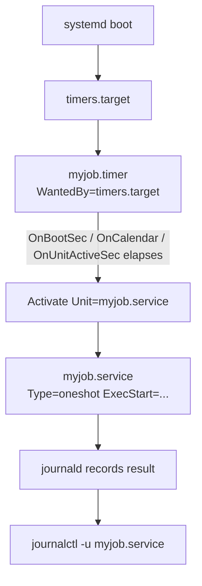

# Systemd Timers in Linux

Systemd timers are the modern, first-class replacement for **cron jobs** on `systemd`-based Linux distributions. Instead of relying on the `crond` daemon and crontab files, a timer schedules the activation of a companion `systemd` service unit, gaining tight integration with the init system, structured logging through the journal, dependency ordering, resource control, and reliability features that classic cron cannot offer.

## Overview

A systemd timer is never a self-contained job. It is always a **pair of unit files** that work together: a timer decides *when*, and a service decides *what*.

| Component | Suffix | Section that matters | Role |
|---|---|---|---|
| Timer unit | `.timer` | `[Timer]` | Defines **when** the job fires (boot-relative, activity-relative, or calendar-based). |
| Service unit | `.service` | `[Service]` | Defines **what** runs (the command, user, environment, and type). |

By convention the two files share the same base name (`myjob.timer` and `myjob.service`). When they match, the timer implicitly activates the service of the same name; otherwise you point at the service explicitly with `Unit=`.

> [!NOTE]
> `systemd` remains the default init and service manager on Debian, Ubuntu, RHEL/Rocky/Alma, Fedora, openSUSE, and Arch. On these systems timers are available out of the box — no extra package is required.

### Advantages over Cron

- Built-in, queryable logging through `journalctl` (per-unit, timestamped, filterable).
- Can run tasks **relative to boot** (`OnBootSec`) or **relative to the service's last activation** (`OnUnitActiveSec`).
- Supports **randomized delays** (`RandomizedDelaySec`) to avoid thundering-herd load across a fleet.
- Supports **persistent timers** — missed runs (system powered off) execute after the next boot.
- Rich **calendar events** (`OnCalendar`) plus all the dependency, sandboxing, and resource-control features of the service unit.

## Architecture

The following flow shows how the timer target pulls in individual timers, which in turn activate their paired services.



## Configuration

### Step 1: Create the Service Unit

The **service unit** defines the actual task. For scheduled one-off work, `Type=oneshot` is almost always what you want.

> Example:

```bash
vim /etc/systemd/system/myjob.service
```

```ini
[Unit]
Description=My Scheduled Job

[Service]
Type=oneshot
ExecStart=/usr/bin/bash -c "echo 'Hello, world!' >> /tmp/hello.txt"
```

> [!NOTE]
> `Type=oneshot` ensures the task runs once and exits. `systemd` treats the unit as "active" while the command runs, then marks it inactive on completion — the correct semantics for a scheduled job rather than a long-running daemon.

You can run the service by hand to confirm it works before wiring up the timer:

```bash
systemctl start myjob.service
```

### Step 2: Create the Timer Unit

The **timer unit** specifies *when* the paired service runs.

> Example:

```bash
vim /etc/systemd/system/myjob.timer
```

```ini
[Unit]
Description=Run My Scheduled Job Every 5 Minutes

[Timer]
OnBootSec=1min
OnUnitActiveSec=5min
Unit=myjob.service

[Install]
WantedBy=timers.target
```

| Directive | Meaning |
|---|---|
| `OnBootSec=1min` | Fire 1 minute after the system boots. |
| `OnUnitActiveSec=5min` | Fire again every 5 minutes, measured from the service's last activation. |
| `Unit=myjob.service` | Links the timer to the service it activates (optional when names match). |
| `WantedBy=timers.target` | Ensures the timer is pulled in and started at boot when enabled. |

> [!TIP]
> Combine `OnBootSec` with `OnUnitActiveSec` for "run shortly after boot, then repeat on an interval." Use `OnCalendar` (below) instead when you need to run at fixed wall-clock times rather than intervals.

## Commands

### Enable and Start

After creating or editing any unit file, reload the manager so it re-reads unit definitions, then enable the timer.

```bash
systemctl daemon-reload
```

```bash
systemctl enable myjob.timer --now
```

| Command | Effect |
|---|---|
| `systemctl daemon-reload` | Reloads systemd's in-memory view of unit files. Required after every edit. |
| `systemctl enable myjob.timer --now` | Enables the timer at boot **and** starts it immediately. |

> [!IMPORTANT]
> Enable and start the **`.timer`**, never the `.service`. Enabling the service directly would try to run it at boot rather than on schedule.

### Check Timer Status

```bash
systemctl list-timers --all
```

```bash
systemctl status myjob.timer
```

`list-timers` shows the next and previous elapse times for every timer — the fastest way to confirm your schedule is what you intended.

### Manually Run the Job

```bash
systemctl start myjob.service
```

> [!NOTE]
> **📸 Screenshot**
> _Capture: Terminal output of systemctl list-timers showing NEXT, LEFT, LAST, PASSED, UNIT and ACTIVATES columns with myjob.timer scheduled to run in a few minutes_

### Disable and Remove

```bash
systemctl stop myjob.timer
```

```bash
systemctl disable myjob.timer
```

```bash
rm /etc/systemd/system/myjob.{timer,service}
```

```bash
systemctl daemon-reload
```

## Examples

### Calendar-Based Scheduling

Instead of `OnUnitActiveSec`, you can use **calendar expressions** with `OnCalendar` for fixed wall-clock times. The general form is `DayOfWeek Year-Month-Day Hour:Minute:Second`, where `*` matches any value.

- Run **daily at 3:15 AM**

```ini
OnCalendar=*-*-* 03:15:00
```

- Run **every Monday at noon**

```ini
OnCalendar=Mon *-*-* 12:00:00
```

- Run **hourly**

```ini
OnCalendar=hourly
```

- Run **weekly**

```ini
OnCalendar=weekly
```

- You can test your calendar syntax and preview upcoming elapse times:

```bash
systemd-analyze calendar "Mon *-*-* 12:00:00"
```

| Shorthand | Equivalent expression |
|---|---|
| `minutely` | `*-*-* *:*:00` |
| `hourly` | `*-*-* *:00:00` |
| `daily` | `*-*-* 00:00:00` |
| `weekly` | `Mon *-*-* 00:00:00` |
| `monthly` | `*-*-01 00:00:00` |

### Persistent Execution

```ini
[Timer]
OnCalendar=*-*-* 03:15:00
Persistent=true
```

> [!TIP]
> `Persistent=true` ensures missed jobs (for example, when the system was powered off at the scheduled time) run immediately after the next boot. This is the systemd equivalent of `anacron` behaviour and is essential for laptops and machines that are not always on.

### Viewing Logs

Every activation is recorded in the journal. Query the service to see the job's own output, and the timer to see scheduling activity.

Check service logs:

```bash
journalctl -u myjob.service --no-pager
```

Check timer activity:

```bash
journalctl -u myjob.timer --no-pager
```

## Systemd Timers vs Cron

| Feature | Cron Jobs | Systemd Timers |
|---|---|---|
| Logging | Limited | Full logs via `journalctl` |
| Start at boot | No | Yes (with `OnBootSec`) |
| Flexibility | Fixed intervals | Randomized delays, calendar events, persistence |
| Failure handling | Manual retry | Built-in retry / dependency options |
| Missed runs | Requires `anacron` | `Persistent=true` |
| Integration | Independent daemon | Fully integrated with `systemd` (deps, sandboxing, cgroups) |

**Systemd timers** are more powerful, flexible, and observable, making them the preferred choice for scheduled work in modern Linux environments. Cron remains useful for its simplicity and portability across non-systemd systems.

## Best Practices

- Store custom timers in `/etc/systemd/system/` (system-wide) or `~/.config/systemd/user/` (per-user).
- Use **descriptive names** for `.service` and `.timer` files, and keep the two base names identical so the pairing is implicit.
- Use `Persistent=true` for critical jobs that must not be skipped when the system is offline.
- Always confirm schedules with `systemctl list-timers --all` after enabling.
- Use `RandomizedDelaySec` to stagger identical jobs across many servers and avoid synchronized load spikes.
- Run `systemd-analyze calendar "<expr>"` to validate every `OnCalendar` expression before deploying it.

## Security Considerations

Because a timer's paired service runs with the privileges systemd grants it, scheduled units are a well-known persistence and privilege-escalation surface. Harden them accordingly.

> [!WARNING]
> System-wide unit files in `/etc/systemd/system/` run as **root** by default. Any user who can write to a unit file — or to a script it invokes via `ExecStart` — can execute arbitrary code as root. Audit ownership and permissions of every unit and every path it references.

- **Lock down file permissions.** Unit files should be owned by `root:root` and mode `0644`; scripts they call should not be writable by non-root users (CIS Benchmark control for cron/at extends to systemd units).
- **Run with least privilege.** Where the job does not need root, set `User=` and `Group=` in the `[Service]` section so it runs as an unprivileged account.
- **Sandbox the service.** Apply hardening directives such as `ProtectSystem=strict`, `ProtectHome=true`, `PrivateTmp=true`, `NoNewPrivileges=true`, and `ReadWritePaths=` to limit blast radius if the job is compromised.
- **Avoid secrets on the command line.** Arguments in `ExecStart` are visible in the process table and journal; load credentials from `EnvironmentFile=` (mode `0600`) or systemd credentials instead.
- **Audit for persistence.** During incident response, enumerate all timers (`systemctl list-timers --all`) and review recently modified unit files — attackers frequently plant a `.timer`/`.service` pair for durable footholds.

## Troubleshooting

| Symptom | Likely cause | Resolution |
|---|---|---|
| Timer never fires | Timer not enabled/started, or edited without reload | `systemctl daemon-reload` then `systemctl enable --now myjob.timer` |
| "Unit not found" on enable | Typo in filename or wrong directory | Confirm file is in `/etc/systemd/system/` and named exactly `*.timer` |
| Service runs but does nothing | Wrong `ExecStart` path or missing permissions | Test with `systemctl start myjob.service` and read `journalctl -u myjob.service` |
| Missed runs after downtime | `Persistent=true` not set | Add `Persistent=true` under `[Timer]` |
| Wrong next-run time | Bad `OnCalendar` expression | Validate with `systemd-analyze calendar "<expr>"` |
| Changes not taking effect | Manager still holds old definition | Always `systemctl daemon-reload` after any edit |

> [!TIP]
> For user-scoped timers under `~/.config/systemd/user/`, prefix commands with `--user` (for example `systemctl --user list-timers`) and remember they only run while that user has an active session unless lingering is enabled with `loginctl enable-linger <user>`.

## References

- `man systemd.timer` — timer unit directives (`OnBootSec`, `OnCalendar`, `Persistent`, `RandomizedDelaySec`).
- `man systemd.time` — full calendar and time-span syntax.
- `man systemd.service` — service unit directives and hardening options.
- `systemd-analyze calendar` / `systemctl list-timers` — inspection tooling.

## Related
- [Cron-Jobs-in-Linux](Cron-Jobs-in-Linux.md) — the classic scheduler systemd timers replace
- [Service-Management-in-Linux](Service-Management-in-Linux.md) — timers activate systemd services
- [Running-Custom-Scripts-on-Shutdown-Boot-Login-and-Logout-with-Systemd](Running-Custom-Scripts-on-Shutdown-Boot-Login-and-Logout-with-Systemd.md) — related systemd unit scripting for lifecycle events
- [Process-Management-in-Linux](Process-Management-in-Linux.md) — inspecting and controlling the processes timers launch
- Privilege-Escalation — writable timers/services as an escalation and persistence vector
- [Readme](../Readme.md) — Process, Service and Job Management module index
- [Linux Administration & Server Hardening](../Readme.md) — Linux administration & server hardening hub
