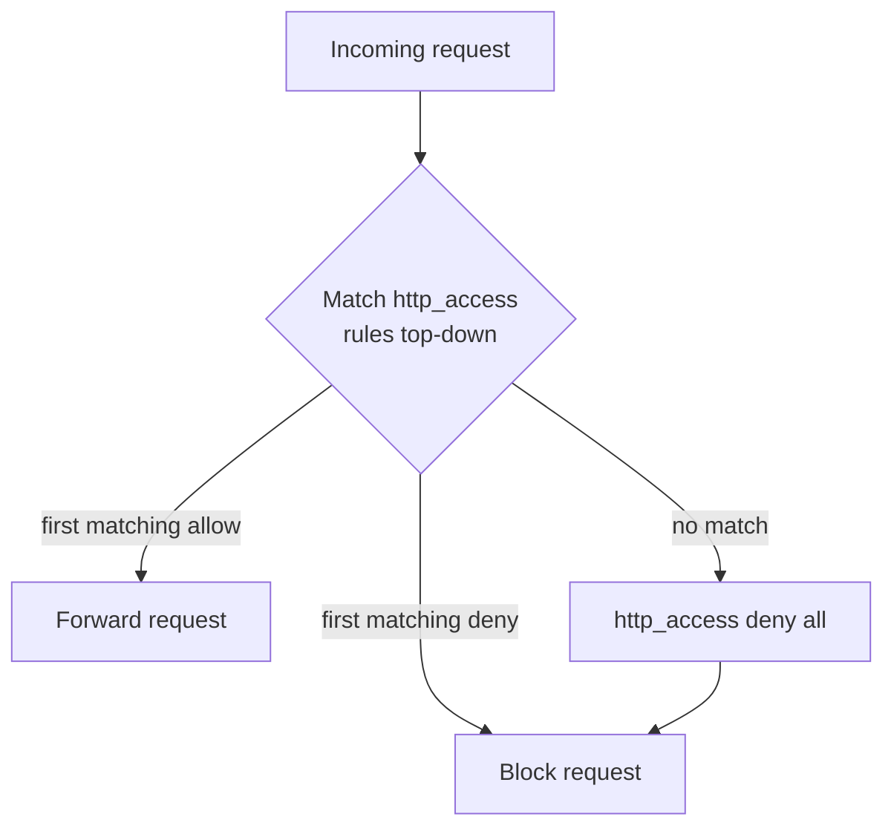

# Access Control List (ACL) in Squid Proxy

## Overview

An Access Control List (ACL) in Squid is a set of rules used to control and filter network connections, website access, and port numbers based on specific conditions. ACLs are the core of Squid's policy engine: you first **define** a named matcher (`acl`), then **act** on it with an access directive such as `http_access allow` or `http_access deny`.

For detailed official documentation, visit the [Squid ACL FAQ](https://wiki.squid-cache.org/SquidFaq/SquidAcl).

> [!IMPORTANT]
> `http_access` rules are evaluated **top to bottom, first match wins**. As soon as a request matches an `allow` or `deny` line, evaluation stops. Order therefore matters as much as the rules themselves — put specific allows/denies before broad ones, and always end with `http_access deny all`.

## Concepts



## ACL Elements (Types)

- Different ACL types define specific criteria for matching requests. Below is a table of the most commonly used ACL types:

|ACL Type|Description|
|---|---|
|`src`|Matches source (client) IP addresses|
|`dst`|Matches destination (server) IP addresses|
|`myip`|Matches the local IP address of a client's connection|
|`arp`|Matches Ethernet (MAC) address|
|`srcdomain`|Matches source (client) domain name|
|`dstdomain`|Matches destination (server) domain name|
|`srcdom_regex`|Matches source domain using regular expressions|
|`dstdom_regex`|Matches destination domain using regular expressions|
|`src_as`|Matches source Autonomous System number|
|`dst_as`|Matches destination Autonomous System number|
|`peername`|Matches name tag assigned to the cache_peer destination|
|`time`|Matches time of day and day of the week|
|`url_regex`|Matches URL patterns using regular expressions|
|`urlpath_regex`|Matches URL path (without protocol and hostname) using regular expressions|
|`port`|Matches destination (server) port number|
|`myport`|Matches local port number used by the client|
|`myportname`|Matches name tag for Squid listening port|
|`proto`|Matches transfer protocol (HTTP, FTP, etc.)|
|`method`|Matches HTTP request methods (GET, POST, etc.)|
|`http_status`|Matches HTTP response status codes (200, 302, 404, etc.)|
|`browser`|Matches user-agent header using regular expressions|
|`referer_regex`|Matches HTTP referer header using regular expressions|
|`proxy_auth`|Matches user authentication via external processes|
|`proxy_auth_regex`|Matches authentication credentials using regular expressions|
|`user_cert`|Matches against user SSL certificate attributes|
|`ca_cert`|Matches against user CA SSL certificate attributes|
|`ext_user`|Matches user field from an external ACL helper|
|`ext_user_regex`|Matches user field from external ACL using regular expressions|
|`snmp_community`|Matches SNMP community string|
|`maxconn`|Limits the number of connections from a single client IP address|
|`max_user_ip`|Limits the number of IP addresses a user can log in from|
|`req_mime_type`|Matches request content-type header using regular expressions|
|`req_header`|Matches specific request headers using regular expressions|
|`rep_mime_type`|Matches downloaded content MIME type (usable in `http_reply_access`)|
|`rep_header`|Matches reply header content (usable in `http_reply_access`)|
|`external`|Performs a lookup via an external ACL helper defined by `external_acl_type`|

## Basic ACL Syntax

- The basic syntax for defining an ACL rule is:

```bash
acl [Name] [Type] [Data]
```

Where:

> `Name`: A user-defined identifier for the ACL.
> `Type`: Specifies the type of match (e.g., IP, port, domain).
> `Data`: The matching criteria.

## ACL Examples

### Allow Local Network

To allow access only from a local network (e.g., `192.168.0.0/16`):

```conf
acl localnet src 192.168.0.0/16
http_access allow localnet
http_access deny all
```

Explanation:

- `acl localnet src 192.168.0.0/16` matches any IP address in the `192.168.x.x` range.

- `http_access allow localnet` allows access for local network users.

- `http_access deny all` denies access for everyone else.

### Restrict To Safe Ports Only

To restrict access to only safe ports (e.g., HTTP, HTTPS):

```conf
acl SSL_ports port 443
http_access deny !Safe_ports
```

Explanation:

- `acl SSL_ports port 443` defines the allowed SSL traffic (HTTPS).

- `http_access deny !Safe_ports` denies access to any traffic not using a predefined "safe" port.

## Full Minimal Squid ACL Configuration

This is the default hardened baseline shipped with Squid — restrict source ranges and safe ports, deny unsafe ports and non-SSL `CONNECT`, then default-deny at the end:

```conf
acl localnet src 0.0.0.1-0.255.255.255	# RFC 1122 "this" network (LAN)
acl localnet src 10.0.0.0/8		# RFC 1918 local private network (LAN)
acl localnet src 100.64.0.0/10		# RFC 6598 shared address space (CGN)
acl localnet src 169.254.0.0/16 	# RFC 3927 link-local (directly plugged) machines
acl localnet src 172.16.0.0/12		# RFC 1918 local private network (LAN)
acl localnet src 192.168.0.0/16		# RFC 1918 local private network (LAN)
acl localnet src fc00::/7       	# RFC 4193 local private network range
acl localnet src fe80::/10      	# RFC 4291 link-local (directly plugged) machines
acl SSL_ports port 443
acl Safe_ports port 80		# http
acl Safe_ports port 21		# ftp
acl Safe_ports port 443		# https
acl Safe_ports port 70		# gopher
acl Safe_ports port 210		# wais
acl Safe_ports port 1025-65535	# unregistered ports
acl Safe_ports port 280		# http-mgmt
acl Safe_ports port 488		# gss-http
acl Safe_ports port 591		# filemaker
acl Safe_ports port 777		# multiling http
http_access deny !Safe_ports
http_access deny CONNECT !SSL_ports
http_access allow localhost manager
http_access deny manager
http_access allow localnet
http_access allow localhost
http_access deny all
http_port 3128
coredump_dir /var/spool/squid
refresh_pattern ^ftp:		1440	20%	10080
refresh_pattern -i (/cgi-bin/|\?) 0	0%	0
refresh_pattern .		0	20%	4320
```

## Allow Specific Websites Using Squid Proxy

- You can allow access to only specific websites using ACLs that match the destination domain.

### Allow Only Google

- Open the Squid configuration file:

```bash
vim /etc/squid/squid.conf
```

- To allow access only to Google:

```conf
acl allow_website dstdomain .google.com
http_access allow allow_website
http_access deny all
```

Explanation:

> `acl allow_website dstdomain .google.com` matches any subdomain of `google.com`.
> `http_access allow allow_website` allows access to Google.
> `http_access deny all` blocks access to any other websites.

- Apply the configuration changes:

```bash
systemctl restart squid
```

### Allow Multiple Websites

- Open the Squid configuration file:

```bash
vim /etc/squid/squid.conf
```

- To allow both Google and YouTube:

```conf
acl allow_website dstdomain .google.com .youtube.com
http_access allow allow_website
http_access deny all
```

- Apply the configuration changes:

```bash
systemctl restart squid
```

### Allow Multiple Websites Using A List File

- For managing multiple allowed websites, use an external list.

- Create a new file with the allowed websites:

```bash
vim /etc/squid/allow_website_list
```

- Add the domains, one per line:

```text
.google.com
.youtube.com
.armourinfosec.com
.facebook.com
```

- Update the Squid configuration file:

```bash
vim /etc/squid/squid.conf
```

- Add the following rule:

```conf
acl allow_website dstdomain "/etc/squid/allow_website_list"
http_access allow allow_website
http_access deny all
```

- Apply the configuration changes:

```bash
systemctl restart squid
```

## Deny Access to Specific Websites

- You can block specific websites by defining ACLs that match destination domains.

### Deny Specific Websites

- Open the Squid configuration file:

```bash
vim /etc/squid/squid.conf
```

- To block access to a specific website (e.g., `google.com`):

```conf
acl deny_website dstdomain .google.com
http_access deny deny_website
```

Explanation:
> `acl deny_website dstdomain .google.com` blocks access to `google.com`.
> `http_access deny deny_website` denies access to `google.com`.

Restart Squid Service:

- Apply the configuration changes:

```bash
systemctl restart squid
```

### Deny Multiple Websites

- Open the Squid configuration file:

```bash
vim /etc/squid/squid.conf
```

- To block multiple websites:

```conf
acl deny_website dstdomain .google.com .youtube.com
http_access deny deny_website
```

Restart Squid Service:

- Apply the configuration changes:

```bash
systemctl restart squid
```

### Use External File for Website List

- To maintain a list of websites to block, use an external file.

- Create a file for blocked websites:

```bash
vim /etc/squid/deny_website_list
```

- Add websites to block (one per line):

```text
.google.com
.youtube.com
.armourinfosec.com
.facebook.com
```

- Edit the Squid configuration file:

```bash
vim /etc/squid/squid.conf
```

- Add the following rule:

```conf
acl deny_website dstdomain "/etc/squid/deny_website_list"
http_access deny deny_website
```

- Restart the Squid service to apply the changes:

```bash
systemctl restart squid
```

## Deny Access Based on Keywords in Squid

- Open the Squid configuration file:

```bash
vim /etc/squid/squid.conf
```

- Add the rule to deny URLs containing certain keywords. For instance:

```conf
acl deny_keywords url_regex -i reports news game
http_access deny deny_keywords
```

Explanation:

- `acl deny_keywords url_regex -i reports news game`: This rule matches URLs containing any of the keywords `reports`, `news`, or `game` (case-insensitive, thanks to the `-i` flag).

- `http_access deny deny_keywords`: Denies access if any of the keywords match the URL.

> [!WARNING]
> `url_regex` matches anywhere in the full URL, so a keyword like `news` will also block `bbc.com/newsletter` or a query string containing that substring. Anchor patterns carefully and test against real URLs to avoid over-blocking. Keyword filtering also does not see inside HTTPS URLs unless you are performing [SSL bump](SSL-Bump-with-Squid-Proxy.md).

- Restart the Squid service to apply the changes:

```bash
systemctl restart squid
```

### Create a List of Keywords to Block

> If you want to block additional keywords or have a more extensive list, it's better to maintain the list in a separate file.

- Create the file `/etc/squid/deny_keywords`:

```bash
vim /etc/squid/deny_keywords
```

- Add the keywords you want to block, one per line:

```text
torrent
game
news
business
sports
```

#### Update the Squid Configuration to Use the External List

> Now, you need to modify the Squid configuration to use this external list of keywords.

- Edit the Squid configuration file again:

```bash
vim /etc/squid/squid.conf
```

> Add the following rule to load the list from the file:

```conf
acl deny_keywords url_regex -i "/etc/squid/deny_keywords"
http_access deny deny_keywords
```

Explanation:

> `acl deny_keywords url_regex -i "/etc/squid/deny_keywords"` tells Squid to read the keywords from the `/etc/squid/deny_keywords` file and block any URL containing those words.
> `http_access deny deny_keywords` denies access to URLs that match the keywords.

- To apply the changes, restart the Squid service:

```bash
systemctl restart squid
```

## Deny Clients Using Squid

### Deny a Specific Client (Single IP)

> In your Squid configuration, to block access from a specific client IP (e.g., `192.168.2.51`), you can add the following rule:

- Edit the Squid configuration file:

```bash
vim /etc/squid/squid.conf
```

> Add the rule to deny the client:

```conf
acl deny_client src 192.168.2.11
http_access deny deny_client
```

> `acl deny_client src 192.168.2.51`: Defines the IP address you want to block.
> `http_access deny deny_client`: Denies access from the defined client.

- Then, restart Squid:

```bash
systemctl restart squid
```

### Deny Multiple Clients (Multiple IPs)

- If you want to deny multiple IP addresses, you can specify each one in the configuration:

```bash
vim /etc/squid/squid.conf
```

```conf
acl deny_client src 192.168.2.11 192.168.2.12 192.168.2.13 192.168.2.14
http_access deny deny_client
```

> `acl deny_client src 192.168.2.11 192.168.2.12 ...`: Lists the client IPs you want to block.
> `http_access deny deny_client`: Denies access for these clients.

- Then, restart Squid again:

```bash
systemctl restart squid
```

### Deny Clients Using an External File

- To make it easier to manage multiple blocked clients, you can store the list of IPs in an external file. Here's how:

1. Create a file to hold the denied IPs:

```bash
vim /etc/squid/deny_clients
```

> Add the IPs you want to block, one per line:

```text
192.168.2.51
192.168.2.52
192.168.2.100
192.168.2.101
192.168.2.80
192.168.2.81
192.168.2.85
192.168.2.95
192.168.2.200
```

2. Edit the Squid configuration file to reference this external file:

```bash
vim /etc/squid/squid.conf
```

> Add the following rule:

```conf
acl deny_client src "/etc/squid/deny_clients"
http_access deny deny_client
```

> `acl deny_client src "/etc/squid/deny_clients"`: Tells Squid to load the denied client list from the external file.
>`http_access deny deny_client`: Denies access to the IPs listed in the external file.

3. Restart Squid to apply the changes:

```bash
systemctl restart squid
```

## Best Practices

> [!TIP]
> - **Default-deny.** Keep `http_access deny all` as the final rule and only open what you explicitly trust.
> - **Order deny before allow** when a narrow block must override a broader permit — first match wins.
> - **Externalize lists.** Domain, keyword, and client lists in `/etc/squid/*` files are far easier to audit and version-control than inline ACLs, and can be reloaded with `squid -k reconfigure`.
> - **Prefer `dstdomain` over `url_regex`** for site blocking — it is exact and cheaper than a regex scan of every URL.
> - **Validate every change** with `squid -k parse` before restarting.

## Troubleshooting

| Symptom | Likely cause | Fix |
|---|---|---|
| Allowed site still blocked | An earlier `deny` rule matched first | Move the `allow` above the conflicting `deny` |
| External list changes ignored | Service not reloaded | `squid -k reconfigure` or `systemctl restart squid` |
| Regex blocks too much | `url_regex` substring match too broad | Anchor the pattern, test against sample URLs |
| HTTPS sites not filtered by keyword | Squid only sees the CONNECT host, not the path | Use `dstdomain`, or enable [SSL-Bump-with-Squid-Proxy](SSL-Bump-with-Squid-Proxy.md) |

## Monitoring and Testing

- To verify that your ACLs are working, check the Squid access logs:

```bash
tail -f /var/log/squid/access.log
```

- Test by trying to access the websites you have blocked or allowed to ensure the configuration works as expected.

## References

- [Squid ACL FAQ](https://wiki.squid-cache.org/SquidFaq/SquidAcl)
- [Squid `http_access` configuration reference](http://www.squid-cache.org/Doc/config/http_access/)

## Related
- [Squid-Proxy-Server-Setup](Squid-Proxy-Server-Setup.md) — base Squid proxy setup
- [Enable-Basic-NCSA-Authentication-in-Squid](Enable-Basic-NCSA-Authentication-in-Squid.md) — companion access control via auth
- [Squid-Transparent-Proxy](Squid-Transparent-Proxy.md) — related Squid deployment mode
- [SSL-Bump-with-Squid-Proxy](SSL-Bump-with-Squid-Proxy.md) — inspect HTTPS so keyword/URL ACLs apply
- Proxy-VPNS-and-TOR — proxy concepts hub
- [Linux Administration & Server Hardening](../Readme.md) — Linux administration & server hardening hub
