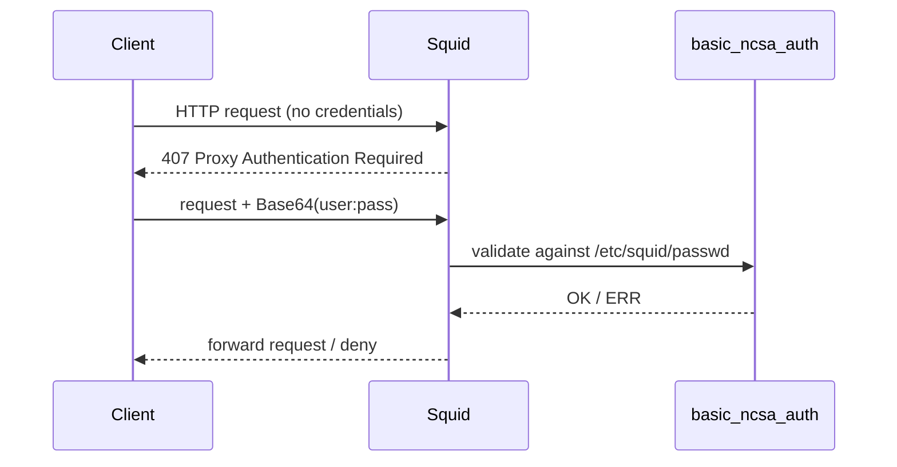

# Enable Basic NCSA Authentication in Squid

## Overview

By default a Squid proxy authorizes clients by **IP address** alone. NCSA authentication adds a **username/password** layer on top: before a request is allowed, Squid prompts the client and validates the supplied credentials against a flat `htpasswd`-style file. This gives you per-user accountability in the access log and lets the proxy follow the user rather than the workstation.

This note uses Squid's bundled `basic_ncsa_auth` helper together with a password database created by Apache's `htpasswd` tool.

> [!WARNING]
> **Basic authentication sends credentials Base64-encoded, not encrypted.** On a plain HTTP proxy connection they are trivially recoverable by anyone on the path. Use NCSA auth only over a trusted LAN, or combine it with TLS to the proxy. See [SSL-Bump-with-Squid-Proxy](SSL-Bump-with-Squid-Proxy.md) for encrypted proxy transport.

## Concepts

| Component | Role |
|---|---|
| `basic_ncsa_auth` | Squid helper binary that checks a username/password against a file |
| `/etc/squid/passwd` | The credential database (user + hashed password, one per line) |
| `htpasswd` | Tool from `httpd-tools` used to create and manage that file |
| `auth_param basic` | `squid.conf` directive that wires the helper into the request flow |
| `proxy_auth REQUIRED` | ACL that forces every request to carry valid credentials |



## Create the Password Database

- Install the `httpd-tools` package, which provides the `htpasswd` command:

```bash
yum install httpd-tools -y
```

- Create the password file and the first user:

```bash
htpasswd -c /etc/squid/passwd u1
```

> [!IMPORTANT]
> The `-c` flag **creates** the file and will overwrite it if it already exists. Use it **only** for the very first user; adding later users with `-c` wipes everyone created before.

- Add additional users (without the `-c` flag):

```bash
htpasswd /etc/squid/passwd u2
```

- Confirm the file:

```bash
cat /etc/squid/passwd
```

## Set File Permissions

The helper runs as the `squid` user, so the database must be readable by the `squid` group but not world-readable.

- Check the current permissions:

```bash
ls -lh /etc/squid/passwd
```

- Set group ownership to `squid`:

```bash
chgrp squid /etc/squid/passwd
```

- Restrict permissions to `640` (owner read/write, group read):

```bash
chmod 640 /etc/squid/passwd
```

- Confirm the result:

```bash
ls -lh /etc/squid/passwd
```

## Update squid.conf for Authentication

- Edit your Squid configuration file:

```bash
vim /etc/squid/squid.conf
```

> Add the following lines (near the top or inside the section marked for custom rules):

```conf
auth_param basic program /usr/lib64/squid/basic_ncsa_auth /etc/squid/passwd
auth_param basic realm Squid Proxy Authentication
acl ncsa_users proxy_auth REQUIRED
http_access allow ncsa_users
```

> [!NOTE]
> The helper path `/usr/lib64/squid/basic_ncsa_auth` is correct for 64-bit RHEL-family systems. On Debian/Ubuntu it is `/usr/lib/squid/basic_ncsa_auth`. Confirm with `rpm -ql squid | grep ncsa` (or `dpkg -L squid`).

> Optional: You can also restrict to specific users:
>
> ```conf
> acl allowed_users proxy_auth u1 u2
> http_access allow allowed_users
> ```

> [!IMPORTANT]
> Make sure this `http_access allow` line appears **before** any general `http_access deny all` rules, or it will be ignored. Squid evaluates `http_access` rules top-down and stops at the first match.

- To apply the configuration:

```bash
systemctl restart squid
```

## Test the Proxy

> Try accessing any website via Squid in a browser — it should prompt for a username and password. Only the users defined in `/etc/squid/passwd` will be able to connect.

> [!NOTE]
> **📸 Screenshot**
> _Capture: Browser proxy authentication dialog prompting for username and password with the realm "Squid Proxy Authentication"_

## Managing Users

- Add a new user:

```bash
htpasswd /etc/squid/passwd newuser
```

- To delete a user, manually edit the file and remove that user's line:

```bash
vim /etc/squid/passwd
```

- Check logs to confirm which user made a request (the `htpasswd` username appears in the log line):

```bash
tail -f /var/log/squid/access.log
```

## Best Practices

> [!TIP]
> - **Always back up** `squid.conf` before editing, and validate with `squid -k parse` before restarting.
> - **Prefer a stronger hash.** Modern `htpasswd` defaults vary; pass `-B` for bcrypt (`htpasswd -B /etc/squid/passwd user`) instead of the legacy MD5/crypt hashes when your Squid build supports it.
> - **Combine auth with an IP allowlist** so credentials are only ever accepted from your LAN ranges (see [Access-Control-List](Access-Control-List.md)).
> - **Rotate and audit accounts** — remove leavers promptly, since a valid proxy account is a foothold into your egress path.

## Troubleshooting

| Symptom | Likely cause | Fix |
|---|---|---|
| No auth prompt appears | `http_access allow` for another ACL matched first | Reorder rules so `ncsa_users` is evaluated before broad allows |
| Every login rejected | Wrong helper path or unreadable `passwd` file | Verify helper path; ensure `640 root:squid` on `/etc/squid/passwd` |
| Squid fails to start | Syntax error in `auth_param` line | Run `squid -k parse` for the exact line |
| Auth works but no username in log | Log format doesn't include `%un` | Add a `logformat` with `%un` or use the default |

## References

- [Squid: Configuring Basic authentication](https://wiki.squid-cache.org/ConfigExamples/Authenticate/Ncsa)
- [Apache `htpasswd` manual](https://httpd.apache.org/docs/current/programs/htpasswd.html)

## Related
- [Squid-Proxy-Server-Setup](Squid-Proxy-Server-Setup.md) — base Squid proxy setup
- [Access-Control-List](Access-Control-List.md) — ACL-based access control counterpart
- [SSL-Bump-with-Squid-Proxy](SSL-Bump-with-Squid-Proxy.md) — encrypting the proxy transport
- [Squid-Transparent-Proxy](Squid-Transparent-Proxy.md) — transparent deployment mode
- Proxy-VPNS-and-TOR — proxy concepts hub
- [Linux Administration & Server Hardening](../Readme.md) — Linux administration & server hardening hub
