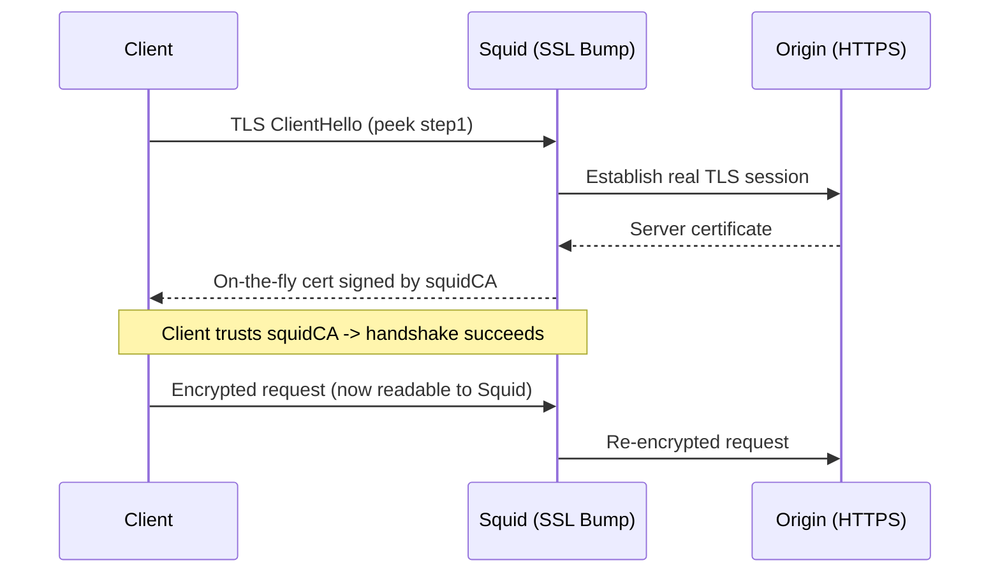

# SSL Bump With Squid Proxy

## Overview

**SSL Bump** is Squid's HTTPS interception feature. It lets the proxy decrypt, inspect, filter, and re-encrypt TLS traffic that would otherwise be opaque. Squid presents each client with a certificate it generates on the fly, signed by a **local Certificate Authority (CA)** that you install into the clients' trust stores. To the client the connection looks legitimate; to the proxy the traffic is now readable, so URL/keyword ACLs and content policy can be applied to HTTPS.

This note covers generating the CA, initializing Squid's dynamic-certificate database, configuring `ssl-bump`, opening the firewall, distributing the CA certificate, and importing it on clients.

> [!WARNING]
> SSL Bump is a **man-in-the-middle** of your users' encrypted traffic. Only deploy it on infrastructure you own, with clear policy and user consent, and never intercept sensitive categories (banking, health, authentication portals). Certificate pinning (HSTS/HPKP, pinned mobile apps) will legitimately break under bump. Misuse can be unlawful.

## How Https Works

> HTTPS uses Transport Layer Security (TLS) to encrypt communication securely between clients and servers.

| Key | Role |
|---|---|
| Private Key | Secret, stored securely on the server. Decrypts what the public key encrypted. |
| Public Key | Shared publicly (in the certificate). Encrypts data that only the private key can decrypt. |

> This encryption ensures privacy, integrity, and authentication of communications.



## Create SSL Certificates For Squid

- First, generate a self-signed CA (Certificate Authority) certificate for Squid.

```bash
mkdir -p /etc/squid/ssl_cert
```

```bash
cd /etc/squid/ssl_cert
```

```bash
openssl req -new -newkey rsa:4096 -days 365 -nodes -x509 -keyout squidCA.key -out squidCA.crt
```

```bash
cat squidCA.crt squidCA.key > squidCA.pem
```

- Verify that the certificate files are created:

```bash
ls -lh /etc/squid/ssl_cert
```

> You should see `squidCA.key`, `squidCA.crt`, and `squidCA.pem`.

> [!IMPORTANT]
> `squidCA.key` and `squidCA.pem` contain the CA **private key** — anyone who obtains them can impersonate any website to your clients. Lock them down (`chmod 600`, owned by `squid`) and never copy them off the proxy. Only the public `squidCA.crt` is distributed to clients.

## Prepare The SSL Database For Squid

- Create and initialize the SSL database Squid uses for dynamic certificate generation.

```bash
mkdir -p /var/lib/squid
```

```bash
ls -lh /var/lib/squid
```

```bash
/usr/lib64/squid/security_file_certgen -c -s /var/lib/squid/ssl_db -M 20MB
```

```bash
ls -lh /var/lib/squid
```

```bash
chown -R squid:squid /var/lib/squid/ssl_db/
```

- Check the database:

```bash
ls -lh /var/lib/squid/ssl_db/
```

## Disable Selinux (Optional)

- Disabling SELinux may avoid permission issues when running Squid in SSL bump mode.

> [!NOTE]
> Disabling SELinux removes a whole layer of mandatory access control from the host. On a production system, prefer to keep SELinux **enforcing** and add the correct booleans/labels for Squid (e.g. `setsebool -P squid_connect_any on`) instead of turning it off. Disable it only as a temporary troubleshooting step.

> Edit the SELinux configuration file:

```bash
vim /etc/sysconfig/selinux
```

> Set the following:

```ini
SELINUX=disabled
```

- Check the SELinux status:

```bash
sestatus
```

> If `disabled`, changes have taken effect.

## Configure Squid For Ssl Bump

- Edit the Squid configuration file:

```bash
vim /etc/squid/squid.conf
```

> Update it with the following configuration:

```conf
# Squid Configuration File  
http_port 3128 ssl-bump cert=/etc/squid/ssl_cert/squidCA.pem generate-host-certificates=on dynamic_cert_mem_cache_size=4MB  
  
acl step1 at_step SslBump1  
  
ssl_bump peek step1  
ssl_bump bump all  
  
# SSL Proxy Settings  
http_access allow all  
sslcrtd_program /usr/lib64/squid/security_file_certgen -s /var/lib/squid/ssl_db -M 4MB  
sslcrtd_children 5  
```

> This configuration allows Squid to decrypt, inspect, and re-encrypt HTTPS traffic.

The complete `squid.conf` used for SSL bump, including the standard ACL baseline and keyword deny list:

```conf
# SSL Bump with Squid Proxy
# Recommended minimum configuration:
#

# Example rule allowing access from your local networks.
# Adapt to list your (internal) IP networks from where browsing
# should be allowed
acl localnet src 0.0.0.1-0.255.255.255	# RFC 1122 "this" network (LAN)
acl localnet src 10.0.0.0/8		# RFC 1918 local private network (LAN)
acl localnet src 100.64.0.0/10		# RFC 6598 shared address space (CGN)
acl localnet src 169.254.0.0/16 	# RFC 3927 link-local (directly plugged) machines
acl localnet src 172.16.0.0/12		# RFC 1918 local private network (LAN)
acl localnet src 192.168.0.0/16		# RFC 1918 local private network (LAN)
acl localnet src fc00::/7       	# RFC 4193 local private network range
acl localnet src fe80::/10      	# RFC 4291 link-local (directly plugged) machines

acl SSL_ports port 443
acl Safe_ports port 80		# http
acl Safe_ports port 21		# ftp
acl Safe_ports port 443		# https
acl Safe_ports port 70		# gopher
acl Safe_ports port 210		# wais
acl Safe_ports port 1025-65535	# unregistered ports
acl Safe_ports port 280		# http-mgmt
acl Safe_ports port 488		# gss-http
acl Safe_ports port 591		# filemaker
acl Safe_ports port 777		# multiling http

#
# Recommended minimum Access Permission configuration:
#
# Deny requests to certain unsafe ports
http_access deny !Safe_ports

# Deny CONNECT to other than secure SSL ports
http_access deny CONNECT !SSL_ports

# Only allow cachemgr access from localhost
http_access allow localhost manager
http_access deny manager

# We strongly recommend the following be uncommented to protect innocent
# web applications running on the proxy server who think the only
# one who can access services on "localhost" is a local user
#http_access deny to_localhost

#
# INSERT YOUR OWN RULE(S) HERE TO ALLOW ACCESS FROM YOUR CLIENTS
#

acl deny_keywords url_regex -i "/etc/squid/deny_keywords"  
http_access deny deny_keywords

# Example rule allowing access from your local networks.
# Adapt localnet in the ACL section to list your (internal) IP networks
# from where browsing should be allowed
http_access allow localnet
http_access allow localhost

# And finally deny all other access to this proxy
http_access deny all

# Squid normally listens to port 3128
# http_port 3128

# Squid Configuration File  
http_port 3128 ssl-bump cert=/etc/squid/ssl_cert/squidCA.pem generate-host-certificates=on dynamic_cert_mem_cache_size=4MB  
  
acl step1 at_step SslBump1  
  
ssl_bump peek step1  
ssl_bump bump all  
  
# SSL Proxy Settings  
http_access allow all  
sslcrtd_program /usr/lib64/squid/security_file_certgen -s /var/lib/squid/ssl_db -M 4MB  
sslcrtd_children 5  

# Uncomment and adjust the following to add a disk cache directory.
#cache_dir ufs /var/spool/squid 100 16 256

# Leave coredumps in the first cache dir
coredump_dir /var/spool/squid

#
# Add any of your own refresh_pattern entries above these.
#
refresh_pattern ^ftp:		1440	20%	10080
refresh_pattern -i (/cgi-bin/|\?) 0	0%	0
refresh_pattern .		0	20%	4320
```

## Restart Squid

- Apply the configuration changes:

```bash
systemctl restart squid.service
```

- Verify Squid is running and listening:

```bash
netstat -nltup | grep squid
```

> You should see Squid listening on port `3128`.

## Enable Ip Forwarding

- Edit the sysctl configuration:

```bash
vim /etc/sysctl.d/ipv4_forward.conf
```

> Add the following line:

```ini
net.ipv4.ip_forward = 1
```

- Apply the changes:

```bash
sysctl --system
```

- Verify IP forwarding is enabled:

```bash
sysctl -p
```

```bash
sysctl net.ipv4.ip_forward
```

> Should output `net.ipv4.ip_forward = 1`.

## Configure Firewalld

- Open the necessary ports to allow proxy traffic and certificate downloads.

> Add Squid proxy and HTTP ports:

```bash
firewall-cmd --permanent --zone=public --add-port=3128/tcp
```

```bash
firewall-cmd --permanent --zone=public --add-port=80/tcp
```

- Enable masquerading for IP forwarding:

```bash
firewall-cmd --permanent --add-masquerade
```

- Reload firewall rules:

```bash
firewall-cmd --reload
```

- Verify the changes:

```bash
firewall-cmd --list-all
```

> Now Squid and IP forwarding are allowed through the firewall.

## Distribute The Squid Ca Certificate

- Serve the Squid CA certificate over HTTP for easy client download:

```bash
cp -v /etc/squid/ssl_cert/squidCA.crt /var/www/html/
```

- Clients can download it by accessing:

```text
http://192.168.2.1/squidCA.crt
```

> Replace `<proxy-server-ip>` with your actual proxy server IP address.

> [!IMPORTANT]
> Only ever distribute the **public** `squidCA.crt`. Never place `squidCA.key` or `squidCA.pem` in the web root — publishing the private key would let anyone forge certificates for your clients.

## Troubleshooting: IPv6 Network Unreachable

### What This Error Means

- Squid attempted to connect to an external IPv6 address.

- The network failed to reach the destination.

- Likely causes are a lack of IPv6 support or misconfiguration.

### Common Causes

| Cause | Detail |
|---|---|
| No IPv6 support | Server or network does not support IPv6 |
| Missing routing | IPv6 is enabled but routing or ISP support is missing |
| Firewall block | Firewall blocks outgoing IPv6 traffic |
| DNS ordering | DNS resolves to IPv6 (AAAA) records before IPv4 (A) records |
| Typo | Typo in the URL (`googl.com` instead of `google.com`) |

### Disable IPv6 System-Wide

- If you do not plan to use IPv6, disable it entirely.

> Edit the sysctl configuration:

```bash
vim /etc/sysctl.conf
```

> Add the following lines:

```ini
net.ipv6.conf.all.disable_ipv6 = 1
net.ipv6.conf.default.disable_ipv6 = 1
```

- Apply the changes immediately:

```bash
sysctl -p
```

> This prevents all IPv6 usage on the server.

## Import The Ca Certificate Into Clients

For SSL bump to work transparently, every client must trust `squidCA.crt`. Untrusted clients will show certificate warnings on every HTTPS site.

### On Windows (Google Chrome)

1. Open `chrome://settings/`

2. Navigate to Privacy And Security → Security → Manage Certificates

3. Under Trusted Root Certification Authorities, choose Import and select `squidCA.crt`

### On Macos

1. Open Keychain Access

2. Import `squidCA.crt` into the System keychain

3. Set the certificate to Always Trust

### On Linux

- Copy the certificate:

```bash
cp /path/to/squidCA.crt /usr/local/share/ca-certificates/
```

- Update the trusted certificates:

```bash
update-ca-certificates
```

- Restart your browser to apply changes.

> [!NOTE]
> **📸 Screenshot**
> _Capture: Browser certificate viewer showing an HTTPS site's certificate issued by squidCA instead of the real public CA, confirming interception is active_

## Security Considerations

- SSL Bump breaks the end-to-end confidentiality guarantee of TLS. The proxy becomes a high-value target: compromise of the CA key exposes **all** intercepted traffic.
- Sites using **certificate pinning** or HSTS preloading will fail under bump — maintain a `ssl_bump splice` bypass list for banking, healthcare, and OS/software-update endpoints.
- Keep SELinux enforcing where possible rather than disabling it; disabling MAC weakens the whole host.
- Log and monitor access to `/etc/squid/ssl_cert/` — treat the CA key with the same rigor as a production PKI root.

## Best Practices

> [!TIP]
> - **Protect the CA key** with `chmod 600` and `squid:squid` ownership; back it up encrypted, off-host.
> - **Short CA lifetime + rotation** — the example uses `-days 365`; plan renewal and re-distribution before expiry.
> - **Bypass sensitive domains** with `ssl_bump splice` so you never decrypt banking/health/auth traffic.
> - **Distribute the CA via managed policy** (GPO/MDM) rather than manual per-machine import in any real fleet.
> - **Validate config** with `squid -k parse` before restarting.

## Summary

- Squid is configured to perform SSL Bump (intercepting HTTPS traffic).

- Firewall rules have been applied properly using `firewalld`.

- Clients can trust the Squid CA by importing the certificate.

- HTTPS connections are transparently decrypted and filtered if needed.

## References

- [Squid: Feature/SslBump](https://wiki.squid-cache.org/Features/SslBump)
- [Squid: Dynamic SSL certificate generation](https://wiki.squid-cache.org/Features/DynamicSslCert)
- [OpenSSL `req` documentation](https://www.openssl.org/docs/man1.1.1/man1/req.html)

## Related
- [Squid-Proxy-Server-Setup](Squid-Proxy-Server-Setup.md) — base Squid proxy setup
- [Squid-Transparent-Proxy](Squid-Transparent-Proxy.md) — related Squid deployment mode
- [Access-Control-List](Access-Control-List.md) — ACLs governing bumped traffic
- [Enable-Basic-NCSA-Authentication-in-Squid](Enable-Basic-NCSA-Authentication-in-Squid.md) — per-user authentication
- Proxy-VPNS-and-TOR — proxy concepts hub
- [Linux Administration & Server Hardening](../Readme.md) — Linux administration & server hardening hub
