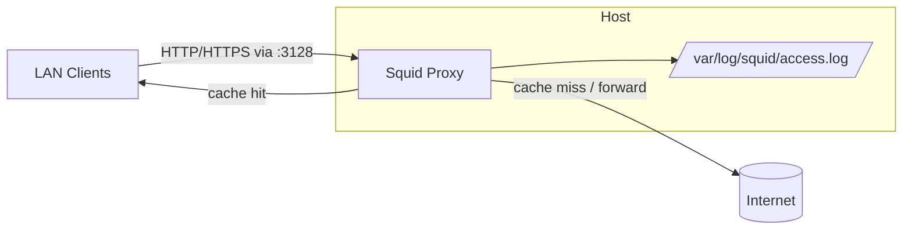

# Squid Proxy Server Setup

## Overview

[Squid](https://www.squid-cache.org/) is a high-performance caching and forwarding HTTP/HTTPS proxy. It sits between clients and the wider internet to cache frequently requested content, enforce access control, log activity, and reduce upstream bandwidth. This note covers a clean, ground-up installation on an RPM-based distribution (RHEL/CentOS/Rocky/AlmaLinux) — from installing the package to opening the correct firewall ports and monitoring live traffic.

By default Squid listens on TCP port **3128** and stores its main configuration in `/etc/squid/squid.conf`.

> [!NOTE]
> The commands below use `yum` and `firewalld`, so they target the RHEL family. On Debian/Ubuntu the workflow is equivalent but uses `apt install squid`, `ufw`/`nftables`, and the config lives at `/etc/squid/squid.conf` all the same.

## Architecture



| Item | Default value |
|---|---|
| Listen port | `3128/tcp` |
| Main config | `/etc/squid/squid.conf` |
| Access log | `/var/log/squid/access.log` |
| Cache/coredump dir | `/var/spool/squid` |
| systemd unit | `squid.service` |
| Firewall manager | `firewalld` |

## 1. Check Repositories And Existing Installation

- To ensure the system is ready, first check available repositories and whether Squid is already installed.

> Check enabled repositories:

```bash
yum repolist all
```

> Check if Squid is already installed:

```bash
rpm -qa | grep squid
```

## 2. Install Squid

- Install the Squid package using `yum`. The `*` ensures all related packages are installed.

```bash
yum install squid*
```

## 3. Verify Installation

> After installation, verify Squid and gather information about its files and configurations.

The `rpm` query flags below let you inspect exactly what the package delivered before touching any configuration:

| Command | Purpose |
|---|---|
| `rpm -qa \| grep squid` | List installed Squid packages |
| `rpm -qi squid` | Show detailed package information |
| `rpm -qc squid` | List configuration files |
| `rpm -qd squid` | List documentation files |
| `rpm -ql squid` | List every file the package installed |

- List installed Squid packages:

```bash
rpm -qa | grep squid
```

- Show detailed information about the Squid package:

```bash
rpm -qi squid
```

- List all Squid configuration files:

```bash
rpm -qc squid
```

- List Squid documentation files:

```bash
rpm -qd squid
```

- List all files installed by Squid:

```bash
rpm -ql squid
```

## 4. Edit Squid Configuration

- Edit the main Squid configuration file to define access control lists (ACLs), ports, and other rules.

```bash
vim /etc/squid/squid.conf
```

> Customize the configuration as needed, for example allowing only internal network access.

> [!TIP]
> Always back up the working config before editing it — `cp /etc/squid/squid.conf /etc/squid/squid.conf.bak`. You can then validate any change with `squid -k parse` before restarting the service, which catches syntax errors without dropping active connections.

## 5. Manage Squid Service

> Enable Squid to start on boot, start the service immediately, and check its status.

- Enable Squid to start automatically at boot:

```bash
systemctl enable squid.service
```

- Start the Squid service:

```bash
systemctl start squid.service
```

- Check the status of the Squid service:

```bash
systemctl status squid.service
```

## 6. Check If Squid Is Listening

- Verify if Squid is actively listening on the default proxy port (3128).

> Using netstat:

```bash
netstat -nltup | grep squid
```

> Alternatively, using ss:

```bash
ss -nltup | grep squid
```

> Look for Squid binding to TCP port 3128.

> [!NOTE]
> **📸 Screenshot**
> _Capture: Terminal output of ss showing the squid process bound to 0.0.0.0:3128 in LISTEN state_

## 7. Configure Firewalld Instead Of Iptables

- Instead of manually editing iptables, use firewalld commands for better management.

### Check If Firewalld Is Running

- Check the status of firewalld:

```bash
systemctl status firewalld
```

### Start Firewalld If Not Running

- Start and enable firewalld:

```bash
systemctl start firewalld
```

- Enable firewalld to start on boot:

```bash
systemctl enable firewalld
```

### Allow Squid Port 3128 In Firewall

- Allow incoming TCP traffic to Squid:

```bash
firewall-cmd --permanent --add-port=3128/tcp
```

### Allow Dns Ports (Optional)

- Allow DNS queries if your proxy server must resolve domain names:

```bash
firewall-cmd --permanent --add-port=53/tcp
```

```bash
firewall-cmd --permanent --add-port=53/udp
```

### Reload Firewalld To Apply Changes

- Apply all new firewall rules:

```bash
firewall-cmd --reload
```

### Check Open Ports And Services

- List the active firewall settings:

```bash
firewall-cmd --list-all
```

> Now, the Squid proxy server is running, and firewall rules are correctly applied using firewalld.

## 8. Monitor Logs And Traffic

Monitoring Squid helps in troubleshooting and analyzing usage.

- Follow the Squid access log in real-time:

```bash
tail -f /var/log/squid/access.log
```

- Capture network packets on a specific interface:

```bash
tcpdump -i enp0s8 -w /root/1.pcap
```

- Read and analyze the captured packet file:

```bash
tcpdump -r /root/1.pcap
```

## Best Practices

> [!TIP]
> - **Restrict the proxy to trusted networks.** An open proxy will be found and abused within hours of exposure. Never allow `src all`; scope access to your LAN ranges only (see [Access-Control-List](Access-Control-List.md)).
> - **Bind Squid to the internal interface** rather than `0.0.0.0` if the host is multi-homed, so the proxy is never reachable from the public side.
> - **Add authentication** for accountability — see [Enable-Basic-NCSA-Authentication-in-Squid](Enable-Basic-NCSA-Authentication-in-Squid.md).
> - **Rotate logs** with `logrotate` (Squid ships a drop-in in `/etc/logrotate.d/squid`) so `access.log` does not fill the disk.
> - **Validate before restart** with `squid -k parse`, then reload with `squid -k reconfigure` to apply changes without dropping active sessions.

## Security Considerations

- An **open forwarding proxy** is one of the most commonly abused misconfigurations on the internet — it lets attackers launder traffic through your IP. Default-deny (`http_access deny all` at the end) and explicitly allow only known clients.
- Restrict `CONNECT` requests to SSL ports only (`http_access deny CONNECT !SSL_ports`) to stop the proxy being used to tunnel arbitrary TCP services.
- Keep Squid patched — proxy daemons are network-facing and have a history of CVEs. Subscribe to your distro's security advisories.
- Treat `access.log` as sensitive: it records every URL your users visit. Protect it with `640 root:squid` permissions and a defined retention policy.

## Troubleshooting

| Symptom | Likely cause | Check |
|---|---|---|
| Clients get "connection refused" | Service not running / firewall closed | `systemctl status squid`, `firewall-cmd --list-all` |
| "Access Denied" for all sites | `http_access deny all` matched first | Review ACL order in `squid.conf` |
| Squid won't start after edit | Config syntax error | `squid -k parse` |
| Names don't resolve | DNS blocked or misconfigured | Open port 53, verify `/etc/resolv.conf` |
| Nothing in access.log | Wrong interface / client not using proxy | `tail -f /var/log/squid/access.log` while testing |

## References

- [Squid Web Cache — official site](https://www.squid-cache.org/)
- [Squid configuration manual](http://www.squid-cache.org/Doc/config/)
- [Red Hat: Configuring the Squid caching proxy server](https://access.redhat.com/documentation/)

## Related
- [Access-Control-List](Access-Control-List.md) — restricting access on this proxy
- [Enable-Basic-NCSA-Authentication-in-Squid](Enable-Basic-NCSA-Authentication-in-Squid.md) — adding auth to this proxy
- [Squid-Transparent-Proxy](Squid-Transparent-Proxy.md) — transparent deployment mode
- [SSL-Bump-with-Squid-Proxy](SSL-Bump-with-Squid-Proxy.md) — intercepting and inspecting HTTPS
- Proxy-VPNS-and-TOR — proxy concepts hub
- [Linux Administration & Server Hardening](../Readme.md) — Linux administration & server hardening hub
