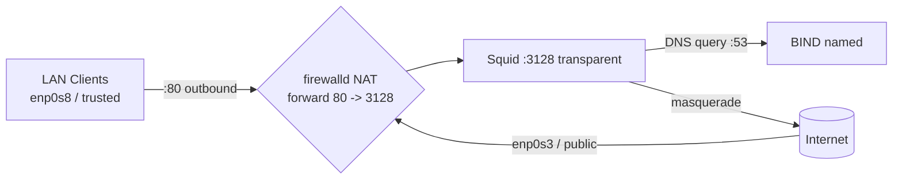

# Squid Transparent Proxy

## Overview

> A _transparent proxy_ intercepts HTTP/HTTPS traffic **without configuring clients' browsers**.
> It requires **router/firewall NAT rules** + **Squid configured for interception**.

In a normal (explicit) proxy deployment every client must be told the proxy's IP and port. A transparent proxy removes that requirement: the gateway silently **redirects** outbound web traffic into Squid using NAT/port-forwarding, so clients need no configuration at all. This note builds a transparent proxy on an RHEL-family gateway using **ISC BIND** for DNS, **Squid** for interception, and **firewalld** for NAT and forwarding.

> [!NOTE]
> Transparent interception works cleanly for plain **HTTP (port 80)**. Intercepting **HTTPS** transparently additionally requires certificate interception — see [SSL-Bump-with-Squid-Proxy](SSL-Bump-with-Squid-Proxy.md) — because a client that did not choose to use a proxy will otherwise reject the substituted certificate.

## Architecture



| Element | Value in this guide |
|---|---|
| Internet-facing interface | `enp0s3` → `public` zone |
| LAN interface | `enp0s8` → `trusted` zone |
| Proxy listen port | `3128` (transparent) |
| Redirected client port | `80/tcp` → `3128` |
| DNS server | ISC BIND (`named`) on port `53` |
| Proxy IP (example) | `192.168.2.1` |

## DNS Configuration for Squid Transparent Proxy with BIND

To configure your DNS server using ISC BIND, you need to update the `named.conf` configuration file and ensure that your DNS server is properly set up to handle queries from your local network and forward DNS requests where needed.

### Edit the `named.conf` File

- Open the `named.conf` configuration file to make the necessary changes:

```bash
vim /etc/named.conf
```

> Update the `named.conf` Configuration
> Below is the updated configuration for the `named.conf` file. This setup is for a DNS server configured as a **caching only nameserver** for specific IP addresses and networks.

```conf
//
// named.conf
//
// Provided by Red Hat bind package to configure the ISC BIND named(8) DNS
// server as a caching only nameserver (as a localhost DNS resolver only).
//
// See /usr/share/doc/bind*/sample/ for example named configuration files.
//

acl ns_ip_add {
	127.0.0.1;
	192.168.1.34;
	192.168.2.1;
};

acl mynetwork {
	127.0.0.1;
	192.168.1.0/24;
	192.168.2.0/24;
};

options {
	listen-on port 53 { ns_ip_add; };
	listen-on-v6 port 53 { ::1; };
	directory 	"/var/named";
	dump-file 	"/var/named/data/cache_dump.db";
	statistics-file "/var/named/data/named_stats.txt";
	memstatistics-file "/var/named/data/named_mem_stats.txt";
	secroots-file	"/var/named/data/named.secroots";
	recursing-file	"/var/named/data/named.recursing";
	allow-query     { mynetwork; };

	/*
	 - If you are building an AUTHORITATIVE DNS server, do NOT enable recursion.
	 - If you are building a RECURSIVE (caching) DNS server, you need to enable
	   recursion.
	 - If your recursive DNS server has a public IP address, you MUST enable access
	   control to limit queries to your legitimate users. Failing to do so will
	   cause your server to become part of large scale DNS amplification
	   attacks. Implementing BCP38 within your network would greatly
	   reduce such attack surface
	*/
	recursion yes;

	dnssec-validation yes;

	managed-keys-directory "/var/named/dynamic";
	geoip-directory "/usr/share/GeoIP";

	pid-file "/run/named/named.pid";
	session-keyfile "/run/named/session.key";

	/* https://fedoraproject.org/wiki/Changes/CryptoPolicy */
	include "/etc/crypto-policies/back-ends/bind.config";
};

logging {
        channel default_debug {
                file "data/named.run";
                severity dynamic;
        };
};

zone "." IN {
	type hint;
	file "named.ca";
};

include "/etc/named.rfc1912.zones";
include "/etc/named.root.key";
```

### Explanation of Key Sections

- **acl ns_ip_add**: This defines a list of IP addresses `192.168.2.1` that are allowed to access the DNS server. This is used for security, ensuring that only trusted IPs can interact with the server.

- **acl mynetwork**: This defines the network blocks (subnets) that are allowed to query the DNS server. In this case, the local network `192.168.1.0/24` and `192.168.2.0/24` are allowed.

- **options**: This section contains the general settings for the DNS server, including which ports to listen on, whether recursion is allowed, and whether DNSSEC validation is enabled.

    - `listen-on port 53 { ns_ip_add; }`: The DNS server will only listen on port 53 for IP addresses defined in `ns_ip_add`.

    - `allow-query { mynetwork; }`: Limits the queries to clients within the `mynetwork` ACL.

- **logging**: Configures logging for debugging purposes.

- **zone "." IN**: The root zone configuration, with a hint file for root DNS servers.

- **include**: Includes additional configuration files for zones and root keys.

> [!WARNING]
> A recursive resolver reachable from the internet is an **open resolver** and will be abused in DNS amplification attacks. The `allow-query { mynetwork; }` and `listen-on` restrictions above are what keep this server private — never widen them to `any` on a public-facing host.

#### Restart the Named Service

- After updating the configuration, restart the `named` service to apply the changes:

```bash
systemctl restart named.service
```

#### Verify the DNS Server is Running

- To verify that the DNS server is running correctly, you can check the status of the `named` service:

```bash
systemctl status named.service
```

> Additionally, you can test DNS resolution using `dig` or `nslookup` to ensure the DNS server is resolving queries as expected.

## Set Up Squid Proxy

- First, configure Squid to listen on port 3128 and set it for transparent proxying.

### Edit Squid Configuration File

- Open the Squid configuration file:

```bash
vim /etc/squid/squid.conf
```

> Add the following line to ensure Squid listens for transparent proxy connections:

```conf
http_port 3128
http_port 3128 transparent
```

The full working ACL/port block for a transparent deployment:

```conf
acl localnet src 0.0.0.1-0.255.255.255	# RFC 1122 "this" network (LAN)
acl localnet src 10.0.0.0/8		# RFC 1918 local private network (LAN)
acl localnet src 100.64.0.0/10		# RFC 6598 shared address space (CGN)
acl localnet src 169.254.0.0/16 	# RFC 3927 link-local (directly plugged) machines
acl localnet src 172.16.0.0/12		# RFC 1918 local private network (LAN)
acl localnet src 192.168.0.0/16		# RFC 1918 local private network (LAN)
acl localnet src fc00::/7       	# RFC 4193 local private network range
acl localnet src fe80::/10      	# RFC 4291 link-local (directly plugged) machines
acl SSL_ports port 443
acl Safe_ports port 80		# http
acl Safe_ports port 21		# ftp
acl Safe_ports port 443		# https
acl Safe_ports port 70		# gopher
acl Safe_ports port 210		# wais
acl Safe_ports port 1025-65535	# unregistered ports
acl Safe_ports port 280		# http-mgmt
acl Safe_ports port 488		# gss-http
acl Safe_ports port 591		# filemaker
acl Safe_ports port 777		# multiling http
http_access deny !Safe_ports
http_access deny CONNECT !SSL_ports
http_access allow localhost manager
http_access deny manager
http_access allow localnet
http_access allow localhost
http_access deny all
http_port 3128
http_port 3128 transparent
coredump_dir /var/spool/squid
refresh_pattern ^ftp:		1440	20%	10080
refresh_pattern -i (/cgi-bin/|\?) 0	0%	0
refresh_pattern .		0	20%	4320
```

#### Restart Squid to Apply Changes

- After modifying the Squid configuration, restart Squid to apply the changes:

```bash
systemctl restart squid.service
```

## Configure Firewalld

- You will need to modify your `firewalld` configuration to set up NAT and port forwarding for the transparent proxy.

### Enable IP Forwarding

- IP forwarding allows the system to route traffic between interfaces. Run the following command to enable it:

```bash
sysctl -w net.ipv4.ip_forward=1
```

- To make the change permanent, edit the sysctl configuration file:

```bash
vim /etc/sysctl.conf
```

> Add or ensure the following line exists:

```ini
net.ipv4.ip_forward = 1
```

- Then apply the changes:

```bash
sysctl -p
```

### Configure Firewalld Zones

The design assigns the internet-facing NIC to the `public` zone and the LAN NIC to the `trusted` zone, then redirects LAN web traffic into Squid.

#### Add Internet Interface to Public Zone

- Identify the interface connected to the internet (e.g., `enp0s3`), and add it to the `public` zone:

```bash
firewall-cmd --zone=public --add-interface=enp0s3 --permanent
```

#### Add LAN Interface to Trusted Zone

- Identify the LAN interface (e.g., `enp0s8`), and add it to the `trusted` zone:

```bash
firewall-cmd --zone=trusted --add-interface=enp0s8 --permanent
```

#### Allow Loopback Traffic

- Allow loopback traffic (important for DNS and internal communications):

```bash
firewall-cmd --zone=trusted --add-source=127.0.0.1 --permanent
```

#### Allow DNS and UDP Traffic

- Allow DNS and UDP traffic, which is required for Squid to resolve domain names:

```bash
firewall-cmd --zone=public --add-port=53/udp --permanent
```

```bash
firewall-cmd --zone=public --add-service=dns --permanent
```

#### Enable NAT (Masquerading) for Outgoing Connections

- Enable masquerading for outgoing traffic. This allows LAN clients to access the internet via the Squid proxy:

```bash
firewall-cmd --zone=public --add-masquerade --permanent
```

#### Forward HTTP Traffic to Squid

- To forward incoming HTTP traffic (port 80) from the LAN to Squid (which runs on port 3128), use the following command:

```bash
firewall-cmd --zone=trusted --add-forward-port=port=80:proto=tcp:toport=3128 --permanent
```

- Also, ensure incoming HTTP traffic from the internet is redirected to Squid:

```bash
firewall-cmd --zone=public --add-forward-port=port=80:proto=tcp:toport=3128 --permanent
```

- Remove Forward HTTP Traffic to Squid

```bash
firewall-cmd --zone=public --remove-forward-port=port=80:proto=tcp:toport=3128 --permanent
```

#### Reload Firewalld to Apply Changes

- After adding all the rules, reload `firewalld` to apply them:

```bash
firewall-cmd --reload
```

## Verify Configuration

### Verify Firewalld Rules

- You can check if the firewall rules were applied correctly by listing the current `firewalld` configuration:

```bash
firewall-cmd --list-all
```

#### Test the Proxy

- On a client machine in the LAN, configure the browser to use the Squid proxy (IP address: `192.168.2.1`, Port: `3128`). Ensure traffic is being intercepted and handled by Squid.

- Alternatively, you can use `curl` or `wget` from a client machine to verify that HTTP traffic is being transparently routed through Squid.

```bash
curl http://example.com
```

> [!NOTE]
> **📸 Screenshot**
> _Capture: Squid access.log tailing on the gateway showing intercepted TCP_MISS entries from a LAN client IP as it browses http sites_

## Best Practices

> [!TIP]
> - **Keep the resolver private.** The BIND `allow-query`/`listen-on` ACLs must stay scoped to your LAN so the box never becomes an open resolver.
> - **Do not put the proxy on the deny list of its own NAT.** Loopback and localhost traffic must be allowed for DNS and cache-manager access.
> - **Log interception separately.** Transparent proxies hide themselves from users, so clear signage/policy and access logging are important for both operations and legal/privacy compliance.
> - **For HTTPS interception**, deploy [SSL-Bump-with-Squid-Proxy](SSL-Bump-with-Squid-Proxy.md) and distribute the CA — plain transparent proxying cannot read encrypted sessions.

## Troubleshooting

| Symptom | Likely cause | Fix |
|---|---|---|
| Client HTTP hangs | Forward-port rule missing or wrong zone | Recheck `--add-forward-port` on the LAN zone and `firewall-cmd --list-all` |
| Names don't resolve | DNS port closed or BIND ACL too tight | Open `53/udp`, confirm client subnet is in `mynetwork` |
| HTTPS sites fail | Transparent proxy can't intercept TLS | Expected — use SSL bump, or exclude 443 from redirection |
| Traffic not intercepted | IP forwarding off / masquerade missing | `sysctl net.ipv4.ip_forward`, re-add `--add-masquerade` |
| Squid won't start | Config parse error | `squid -k parse` |

## References

- [Squid: Interception (transparent) proxy](https://wiki.squid-cache.org/ConfigExamples/Intercept/)
- [ISC BIND documentation](https://bind9.readthedocs.io/)
- [firewalld documentation](https://firewalld.org/documentation/)

## Related
- [Squid-Proxy-Server-Setup](Squid-Proxy-Server-Setup.md) — base Squid proxy setup
- [Access-Control-List](Access-Control-List.md) — ACLs for the transparent proxy
- [SSL-Bump-with-Squid-Proxy](SSL-Bump-with-Squid-Proxy.md) — intercepting HTTPS transparently
- [Enable-Basic-NCSA-Authentication-in-Squid](Enable-Basic-NCSA-Authentication-in-Squid.md) — per-user authentication
- Proxy-VPNS-and-TOR — proxy concepts hub
- [Linux Administration & Server Hardening](../Readme.md) — Linux administration & server hardening hub
