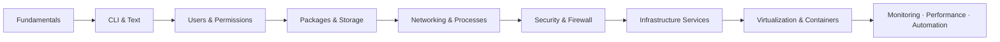

# Linux Administration & Server Hardening

> A four-month, lab-driven curriculum that takes a learner from first login to running and hardening a full stack of enterprise Linux network services — the command line, users and permissions, packages and storage, networking, automation, and the infrastructure services (DNS, DHCP, Apache, Samba, NFS, LDAP, Squid, PXE, OpenWrt) that keep production environments running.

**Curriculum home:** Vault Catalog

---

## Course Information

| Property | Value |
|----------|-------|
| **Course Title** | Linux Administration & Server Hardening |
| **Folder** | `Linux-Administration-and-Server-Hardening/` |
| **Tag** | Linux Server Administration |
| **Slug** | `linux-admin` |
| **Level** | Beginner to Advanced |
| **Duration** | 4 Months (16 Weeks · 1 Hour/Day · ~120 Hours) |
| **Focus** | Server Administration & Server Hardening |
| **Reference Distributions** | CentOS Stream 10 · Debian 12 (Bookworm) |
| **Modules** | 32 |
| **Delivery** | Self-paced notes + hands-on labs |
| **Language** | English |

> [!NOTE]
> **What this course is**
> A study-and-practice track built as an Obsidian knowledge base. Each module is a folder with its own `Readme` hub and a set of deep-dive notes containing tagged, copy-ready command snippets and configuration files. It is designed to be read in order but is fully cross-linked for reference use.

---

## Course Description

Master Linux server administration and defensive hardening end to end: the command line and shell environment, text processing, users, groups and permissions, package management, filesystem and disk management, process and service control, networking, and shell-scripting automation — then apply those foundations to deploy and secure real infrastructure services including Apache web hosting, DNS, DHCP, FTP, Samba, NFS, LDAP directory services, Squid proxy, TFTP/PXE network boot, remote-access services, an OpenWrt router/firewall OS, and system-wide security, firewall, and monitoring controls.

The program is delivered through extensive, reproducible hands-on labs modelled on real-world production environments, so every concept is paired with a working configuration you can build, break, and harden.

---

## Overview

The **Linux Administration & Server Hardening** program provides practical, enterprise-ready skills across Linux system administration, networking, security hardening, and infrastructure management. It assumes no prior Linux experience and progresses to advanced multi-service deployments.

By the end of the course, students will be able to:

- Administer Linux confidently from the command line and shell environment
- Manage users, groups, permissions, and access controls
- Manage software packages, storage, filesystems, processes, and services
- Configure networking, name resolution, and host-based firewalls
- Automate administration and hardening tasks with shell scripting
- Deploy and secure core network services (DNS, DHCP, FTP, TFTP/PXE)
- Host and harden websites with Apache
- Provide file sharing with Samba (SMB/CIFS) and NFS
- Run LDAP directory services for centralized authentication
- Deploy proxy, remote-access, and PXE-boot infrastructure
- Configure an OpenWrt router/firewall operating system
- Apply system-wide security, monitoring, and hardening baselines

> [!TIP]
> **Administration and hardening are taught together**
> Every service module ends with a hardening pass — least privilege, restricted binds, authentication, logging, and firewalling — rather than treating security as an optional afterthought.

---

## Learning Path

The 32 modules are sequenced into nine progressive stages. Complete each stage before advancing; later infrastructure and platform modules assume the fundamentals from earlier stages.

```text
Stage 1  Fundamentals ........... Introduction · Basic Commands
Stage 2  CLI & Text ............. Text Editors · String Processing · Shells · Shell Scripting
Stage 3  Users & Permissions .... Users, Groups & Permissions
Stage 4  Packages & Storage ..... Package Management · Filesystem & Disk Management
Stage 5  Networking & Processes . Network Configuration · Process/Service/Job Management
Stage 6  Security & Firewall .... Security/Firewall/Monitoring · SSH · OpenWrt
Stage 7  Infrastructure ......... Apache · DNS · DHCP · FTP · Samba · NFS · LDAP
                                   Squid · TFTP/PXE · Telnet/RDP
Stage 8  Virtualization ......... Virtualization (KVM/libvirt) · Containers (Docker/Podman)
Stage 9  Operate & Automate ..... Monitoring · Performance & Tuning · Automation (Ansible)
```



> [!IMPORTANT]
> **Prerequisite chaining**
> Infrastructure services (Stage 7) depend on Networking (Stage 5) and Users & Permissions (Stage 3). Attempting a Samba, NFS, or LDAP lab without those foundations will leave gaps in authentication and firewall configuration.

---

## Prerequisites

| Requirement | Level | Notes |
|-------------|-------|-------|
| Basic computer literacy | Required | File management, installing software |
| Operating-system familiarity | Required | Any desktop OS is sufficient |
| Basic networking concepts | Recommended | IP addressing, DNS, ports — reinforced in-course |
| Prior Linux experience | Not required | Course starts from first login |
| A machine capable of virtualization | Required | See Hardware & Virtualization Requirements |

> [!TIP]
> **No Linux background needed**
> The first two stages assume zero prior Linux exposure. If you already administer Linux, you can skim Stages 1–2 and start at Users & Permissions.

---

## Software Requirements

| Component | Recommended | Purpose |
|-----------|-------------|---------|
| **Primary server distro** | CentOS Stream 10 | RHEL-family administration (dnf, firewalld, SELinux) |
| **Secondary server distro** | Debian 12 (Bookworm) | Debian-family administration (apt, ufw/nftables) |
| **Hypervisor** | VirtualBox 7.x *or* KVM/QEMU + virt-manager | Building the multi-VM lab |
| **Terminal / SSH client** | OpenSSH, PuTTY (Windows), Windows Terminal | Remote administration |
| **Router/firewall image** | OpenWrt (x86-64 VM image) | Router & firewall OS module |
| **Editor** | Obsidian (to read these notes) + nano/vim | Note-taking and in-VM editing |
| **Optional** | Wireshark, tcpdump | Traffic analysis for networking/service labs |

> [!WARNING]
> **Track distro differences deliberately**
> Package names, service managers, and firewall front-ends differ between the RHEL and Debian families. Labs note both where they diverge — do not assume a command that works on CentOS Stream is identical on Debian.

---

## Hardware Requirements

| Resource | Minimum | Recommended |
|----------|---------|-------------|
| **CPU** | 4 cores with VT-x/AMD-V | 6+ cores with virtualization enabled |
| **RAM** | 8 GB | 16 GB+ (to run 2–3 VMs concurrently) |
| **Disk** | 80 GB free | 200 GB+ SSD |
| **Network** | 1 host-only + 1 NAT adapter | Additional internal networks for multi-VM labs |

> [!IMPORTANT]
> **Virtualization must be enabled in firmware**
> Hardware virtualization (Intel VT-x / AMD-V) must be enabled in BIOS/UEFI. Without it, hypervisors fall back to slow emulation or fail to start 64-bit guests.

---

## Virtualization Requirements

The lab is a small virtual network of guests on a single host. Later phases expand this into containers and nested virtualization.

| Item | Detail |
|------|--------|
| **Hypervisor** | VirtualBox 7.x or KVM/QEMU (libvirt + virt-manager) |
| **Guest count** | 1 server + 1 client minimum; 3–4 for multi-service labs |
| **Networking** | Host-only/internal network for isolated service testing; NAT for updates |
| **Snapshots** | Take a clean baseline snapshot per VM before each lab |
| **Containers** | Docker/Podman and LXC/LXD for service isolation — see [Containers](Containers/Readme.md) |

> [!TIP]
> **Snapshot before you harden**
> Take a snapshot after a clean install and again after base configuration. Hardening steps (SELinux, firewalld, PAM) are the most common source of lockouts — snapshots make recovery instant.

---

## Lab Environment

A reference topology used across the infrastructure modules:

```text
                    ┌─────────────────────────┐
                    │   Host (Hypervisor)     │
                    └───────────┬─────────────┘
                                │  internal net 10.0.10.0/24
        ┌───────────────┬───────┴───────┬────────────────┐
        │               │               │                │
  ┌───────────┐   ┌───────────┐   ┌───────────┐   ┌──────────────┐
  │  srv-01   │   │  srv-02   │   │  client   │   │  OpenWrt GW  │
  │ CentOS    │   │ Debian 12 │   │ (test)    │   │ router/fw    │
  │ DNS/DHCP  │   │ Samba/NFS │   │           │   │ NAT + rules  │
  │ Apache    │   │ LDAP/Squid│   │           │   │              │
  └───────────┘   └───────────┘   └───────────┘   └──────────────┘
```

| Role | Guest | Services exercised |
|------|-------|--------------------|
| Core services | `srv-01` (CentOS Stream 10) | DNS, DHCP, Apache, FTP, TFTP/PXE |
| File & auth | `srv-02` (Debian 12) | Samba, NFS, LDAP, Squid |
| Gateway | `OpenWrt` VM | Routing, NAT, firewall rules |
| Client | test workstation | Mount shares, resolve names, authenticate |

> [!NOTE]
> **Isolate the lab network**
> Keep service labs on an internal/host-only network. Standing up rogue DHCP or DNS on a shared LAN will disrupt other devices.

---

## Course Modules

29 teaching modules grouped into nine logical tracks, each linking to the module's own `Readme` hub — plus the [Practical Labs](Practical-Labs/Readme.md) and [Enterprise Projects](Enterprise-Projects/Readme.md) collections (below) for 31 folders total.

### Fundamentals

| # | Module | Focus |
|---|--------|-------|
| 1 | [Introduction to Linux](Introduction-to-Linux/Readme.md) | Linux/Unix history, distributions, CentOS Stream & Debian install, login methods |
| 2 | [Linux Basic Commands](Linux-Basic-Commands/Readme.md) | Core commands, `cat`, archives/compression, pipes, standard streams, `screen` |

### CLI & Text

| # | Module | Focus |
|---|--------|-------|
| 3 | [Text Editors](Text-Editors/Readme.md) | `nano` and `vim` for configuration editing |
| 4 | [String Processing & Finding Files](String-Processing-and-Finding-Files/Readme.md) | `grep`, `sed`, `awk`, `find`, file comparison |
| 5 | [Shells & Environment](Shells-and-Environment/Readme.md) | Shell types, environment variables, profiles |
| 6 | [Shell Scripting](Shell-Scripting/Readme.md) | Bash scripting and administration automation |

### Users & Permissions

| # | Module | Focus |
|---|--------|-------|
| 7 | [Users, Groups & Permissions](Users-Groups-and-Permissions/Readme.md) | `/etc/passwd` & `/etc/group`, ownership, modes, sudo, root recovery |

### Packages & Filesystems

| # | Module | Focus |
|---|--------|-------|
| 8 | [Package Management](Package-Management/Readme.md) | `dnf`/`yum` and `apt`, repositories, package building |
| 9 | [File System & Disk Management](File-System-and-Disk-Management/Readme.md) | Partitions, filesystems, mounts, LVM, quotas |

### Networking & Processes

| # | Module | Focus |
|---|--------|-------|
| 10 | [Network Configuration](Network-Configuration/Readme.md) | Interfaces, addressing, routing, name resolution |
| 11 | [Process, Service & Job Management](Process-Service-and-Job-Management/Readme.md) | Processes, systemd services, cron/at, boot-time scripts |

### Security & Firewall

| # | Module | Focus |
|---|--------|-------|
| 12 | [Security, Firewall & Monitoring](Security-Firewall-and-Monitoring/Readme.md) | firewalld/nftables, hardening baseline, logging, monitoring |
| 13 | [SSH (Secure Shell) Server](SSH-Secure-Shell-Server/Readme.md) | Key auth, hardening `sshd`, secure remote administration |
| 14 | [Router & Firewall OS (OpenWrt)](Router-and-Firewall-OS-OpenWrt/Readme.md) | Routing, NAT, firewall rules on OpenWrt |

### Infrastructure Services

| # | Module | Focus |
|---|--------|-------|
| 15 | [Apache Web Server](Apache-Web-Server/Readme.md) | Virtual hosts, TLS, hardening web hosting |
| 16 | [Domain Name System (DNS)](Domain-Name-System-DNS/Readme.md) | Authoritative & recursive DNS with BIND |
| 17 | [DHCP Server](Dynamic-Host-Configuration-Protocol-DHCP/Readme.md) | Address leasing, scopes, reservations |
| 18 | [FTP Server (vsftpd)](FTP-Server-VSFTPD/Readme.md) | Secure FTP, chroot, TLS, user isolation |
| 19 | [Samba (SMB/CIFS) Server](Samba-SMB-CIFS-Server/Readme.md) | Windows-compatible file sharing |
| 20 | [NFS Server](NFS-Server/Readme.md) | Unix file sharing, exports, access control |
| 21 | [LDAP Server](LDAP-Server/Readme.md) | Centralized directory & authentication |
| 22 | [Proxy Server (Squid)](Proxy-Server-Squid/Readme.md) | Forward proxy, caching, access policy |
| 23 | [TFTP & PXE Boot Server](TFTP-and-PXE-Boot-Server/Readme.md) | Network boot and provisioning |
| 24 | [Telnet & Remote Desktop Server](Telnet-and-Remote-Desktop-Server/Readme.md) | Remote access (XRDP/VNC) and why Telnet is deprecated |

> [!WARNING]
> **Deprecated protocols appear for context only**
> Telnet and cleartext FTP are covered so you understand legacy environments and their risks — production deployments should use SSH and FTPS/SFTP instead.

### Virtualization & Containers

| # | Module | Focus |
|---|--------|-------|
| 25 | [Virtualization](Virtualization/Readme.md) | KVM/QEMU, libvirt/virsh, virt-manager, VirtualBox/VMware, LXC/LXD |
| 26 | [Containers](Containers/Readme.md) | Docker, Compose, Podman, Buildah, rootless, CIS hardening, Kubernetes basics |

### Operate & Automate

| # | Module | Focus |
|---|--------|-------|
| 27 | [Monitoring](Monitoring/Readme.md) | journald/rsyslog, auditd, Prometheus, Grafana, Alertmanager, Netdata, Nagios/Zabbix |
| 28 | [Performance & Tuning](Performance-and-Tuning/Readme.md) | CPU/memory/disk/network analysis, sar, perf, sysctl kernel tuning |
| 29 | [Automation](Automation/Readme.md) | Ansible (playbooks/roles/vault), Bash, cron, systemd timers |

---

## Practical Labs

**20 standalone labs** — each self-contained (objective, requirements, topology, setup, validation, cleanup, troubleshooting). Start at the [Practical Labs](Practical-Labs/Readme.md) index.

| # | Lab | Primary module |
|---|-----|----------------|
| 01 | [Linux Installation](Practical-Labs/Lab-01-Linux-Installation.md) | Introduction to Linux |
| 02 | [User Administration](Practical-Labs/Lab-02-User-Administration.md) | Users, Groups & Permissions |
| 03 | [Permission Management](Practical-Labs/Lab-03-Permission-Management.md) | Users, Groups & Permissions |
| 04 | [LVM Configuration](Practical-Labs/Lab-04-LVM-Configuration.md) | Filesystem & Disk Management |
| 05 | [Software RAID with mdadm](Practical-Labs/Lab-05-RAID-Configuration.md) | Filesystem & Disk Management |
| 06 | [SSH Hardening](Practical-Labs/Lab-06-SSH-Hardening.md) | SSH Server |
| 07 | [Firewall Configuration](Practical-Labs/Lab-07-Firewall-Configuration.md) | Security, Firewall & Monitoring |
| 08 | [Apache Deployment](Practical-Labs/Lab-08-Apache-Deployment.md) | Apache Web Server |
| 09 | [Authoritative DNS (BIND9)](Practical-Labs/Lab-09-DNS-Server.md) | DNS |
| 10 | [DHCP Server](Practical-Labs/Lab-10-DHCP-Server.md) | DHCP |
| 11 | [Samba File Share](Practical-Labs/Lab-11-Samba-File-Share.md) | Samba Server |
| 12 | [NFS Share](Practical-Labs/Lab-12-NFS-Share.md) | NFS Server |
| 13 | [Central Auth with OpenLDAP](Practical-Labs/Lab-13-LDAP-Authentication.md) | LDAP Server |
| 14 | [Squid Proxy](Practical-Labs/Lab-14-Squid-Proxy.md) | Proxy Server |
| 15 | [PXE Network Boot](Practical-Labs/Lab-15-PXE-Boot.md) | TFTP & PXE Boot |
| 16 | [OpenWrt Router & VLANs](Practical-Labs/Lab-16-OpenWrt-Router.md) | Router & Firewall OS |
| 17 | [WireGuard VPN](Practical-Labs/Lab-17-VPN-WireGuard.md) | Router & Firewall OS |
| 18 | [Prometheus + Grafana](Practical-Labs/Lab-18-Monitoring-Stack.md) | Monitoring |
| 19 | [Performance Tuning](Practical-Labs/Lab-19-Performance-Tuning.md) | Performance & Tuning |
| 20 | [Backup and Restore](Practical-Labs/Lab-20-Backup-and-Restore.md) | Automation |

---

## Enterprise Projects

**10 multi-service capstone projects** — each combines several modules into a realistic, CIS/NIST-hardened production build with architecture, network diagram, security controls, deployment, and validation. Start at the [Enterprise Projects](Enterprise-Projects/Readme.md) index.

| # | Project | Integrates |
|---|---------|------------|
| 01 | [Enterprise Linux Server Baseline](Enterprise-Projects/Project-01-Enterprise-Linux-Server.md) | Users, SSH, firewalld, SELinux, auditd |
| 02 | [Secure Web Hosting Platform](Enterprise-Projects/Project-02-Secure-Web-Hosting-Platform.md) | Apache, TLS, PHP-FPM, ModSecurity, fail2ban |
| 03 | [DNS & DHCP Infrastructure](Enterprise-Projects/Project-03-DNS-and-DHCP-Infrastructure.md) | BIND9 (primary/secondary), ISC DHCP, DDNS |
| 04 | [Secure File Server](Enterprise-Projects/Project-04-Secure-File-Server.md) | Samba, NFS, LDAP, Kerberos, quotas |
| 05 | [Central Authentication](Enterprise-Projects/Project-05-Central-Authentication.md) | OpenLDAP, SSSD, LDAPS, sudo-in-LDAP |
| 06 | [PXE Deployment Environment](Enterprise-Projects/Project-06-PXE-Deployment-Environment.md) | DHCP, TFTP, HTTP, kickstart/preseed |
| 07 | [Enterprise Firewall & Segmentation](Enterprise-Projects/Project-07-Enterprise-Firewall.md) | nftables/firewalld, DMZ, NAT, Suricata |
| 08 | [OpenWrt Branch Office](Enterprise-Projects/Project-08-OpenWrt-Branch-Office.md) | OpenWrt, VLANs, WireGuard S2S, SQM |
| 09 | [Central Monitoring Server](Enterprise-Projects/Project-09-Monitoring-Server.md) | Prometheus, Grafana, Alertmanager, logging |
| 10 | [Infrastructure Automation](Enterprise-Projects/Project-10-Infrastructure-Automation.md) | Ansible roles across the whole estate |

---

## Exam Preparation

Spaced-repetition flashcard decks and per-exam objective maps to revise for the major Linux administration certifications. Start at the [Exam Preparation](Exam-Preparation/Readme.md) index.

| Resource | Purpose |
|----------|---------|
| **Flashcard decks** (8) | `Q::A` spaced-repetition cards grouped by domain — CLI & text, users & PAM, storage & packages, boot & systemd, networking, security & SELinux, virtualization & containers, and infrastructure services |
| [RHCSA (EX200) Objective Mapping](Exam-Preparation/RHCSA-Objective-Mapping.md) | Every RHCSA objective mapped to the covering note(s) with a coverage rating |
| [LFCS Objective Mapping](Exam-Preparation/LFCS-Objective-Mapping.md) | Every LFCS objective mapped to the covering note(s) with a coverage rating |

---

## Learning Outcomes

On completion, a student can:

| Domain | Outcome |
|--------|---------|
| **CLI mastery** | Navigate, edit, search, and process text and files fluently from the shell |
| **Administration** | Manage users, permissions, packages, storage, processes, and services |
| **Automation** | Write Bash scripts to automate administration and hardening |
| **Networking** | Configure interfaces, routing, name resolution, and host firewalls |
| **Services** | Deploy DNS, DHCP, Apache, FTP, Samba, NFS, LDAP, Squid, TFTP/PXE |
| **Hardening** | Apply least privilege, secure defaults, logging, and firewalling to each service |
| **Infrastructure** | Stand up and interconnect a multi-server virtual network with an OpenWrt gateway |

---

## Certification Mapping

This course's content aligns with the objectives of the major Linux administration certifications. It is exam-relevant preparation, not a guarantee of passing.

| Certification | Alignment | Strongly covered | Partially covered |
|---------------|-----------|------------------|-------------------|
| **LFCS** (Linux Foundation Certified SysAdmin) | ⭐⭐⭐⭐ High | Users/PAM, storage, networking, services, containers, scripting | git, mail-service, and AppArmor tasks |
| **RHCSA** (Red Hat EX200) | ⭐⭐⭐⭐ High | dnf, systemd, boot/GRUB2, firewalld, users, storage, SSH, **SELinux**, containers | `tuned` profiles; VDO/Stratis layered storage |
| **CompTIA Linux+** (XK0-005) | ⭐⭐⭐⭐ High | Shell, permissions, services, networking, security, automation | Deeper cloud/orchestration (Kubernetes) |
| **LPIC-1** (101/102) | ⭐⭐⭐⭐ High | Boot/GRUB2, packages, filesystems, networking, localization, security | X11/desktop and printing (CUPS) edge topics |

> [!TIP]
> **Best-fit exams**
> The infrastructure-services depth here maps most directly to **RHCSA** and **LFCS**. For objective-by-objective coverage — and the remaining minor gaps per exam — see the [RHCSA-Objective-Mapping](Exam-Preparation/RHCSA-Objective-Mapping.md) and [LFCS-Objective-Mapping](Exam-Preparation/LFCS-Objective-Mapping.md) maps in [Exam Preparation](Exam-Preparation/Readme.md).

---

## References

- Red Hat Enterprise Linux Documentation — <https://docs.redhat.com>
- CentOS Stream — <https://www.centos.org/centos-stream/>
- Debian Administrator's Handbook — <https://debian-handbook.info>
- Ubuntu Server Guide — <https://ubuntu.com/server/docs>
- The Linux Documentation Project — <https://tldp.org>
- Arch Linux Wiki (distribution-neutral reference) — <https://wiki.archlinux.org>
- OpenWrt Documentation — <https://openwrt.org/docs/start>
- BIND 9 / ISC DHCP — <https://www.isc.org>
- Samba Wiki — <https://wiki.samba.org>
- OpenLDAP Documentation — <https://www.openldap.org/doc/>
- Squid Documentation — <https://www.squid-cache.org/Doc/>
- CIS Benchmarks (hardening baselines) — <https://www.cisecurity.org/cis-benchmarks>

---

## Related Courses

Sibling courses in this vault that pair well with Linux administration:

- Secure WordPress Administration — administer and harden WordPress on the Linux/Apache stack built here.
- Secure PHP Development — secure application development for the web platform you host.
- Python for Security Professionals — scripting and automation beyond Bash.

See also the vault hub [Linux Administration & Server Hardening](Readme.md) and the full curriculum catalog.

---

## Contribution

Contributions that improve accuracy, add labs, or deepen module notes are welcome.

| Guideline | Detail |
|-----------|--------|
| **Conventions** | Follow vault house style: one H1 per note (= filename), intro sentence, standard sections, tagged code fences |
| **Links** | Use **relative Markdown links** (`[text](../Folder/Note.md)`, `[text](Note.md#heading-slug)`) — they render on GitHub and still resolve in Obsidian. Avoid `[[wikilinks]]` (GitHub does not render them). Keep link integrity when renaming/moving notes |
| **Callouts** | Use **GitHub alert** syntax — `> [!NOTE]`, `> [!TIP]`, `> [!IMPORTANT]`, `> [!WARNING]`, `> [!CAUTION]` (marker alone on its line; a title goes on the next line as `> **Title**`). These render as callouts on GitHub and in Obsidian |
| **Scope** | Keep each note single-topic; wire new notes into the relevant module `Readme` hub |
| **Accuracy** | Prefer tested commands and cite upstream docs for configuration claims |
| **No placeholders** | Do not link to files that do not yet exist; mark planned work as *forthcoming* |

---

## License

Educational use. These notes are a personal study knowledge base compiled from public documentation and hands-on labs. Third-party trademarks (Red Hat, Debian, CentOS, OpenWrt, Samba, and others) belong to their respective owners and are referenced for identification only. Verify every command in an isolated lab before using it in production.

}
