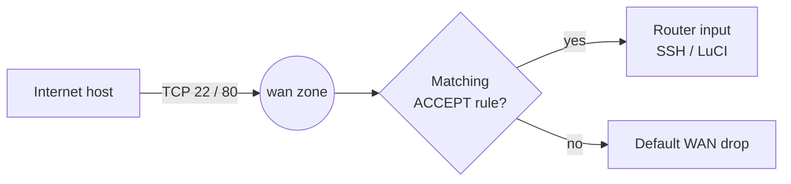

# Allow SSH and HTTP Ports on WAN in OpenWrt

## Overview

By default, OpenWrt's zone-based firewall drops all unsolicited inbound traffic on the **WAN** interface — this is the correct, secure posture. Occasionally you need to make a management service reachable from the internet: SSH (port 22) for remote administration, or HTTP/LuCI (port 80) for the web UI. This note shows how to open those ports on the WAN zone using either the **UCI CLI** or a **manual edit** of `/etc/config/firewall`, then how to verify and harden the exposure.

> [!WARNING]
> **Exposing management services to the internet is high risk**
> SSH and especially LuCI on the WAN interface are prime targets for brute-force and exploit scans. Only open these ports when you have no better option (a VPN is almost always better), and always pair them with the hardening measures in [Security Considerations](#security-considerations).

## Concepts

OpenWrt's firewall is organized into **zones** (`lan`, `wan`, and any custom zones). Each zone has default policies for `input`, `output`, and `forward`. A **rule** overrides the default policy for specific traffic — here, accepting new inbound TCP connections destined for a given port on the router itself.

| Field | Value used here | Meaning |
| --- | --- | --- |
| `src` | `wan` | Traffic arriving from the WAN zone |
| `proto` | `tcp` | Match TCP segments |
| `dest_port` | `22` / `80` | Destination port on the router |
| `target` | `ACCEPT` | Allow the matched traffic |
| `family` | `ipv4` | Apply to IPv4 only |
| `enabled` | `1` | Rule is active |

### Where a WAN input rule fits



## Configuration

### Method 1: Using UCI CLI

Allow SSH (port 22) from WAN

```bash
uci add firewall rule
uci set firewall.@rule[-1].name='Allow-SSH-WAN'
uci set firewall.@rule[-1].src='wan'
uci set firewall.@rule[-1].target='ACCEPT'
uci set firewall.@rule[-1].proto='tcp'
uci set firewall.@rule[-1].dest_port='22'
uci set firewall.@rule[-1].family='ipv4'
uci set firewall.@rule[-1].enabled='1'
```

Allow HTTP (port 80) from WAN

```bash
uci add firewall rule
uci set firewall.@rule[-1].name='Allow-HTTP-WAN'
uci set firewall.@rule[-1].src='wan'
uci set firewall.@rule[-1].target='ACCEPT'
uci set firewall.@rule[-1].proto='tcp'
uci set firewall.@rule[-1].dest_port='80'
uci set firewall.@rule[-1].family='ipv4'
uci set firewall.@rule[-1].enabled='1'
```

Commit and reload firewall

```bash
uci commit firewall
/etc/init.d/firewall reload
```

### Method 2: Manual Edit of `/etc/config/firewall`

Add the following at the end of `/etc/config/firewall`:

```text
config rule
        option name 'Allow-SSH-WAN'
        option src 'wan'
        option dest_port '22'
        option proto 'tcp'
        option target 'ACCEPT'

config rule
        option name 'Allow-HTTP-WAN'
        option src 'wan'
        option dest_port '80'
        option proto 'tcp'
        option target 'ACCEPT'
```

Then reload the firewall:

```bash
/etc/init.d/firewall reload
```

> [!NOTE]
> **📸 Screenshot**
> _Capture: OpenWrt LuCI Traffic Rules page showing the newly added Allow-SSH-WAN and Allow-HTTP-WAN rules with source zone wan and ACCEPT action_

## Examples

Verify the rules were created and confirm the ports are now reachable:

```bash
# Show all firewall rules and confirm the two new entries appear
uci show firewall | grep -E 'Allow-SSH-WAN|Allow-HTTP-WAN'
```

From an external host, test that the ports respond (replace with your public IP):

```bash
nc -zv <router-public-ip> 22
nc -zv <router-public-ip> 80
```

## Best Practices

- Prefer a **VPN** (see [OpenVPN-on-OpenWrt](OpenVPN-on-OpenWrt.md)) over any WAN-exposed management port; open ports only as a last resort.
- Scope every rule to a **trusted source IP** with `option src_ip` rather than leaving it open to `0.0.0.0/0`.
- Give each rule a clear `name` so `uci show firewall` remains auditable.
- Remove or disable the rule the moment the remote-access need ends.

## Security Considerations

Opening WAN ports moves the router from "invisible" to "advertised". Mitigate the exposure:

- **SSH**
  - Change to a **non-standard port** to cut brute-force noise.
  - Use **key-based authentication** and disable password login.
  - Restrict to trusted source IPs using `option src_ip 'x.x.x.x'` on the rule.
- **HTTP (LuCI)**
  - Avoid exposing LuCI on port 80 to the WAN at all.
  - Prefer **HTTPS (port 443)** with a strong administrator password.
  - Use a **VPN** for remote access whenever possible — see [OpenVPN-on-OpenWrt](OpenVPN-on-OpenWrt.md).

> [!TIP]
> **Restrict by source IP**
> Pinning a rule to a known management IP (`uci set firewall.@rule[-1].src_ip='203.0.113.10'`) reduces the exposed attack surface far more than any port change. Combine it with key-only SSH per CIS-style hardening guidance.

## Troubleshooting

| Symptom | Likely cause | Fix |
| --- | --- | --- |
| Port still unreachable after reload | Rule not committed | Run `uci commit firewall` then `/etc/init.d/firewall reload` |
| Reachable on LAN but not WAN | ISP/upstream NAT or CGNAT blocking inbound | Confirm the router holds a public IP; check upstream device |
| Locked out after a change | Rule mistake or default WAN drop restored | Recover from local console/serial and re-edit `/etc/config/firewall` |

## Related
- [Linux Administration & Server Hardening](../Readme.md) — Linux administration & server hardening hub.
- [Router and Firewall OS (OpenWrt)](Readme.md) — module hub.
- [Firewall-Rules-in-OpenWrt](Firewall-Rules-in-OpenWrt.md) — the WAN allow rules build on OpenWrt firewall zone configuration.
- [OpenWrt-Commands](OpenWrt-Commands.md) — CLI reference for applying and reloading firewall config.
- [OpenVPN-on-OpenWrt](OpenVPN-on-OpenWrt.md) — safer remote access than exposing management ports on WAN.
