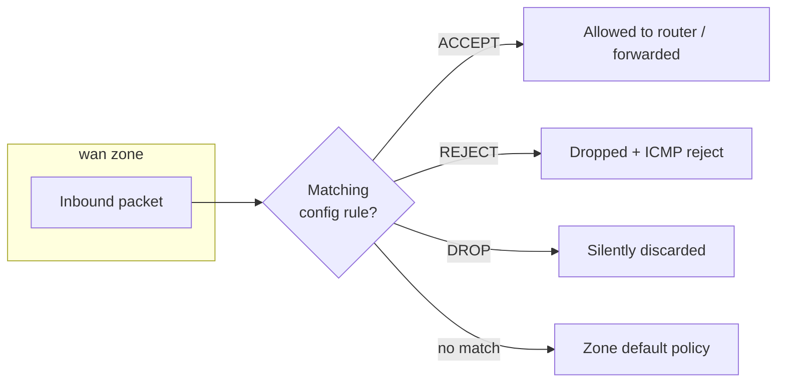

# Firewall Rules in OpenWrt

## Overview

OpenWrt uses a **zone-based firewall** system configured in `/etc/config/firewall`. Rules are portable, human-readable UCI sections rather than raw `iptables`/`nftables` statements, and they can be managed three ways:

- **UCI CLI** — scriptable, ideal for automation and remote SSH sessions.
- **LuCI Web UI** — point-and-click, under *Network → Firewall → Traffic Rules*.
- **Manual edit** of the config file — full control, good for review and version tracking.

This note covers the rule anatomy plus the add/remove workflows for all three methods.

## Concepts

The firewall groups interfaces into **zones** (`lan`, `wan`, custom). Traffic between zones is governed by **forwardings**, and individual exceptions are expressed as **rules**. Each rule is a `config rule` section whose options narrow the match (source/destination zone, protocol, IP, port) and set a `target`.



## Configuration

### Config File Location

```text
/etc/config/firewall
```

### Firewall Rule Structure

```text
config rule
        option name 'Rule-Description'
        option src 'wan'              # Source zone
        option dest 'lan'             # Destination zone (optional)
        option proto 'tcp udp'        # Protocol(s)
        option src_ip '0.0.0.0/0'     # Source IP (optional)
        option dest_ip '192.168.1.100'# Destination IP (optional)
        option dest_port '80'         # Destination port (optional)
        option target 'ACCEPT'        # ACCEPT, DROP, or REJECT
        option family 'ipv4'          # ipv4, ipv6, or any
```

| Option | Purpose | Example |
| --- | --- | --- |
| `name` | Human-readable label | `Allow-HTTP-WAN` |
| `src` | Source zone | `wan` |
| `dest` | Destination zone (optional) | `lan` |
| `proto` | Protocol(s) to match | `tcp udp` |
| `src_ip` | Restrict by source address | `0.0.0.0/0` |
| `dest_ip` | Restrict by destination address | `192.168.1.100` |
| `dest_port` | Destination port | `80` |
| `target` | Action on match | `ACCEPT`, `DROP`, `REJECT` |
| `family` | Address family | `ipv4`, `ipv6`, `any` |

## Commands

### Add a Rule — Method 1: UCI CLI

Example: allow HTTP on WAN

```bash
uci add firewall rule
uci set firewall.@rule[-1].name='Allow-HTTP-WAN'
uci set firewall.@rule[-1].src='wan'
uci set firewall.@rule[-1].proto='tcp'
uci set firewall.@rule[-1].dest_port='80'
uci set firewall.@rule[-1].target='ACCEPT'
uci set firewall.@rule[-1].family='ipv4'
uci commit firewall
/etc/init.d/firewall reload
```

### Add a Rule — Method 2: Manual Edit

Add to `/etc/config/firewall`:

```text
config rule
        option name 'Allow-HTTP-WAN'
        option src 'wan'
        option proto 'tcp'
        option dest_port '80'
        option target 'ACCEPT'
        option family 'ipv4'
```

Then reload:

```bash
/etc/init.d/firewall reload
```

### Remove a Rule — Method 1: UCI CLI

1. List all rules:

```bash
uci show firewall
```

2. Identify the index of the rule to remove, e.g.:

```text
firewall.@rule[2]=rule
firewall.@rule[2].name='Allow-HTTP-WAN'
```

3. Delete the rule:

```bash
uci delete firewall.@rule[2]
uci commit firewall
/etc/init.d/firewall reload
```

> [!TIP]
> **Find a rule by name**
> Indices shift as rules are added and removed. To locate a rule's index by its name:
> ```bash
> for i in $(seq 0 20); do uci get firewall.@rule[$i].name 2>/dev/null | grep 'Allow-HTTP-WAN' && echo "Index: $i"; done
> ```

### Remove a Rule — Method 2: Manual Edit

1. Open the file:

```bash
vi /etc/config/firewall
```

2. Remove the rule block you want to delete.

3. Save and reload:

```bash
/etc/init.d/firewall reload
```

## Best Practices

- Use `DROP` instead of `REJECT` to silently discard traffic and avoid confirming the port is filtered to a scanner.
- Always test new rules from a **local console** to avoid locking yourself out.
- For safer SSH access, **restrict by source IP** and use **key authentication**.
- Give every rule a descriptive `name` so `uci show firewall` stays readable.
- Commit (`uci commit firewall`) and reload (`/etc/init.d/firewall reload`) as an atomic pair — an uncommitted change is lost on reboot.

## Security Considerations

- Keep the WAN zone's default `input` policy at `REJECT`/`DROP`; add explicit allow rules only for services you truly need to expose.
- Prefer scoping inbound rules with `src_ip` to trusted management networks rather than `0.0.0.0/0`.
- Review rules periodically — stale `ACCEPT` rules on `wan` are a common misconfiguration flagged by CIS-style audits.

## Troubleshooting

| Symptom | Likely cause | Fix |
| --- | --- | --- |
| Rule has no effect | Change not committed | Run `uci commit firewall` then `/etc/init.d/firewall reload` |
| Wrong rule deleted | Index shifted after an add/remove | Re-run `uci show firewall`; delete by current index only |
| Config lost after reboot | Edited but never committed | Always pair edits with `uci commit firewall` |
| Syntax error on reload | Malformed manual edit | Check `logread` output; validate the `config rule` block indentation |

## Related
- [Linux Administration & Server Hardening](../Readme.md) — Linux administration & server hardening hub.
- [Router and Firewall OS (OpenWrt)](Readme.md) — module hub.
- [Allow-SSH-and-HTTP-Ports-on-WAN-in-OpenWrt](Allow-SSH-and-HTTP-Ports-on-WAN-in-OpenWrt.md) — concrete WAN traffic-rule example built on these rules.
- [OpenWrt-Commands](OpenWrt-Commands.md) — CLI reference for managing firewall zones and rules.
