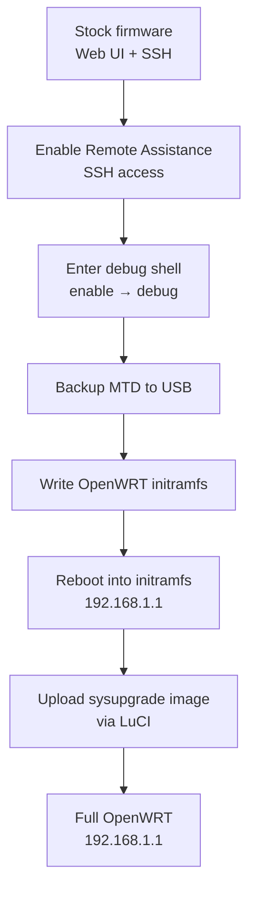

# Flash OpenWRT on TP-Link ER605 V2

## Overview

This note documents flashing OpenWRT onto the **TP-Link ER605 v2** router, based on [chill1Penguin's method](https://github.com/chill1Penguin/er605v2_openwrt_install). The procedure enters the stock firmware's hidden debug shell over SSH, backs up the MTD flash, writes an OpenWRT initramfs image, and finally installs the full sysupgrade firmware.

> [!WARNING]
> **Advanced and risky — you can permanently brick the router**
> This process is **advanced** and **risky**, and may permanently brick your router. Proceed with caution and understand that it **voids your TP-Link warranty**. Complete the MTD backup step before writing anything.

## Prerequisites

| Requirement | Notes |
| --- | --- |
| TP-Link **ER605 v2** router | Hardware revision v2 only |
| [chill1Penguin's GitHub repository](https://github.com/chill1Penguin/er605v2_openwrt_install) | Source of the helper scripts |
| OpenWRT **initramfs** and **sysupgrade** images | From the OpenWRT Firmware Selector |
| SSH client (`ssh` or PuTTY) | For the debug shell |
| USB drive (FAT32 recommended) | Holds scripts, backup, and image |
| Ethernet cable | Use the **last LAN port on the right** |
| Laptop | For preparing files |
| Internet | To download resources |

## Architecture

The flash flow moves the device through three firmware states: stock → OpenWRT initramfs (RAM-only, recoverable) → full OpenWRT on flash.



## Configuration

### 1. Enable SSH on the Router

1. Power on the router.
2. Access the **Web Interface** (`192.168.0.1` by default).
3. Register a new **username and password**, then log in.
4. Go to: `System Tools > Diagnostics > Remote Assistance`
5. **Enable Remote Assistance** and click **Save**.

### 2. Verify USB Storage

1. Plug in your USB drive to the router.
2. Navigate to: `USB > USB Storage`
3. Confirm the USB is detected.
4. Remove USB and connect it to your **laptop**.
5. Enable **Wi-Fi** on your laptop and **disconnect Ethernet** to avoid IP conflicts.
6. Download and save the following to the USB root directory:
   - `backup_mtd.sh` (from GitHub)
   - `er605v2_write_initramfs.sh` (from GitHub)
   - `openwrt-initramfs-compact.bin` (from [OpenWRT Firmware Selector](https://firmware-selector.openwrt.org))

### 3. Generate Debug Password

1. Go to the [ER605 v2 Root Password Generator](https://chill1penguin.github.io/er605v2_openwrt_install/er605rootpw.html).
2. Enter:
   - Your router's **MAC Address**
   - Your **registered username**
3. Save the generated **Debug Mode Password** for later use.

> [!NOTE]
> **📸 Screenshot**
> _Capture: The ER605 v2 root password generator web page with MAC address and username fields filled in and a generated debug password shown_

### 4. Establish SSH Connection

1. Reconnect the **Ethernet cable** to the router.
2. Disable Wi-Fi.
3. Open a terminal or SSH client:

```bash
ssh -o HostKeyAlgorithms=+ssh-rsa your_username@192.168.0.1
```

> [!NOTE]
> Replace `your_username` with the registered username (e.g., `kyle`).

### 5. Enter Debug Mode

```bash
enable
debug
```

- Paste the **debug password** (Right-click in PuTTY or Ctrl+V in terminal).

### 6. Backup MTD (Important)

```bash
cd /mnt
ls  # You should see 'sda1' if the USB is detected

cd sda1
ls  # You should see the copied scripts

chmod +x backup_mtd.sh
chmod +x er605v2_write_initramfs.sh

./backup_mtd.sh
```

> [!IMPORTANT]
> **Do not skip this step**
> The backup takes ~2-3 minutes and creates a full flash backup to USB. It is your only recovery path if the flash goes wrong — verify the backup file exists on the USB before continuing.

### 7. Flash Initramfs Image

```bash
./er605v2_write_initramfs.sh openwrt-initramfs-compact.bin
reboot
```

- **Do not unplug** during this phase.
- Wait for the reboot.
- Confirm connectivity by pinging:

```bash
ping 192.168.1.1 -t
```

### 8. Install Full OpenWRT Firmware

1. Access: [http://192.168.1.1](http://192.168.1.1/)
2. Click **"Adjust UBI Layout"** (if prompted).
3. Upload the **OpenWRT sysupgrade** image (v23.05.0 only):

```text
openwrt-23.05.0-ramips-mt7621-tplink_er605-v2-squashfs-sysupgrade.bin
```

4. Flash the image.
5. After reboot, OpenWRT will be available at `192.168.1.1`.

## Verification

You now have OpenWRT installed on your TP-Link ER605 v2. From here you can use the LuCI web interface for further configuration or SSH into the device for advanced setups.

- Browse to `http://192.168.1.1` and confirm the LuCI login page loads.
- SSH in with `ssh root@192.168.1.1` to reach the OpenWrt shell.

## Troubleshooting

| Symptom | Likely cause | Action |
| --- | --- | --- |
| USB not shown under `/mnt/sda1` | Drive not FAT32 or not detected | Reformat FAT32; confirm under *USB → USB Storage* first |
| SSH refuses to connect | Modern client rejects `ssh-rsa` | Use the `-o HostKeyAlgorithms=+ssh-rsa` flag shown above |
| No ping reply after initramfs reboot | Still booting, or wrong subnet | Wait; ensure laptop is on `192.168.1.0/24` |
| Router unresponsive after write | Interrupted flash | Recover from the MTD backup created in step 6 |

## References

- [chill1Penguin GitHub Repo](https://github.com/chill1Penguin/er605v2_openwrt_install)
- [Root Password Generator](https://chill1penguin.github.io/er605v2_openwrt_install/er605rootpw.html)
- [YouTube Flashing Guide](https://www.youtube.com/watch?v=v1TEVJjqPco)
- [OpenWRT Firmware Selector](https://firmware-selector.openwrt.org/)

## Related
- [Linux Administration & Server Hardening](../Readme.md) — Linux administration & server hardening hub.
- [Router and Firewall OS (OpenWrt)](Readme.md) — module hub.
- [OpenWrt-Upgrade](OpenWrt-Upgrade.md) — upgrading the firmware once OpenWrt is flashed.
- [OpenWrt-Commands](OpenWrt-Commands.md) — CLI reference for the freshly flashed device.
