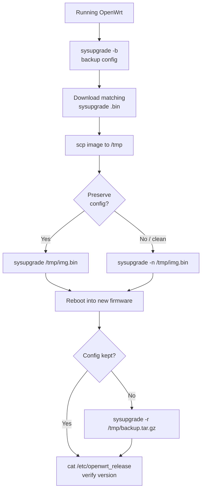

# OpenWrt Upgrade

Upgrading an OpenWrt device in place using the command-line `sysupgrade` method: back up the running configuration, upload a device-matched firmware image, flash it, then restore and verify.

## Overview

`sysupgrade` is OpenWrt's built-in firmware replacement tool. It writes a new `*-sysupgrade.bin` image to the boot/root partitions of a device that is *already* running OpenWrt, and — unless told otherwise — carries the existing configuration forward across the version bump.

The upgrade has four phases:

| Phase | Goal | Key command |
|---|---|---|
| Prepare | Preserve current settings and fetch the right image | `sysupgrade -b`, Firmware Selector |
| Upload | Move the `.bin` onto the router | `scp … root@192.168.1.1:/tmp/` |
| Flash | Replace firmware, keeping or wiping config | `sysupgrade [-n] /tmp/…bin` |
| Verify | Confirm version and (if needed) restore config | `cat /etc/openwrt_release`, `sysupgrade -r` |

> [!WARNING]
> Flash the **sysupgrade** image, never the **factory** image, when the device is already running OpenWrt. Using the wrong image type — or an image built for a different target/board — can brick the device. Confirm the target string (e.g. `ramips/mt7621`) matches your hardware before flashing.



## Before You Begin

Back up the current configuration and confirm you have the correct firmware file before touching the flash.

### Back Up the Current Configuration

```bash
sysupgrade -b /tmp/backup.tar.gz
```

This creates a compressed archive of your configuration in `/tmp`. Download it to your workstation with SCP or through the LuCI web interface so your settings survive a failed or clean flash.

> [!TIP]
> `/tmp` on OpenWrt is a RAM-backed tmpfs — its contents are lost on reboot. Copy the backup (and the firmware image) off the device, or at least keep in mind they vanish if the router restarts before you finish.

### Download Compatible Firmware

Use the OpenWrt Firmware Selector to obtain the correct `.bin` image for your exact device model:

```text
https://firmware-selector.openwrt.org/
```

Select your device model and download the **sysupgrade** image (not the factory image).

## Upload Firmware to the Device

Copy the firmware from your workstation to the router's `/tmp` directory with `scp`.

```bash
scp openwrt-<target>.bin root@192.168.1.1:/tmp/
```

Replace `<target>` with the actual filename you downloaded. Example:

```bash
scp openwrt-22.03.6-ramips-mt7621-erx-squashfs-sysupgrade.bin root@192.168.1.1:/tmp/
```

## Perform the Upgrade

Run the upgrade only after the image is uploaded and verified.

### Upgrade While Preserving Configuration

```bash
sysupgrade /tmp/openwrt-<target>.bin
```

This is the most common path. It flashes the new firmware while keeping the current configuration files intact.

### Upgrade Without Preserving Configuration (Fresh Install)

```bash
sysupgrade -n /tmp/openwrt-<target>.bin
```

This erases all existing configuration and applies a clean firmware installation. Use it when troubleshooting persistent bugs or migrating from a different OpenWrt variant.

> [!IMPORTANT]
> A clean flash (`-n`) also resets the LAN address, root password, and firewall to defaults. Have out-of-band or console access ready in case network settings you rely on are wiped.

## After the Upgrade

### Restore Backup Configuration (If Needed)

If you performed a fresh install and want your previous settings back, restore the archive you saved earlier:

```bash
sysupgrade -r /tmp/backup.tar.gz
```

Upload the backup file first if it is not already on the device:

```bash
scp backup.tar.gz root@192.168.1.1:/tmp/
```

Then run the restore command above.

### Verify Firmware Version

Check the installed OpenWrt version and build information:

```bash
cat /etc/openwrt_release
```

Expected output resembles the following (values vary by device and release):

```ini
DISTRIB_ID='OpenWrt'
DISTRIB_RELEASE='22.03.6'
DISTRIB_REVISION='r20134-5f15225c1e'
DISTRIB_TARGET='ramips/mt7621'
DISTRIB_DESCRIPTION='OpenWrt 22.03.6 r20134-5f15225c1e'
```

> [!NOTE]
> **📸 Screenshot**
> _Capture: LuCI System → Backup / Flash Firmware page showing the sysupgrade image upload field and the "Keep settings" checkbox_

## Best Practices

- **Verify the image before flashing.** Match the `DISTRIB_TARGET` of the running system to the target embedded in the filename; a mismatched target can brick the device.
- **Keep a copy of the backup off-device.** `/tmp` is volatile — a mid-upgrade reboot loses anything stored only there.
- **Prefer major-version-aware config migration.** When jumping several releases, review the OpenWrt release notes for breaking `uci` changes rather than blindly preserving config.
- **Read the checksum.** Confirm the downloaded `.bin` matches the SHA-256 published by the Firmware Selector before uploading.

## Troubleshooting

| Symptom | Likely cause | Check / fix |
|---|---|---|
| `Image check failed` / refuses to flash | Wrong image type or target | Re-download the **sysupgrade** image for the exact device model |
| Device unreachable after upgrade | Config wiped by `-n`, LAN reset to default | Reach it at the default `192.168.1.1`; restore with `sysupgrade -r` |
| Settings lost after clean flash | Backup not restored | `scp` the backup to `/tmp`, then `sysupgrade -r /tmp/backup.tar.gz` |
| Router bricked / no boot | Power loss during flash or bad image | Use the device's failsafe / TFTP recovery mode |
| Version unchanged after reboot | Flash did not complete | Re-check `cat /etc/openwrt_release`; re-run the upgrade |

## Additional Tips

- Use the LuCI web interface (**System → Backup / Flash Firmware**) if you are not comfortable with SSH/SCP.
- Ensure the router is powered from a stable source during the upgrade to avoid firmware corruption.
- Avoid the factory image unless flashing from OEM firmware or a recovery mode.

## References

- OpenWrt Documentation — *Upgrading OpenWrt firmware using sysupgrade*
- OpenWrt Firmware Selector — `https://firmware-selector.openwrt.org/`
- OpenWrt Documentation — *Backup and restore (`/etc/config`)*

## Related

- [Router and Firewall OS (OpenWrt)](Readme.md) — module hub
- [OpenWrt-Commands](OpenWrt-Commands.md) — CLI reference for the upgrade procedure
- [Flash-OpenWRT-on-TP-Link-ER605-V2](Flash-OpenWRT-on-TP-Link-ER605-V2.md) — initial flashing before upgrades
- [Linux Administration & Server Hardening](../Readme.md) — Linux administration & server hardening hub
