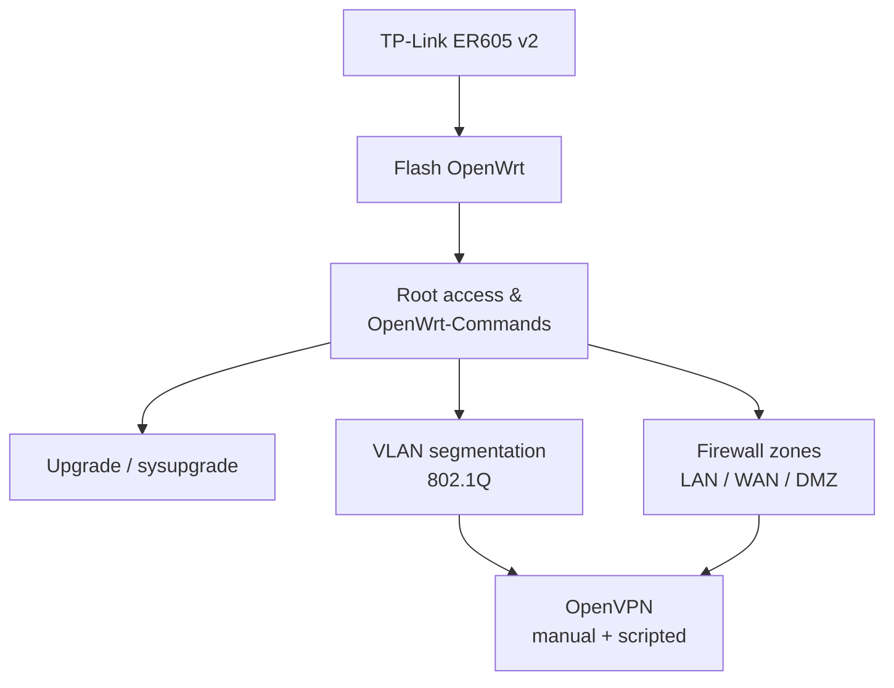

# Router and Firewall OS (OpenWrt)

OpenWrt as a router/firewall: flashing, firewall, VLANs, and VPN (WireGuard/OpenVPN).

> [!NOTE]
> **Module hub**
> Part of the **[Linux Administration & Server Hardening](../Readme.md)** course.

## Overview

Turning commodity hardware into a capable router and firewall with OpenWrt. This module covers flashing and upgrading firmware, the firewall rule model, VLAN segmentation, and site-to-site/remote VPN with OpenVPN — including an automated deployment script — for branch-office and edge networking.

## Learning Objectives

By the end of this module you will be able to:

- Flash, upgrade, and recover OpenWrt on supported hardware
- Configure firewall rules, port policy, and VLAN segmentation
- Deploy VPN connectivity (OpenVPN/WireGuard) for secure remote/site links

## Topics Covered

This module contains **7 notes**.

| Note | Topic |
| --- | --- |
| [Allow-SSH-and-HTTP-Ports-on-WAN-in-OpenWrt](Allow-SSH-and-HTTP-Ports-on-WAN-in-OpenWrt.md) | Allow SSH and HTTP Ports on WAN in OpenWrt |
| [Firewall-Rules-in-OpenWrt](Firewall-Rules-in-OpenWrt.md) | Firewall Rules in OpenWrt |
| [Flash-OpenWRT-on-TP-Link-ER605-V2](Flash-OpenWRT-on-TP-Link-ER605-V2.md) | Flash OpenWRT on TP Link ER605 V2 |
| [OpenVPN-on-OpenWrt](OpenVPN-on-OpenWrt.md) | OpenVPN on OpenWrt |
| [OpenWrt-Commands](OpenWrt-Commands.md) | OpenWrt Commands |
| [OpenWrt-Upgrade](OpenWrt-Upgrade.md) | OpenWrt Upgrade |
| [Router-OS-and-Firewall-OS](Router-OS-and-Firewall-OS.md) | Router OS and Firewall OS |

## Practical Labs

> [!NOTE]
> **Hands-on labs**
> Guided, reproducible labs for this topic live in the course-wide **[Practical Labs](../Practical-Labs/Readme.md)** collection — build them on a disposable VM. The step-by-step configuration walkthroughs in the notes above also work as self-paced labs.

## Best Practices

- Back up the configuration before flashing or upgrading
- Segment networks with VLANs and default-deny between zones
- Automate repeatable VPN/router builds with scripts under version control

## Security Considerations

> [!WARNING]
> **Harden before you expose**
> Apply these controls before placing any service on an untrusted network.

- Restrict WAN-side management; expose only required, authenticated services
- Keep firmware updated and disable unused services
- Use strong keys and modern ciphers for VPN tunnels

## Troubleshooting

| Symptom | Likely cause & fix |
| --- | --- |
| Router unreachable after flashing | Use failsafe mode / TFTP recovery to restore a known-good image |
| VLANs not isolating traffic | Verify switch port tagging and firewall zone assignments |

## References

- [OpenWrt documentation](https://openwrt.org/docs/start)
- [WireGuard](https://www.wireguard.com/)
- [OpenVPN community docs](https://openvpn.net/community-resources/)

## Related Notes

- [Linux Administration & Server Hardening](../Readme.md) — course hub and map of content
- [OpenWrt Branch Office (Project 08)](../Enterprise-Projects/Project-08-OpenWrt-Branch-Office.md) — capstone build
- [Security, Firewall and Monitoring](../Security-Firewall-and-Monitoring/Readme.md) — related module
- [Network Configuration](../Network-Configuration/Readme.md) — related module
- [SSH Secure Shell Server](../SSH-Secure-Shell-Server/Readme.md) — related module
