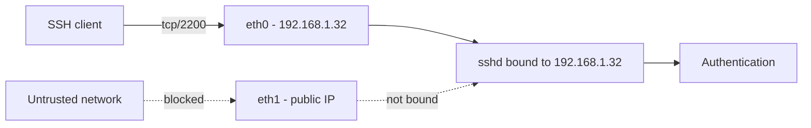

# Bind SSH To A Specific IP Address

## Overview

By default the OpenSSH daemon (`sshd`) binds to **all available network interfaces** — the equivalent of `ListenAddress 0.0.0.0` for IPv4 and `ListenAddress ::` for IPv6. On a multi-homed host (a machine with more than one IP address or interface) this exposes the SSH service on every network the server is attached to, including networks where remote administration should never be reachable.

The `ListenAddress` directive constrains `sshd` to one or more specific IP addresses, so the daemon accepts connections only on the interface(s) you designate. This is a foundational hardening control: it reduces the service's attack surface and lets you isolate management traffic onto a dedicated administrative or internal network.

> [!NOTE]
> `ListenAddress` controls **where the daemon binds** (which interface answers). It is not a substitute for host-based access control (`AllowUsers`/`DenyUsers`) or a firewall — it complements them. See [Managing-IP-Allow-and-Deny-in-SSH](Managing-IP-Allow-and-Deny-in-SSH.md) and [Managing-Access-with-hosts.allow-and-hosts.deny](Managing-Access-with-hosts.allow-and-hosts.deny.md).

## Concepts

| Directive | Purpose | Default |
|-----------|---------|---------|
| `ListenAddress` | IP address (and optionally port) `sshd` binds to | All interfaces (`0.0.0.0` and `::`) |
| `Port` | TCP port `sshd` listens on | `22` |
| `AddressFamily` | Restrict to `inet` (IPv4), `inet6` (IPv6), or `any` | `any` |

**Accepted `ListenAddress` forms:**

| Syntax | Meaning |
|--------|---------|
| `ListenAddress 192.168.1.32` | Bind to this IPv4 address on the configured `Port` |
| `ListenAddress 192.168.1.32:2200` | Bind to this address **and** port in one directive |
| `ListenAddress ::1` | Bind to an IPv6 address |
| Multiple lines | Bind to several addresses (one directive per address) |

## Architecture



## Configuration

### Edit The SSH Configuration File

Open the SSH server configuration file:

```bash
vim /etc/ssh/sshd_config
```

Locate the `ListenAddress` directive and set it to the desired IP address, for example:

```bash
ListenAddress 192.168.1.32
```

If you are also changing the port (e.g., from `22` to `2200`), ensure the `Port` directive reflects that:

```bash
Port 2200
```

> [!TIP]
> You can specify **multiple** `ListenAddress` entries if the server should listen on more than one IP. Each address goes on its own line.

### Example Configuration Snippet (`/etc/ssh/sshd_config`)

A practical snippet from `/etc/ssh/sshd_config` demonstrating both port and IP binding:

```bash
Include /etc/ssh/sshd_config.d/*.conf
Port 2200
ListenAddress 192.168.1.32
AuthorizedKeysFile	.ssh/authorized_keys
Subsystem	sftp	/usr/libexec/openssh/sftp-server
```

> You can comment out the `#ListenAddress ::` or `#ListenAddress 0.0.0.0` lines if you don't want the daemon to listen on all interfaces.

> [!WARNING]
> Validate the configuration **before** restarting so you don't lock yourself out. Run `sshd -t` (or `sshd -T` to dump the effective config) and keep a second, already-authenticated session open while you test.

## Commands

### Restart The SSH Service

After modifying the configuration file, restart the SSH service to apply the changes:

```bash
systemctl restart sshd.service
```

### Verify SSH Is Listening On The Correct IP And Port

Use `netstat` (or `ss`) to confirm that `sshd` is bound to the specified IP and port:

```bash
netstat -nltup | grep sshd
```

Expected output should show something like:

```text
tcp   0   0 192.168.1.32:2200   0.0.0.0:*   LISTEN   <PID>/sshd
```

> [!NOTE]
> **📸 Screenshot**
> _Capture: Terminal output of netstat showing sshd bound only to 192.168.1.32 on port 2200 in the LISTEN state_

## Best Practices

- **Bind management SSH to an internal/administrative IP**, never a public-facing interface, whenever a dedicated management network exists.
- Combine `ListenAddress` with a **host firewall** (firewalld/nftables/iptables) so the port is filtered even if the bind configuration is later relaxed.
- Set `AddressFamily inet` when IPv6 is unused, so the daemon does not silently expose an IPv6 listener.
- Keep a **backup** of `/etc/ssh/sshd_config` and always test with `sshd -t` before restarting.
- Layer access control: `ListenAddress` (interface) + `AllowUsers`/`AllowGroups` (identity) + firewall (packet filter).

## Security Considerations

- Binding to a single interface is a **defense-in-depth** measure, not authentication. An attacker on the same subnet as the bound IP is unaffected — pair it with key-based auth and access lists.
- If the server's IP changes (DHCP lease, cloud re-provisioning), a hard-coded `ListenAddress` can leave `sshd` unable to bind at boot. Prefer static addressing for hosts that pin `ListenAddress`.
- Aligns with CIS Benchmark guidance to minimize network exposure of remote-administration services.

## Troubleshooting

| Symptom | Likely cause | Resolution |
|---------|--------------|------------|
| `sshd` fails to start, "Cannot bind any address" | The `ListenAddress` IP is not configured on any interface yet | Bring the interface/IP up first, or correct the address |
| Connection refused on the new IP | Firewall still blocks the port | Open the port (see [Change-Default-SSH-Port](Change-Default-SSH-Port.md)) |
| Still reachable on old interfaces | Stray `ListenAddress 0.0.0.0`/`::` line present | Comment it out and restart |
| Change not taking effect | A drop-in under `sshd_config.d/` overrides the main file | Check `grep -r ListenAddress /etc/ssh/sshd_config*` |

## References

- `man 5 sshd_config` — `ListenAddress`, `Port`, `AddressFamily`
- CIS Benchmarks — SSH server hardening

## Related

- [SSH(Secure-Shell)-Server](SSH(Secure-Shell)-Server.md) — parent SSH server note
- [Change-Default-SSH-Port](Change-Default-SSH-Port.md) — companion sshd hardening tweak (port + firewall)
- [Managing-IP-Allow-and-Deny-in-SSH](Managing-IP-Allow-and-Deny-in-SSH.md) — restrict access by user and IP
- SSH-Enumeration — attacker-side SSH recon
- [Linux Administration & Server Hardening](../Readme.md) — Linux administration & server hardening hub
