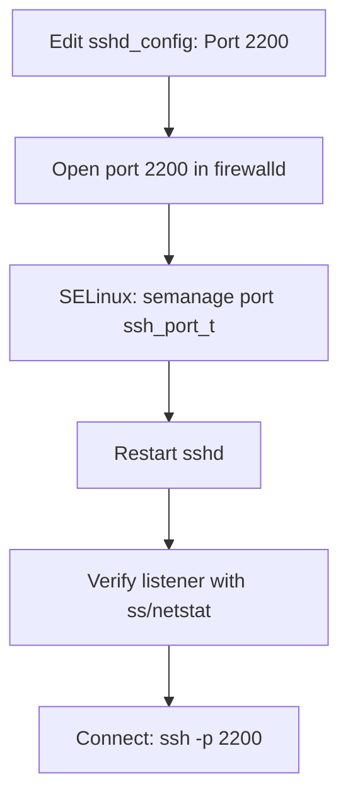

# Change Default SSH Port

## Overview

SSH listens on TCP port `22` by default. Because that port is universally known, it is the constant target of automated scanners, credential-stuffing bots, and worm traffic. Moving `sshd` to a non-standard port (for example `2200`) is a low-effort hardening step that dramatically cuts opportunistic noise in your logs and reduces exposure to untargeted attacks.

> [!IMPORTANT]
> Changing the port is **security through obscurity** — it deters bulk automated scanning, not a determined attacker who fingerprints services. Treat it as one layer among key-based authentication, access control, and a firewall, never as a standalone control.

This note covers the full change: editing `sshd_config`, updating firewalld, restarting the service, verifying the listener, and connecting on the new port — plus the SELinux step that trips people up on RHEL-family systems.

## Concepts

| Item | Value in this note | Notes |
|------|--------------------|-------|
| Default port | `22` | Well-known, heavily scanned |
| New port | `2200` | Any free TCP port `1024`–`65535` works |
| Config file | `/etc/ssh/sshd_config` | Main daemon configuration |
| Firewall | `firewalld` | RHEL/Fedora/CentOS default |
| SELinux type | `ssh_port_t` | Must be updated when SELinux is enforcing |

## Change Workflow



> [!WARNING]
> Do the **firewall and SELinux steps before** restarting `sshd`. If you restart first, the new port may be blocked or denied by SELinux and you can lock yourself out. Keep a second authenticated session open throughout.

## Configuration

### Edit The SSHD Configuration File

Open the SSH server configuration file in a text editor such as `vim`:

```bash
vim /etc/ssh/sshd_config
```

Locate the following line and change the port number (e.g., to `2200`):

```conf
Port 2200
```

> [!NOTE]
> Ensure this line is not commented out (remove the `#` at the beginning).

### Example Configuration Snippet (`/etc/ssh/sshd_config`)

A sample snippet of the modified `sshd_config` with the relevant `Port` directive and other useful defaults:

```bash
Include /etc/ssh/sshd_config.d/*.conf
Port 2200
AuthorizedKeysFile	.ssh/authorized_keys
Subsystem	sftp	/usr/libexec/openssh/sftp-server
```

> Make sure to save your changes and always back up configuration files before modifying them.

## Firewall (firewalld)

### Add The New SSH Port

Permanently allow TCP traffic on port `2200`:

```bash
firewall-cmd --permanent --add-port=2200/tcp
```

### Remove The Default Port (Optional)

If you want to disallow SSH on the default port `22`, you can remove the ssh service:

```bash
firewall-cmd --permanent --remove-service=ssh
```

> This step is optional but recommended for security if you're confident in accessing the system through the new port only.

### Reload The Firewall Rules

After making changes, reload `firewalld` to apply them:

```bash
firewall-cmd --reload
```

### Verify The New Port Is Allowed

Check that port `2200` is now listed:

```bash
firewall-cmd --list-ports
```

You should see:

```text
2200/tcp
```

## Commands

### Restart The SSH Service

Restart the SSH service to load the updated configuration:

```bash
systemctl restart sshd.service
```

### Verify SSH Service Port

Check that the SSH daemon is listening on the new port:

```bash
netstat -nltup | grep sshd
```

Alternatively, use `ss` if `netstat` is unavailable:

```bash
ss -nltup | grep sshd
```

> [!NOTE]
> **📸 Screenshot**
> _Capture: Terminal showing ss output with sshd in LISTEN state on port 2200_

### Connect Using The New SSH Port

To connect to the server on the new SSH port (both forms are equivalent):

```bash
ssh -p 2200 armour@192.168.1.32
```

```bash
ssh armour@192.168.1.32 -p 2200
```

> Replace `root` and `192.168.1.32` with the appropriate username and server IP address.

## SELinux Consideration (If Enabled)

If SELinux is enabled and enforcing, you must inform it about the new SSH port, or the daemon will be denied the bind:

```bash
semanage port -a -t ssh_port_t -p tcp 2200
```

> You may need to install the `policycoreutils-python` or `policycoreutils-python-utils` package to use `semanage`.

## Best Practices

- Choose a port and **document it** in your infrastructure inventory; an undocumented custom port causes operational headaches.
- Always keep a **fallback session** open until you have confirmed a fresh login on the new port succeeds.
- Combine the port change with **key-based authentication** ([SSH-Public-and-Private-Key-Configuration](SSH-Public-and-Private-Key-Configuration.md)) and access control ([Managing-IP-Allow-and-Deny-in-SSH](Managing-IP-Allow-and-Deny-in-SSH.md)).
- Update any **monitoring, backup, and automation** (Ansible inventories, `~/.ssh/config`, CI runners) that assumed port `22`.

## Security Considerations

- Port obfuscation reduces automated-scan volume but a full-range TCP scan (e.g., `nmap -p-`) will still find the service — it is not a hiding place.
- Do **not** use this as a reason to relax stronger controls. CIS/NIST guidance treats key auth, `PermitRootLogin no`, and firewalling as the substantive controls.
- Removing the default `ssh` firewalld service (above) is the safer end state once the new port is confirmed working.

## Troubleshooting

| Symptom | Likely cause | Resolution |
|---------|--------------|------------|
| Connection refused on `2200` | Firewall port not open, or SELinux blocked bind | Add port in firewalld; run the `semanage` step |
| `sshd` won't restart | Syntax error in `sshd_config` | Run `sshd -t` to validate before restart |
| Still answers on `22` | A drop-in in `sshd_config.d/` re-sets the port | `grep -r Port /etc/ssh/sshd_config*` |
| `semanage: command not found` | policycoreutils utils not installed | Install `policycoreutils-python-utils` |

## References

- `man 5 sshd_config` — `Port` directive
- `man firewall-cmd`, `man semanage-port`
- CIS Benchmarks — SSH hardening

## Related

- [SSH(Secure-Shell)-Server](SSH(Secure-Shell)-Server.md) — parent SSH server note
- [Bind-SSH-To-A-Specific-IP-Address](Bind-SSH-To-A-Specific-IP-Address.md) — companion sshd hardening tweak
- [Managing-IP-Allow-and-Deny-in-SSH](Managing-IP-Allow-and-Deny-in-SSH.md) — restrict SSH by user/IP
- SSH-Enumeration — attacker-side SSH recon
- [Linux Administration & Server Hardening](../Readme.md) — Linux administration & server hardening hub
