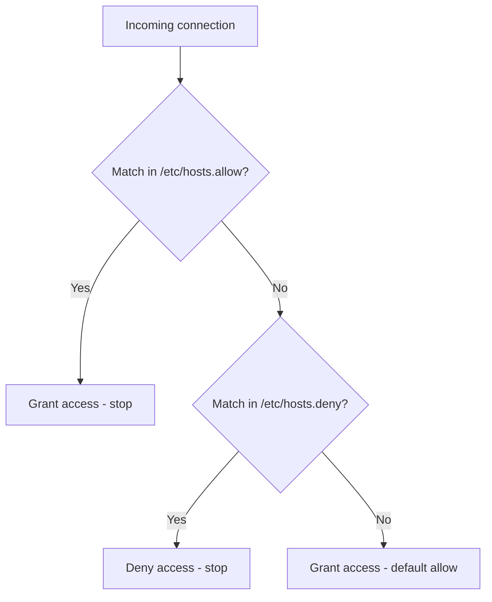

# Managing Access With hosts.allow and hosts.deny

## Overview

The files `/etc/hosts.allow` and `/etc/hosts.deny` are part of the **TCP Wrappers** system, a host-based access-control layer for network services on Unix-like systems. Any service linked against the **libwrap** library (historically `sshd`, `vsftpd`, and services launched through a tcp_wrappers-enabled `xinetd`) can be gated by rules in these two files.

| File | Role |
|------|------|
| `/etc/hosts.allow` | Specifies which hosts are **permitted** access |
| `/etc/hosts.deny` | Specifies which hosts are **denied** access |

> [!IMPORTANT]
> TCP Wrappers is **deprecated** and support was removed from OpenSSH as of version 6.7. On current systems `sshd` is typically **not** libwrap-linked, so these files may have no effect on SSH. Verify with `ldd $(which sshd) | grep libwrap`; if there is no output, use firewalld/nftables and `sshd`'s own `AllowUsers`/`DenyUsers` ([Managing-IP-Allow-and-Deny-in-SSH](Managing-IP-Allow-and-Deny-in-SSH.md)) instead. This note documents the classic mechanism for legacy hosts and exam contexts.

## Concepts

### Rule Evaluation Order

TCP Wrappers evaluates rules deterministically: `hosts.allow` is checked first, and the first match wins.



> [!NOTE]
> Because the default when no rule matches is **allow**, a deny-by-default posture requires an explicit `sshd : ALL` (or `ALL : ALL`) in `/etc/hosts.deny`.

### Pattern Syntax

| Pattern | Meaning |
|---------|---------|
| `192.168.1.7` | A single host IP |
| `192.168.1.*` | Every host in the subnet (wildcard) |
| `192.168.1.0/255.255.255.0` | CIDR-style subnet (network/netmask) |
| `ALL` | Every host / every service |
| `EXCEPT` | Carves an exception out of a broader pattern |
| `: allow` / `: deny` | Optional per-rule action (lets one file hold both) |

## Denying Hosts Access

### Edit The hosts.deny File

To deny hosts access to SSH or other services:

```bash
vim /etc/hosts.deny
```

Add the following configuration:

```conf
# hosts.deny This file contains access rules which are used to
# deny connections to network services that either use
# the tcp_wrappers library or that have been
# started through a tcp_wrappers-enabled xinetd.
# See 'man 5 hosts_options' and 'man 5 hosts_access'
# for information on rule syntax.
# See 'man tcpd' for information on tcp_wrappers

sshd : 192.168.1.7  
sshd : 192.168.1.*  
sshd : 192.168.1.0/255.255.255.0  
sshd : 192.168.1.0/255.255.255.0 EXCEPT 192.168.1.7
```

#### Explanation

| Rule | Effect |
|------|--------|
| `sshd : 192.168.1.7` | Deny SSH access from a specific IP |
| `sshd : 192.168.1.*` | Deny SSH access from all hosts in the subnet |
| `sshd : 192.168.1.0/255.255.255.0` | CIDR-style subnet blocking |
| `... EXCEPT 192.168.1.7` | Deny the subnet **except** this trusted IP |

## Allowing Hosts Access

### Option 1: Block All In hosts.deny, Then Allow Specific In hosts.allow

**1. Block all SSH access** — edit `hosts.deny`:

```bash
vim /etc/hosts.deny
```

Add the following:

```conf
# hosts.deny This file contains access rules which are used to
# deny connections to network services that either use
# the tcp_wrappers library or that have been
# started through a tcp_wrappers-enabled xinetd.
sshd : ALL
```

**2. Allow a specific IP** — edit `hosts.allow`:

```bash
vim /etc/hosts.allow
```

Add the specific host to be allowed:

```conf
# hosts.allow This file contains access rules which are used to
# allow or deny connections to network services that
# either use the tcp_wrappers library or that have been
# started through a tcp_wrappers-enabled xinetd.
sshd : 192.168.1.7
```

### Option 2: Manage Allow And Deny In One File (hosts.allow)

```bash
vim /etc/hosts.allow
```

Configure combined rules directly:

```conf
# hosts.allow This file contains access rules which are used to
# allow or deny connections to network services that
# either use the tcp_wrappers library or that have been
# started through a tcp_wrappers-enabled xinetd.
sshd : 192.168.1.7 : allow
sshd : ALL : deny
```

#### Notes

| Rule | Effect |
|------|--------|
| `sshd : 192.168.1.7 : allow` | Only this IP is permitted SSH access |
| `sshd : ALL : deny` | All other hosts are denied access |

## Best Practices

- Rules in `hosts.allow` take precedence over those in `hosts.deny` — put your **exceptions in `hosts.allow`**.
- TCP Wrappers must be **supported by the service**; not all services (and modern `sshd`) use libwrap. Confirm before relying on it.
- Use `EXCEPT` clauses in `/etc/hosts.deny` to exclude trusted IPs from a broad block.
- **Combine with a packet filter** (iptables/nftables/firewalld) for defense in depth — TCP Wrappers acts at the application layer, after the packet is already accepted by the kernel.
- On modern systems, prefer `sshd`'s native `AllowUsers`/`DenyUsers` and firewall rules; treat these files as a legacy/compatibility mechanism.

## Security Considerations

- A missing explicit `deny` means **default-allow** — an incomplete `hosts.deny` provides no protection.
- Because support has been removed from current OpenSSH, do **not** rely on these files as your only SSH control on new deployments; you may believe access is restricted when it is not.
- TCP Wrappers rules apply per-service name (`sshd`, `vsftpd`), so a typo in the daemon name silently disables the rule.

## Troubleshooting

| Symptom | Likely cause | Resolution |
|---------|--------------|------------|
| Rules have no effect on SSH | `sshd` is not libwrap-linked | `ldd $(which sshd) | grep libwrap`; use firewall + `AllowUsers` |
| Everyone still allowed despite deny rule | Daemon name mismatch or missing `ALL` fallback | Match the exact service name; add `sshd : ALL` |
| Trusted host blocked | Broad subnet deny without `EXCEPT` | Add the host to `hosts.allow` or an `EXCEPT` clause |

## References

```bash
man 5 hosts_access
```

```bash
man 5 hosts_options
```

```bash
man tcpd
```

## Related

- [Managing-IP-Allow-and-Deny-in-SSH](Managing-IP-Allow-and-Deny-in-SSH.md) — native sshd access control (AllowUsers/DenyUsers)
- [SSH(Secure-Shell)-Server](SSH(Secure-Shell)-Server.md) — parent SSH server note
- [Change-Default-SSH-Port](Change-Default-SSH-Port.md) — complementary SSH hardening
- Privilege-Escalation — access controls relevant to hardening
- [Linux Administration & Server Hardening](../Readme.md) — Linux administration & server hardening hub
