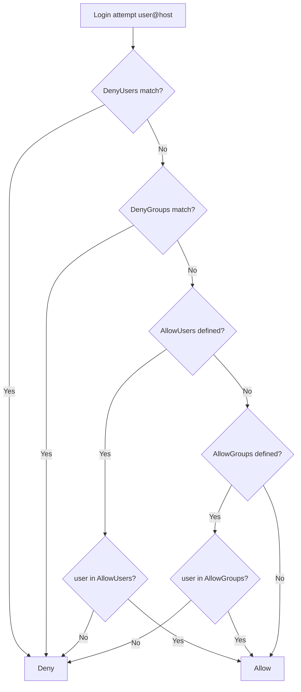

# Managing IP Allow and Deny in SSH

## Overview

SSH access can be constrained directly inside the daemon configuration (`/etc/ssh/sshd_config`) by declaring which **users** — optionally bound to specific **source IP addresses** — may or may not authenticate. This is done with the `AllowUsers`, `DenyUsers`, `AllowGroups`, and `DenyGroups` directives.

Unlike TCP Wrappers ([Managing-Access-with-hosts.allow-and-hosts.deny](Managing-Access-with-hosts.allow-and-hosts.deny.md)), these directives are **native to OpenSSH** and work on all current systems, making them the recommended way to build user- and origin-based access lists for SSH. They are especially valuable on critical hosts where you want to pin administrative accounts to known jump hosts or management subnets.

> [!NOTE]
> These directives match on the `user@host` pair, where `host` is the client's resolved name or IP. They complement — but do not replace — a network firewall. Layer both for defense in depth.

## Concepts

### Directives

| Directive | Scope | Effect |
|-----------|-------|--------|
| `AllowUsers` | User (optionally `user@host`) | Only listed users may log in; everyone else is denied |
| `DenyUsers` | User (optionally `user@host`) | Listed users are refused |
| `AllowGroups` | Group | Only members of listed groups may log in |
| `DenyGroups` | Group | Members of listed groups are refused |

### Evaluation Precedence

OpenSSH evaluates the four directives in a fixed order, and **`Deny` rules win** over `Allow` rules:



> [!IMPORTANT]
> The precise order is `DenyUsers` → `AllowUsers` → `DenyGroups` → `AllowGroups`. If `AllowUsers` (or `AllowGroups`) is present, it becomes an **allow-list**: any account not on it is denied, even without an explicit `DenyUsers` entry.

### Pattern Forms

| Pattern | Meaning |
|---------|---------|
| `root@192.168.1.7` | The user `root` only from `192.168.1.7` |
| `*@192.168.1.151` | Any user from `192.168.1.151` |
| `*@192.168.1.*` | Any user from any host in `192.168.1.x` |
| `root@*` | User `root` from any IP |
| `armour@*` | User `armour` from any IP |

## Deny SSH Access From Specific Users Or IPs

Use a text editor like `vim` to open the SSH daemon configuration file:

```bash
vim /etc/ssh/sshd_config
```

To block access from specific users or IP addresses, add `DenyUsers` directives to the `sshd_config` file:

```bash
DenyUsers root@192.168.1.7
DenyUsers *@192.168.1.151
DenyUsers *@192.168.1.*
DenyUsers root@*
```

| Rule | Effect |
|------|--------|
| `root@192.168.1.7` | Deny SSH login to root from this specific IP |
| `*@192.168.1.151` | Deny any user from IP `192.168.1.151` |
| `*@192.168.1.*` | Deny any user from any host in the `192.168.1.x` range |
| `root@*` | Deny root login from all IP addresses |

### Restart SSH Service

After saving the file, apply the changes by restarting the SSH service:

```bash
systemctl restart sshd.service
```

## Allow SSH Access From Specific Users Or IPs

If you want to permit access only to selected users or IPs, use the `AllowUsers` directive instead. Open the configuration again:

```bash
vim /etc/ssh/sshd_config
```

Add the following lines to explicitly allow access:

```bash
AllowUsers root@192.168.1.7
AllowUsers armour@*
AllowUsers *@192.168.1.7
```

| Rule | Effect |
|------|--------|
| `root@192.168.1.7` | Allow root login from IP `192.168.1.7` |
| `armour@*` | Allow the user `armour` to log in from any IP |
| `*@192.168.1.7` | Allow any user from IP `192.168.1.7` |

> If both `DenyUsers` and `AllowUsers` are present, `DenyUsers` takes precedence.

> [!WARNING]
> Adding an `AllowUsers` line turns SSH into an **allow-list**. Any account not listed — including the one you are currently using — is immediately locked out on restart. Make sure your own `user@host` is included and keep a second session open.

### Restart SSH Service Again

Finally, restart the SSH service again to apply the updated configuration:

```bash
systemctl restart sshd.service
```

> [!NOTE]
> **📸 Screenshot**
> _Capture: SSH connection attempt from a denied IP being rejected while an allowed IP succeeds, shown side by side in two terminals_

## Best Practices

- Prefer **`AllowGroups`** (e.g., a dedicated `ssh-users` group) over long per-user lists — it scales and centralizes membership management.
- Pin administrative accounts to a **management subnet or jump host** with `user@host` patterns rather than allowing `*`.
- Validate configuration with `sshd -t` before every restart, and always keep a **fallback authenticated session** open.
- Combine these directives with a **firewall** and **key-based authentication** for layered control.
- Use **`Match` blocks** for granular, conditional policy per user, group, or source address.

## Security Considerations

- IP-based patterns rely on the client's apparent source address; behind NAT or a shared egress IP, `*@<ip>` grants everyone on that egress the same trust. Scope carefully.
- Host patterns can resolve via DNS — if `UseDNS` is enabled, a DNS failure or spoof can affect matching. Prefer literal IPs for security-critical rules.
- An empty or typo'd `AllowUsers` (matching no one) will deny **all** logins after restart — a fast way to lock yourself out.
- Aligns with CIS Benchmark guidance to explicitly restrict which accounts may access SSH.

## Troubleshooting

| Symptom | Likely cause | Resolution |
|---------|--------------|------------|
| Locked out after adding `AllowUsers` | Your own `user@host` not listed | Recover via console; add your account |
| Rule ignored | `sshd` not restarted or config error | `sshd -t` then `systemctl restart sshd.service` |
| Allowed user still denied | A `DenyUsers`/`DenyGroups` match wins | Check precedence order; remove the deny match |
| IP pattern never matches | Client behind NAT / different source IP | Verify with `who` / `last`, adjust pattern |

## References

- `man 5 sshd_config` — `AllowUsers`, `DenyUsers`, `AllowGroups`, `DenyGroups`, `Match`
- CIS Benchmarks — SSH access restriction

## Related

- [Managing-Access-with-hosts.allow-and-hosts.deny](Managing-Access-with-hosts.allow-and-hosts.deny.md) — legacy TCP-wrappers access control
- [SSH(Secure-Shell)-Server](SSH(Secure-Shell)-Server.md) — parent SSH server note
- [Bind-SSH-To-A-Specific-IP-Address](Bind-SSH-To-A-Specific-IP-Address.md) — restrict which interface sshd binds to
- SSH-Enumeration — attacker-side SSH recon
- [Linux Administration & Server Hardening](../Readme.md) — Linux administration & server hardening hub
