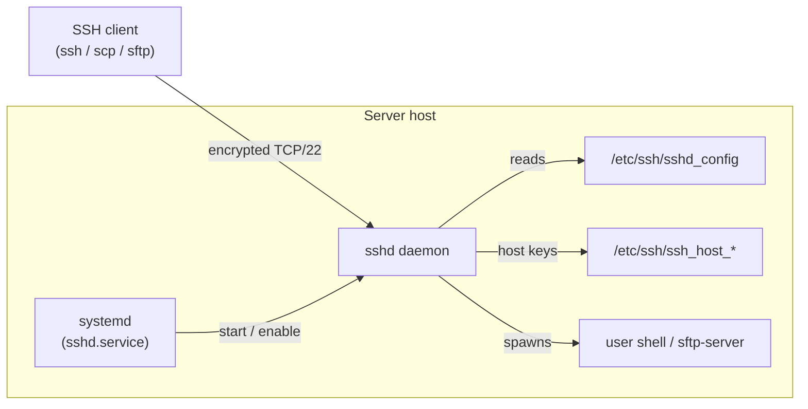

# SSH (Secure Shell) Server

## Overview

**OpenSSH** is the de facto implementation of the SSH protocol on Linux and is the primary means of secure remote administration. The server component (`sshd`, the SSH daemon) listens for inbound connections — by default on TCP port **22** — and provides an encrypted channel for interactive shells, file transfer (`scp`/`sftp`), port forwarding, and remote command execution.

This note covers the full server lifecycle on **RPM-based distributions** (RHEL, CentOS, Rocky, AlmaLinux, Fedora): checking whether OpenSSH is installed, removing an old build, installing fresh packages, inspecting package metadata, and managing the daemon with `systemd`.

> [!NOTE]
> The `yum` / `rpm` commands here target Red Hat–family systems. On Debian/Ubuntu the equivalent package is `openssh-server`, installed with `apt install openssh-server` and managed with `systemctl … ssh` (note: the service is `ssh`, not `sshd`).

## Architecture

The OpenSSH server ships as a set of cooperating packages and a `systemd`-managed daemon that binds a listening socket:



## Check If OpenSSH Is Already Installed

- To verify if any SSH-related packages are already installed:

```bash
rpm -qa | grep ssh
```

## Remove Existing OpenSSH Server (If Needed)

- If an existing OpenSSH server installation needs to be removed before installing a fresh one:

```bash
yum remove openssh-server
```

> [!WARNING]
> Removing `openssh-server` on a machine you are administering **remotely** will terminate the daemon and can cut off your access. Only remove it from a local console, or ensure you have out-of-band access first.

## Install OpenSSH Packages

- You can install all SSH-related packages using a wildcard:

```bash
yum install openssh*
```

- Or install them individually for more control:

```bash
yum install openssh-server
```

- Install the client tools for connecting to SSH servers:

```bash
yum install openssh-clients
```

The core OpenSSH packages and their roles:

| Package | Provides | Key binaries |
| --- | --- | --- |
| `openssh` | Shared libraries and common files | (support files) |
| `openssh-server` | The SSH daemon | `sshd` |
| `openssh-clients` | Client-side tools | `ssh`, `scp`, `sftp`, `ssh-keygen`, `ssh-add` |

## Check Package Information

`rpm` query flags let you inspect exactly what a package installed and where:

| Command | Shows |
| --- | --- |
| `rpm -qi openssh-server` | Detailed package info (version, license, summary) |
| `rpm -ql openssh-server` | List of all files installed by the package |
| `rpm -qc openssh-server` | Configuration files only |
| `rpm -qd openssh-server` | Documentation files only |

- Retrieve detailed information about the installed OpenSSH server package:

```bash
rpm -qi openssh-server
```

- List all the files installed by the OpenSSH server package:

```bash
rpm -ql openssh-server
```

- List all the configuration files related to the OpenSSH server:

```bash
rpm -qc openssh-server
```

- Display documentation files included in the OpenSSH server package:

```bash
rpm -qd openssh-server
```

## Manage The SSH Daemon With Systemd

- Check the current status of the SSH daemon:

```bash
systemctl status sshd.service
```

- Start the SSH service:

```bash
systemctl start sshd.service
```

- Enable SSH to start automatically on boot:

```bash
systemctl enable sshd.service
```

> [!TIP]
> Use `systemctl enable --now sshd.service` to start the daemon and enable it at boot in a single command.

## Verify SSH Service Is Running

- Check if the SSH daemon is listening on the expected ports (usually port 22):

```bash
netstat -nltup | grep sshd
```

- If `netstat` is not available, you can install it via `yum install net-tools` or use `ss` as an alternative:

```bash
ss -nltup | grep sshd
```

> [!NOTE]
> **📸 Screenshot**
> _Capture: Terminal output of ss showing sshd bound to 0.0.0.0:22 in LISTEN state_

## Best Practices

- **Enable at boot** (`systemctl enable`) so remote access survives a reboot.
- Keep OpenSSH patched — subscribe to distro security advisories and apply updates promptly.
- After installation, harden `/etc/ssh/sshd_config` before exposing the host: disable root login, disable password auth in favour of keys, and consider changing the listening port or binding to a management interface.
- Restrict inbound port 22 (or your custom port) at the firewall to trusted networks only.

## Security Considerations

- The default port 22 attracts constant automated brute-force traffic; combine key-based auth with `fail2ban` and firewall rules. See [Change-Default-SSH-Port](Change-Default-SSH-Port.md) and [Managing-IP-Allow-and-Deny-in-SSH](Managing-IP-Allow-and-Deny-in-SSH.md).
- Protect the private host keys in `/etc/ssh/` — a leaked host key enables server impersonation and man-in-the-middle attacks.
- Bind the daemon to a specific management address rather than all interfaces where possible — see [Bind-SSH-To-A-Specific-IP-Address](Bind-SSH-To-A-Specific-IP-Address.md).

## Troubleshooting

| Symptom | Check |
| --- | --- |
| Cannot connect | Is `sshd` running? `systemctl status sshd.service` |
| Nothing listening on 22 | `ss -nltup \| grep sshd`; review `Port`/`ListenAddress` in `sshd_config` |
| Connection refused | Firewall blocking the port, or daemon not started |
| Service won't start | Validate config with `sshd -t` |

## References

- OpenSSH project — https://www.openssh.com/
- `sshd(8)` and `sshd_config(5)` manual pages.
- Red Hat Enterprise Linux — Configuring OpenSSH.

## Related
- [SSH-Client-Tools](SSH-Client-Tools.md) — client side of SSH
- [SSH-Public-and-Private-Key-Configuration](SSH-Public-and-Private-Key-Configuration.md) — key-based auth setup
- [SSH-Keygen-Usage-and-SSH-Authentication-Setup](SSH-Keygen-Usage-and-SSH-Authentication-Setup.md) — generating key pairs
- [Prevent-Root-Login-via-SSH](Prevent-Root-Login-via-SSH.md) — disable direct root SSH access
- [Change-Default-SSH-Port](Change-Default-SSH-Port.md) — sshd hardening tweak
- [Bind-SSH-To-A-Specific-IP-Address](Bind-SSH-To-A-Specific-IP-Address.md) — restrict the listening interface
- SSH-Enumeration — attacker-side SSH recon
- [Linux Administration & Server Hardening](../Readme.md) — Linux administration & server hardening hub
