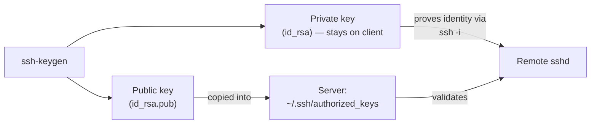

# SSH Keygen Usage and SSH Authentication Setup

## Overview

This note is a comprehensive guide to generating SSH keys with `ssh-keygen`, configuring public key authentication, setting appropriate file permissions, and connecting to remote servers using private keys. It includes examples for both **RSA** and **DSA** key generation and usage.

Public-key authentication replaces the reusable secret of a password with an asymmetric key pair: a **private key** that never leaves the client and a **public key** that is placed in the server's `authorized_keys`. The server proves the client holds the matching private key without the secret ever crossing the wire, making key-based auth both more convenient (no password prompts) and dramatically more resistant to brute-force attacks.

> [!IMPORTANT]
> Prefer **Ed25519** (`ssh-keygen -t ed25519`) or **RSA ≥ 3072-bit** for new keys. **DSA is deprecated** — 1024-bit DSA is cryptographically weak and disabled by default in modern OpenSSH. The DSA examples here are retained for legacy/compatibility scenarios only.

## Concepts

### Key-pair authentication flow



### `ssh-keygen` options used in this note

| Option | Meaning |
| --- | --- |
| `-t <type>` | Key algorithm (`rsa`, `dsa`, `ecdsa`, `ed25519`) |
| `-b <bits>` | Key length in bits (e.g. 2048, 4096) |
| `-f <file>` | Output file path for the private key |
| `-N "<pass>"` | Passphrase (`""` = none) |
| `-q` | Quiet mode |

## Commands

### Generate a Basic SSH Key Pair

```bash
ssh-keygen
```

> This command generates a default RSA key pair and stores it in `~/.ssh/id_rsa` and `~/.ssh/id_rsa.pub`.

### Generate an RSA Key Without a Passphrase

```bash
ssh-keygen -t rsa -q -N ""
```

> This creates an RSA key with no passphrase for passwordless login.

> [!WARNING]
> A key with no passphrase (`-N ""`) is convenient for automation but offers no protection if the private key file is stolen — anyone who reads the file gains full access. Use passphrase-less keys only for tightly scoped automation, and protect the file with `chmod 600`.

### Add the Public Key to Authorized Keys

```bash
cp /root/.ssh/id_rsa.pub /root/.ssh/authorized_keys
```

> Copies the public key to the list of authorized keys on the local system to allow SSH login.

### SSH Into a Server Using a Custom Key

```bash
ssh -i id_rsa_centos root@192.168.1.38
```

```bash
ssh -i id_rsa -p 2200 root@192.168.1.32
```

> Specify the key file while connecting to a remote server.

## Generate RSA Keys With Different Bit Sizes and Passphrases

- 2048-Bit RSA Key With A Passphrase

```bash
ssh-keygen -b 2048 -t rsa -f /tmp/id_rsa -q -N "@rmour123"
```

- 2048-Bit RSA Key Without A Passphrase

```bash
ssh-keygen -b 2048 -t rsa -f /tmp/id_rsa1 -q -N ""
```

- Default Key Location With A Passphrase

```bash
ssh-keygen -b 2048 -t rsa -f /root/.ssh/id_rsa -q -N "@rmour123"
```

- Simple RSA Key Generation With Filename And Passphrase

```bash
ssh-keygen -t rsa -f /tmp/id_rsa3 -q -N "@rmour123"
```

## Check the Key File Type

- Check the type of the generated private and public key files.

```bash
file id_rsa
```

```bash
file id_rsa.pub
```

## SSH Using Specific Key and Key Type Option

- Use a custom identity file and specify acceptable public key types.

```bash
ssh -o PubkeyAcceptedKeyTypes=ssh-rsa root@192.168.1.33 -i id_rsa
```

> [!NOTE]
> Modern OpenSSH deprecates the legacy `ssh-rsa` (SHA-1) signature algorithm. `-o PubkeyAcceptedKeyTypes=ssh-rsa` is a compatibility override for connecting to older servers; prefer `rsa-sha2-256`/`rsa-sha2-512` or Ed25519 keys where the server supports them.

## Generate a DSA Key

- 1024-Bit DSA Key Without A Passphrase

```bash
ssh-keygen -b 1024 -t dsa -f /tmp/id_dsa -q -N ""
```

- DSA Key With A Passphrase

```bash
ssh-keygen -t dsa -f /tmp/id_dsa -q -N "@rmour123"
```

- Add DSA Public Key To Authorized Keys

```bash
cp id_dsa.pub /root/.ssh/authorized_keys
```

- Set Proper Permissions On Authorized Keys

```bash
chmod 644 /root/.ssh/authorized_keys
```

## Best Practices

- Always protect your private keys using appropriate file permissions.
- Do not share private keys; share only the public key.
- Use passphrases for an added layer of security unless automation is required.
- DSA is considered weaker than RSA and is generally discouraged unless needed for compatibility.

## Security Considerations

Recommended file permissions for a working key-based setup:

| Path | Mode | Owner |
| --- | --- | --- |
| `~/.ssh` | `700` | the user |
| `~/.ssh/authorized_keys` | `600`–`644` | the user |
| private key (e.g. `id_rsa`) | `600` | the user |
| public key (`id_rsa.pub`) | `644` | the user |

> [!WARNING]
> `sshd` **refuses** key authentication if the private key or `~/.ssh` directory is group- or world-readable, and (with `StrictModes on`, the default) if `authorized_keys` is writable by anyone but the owner. If key login silently fails, permissions are the first thing to check.

## Troubleshooting

| Symptom | Likely cause | Fix |
| --- | --- | --- |
| Key ignored, prompted for password | Wrong permissions on `~/.ssh` or key files | Apply the modes in the table above |
| `Permission denied (publickey)` | Public key not in server `authorized_keys` | Re-copy the `.pub` into `authorized_keys` |
| DSA key rejected | DSA disabled in modern OpenSSH | Regenerate as RSA/Ed25519, or enable legacy types |
| Passphrase prompt every time | Key not loaded into agent | `ssh-add ~/.ssh/id_rsa` |

## References

- `ssh-keygen(1)` and `sshd(8)` (`AUTHORIZED_KEYS FILE FORMAT`) manual pages.
- NIST SP 800-131A — deprecation of 1024-bit and DSA keys.

## Related
- [SSH-Public-and-Private-Key-Configuration](SSH-Public-and-Private-Key-Configuration.md) — applying generated key pairs
- [SSH(Secure-Shell)-Server](SSH(Secure-Shell)-Server.md) — parent SSH server note
- [SSH-Client-Tools](SSH-Client-Tools.md) — client tools using these keys
- SSH-Enumeration — attacker-side SSH recon
- [Linux Administration & Server Hardening](../Readme.md) — Linux administration & server hardening hub
