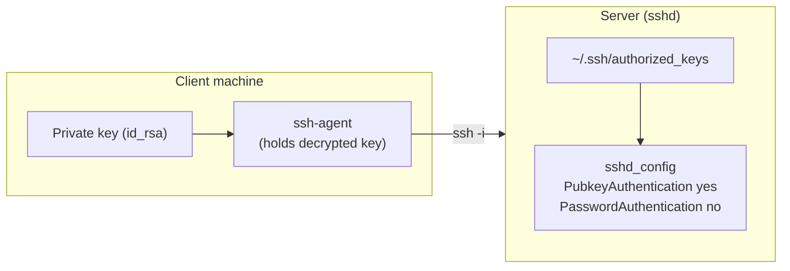

# SSH Public and Private Key Configuration

## Overview

This document explains how to generate SSH public and private keys, configure `sshd` for key-based authentication, and set up secure SSH access for both the `root` user and a custom user (`armour`). Each section includes commands and descriptions for clarity.

Where [SSH-Keygen-Usage-and-SSH-Authentication-Setup](SSH-Keygen-Usage-and-SSH-Authentication-Setup.md) focuses on the mechanics of `ssh-keygen`, this note ties the pieces together end to end: editing `sshd_config`, authorising keys, managing them with `ssh-agent`/`ssh-add`, and connecting from another machine.

> [!IMPORTANT]
> The example `sshd_config` in this note sets `PermitRootLogin yes` to demonstrate root key login. In production, prefer `PermitRootLogin no` (or `prohibit-password`) and log in as an unprivileged user — see [Prevent-Root-Login-via-SSH](Prevent-Root-Login-via-SSH.md).

## Concepts

Key-based authentication uses an asymmetric pair. The private key stays on the client and is presented with `ssh -i`; the matching public key is installed in the server's `authorized_keys`. When both `PubkeyAuthentication yes` and `PasswordAuthentication no` are set, the server accepts only clients that can prove possession of an authorised private key.



## SSH Key Generation and Server Configuration

### Edit SSH Daemon Configuration

- Open the SSH daemon configuration file to enable public key authentication and make necessary changes.

```bash
vim /etc/ssh/sshd_config
```

> Ensure the following options are set:

```conf
PermitRootLogin yes
PubkeyAuthentication yes
AuthorizedKeysFile	.ssh/authorized_keys
PasswordAuthentication no
ChallengeResponseAuthentication no
UsePAM yes
```

> These settings enable key-based authentication and disable password-based login for added security.

Key directives explained:

| Directive | Purpose |
| --- | --- |
| `PermitRootLogin` | Whether root may log in (`yes` here for demo; prefer `no`) |
| `PubkeyAuthentication yes` | Enable public-key authentication |
| `AuthorizedKeysFile .ssh/authorized_keys` | Where each user's authorised public keys live |
| `PasswordAuthentication no` | Disable password login (blocks brute-forcing) |
| `ChallengeResponseAuthentication no` | Disable keyboard-interactive/challenge auth |
| `UsePAM yes` | Use PAM for account/session management |

### Generate SSH Key Pair (RSA)

- Use the `ssh-keygen` tool to generate a key pair.

```bash
ssh-keygen --help
```

- Generate an RSA key pair:

```bash
ssh-keygen -t rsa
```

> This creates `id_rsa` (private key) and `id_rsa.pub` (public key) in `~/.ssh/`.

### Authorize SSH Key For Root Login

- Navigate to the `.ssh` directory:

```bash
cd /root/.ssh/
```

```bash
file id_rsa
```

```bash
file id_rsa.pub
```

- Copy the public key to the `authorized_keys` file:

```bash
cp -v /root/.ssh/id_rsa.pub /root/.ssh/authorized_keys
```

> This file is used by `sshd` to validate login attempts via public key.

### Restart SSH Service

- Apply the configuration changes:

```bash
systemctl restart sshd.service
```

### Verify SSH Service Status

- Check if SSH is listening on the correct port:

```bash
netstat -nltup | grep sshd
```

## ssh-add

`ssh-add` is used to add, list, and manage SSH private keys stored in the `ssh-agent`, which helps avoid repeated passphrase prompts during SSH authentication.

`ssh-add` subcommands:

| Command | Action |
| --- | --- |
| `ssh-add ~/.ssh/id_rsa` | Add a private key to the agent |
| `ssh-add -l` | List loaded key fingerprints |
| `ssh-add -L` | List loaded public keys in full |
| `ssh-add -d ~/.ssh/id_rsa` | Remove one specific key |
| `ssh-add -D` | Remove all keys from the agent |
| `ssh-add -t 600 <key>` | Add a key with a lifetime (seconds) |
| `ssh-add -c <key>` | Require confirmation before each use |

### Basic Usage

- Start ssh-agent and add a private key

```bash
eval "$(ssh-agent -s)"
```

```bash
ssh-add ~/.ssh/id_rsa
```

- List all public keys loaded

```bash
ssh-add -l
```

- Lists public keys currently held by the agent.

```bash
ssh-add -L
```

- Remove a specific key

```bash
ssh-add -d ~/.ssh/id_rsa
```

- Remove all keys from agent

```bash
ssh-add -D
```

- Add key with 10-minute timeout

```bash
ssh-add -t 600 ~/.ssh/id_ed25519
```

- Add a key and ask confirmation before every use

```bash
ssh-add -c ~/.ssh/id_rsa
```

### Using a Private Key To Connect From Another Machine

- Create and configure a private key file locally:

```bash
vim id_rsa_centos
```

- Set the correct permission:

```bash
chmod 600 id_rsa_centos
```

- Connect to the server using the private key:

```bash
ssh -i id_rsa_centos root@192.168.1.38
```

## DSA Key Pair For Custom User

This section demonstrates how to generate and configure a DSA key pair for a non-root user.

> [!WARNING]
> DSA keys are deprecated and disabled by default in current OpenSSH. This example is retained for legacy/compatibility scenarios only — prefer Ed25519 or RSA (≥ 3072-bit) for new deployments.

- Generate DSA Key Pair

```bash
ssh-keygen -t dsa -f /tmp/id_dsa -q -N "@rmour123"
```

> This generates `/tmp/id_dsa` (private key) and `/tmp/id_dsa.pub` (public key) with a passphrase.

### Prepare SSH Directory For User

- Create the `.ssh` directory:

```bash
mkdir /home/armour/.ssh
```

> Verify the directory:

```bash
ls -lha /home/armour/ | grep .ssh
```

### Copy Public Key To Authorized Keys

```bash
cp /tmp/id_dsa.pub /home/armour/.ssh/authorized_keys
```

- Check the file:

```bash
ls -lha /home/armour/.ssh/
```

### Set Correct Ownership

```bash
chown -R armour:armour /home/armour/.ssh/
```

> [!IMPORTANT]
> Ownership and permissions matter: with `StrictModes on` (the default), `sshd` ignores `authorized_keys` unless the `.ssh` directory and file are owned by the target user and are not writable by others. The `chown -R armour:armour` above is essential after copying keys in as root.

### Use DSA Key To Connect

- Edit and configure the private key:

```bash
vim id_dsa_armour
```

- Set the proper permissions:

```bash
chmod 600 id_dsa_armour
```

- Use it to connect:

```bash
ssh -i id_dsa_armour armour@<hostname or IP>
```

## SSH Daemon Configuration Example

- Below is a simplified but secure configuration example for `/etc/ssh/sshd_config`:

```conf
PermitRootLogin yes
PubkeyAuthentication yes
AuthorizedKeysFile .ssh/authorized_keys
PasswordAuthentication no
ChallengeResponseAuthentication no
UsePAM yes
X11Forwarding yes
Subsystem sftp /usr/libexec/openssh/sftp-server
```

> This configuration is ideal for disabling passwords and enforcing public key authentication.

## Best Practices

- Always use strong passphrases when generating private keys.
- Do not share private keys; they must remain secret.
- Change the default SSH port from 22 if you're looking to obscure your service from common scans.
- Consider using `fail2ban` or a firewall (like `ufw` or `iptables`) to reduce brute force login attempts.
- Backup `.ssh` directories securely for recovery.

## Security Considerations

- Disabling `PasswordAuthentication` eliminates the entire class of password brute-force attacks — the single biggest win of key-based auth.
- Combine key auth with `PermitRootLogin no` so even a compromised key cannot yield an instant root shell.
- Prefer Ed25519 keys; retire DSA and 1024-bit keys.
- Protect private keys with a passphrase and load them into `ssh-agent` rather than storing them unencrypted for convenience.

## Troubleshooting

| Symptom | Likely cause | Fix |
| --- | --- | --- |
| Still prompted for a password | `PubkeyAuthentication` off, or key not authorised | Verify `sshd_config`; re-copy the `.pub` |
| `Permission denied (publickey)` | Wrong ownership/permissions on `.ssh` | `chown`/`chmod` per the notes above |
| Key works for root but not `armour` | `authorized_keys` owned by root, not `armour` | `chown -R armour:armour /home/armour/.ssh/` |
| Change not taking effect | Daemon not restarted | `systemctl restart sshd.service` |

## References

- `sshd_config(5)`, `ssh-add(1)`, `ssh-agent(1)` manual pages.
- OpenSSH `AUTHORIZED_KEYS FILE FORMAT` in `sshd(8)`.

## Related
- [SSH-Keygen-Usage-and-SSH-Authentication-Setup](SSH-Keygen-Usage-and-SSH-Authentication-Setup.md) — generating the key pairs
- [SSH(Secure-Shell)-Server](SSH(Secure-Shell)-Server.md) — parent SSH server note
- [SSH-Client-Tools](SSH-Client-Tools.md) — client tools using these keys
- [Prevent-Root-Login-via-SSH](Prevent-Root-Login-via-SSH.md) — disable direct root login in production
- SSH-Enumeration — attacker-side SSH recon
- [Linux Administration & Server Hardening](../Readme.md) — Linux administration & server hardening hub
