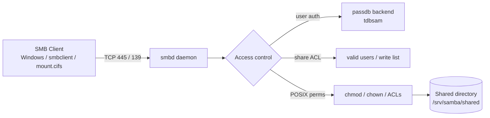

# Samba SMB CIFS Server

## Overview

Samba is the open-source suite that implements the **Server Message Block (SMB)** / **Common Internet File System (CIFS)** protocol on Unix-like systems. It lets Linux, Windows, and macOS hosts share files, printers, and directories over a network, and can even join or provide a Windows Active Directory domain. This note is the hub for the Samba module: it defines the protocol terms, the core configuration file, day-to-day commands, and the client-side mounting workflow.

> [!NOTE]
> **SMB** is the wire protocol, **CIFS** is a specific (legacy Windows) dialect of SMB, and **Samba** is the Unix implementation of both. In modern deployments you should be speaking SMB2/SMB3 — the CIFS/SMB1 dialect is deprecated and insecure.

## Concepts

| Term | Meaning |
| --- | --- |
| **SMB (Server Message Block)** | A network protocol for sharing files, printers, and named pipes between nodes. |
| **CIFS** | A particular implementation/dialect of SMB, historically used in Windows systems. |
| **Samba** | An open-source project that implements SMB/CIFS on Unix-like systems, enabling file and print sharing with Windows clients. |
| **`smbd`** | The Samba daemon that provides file/print services and SMB session handling. |
| **`nmbd`** | The NetBIOS name-service daemon (name resolution and network browsing on SMB1-era networks). |

### Use Cases

- Seamless file sharing between Linux, Windows, and macOS.
- Printer sharing across mixed operating systems.
- Integration into Windows domains via Active Directory.
- Hosting cross-platform network shares for users and applications.

## Architecture

The following diagram shows how a client request travels from a mounted share down to the Linux filesystem and back through Samba's access controls.



## Configuration

### Main Samba Configuration File

All configuration is managed through:

```bash
/etc/samba/smb.conf
```

### Basic Share Example

This configuration defines a shared directory with guest access:

```ini
[shared]
   path = /srv/samba/shared
   browseable = yes
   read only = no
   guest ok = yes
```

| Directive | Purpose |
| --- | --- |
| `path` | Filesystem path to be shared. |
| `browseable` | Whether the share is visible during network browsing. |
| `read only` | If set to `no`, allows write access. |
| `guest ok` | Enables guest access without login. |

> [!TIP]
> Always validate `smb.conf` with `testparm` after editing. A single malformed directive can stop `smbd` from starting.

## Commands

### Install Samba (Debian/Ubuntu)

Install Samba and its dependencies:

```bash
apt install samba
```

### Check Samba Version

Verify the installed Samba version:

```bash
smbd --version
```

### Add A Samba User

Add a user to Samba (must exist as a system user first):

```bash
smbpasswd -a <username>
```

### Restart Samba Services

Apply changes by restarting the SMB and NetBIOS services:

```bash
systemctl restart smbd nmbd
```

### Test Samba Configuration

Check your `smb.conf` for syntax errors:

```bash
testparm
```

## Client Access — Mounting SMB Shares

### Temporary Mount (CLI)

To mount a remote SMB share to `/mnt/shared` using credentials:

```bash
mount -t cifs //192.168.1.100/shared /mnt/shared -o username=user,password=pass,iocharset=utf8,vers=3.0
```

| Option | Meaning |
| --- | --- |
| `username` / `password` | Authentication credentials. |
| `vers=3.0` | Use SMBv3. |
| `iocharset=utf8` | UTF-8 encoding for file names. |

### Persistent Mount With Fstab

To persist across reboots, add the following to `/etc/fstab`:

```ini
//192.168.1.100/shared /mnt/shared cifs username=user,password=pass,iocharset=utf8,vers=3.0 0 0
```

> [!WARNING]
> Embedding a plaintext password directly in `/etc/fstab` exposes it to any user who can read the file. Prefer a root-owned credentials file (below).

Use a credentials file instead of embedding credentials in fstab. Example `/etc/samba/cred-user`:

```ini
username=user
password=pass
```

Mount with:

```bash
mount -t cifs //192.168.1.100/shared /mnt/shared -o credentials=/etc/samba/cred-user,vers=3.0
```

Ensure that the credentials file is owned by root and has restricted permissions:

```bash
chown root:root /etc/samba/cred-user
```

```bash
chmod 600 /etc/samba/cred-user
```

## Security Considerations

- Ensure proper Linux file permissions (`chmod`, `chown`) are set on shared folders — Samba enforces POSIX permissions *on top of* its own share ACLs.
- Use these common parameters for access control in `smb.conf`:

```ini
valid users = username
read only = yes
write list = user1, user2
```

- Enable password encryption:

```ini
encrypt passwords = yes
```

- Always prefer SMBv2 or SMBv3 to avoid the vulnerabilities of SMB1 (SMB1 is disabled by default in modern Samba).
- Use firewall rules to restrict access to SMB ports (137–139, 445).
- Store client credentials in a root-owned `chmod 600` file rather than in world-readable `fstab` entries.

> [!IMPORTANT]
> SMB1/CIFS is affected by well-known exploits (e.g. EternalBlue / MS17-010). Keep SMB1 disabled and expose Samba only to trusted network segments — never directly to the internet.

## Troubleshooting

| Symptom | Likely cause / fix |
| --- | --- |
| `smbd` fails to start after editing config | Run `testparm` to find the malformed directive. |
| Client cannot connect on port 445 | Firewall blocking; open ports 137–139/445 and confirm `smbd` is listening. |
| "Protocol negotiation failed" | Client forcing SMB1; add `vers=3.0` on the mount or upgrade the client. |
| Access denied despite correct password | POSIX permissions on the share path deny the user; check `chmod`/`chown`. |

## Related Notes

- [Samba-Server-Setup](Samba-Server-Setup.md) — installing and configuring Samba
- [Smb-Client-tools](Smb-Client-tools.md) — client tools for SMB shares
- [Anonymous-Samba-Share](Anonymous-Samba-Share.md) — guest/anonymous share configuration
- [Share-With-Selected-Users](Share-With-Selected-Users.md) — authenticated, user-restricted share
- [Shared-Common-Directories-With-Samba](Shared-Common-Directories-With-Samba.md) — sharing common directories
- SMB-Enumeration — attacker-side SMB recon
- [Linux Administration & Server Hardening](../Readme.md) — Linux administration & server hardening hub
