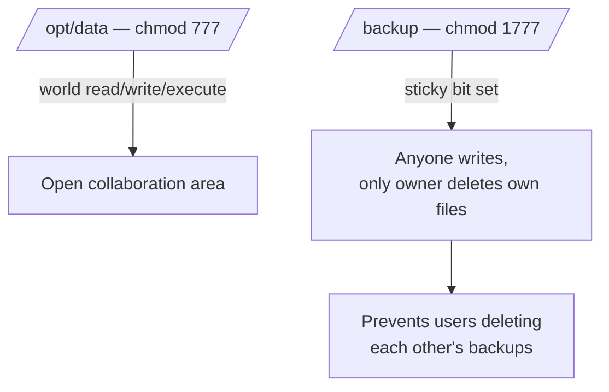

# Shared Common Directories With Samba

## Overview

This setup demonstrates how to share directories such as `/opt/data` and `/backup` over the network using Samba, with appropriate permissions and configurations. It covers preparing the directories (including the sticky-bit pattern for a shared write area), defining the shares in `smb.conf`, restarting the service, and accessing the shares from a client either with `smbclient` or by mounting them via CIFS.

## Concepts

| Directive | Effect |
| --- | --- |
| `public = yes` | Makes the share visible during network browsing. |
| `guest ok = no` | Requires authentication despite `public = yes`. |
| `writable = yes` | Allows write access for authorized users. |
| `path` | Filesystem directory exported by the share. |

> [!NOTE]
> `public = yes` only controls *visibility*. Actual access is still governed by `guest ok`, `valid users`, and the underlying POSIX permissions.

## Permission Model



## Create And Prepare Shared Directories

Create the `data` directory under `/opt`:

```bash
cd /opt/
```

```bash
mkdir data
```

Set wide-open permissions (read/write/execute for all users):

```bash
chmod 777 /opt/data/
```

Create the `backup` directory:

```bash
mkdir /backup/
```

Set the sticky bit and full permissions to preserve file ownerships while allowing write access:

```bash
chmod -R 1777 /backup/
```

> [!TIP]
> The `1777` permission allows anyone to write to the directory but only the owner can delete their files — commonly used for directories like `/tmp`.

## Configure Samba Shared Folders

Edit the Samba configuration file:

```bash
vim /etc/samba/smb.conf
```

Update or append the following sections in the configuration:

```ini
[global]
    workgroup = SAMBA
    security = user
    passdb backend = tdbsam

    printing = cups
    printcap name = cups
    load printers = yes
    cups options = raw

[homes]
    comment = Home Directories
    valid users = %S, %D%w%S
    browseable = No
    read only = No
    inherit acls = Yes

[printers]
    comment = All Printers
    path = /var/tmp
    printable = Yes
    create mask = 0600
    browseable = No

[print$]
    comment = Printer Drivers
    path = /var/lib/samba/drivers
    write list = @printadmin root
    force group = @printadmin
    create mask = 0664
    directory mask = 0775

[data]
    comment = Data
    path = /opt/data
    public = yes
    writable = yes
    guest ok = no
    guest only = no

[backup]
    comment = Server Backup
    path = /backup
    public = yes
    writable = yes
```

## Restart Samba Service

Apply the configuration changes:

```bash
systemctl restart smb.service
```

## Accessing The Shares

You can test the shares using `smbclient` from another Linux machine:

```bash
smbclient -L //192.168.1.33 -U your_samba_user
```

```bash
smbclient -L //192.168.1.33 -U armour
```

```bash
smbclient //192.168.1.33/data -U armour
```

```bash
smbclient //192.168.1.33/backup -U armour
```

Or mount the share using CIFS:

```bash
mount -t cifs //192.168.1.33/data /mnt/data -o username=your_samba_user,password=your_password,vers=3.0
```

For the backup share:

```bash
mount -t cifs //192.168.1.33/backup /mnt/backup -o username=your_samba_user,password=your_password,vers=3.0
```

## Access Control Note

Although `public = yes` is set, `guest ok = no` ensures only authenticated users can access these shares. You can manage permissions more tightly by adding `valid users` or `write list` directives as needed.

## Security Considerations

- A `chmod 777` directory is world-writable to any authenticated user; reserve it for genuinely shared, low-sensitivity data.
- Prefer the sticky bit (`1777`) on multi-user write areas so users cannot delete one another's files.
- When mounting via CIFS, avoid passing `password=` on the command line (it lands in shell history and process listings) — use a root-owned credentials file instead.
- Tighten each share with `valid users` / `write list` once the set of legitimate users is known.

## Related Notes

- [Share-With-Selected-Users](Share-With-Selected-Users.md) — user-restricted share counterpart
- [Anonymous-Samba-Share](Anonymous-Samba-Share.md) — open-share counterpart
- [Samba-Server-Setup](Samba-Server-Setup.md) — base Samba server setup
- [Samba-SMB-CIFS-Server](Samba-SMB-CIFS-Server.md) — Samba/SMB/CIFS module hub
- [Smb-Client-tools](Smb-Client-tools.md) — client tools for SMB shares
- SMB-Enumeration — attacker-side SMB recon
- [Linux Administration & Server Hardening](../Readme.md) — Linux administration & server hardening hub
