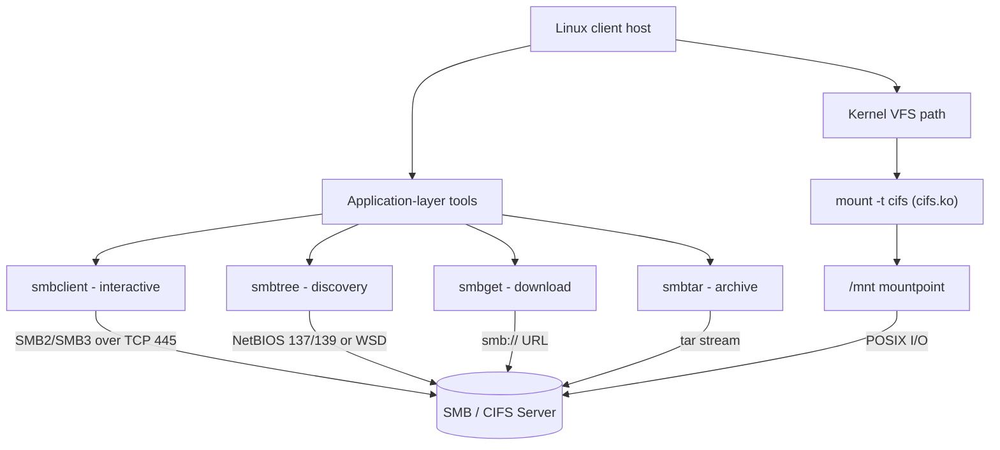

# Smb Client Tools

## Overview

The Samba client suite provides the command-line utilities a Linux host uses to **consume** SMB/CIFS shares exported by a Windows machine or another Samba server. Where the server side (`smbd`) publishes shares, these tools let you browse, authenticate, transfer files, back up, and permanently mount those shares — all without leaving the terminal.

This note covers the four core client utilities plus the kernel-level mount path:

| Tool | Role | Analogy |
| --- | --- | --- |
| `smbclient` | Interactive share access and listing | `ftp` for SMB |
| `smbtree` | Network share discovery in tree form | Windows *Network Neighborhood* |
| `smbget` | Non-interactive single-file download | `wget` for SMB |
| `smbtar` | Archive/restore an entire share as a `tar` file | `tar` over the wire |
| `mount.cifs` | Kernel mount of a share into the local VFS | `mount` for network storage |

> [!NOTE]
> Examples target **RHEL-based** distributions (hence `rpm`/`yum`), but the client tools and their options are identical on Debian/Ubuntu — only the package manager and package names differ (`apt`, `smbclient`, `cifs-utils`).

## Architecture

The client tools split into two access models: an **application-layer** path (userspace utilities that speak SMB directly) and a **kernel VFS** path (`mount.cifs` / the `cifs` module, which exposes the share as a normal filesystem).



## Package Management

### Check Installed Samba Packages

List all Samba-related packages currently installed:

```bash
rpm -qa | grep samba
```

### Install Samba Client

Install the Samba client tools using the package manager:

```bash
yum install samba-client
```

```bash
apt install samba-client
```

### Verify Samba Client Installation

| Query | Command | Purpose |
| --- | --- | --- |
| Presence | `rpm -qa \| grep samba-client` | Confirm the package is installed |
| Details | `rpm -qi samba-client` | Version, size, vendor, description |
| Docs | `rpm -qd samba-client` | Man pages and documentation files |
| Files | `rpm -ql samba-client` | Every file the package delivers |

Check if the Samba client is installed:

```bash
rpm -qa | grep samba-client
```

View detailed package information:

```bash
rpm -qi samba-client
```

Display documentation files:

```bash
rpm -qd samba-client
```

List all installed files for the package:

```bash
rpm -ql samba-client
```

## Browsing Shares With Smbtree

`smbtree` scans the network and displays SMB shares in a tree format, similar to Windows' network neighborhood.

> [!WARNING]
> **Discovery has moved on from NetBIOS**
> `smbtree` depends on legacy broadcast browsing. On modern networks it frequently returns nothing.

```text
main: This utility doesn't work if NetBIOS name resolution is not configured.
If you are using SMB2 or SMB3, network browsing uses WSD/LLMNR, which is not yet supported by Samba.
SMB1 is disabled by default on the latest Windows versions for security reasons.
```

### Discover Network Shares

Scan and print the SMB workgroup/domain tree:

```bash
smbtree
```

List share names only (without computer/user names):

```bash
smbtree -b
```

Browse shares using a specific username:

```bash
smbtree -U win7
```

Show shares in a specified workgroup:

```bash
smbtree -D workgroup
```

List all available workgroups on the network (requires NetBIOS):

```bash
smbtree -D workgroups
```

> [!IMPORTANT]
> **Why `smbtree` often shows nothing**
> - SMB2/3 no longer uses NetBIOS.
> - WSD/LLMNR (used by Windows for discovery) is not supported by Samba.
> - SMB1 is insecure and disabled by default in modern systems.
>
> When browsing fails, address the target host directly by IP with `smbclient -L` instead of relying on discovery.

## Accessing Shares With Smbclient

`smbclient` is a command-line utility with an FTP-style interface for accessing SMB shares. It can either **list** the shares a host exports or **connect** to one for an interactive session.

### Access Shares Directly

List shares using UNC format and a username:

```bash
smbclient -L //hostname -U username
```

Mount a share using CIFS (NetBIOS not required):

```bash
mount -t cifs -o username=user,password=pass //192.168.1.x/share /mnt
```

### Listing Shares

Launch `smbclient` without connecting:

```bash
smbclient
```

Display help menu:

```bash
smbclient --help
```

List shares on a remote host (anonymous):

```bash
smbclient -L 192.168.1.61
```

List shares using UNC format:

```bash
smbclient -L //192.168.1.61
```

List shares as a specific user:

```bash
smbclient -L //192.168.1.61 -U win11
```

Guest (anonymous) access:

```bash
smbclient -L 192.168.1.61 -U "" -N
```

> [!NOTE]
> **📸 Screenshot**
> _Capture: Terminal output of `smbclient -L //192.168.1.61` showing the Sharename, Type, and Comment columns for the target host's exported shares_

### Connect To A Share

Anonymous access to a share:

```bash
smbclient //192.168.1.61/data
```

Authenticated access:

```bash
smbclient //192.168.1.61/data -U Armour
```

### Example Smbclient Session

Once connected you land at the `smb: \>` prompt, which accepts FTP-like commands:

| Command | Action |
| --- | --- |
| `get <file>` | Download a single file |
| `mget <files>` | Download multiple files |
| `put <file>` | Upload a single file |
| `mput <files>` | Upload multiple files |
| `ls` / `cd` | List / change remote directory |
| `lcd <dir>` | Change the local directory |

Download a single file:

```smb
get runasroot.sh
```

Download multiple files:

```smb
mget templated-roadtrip.zip VBoxDarwinAdditions.pkg
```

Upload a single file:

```smb
put mysql80.community-release-el7.3.noarch.rpm
```

Upload multiple files:

```smb
mput html5up-paradigm-shift.zip latest.zip
```

## Download Files With Smbget

`smbget` is similar to `wget` for SMB. It allows downloading files from SMB URLs non-interactively — ideal for scripts and one-off pulls.

Download a file using SMB credentials:

```bash
smbget -U Administrator smb://192.168.1.61/data/settings-Community.xml
```

## Backup And Restore With Smbtar

`smbtar` lets you archive or extract entire SMB shares in `tar` format, streaming the share contents straight into a local archive.

Display help information:

```bash
smbtar --help
```

Backup a share:

```bash
smbtar -s 192.168.1.61 -x data -u Administrator -p @rmour123 -t data.tar -v
```

| Option | Meaning |
| --- | --- |
| `-s` | SMB server address |
| `-x` | Share name |
| `-u` / `-p` | Username and password |
| `-t` | Output archive file |
| `-v` | Verbose output |

> [!WARNING]
> Passing a password on the command line with `-p` exposes it in shell history and the process list (`ps aux`). Prefer an interactive prompt or a credentials file for anything beyond a lab.

## Configuration — Mounting SMB Shares With Mount.cifs

Use the `cifs` kernel module to mount SMB shares as part of the Linux file system, so applications treat the remote share like any local directory.

Mount to `/mnt` using credentials:

```bash
mount -t cifs -o username=Administrator,password=@rmour123 //192.168.1.61/data /mnt
```

Mount to a specific directory:

```bash
mount -t cifs -o username=Administrator,password=@rmour123 //192.168.1.61/data /mnt/d1
```

Unmount the share:

```bash
umount /mnt
```

### Prerequisites And Persistent Mounts

Install `cifs-utils` for full CIFS support:

```bash
yum install cifs-utils
```

Mounts can be made persistent via /etc/fstab:

```bash
vim /etc/fstab
```

```text
//192.168.1.61/data /mnt cifs username=Administrator,password=@rmour123 0 0
```

```bash
mount -a
```

### Using A Credentials File

> [!TIP]
> **Keep passwords out of `fstab`**
> A world-readable `/etc/fstab` leaks the password to every user on the box. Store credentials in a separate root-only file and reference it from the mount.

For better security, use a credentials file:

```bash
vim /etc/smb-credentials
```

```bash
username=Administrator
password=@rmour123
```

Mount using the credentials file:

```bash
mount -t cifs -o credentials=/etc/smb-credentials //192.168.1.61/data /mnt
```

Lock the file down so only root can read it:

```bash
chmod 600 /etc/smb-credentials
```

### Selecting The Protocol Version

- Consider `autofs` for on-demand mounting.
- Avoid SMB1; prefer SMB2 or SMB3 for performance and security.

Use version or security parameters if needed:

```bash
mount -t cifs -o username=Administrator,password=@rmour123,vers=3.0 //192.168.1.61/data /mnt
```

## Best Practices

- **Pin the protocol.** Always mount with `vers=3.0` (or higher) to force SMB3 and its encryption/signing support; never fall back to the deprecated SMB1 dialect.
- **Never inline passwords.** Use a `chmod 600` credentials file for mounts and interactive prompts for `smbclient`/`smbtar` rather than `-p`/`password=` on the command line.
- **Address hosts by IP.** Because SMB2/3 discovery over NetBIOS is unreliable, target shares directly with `smbclient -L //<ip>` instead of depending on `smbtree`.
- **Least privilege.** Mount with a dedicated service account scoped to the specific share, not a domain administrator.
- **Automate cleanly.** Prefer `autofs` for on-demand mounts so idle shares are unmounted automatically, reducing stale handles and exposure.

## Security Considerations

- **SMB1 is a liability.** It is unauthenticated-browsing friendly and vulnerable to attacks such as EternalBlue; keep it disabled and mount with `vers=3.0` or later, aligning with CIS Benchmark guidance to disable legacy SMB dialects.
- **Encrypt in transit.** Add `seal` (SMB3 encryption) to CIFS mount options when traversing untrusted networks so share traffic is not sent in cleartext.
- **Protect credential material.** Credentials files and `fstab` entries containing passwords must be `600`/root-owned; a leaked mount password is a full share compromise.
- **Command-line secrets leak.** Passwords in `smbtar -p` or `mount -o password=` appear in `~/.bash_history`, `ps`, and process accounting logs — treat them as disclosed.
- **The example password `@rmour123` is a lab placeholder.** Replace it with a strong, unique secret in any real deployment.

## Troubleshooting

| Symptom | Likely Cause | Fix |
| --- | --- | --- |
| `smbtree` returns nothing | NetBIOS/WSD browsing unsupported on SMB2/3 | List the host directly: `smbclient -L //<ip>` |
| `mount error(2): No such file or directory` | Share name/UNC path wrong or share not exported | Verify the share name with `smbclient -L //<ip>` |
| `mount error(13): Permission denied` | Bad credentials or insufficient share ACL | Re-check username/password and server-side permissions |
| `mount: unknown filesystem type 'cifs'` | `cifs-utils` not installed / `cifs` module missing | `yum install cifs-utils` then retry |
| `Protocol negotiation failed` | Server refuses the requested/legacy dialect | Add an explicit `vers=3.0` (or a matching version) |

## References

- Samba `smbclient(1)`, `smbtree(1)`, `smbget(1)`, `mount.cifs(8)` man pages
- Samba project documentation — <https://www.samba.org/samba/docs/>
- CIS Microsoft Windows Benchmarks — SMBv1 hardening guidance

## Related

- [Samba-SMB-CIFS-Server](Samba-SMB-CIFS-Server.md) — the SMB service these tools access
- [Samba-Server-Setup](Samba-Server-Setup.md) — base Samba server setup
- [Anonymous-Samba-Share](Anonymous-Samba-Share.md) — configuring guest-accessible shares
- [Share-With-Selected-Users](Share-With-Selected-Users.md) — restricting shares to specific accounts
- SMB-Enumeration — attacker-side SMB recon
- [Linux Administration & Server Hardening](../Readme.md) — Linux administration & server hardening hub
