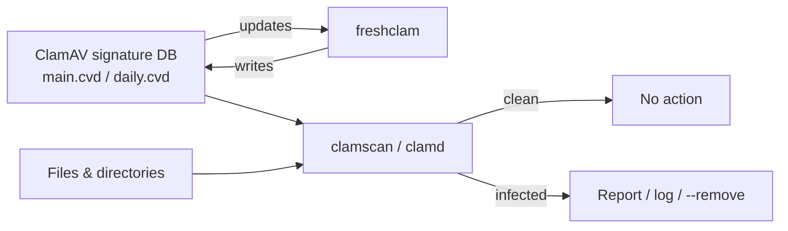

# ClamAV Antivirus

## Overview

**ClamAV** (Clam AntiVirus) is an open-source antivirus engine designed to detect trojans, viruses, malware, and other malicious threats on Linux systems. It is widely deployed on mail gateways for scanning attachments, but it is equally useful for on-demand and scheduled filesystem scanning on servers and workstations.

This note covers installing ClamAV, keeping its signature database current with FreshClam, and running on-demand scans — including how to safely validate the engine with the industry-standard EICAR test file.

> [!NOTE]
> **Signature-based engine**
> ClamAV is primarily a **signature-based** scanner. It is excellent for catching known malware, webshells, and mail-borne threats, but it is not a behavioural/heuristic EDR. Keep the signature database fresh and pair it with host hardening for defence in depth.

## Concepts

| Component | Role |
| :-- | :-- |
| `clamscan` | Command-line, on-demand scanner. Loads the signature DB per run (slower to start). |
| `clamd` | Resident scanning daemon; keeps signatures in memory for fast, repeated scans. |
| `clamdscan` | Client that submits paths to a running `clamd` daemon. |
| `freshclam` | Signature updater — downloads the latest virus definitions. |
| EICAR test file | A harmless, standardized string that every AV engine flags as malware, used to prove detection works without real malware. |

## Architecture



## Installation

Download standard anti-malware test files from EICAR to safely verify ClamAV once it is installed: [Download from EICAR](https://www.eicar.org/download-anti-malware-testfile/).

Before installing ClamAV, ensure the required repositories are enabled:

```bash
yum repolist all
```

Install ClamAV and its related packages:

```bash
yum install clamav
```

Check installed ClamAV package details:

```bash
rpm -qi clamav
```

List files installed by ClamAV:

```bash
rpm -ql clamav
```

## Updating Signatures

FreshClam keeps ClamAV's virus database updated. Install the updater package:

```bash
yum install clamav-freshclam
```

Run FreshClam manually to fetch the latest virus definitions:

```bash
freshclam
```

> [!TIP]
> **Automate updates**
> Enable the FreshClam service (`systemctl enable --now clamav-freshclam`) so signatures refresh automatically. Stale signatures are the most common reason ClamAV misses recent threats.

## Commands

| Command | Purpose |
| :-- | :-- |
| `clamscan` | Scan the current directory (non-recursive). |
| `clamscan <path>` | Scan a specific file or directory. |
| `clamscan -r <path>` | Recurse into subdirectories. |
| `clamscan -i <path>` | Print **infected** files only. |
| `clamscan -l <file>` | Write results to a log file. |
| `clamscan --remove <path>` | Delete infected files (destructive). |
| `freshclam` | Update the signature database. |

## Examples

Basic scan of the current directory:

```bash
clamscan
```

Scan a specific directory:

```bash
clamscan /
```

```bash
clamscan /root/
```

Recursive scan:

```bash
clamscan -r /
```

```bash
clamscan -r /root/
```

Copy a directory of suspected threats to the target host, then scan it recursively:

```bash
scp -r /usr/share/webshells root@192.168.1.32:/root/
```

```bash
clamscan -r /root/webshells/
```

### Validating detection with EICAR

To validate ClamAV, download the harmless EICAR test "malware" files:

```bash
wget --no-check-certificate https://secure.eicar.org/eicar.com
```

```bash
wget --no-check-certificate https://secure.eicar.org/eicar.com.txt
```

```bash
wget --no-check-certificate https://secure.eicar.org/eicar_com.zip
```

Recursive scan of `/root`:

```bash
clamscan -r /root/
```

Show only infected files:

```bash
clamscan -ir /root/
```

Log infected files to a log file, then review it:

```bash
clamscan -ir /root/ -l /root/clamav.log
```

```bash
cat clamav.log
```

> [!NOTE]
> **📸 Screenshot**
> _Capture: clamscan output listing the EICAR test files as Eicar-Test-Signature FOUND, followed by a summary of scanned files and infected count_

### Removing infected files

Scan and remove infected files (use with caution):

```bash
clamscan --remove -ir /root/
```

Remove infections from a specific directory:

```bash
clamscan --remove -r /root/webshells/
```

> [!WARNING]
> **`--remove` is destructive and irreversible**
> `--remove` deletes matched files with no recovery. False positives do happen. Prefer `clamscan -i` (report only) or `--move`/`--copy` to a quarantine directory first, review the findings, then delete manually.

## Best Practices

- **Keep signatures current.** Run FreshClam on a schedule; an out-of-date database is nearly blind to new threats.
- **Schedule regular scans.** Use cron (or a systemd timer) for recurring recursive scans of high-risk paths such as `/tmp`, `/var/www`, and upload directories.
- **Quarantine before deletion.** Avoid `--remove` in automated jobs; move suspects to a quarantine directory and review first.
- **Run `clamd` for frequent scans.** The resident daemon avoids reloading the signature database on every invocation.
- **Log everything.** Use `-l` and centralize logs so detections are auditable and alertable.

## Security Considerations

- ClamAV signature updates are downloaded over the network; ensure the update path is trusted and monitored so a poisoned mirror cannot suppress detections.
- Running scanners as `root` gives them read access to everything — appropriate for full-system scans, but scope scheduled jobs tightly to reduce load and blast radius.
- Signature-based detection can be evaded by obfuscated or novel malware. Combine ClamAV with filesystem integrity monitoring, least-privilege, and network controls (see the firewall notes below).

## Troubleshooting

| Symptom | Likely cause / fix |
| :-- | :-- |
| `freshclam` fails or reports outdated DB | Network/proxy blocking updates, or another `freshclam` instance is running. Check connectivity and remove stale locks. |
| Scans are very slow | `clamscan` reloads signatures each run — use `clamd`/`clamdscan` for repeated scans. |
| EICAR file not detected | Signature DB missing or stale — run `freshclam` and rescan. |
| High false positives | Review with `-i` before using `--remove`; report false positives upstream. |

## References

- EICAR anti-malware test file — https://www.eicar.org/download-anti-malware-testfile/
- ClamAV documentation — https://docs.clamav.net/

## Related

- [Service-Management-in-Linux](../Process-Service-and-Job-Management/Service-Management-in-Linux.md) — run/enable the clamd and freshclam daemons
- [Cron-Jobs-in-Linux](../Process-Service-and-Job-Management/Cron-Jobs-in-Linux.md) — schedule recurring antivirus scans
- [Package-Manager-in-Linux](../Package-Management/Package-Manager-in-Linux.md) — install ClamAV and signature updates
- [Firewall-Network-Security-Barrier](Firewall-Network-Security-Barrier.md) — complementary network-layer defence
- [Linux Administration & Server Hardening](../Readme.md) — Linux administration & server hardening hub
