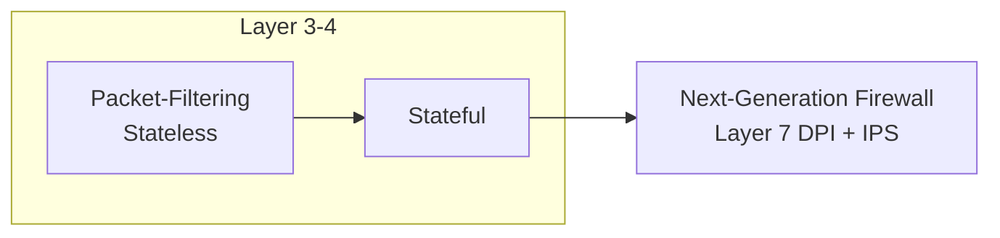

# Firewall - Network Security Barrier

## Overview

A **firewall** is a security device or software that monitors and controls incoming and outgoing network traffic. It acts as a protective barrier between trusted internal networks and untrusted external networks (like the internet).

The primary function of a firewall is to **allow or deny** network traffic based on a defined set of rules. This note covers the core firewall concepts, the main firewall types, and how those concepts map onto the firewall tooling available on Linux.

> [!NOTE]
> **Default-deny is the goal**
> A well-designed firewall follows a **default-deny** posture: block everything, then explicitly permit only the traffic a service genuinely needs. This is the baseline recommended by CIS Benchmarks and NIST for host and perimeter firewalls.

## Concepts

### Key functions of a firewall

| Function | Description | Example |
| :-- | :-- | :-- |
| **Traffic filtering** | Examines packets and applies security rules based on IP, ports, and protocols. | Allow HTTP (port 80) but block FTP (port 21). |
| **Access control** | Controls who can access specific parts of a network. | Restrict SSH (port 22) to internal IPs only. |
| **Intrusion prevention** | Detects suspicious activity (port scanning, large transfers) and can block threats before they exploit vulnerabilities. | Auto-block a host performing a port sweep. |
| **Monitoring & logging** | Keeps logs of traffic for auditing and forensic analysis; aids incident response. | Log all denied connections for later review. |

## Types of Firewalls

Firewalls can be categorized by how they inspect traffic and where they sit in the network.



### 1. Packet-filtering firewalls (stateless)

- Evaluate each packet individually without context of previous packets.
- Operate at the network layer (Layer 3).
- Apply rules based on source/destination IP, port, and protocol.
- Fast processing, lightweight, and simple to configure.
- Less secure; cannot detect complex attacks like replay attacks or fragmentation.

**Example rule:** Allow TCP traffic from 192.168.1.100 to 10.0.0.5 on port 80.

### 2. Stateful firewalls

- Track the state of active connections.
- Operate at the network and transport layers (Layer 3 & 4).
- Allow packets only if part of an established or related session.
- More secure; can prevent SYN floods and spoofing.
- Use more resources and are slower than stateless firewalls.

**Example:** Allow new TCP connections for SSH and track established sessions.

### 3. Next-generation firewalls (NGFW)

- Advanced firewalls with deep packet inspection (Layer 7).
- Include Intrusion Prevention System (IPS), malware filtering, and VPN capabilities.
- Can detect and block complex threats like SQL Injection and Cross-Site Scripting (XSS).

## Comparison: Stateless vs. Stateful Firewalls

| Feature | Stateless Firewall | Stateful Firewall |
| :-- | :-- | :-- |
| Tracking | Does not track connections | Tracks connection states |
| Security | Less secure, vulnerable to spoofing | More secure, resistant to attacks |
| Performance | Faster (no session tracking) | Slower (tracks sessions) |
| Use Case | Simple filtering, high-speed needs | Enterprise security, deeper inspection |
| Vulnerabilities | Susceptible to packet spoofing | Resistant to spoofing & replay attacks |

## Firewalls in Linux

### 1. iptables (legacy — both stateless and stateful)

- **Stateless** if only filtering by IP/port/protocol.
- **Stateful** if using modules `-m state` or `-m conntrack`.

Example stateless rule:

```bash
iptables -A INPUT -p tcp --dport 22 -j ACCEPT
```

```bash
iptables -P INPUT DROP
```

Example stateful rule:

```bash
iptables -A INPUT -m conntrack --ctstate ESTABLISHED,RELATED -j ACCEPT
```

```bash
iptables -A INPUT -p tcp --dport 22 -m conntrack --ctstate NEW -j ACCEPT
```

```bash
iptables -P INPUT DROP
```

### 2. firewalld (stateful by default)

- Uses the nftables or iptables backend.
- Tracks connections and supports dynamic rule management.

Example:

```bash
firewall-cmd --permanent --add-service=ssh
```

```bash
firewall-cmd --reload
```

### 3. UFW (Uncomplicated Firewall — stateful by default)

- Wrapper around iptables.
- Automatically tracks connection states.

Example:

```bash
ufw allow 22/tcp
```

```bash
ufw enable
```

Example to block all except SSH:

```bash
ufw default deny incoming
```

```bash
ufw default allow outgoing
```

```bash
ufw allow ssh
```

```bash
ufw enable
```

## Best Practices

- **Default-deny inbound.** Start by dropping all inbound traffic, then permit only required services.
- **Prefer stateful rules.** Track connection state so replies to legitimate outbound sessions are allowed without opening broad inbound holes.
- **Restrict management access.** Limit SSH and admin ports to trusted source addresses or a VPN/bastion.
- **Log denied traffic.** Enable logging on drop/reject rules to support monitoring and incident response.
- **Keep one authoritative tool.** Do not run iptables, firewalld, and UFW against each other on the same host — pick one manager.

## Security Considerations

- Stateless filtering alone is susceptible to **IP spoofing** and fragmentation attacks; use stateful tracking on any host exposed to untrusted networks.
- A firewall is a control, not a cure. Pair it with patching, service hardening, and IDS/IPS (see [Network-Operating-Systems-and-Security-Solutions](Network-Operating-Systems-and-Security-Solutions.md)) for defence in depth.
- Verify rule order carefully — a permissive earlier rule can silently negate a later restrictive one.

## Summary

- **Stateless** = fast but less secure.
- **Stateful** = secure but slower.
- **NGFW** = advanced protection with deep inspection.
- **Linux tools:** iptables, firewalld, UFW.

## Related

- [IPTables-Configuration-and-Management](IPTables-Configuration-and-Management.md) — netfilter rule management
- [Firewalld](Firewalld.md) — dynamic firewall daemon
- [Uncomplicated-Firewall(ufw)](Uncomplicated-Firewall(ufw).md) — simplified firewall front-end
- [Network-Operating-Systems-and-Security-Solutions](Network-Operating-Systems-and-Security-Solutions.md) — broader network security context
- [Linux Administration & Server Hardening](../Readme.md) — Linux administration & server hardening hub
