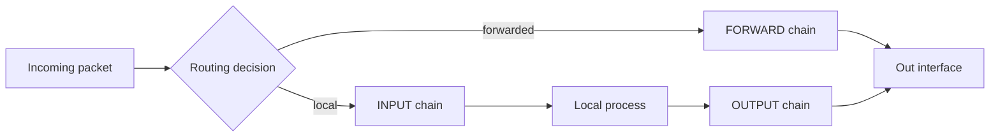

# IPTables Configuration and Management

## Overview

**iptables** is the classic userspace utility for configuring the Linux kernel's **netfilter** packet-filtering framework. It arranges rules into chains (`INPUT`, `OUTPUT`, `FORWARD`) within tables (`filter`, `nat`, `mangle`), and evaluates packets against those rules in order.

This note walks through switching a Red Hat-based host from firewalld to the `iptables-services` model, installing the tooling, viewing and building rules, and persisting them across reboots.

> [!WARNING]
> **iptables and firewalld are mutually exclusive**
> Do not run both managers at once — they both program netfilter and will fight. On the RHEL family you typically **mask/stop firewalld** before enabling `iptables.service`, as shown below.

## Architecture



> [!NOTE]
> **Rule evaluation**
> Within a chain, rules are matched **top to bottom**; the first matching target (`ACCEPT`, `DROP`, `REJECT`) wins. Rule position therefore matters — use `-I <chain> <n>` to insert at a specific line and `--line-numbers` to see current positions.

## Checking and Managing Firewall Services

- Check if Firewalld is Installed

```bash
rpm -qa | grep firewalld
```

- Get Firewalld Package Information

```bash
rpm -qi firewalld-0.6.3.13.el7_9.noarch
```

- Check Status of IPTables and Firewalld

```bash
systemctl status iptables.service
```

```bash
systemctl status firewalld.service
```

- Disable and Stop Firewalld

```bash
systemctl disable firewalld.service
```

```bash
systemctl mask firewalld.service
```

```bash
systemctl stop firewalld.service
```

- Remove Firewalld

```bash
rpm -qf /usr/lib/systemd/system/firewalld.service
```

```bash
yum remove firewalld
```

## Installing Required Packages

- Install Netcat

```bash
yum install netcat
```

- Verify Netcat Installation

```bash
rpm -qa | grep netcat
```

- Check IPTables Installation

```bash
rpm -qa | grep iptables
```

- Search for IPTables Packages

```bash
yum search iptables
```

- Install IPTables (Legacy + Utilities + Services)

```bash
yum install iptables-legacy.x86_64 iptables-utils.x86_64 iptables-services.noarch
```

- Verify IPTables Installation

```bash
rpm -qa | grep iptables
```

- Get Package Info

```bash
rpm -qi iptables-legacy-1.8.10.5.1.el9.next.x86_64
```

```bash
rpm -ql iptables-legacy-1.8.10.5.1.el9.next.x86_64
```

```bash
rpm -qc iptables-legacy-1.8.10.5.1.el9.next.x86_64
```

## Managing IPTables Service

- Enable and Start

```bash
systemctl enable iptables.service
```

```bash
systemctl enable ip6tables.service
```

```bash
systemctl start iptables.service
```

```bash
systemctl start ip6tables.service
```

- Restart

```bash
systemctl restart iptables.service
```

```bash
systemctl restart ip6tables.service
```

## Viewing IPTables Rules

- List Rules

```bash
iptables -L
```

```bash
iptables -L -n
```

```bash
iptables -n -L INPUT
```

```bash
iptables -L OUTPUT
```

```bash
iptables -L FORWARD
```

- List with Line Numbers

```bash
iptables -n --line-numbers -L
```

```bash
iptables -n --line-numbers -L INPUT
```

```bash
iptables -n --line-numbers -L OUTPUT
```

```bash
iptables -n --line-numbers -L FORWARD
```

## IPTables Rules Breakdown

The default RHEL rule set typically reads as follows:

| Rule | Effect |
| :-- | :-- |
| Rule 1 | Allow existing/related connections. |
| Rule 2 | Allow ICMP (ping, traceroute). |
| Rule 3 | Allow all protocols (risky). |
| Rule 4 | Allow new TCP connections on SSH (22). |
| Rule 5 | Reject all other traffic with ICMP "host prohibited". |

## Configuring IPTables Rules

- Allow Specific Ports

```bash
iptables -I INPUT 5 -p tcp --dport 21 -j ACCEPT
```

- Insert Multiple Port Rules

```bash
iptables -I INPUT 5 -p tcp --dport 80:90 -j ACCEPT
```

```bash
iptables -I INPUT 5 -p tcp --dport telnet -j ACCEPT
```

```bash
iptables -I INPUT 5 -p udp --dport 53 -j ACCEPT
```

```bash
iptables -I INPUT 5 -p udp --dport 67 -j ACCEPT
```

```bash
iptables -I INPUT 5 -p udp --dport 110:130 -j ACCEPT
```

- Delete a Rule

```bash
iptables -D INPUT 6
```

- Block Specific Traffic

```bash
iptables -I INPUT 4 -p tcp -s 192.168.1.6 --dport 22 -j DROP
```

```bash
iptables -I INPUT 4 -p tcp -s 192.168.1.45 --dport 22 -j REJECT
```

```bash
iptables -I INPUT 5 -p tcp -d 192.168.1.37 --dport 30 -j ACCEPT
```

> [!TIP]
> **DROP vs. REJECT**
> **DROP** silently discards the packet (the sender sees a timeout), while **REJECT** returns an ICMP error immediately. DROP is stealthier against scanners; REJECT is friendlier for internal services where fast failure is preferable.

## Managing Output Rules

- Drop ICMP to 8.8.8.8

```bash
iptables -I OUTPUT 1 -d 8.8.8.8 -p icmp -j DROP
```

- Block HTTP(S) to Specific Domains

```bash
iptables -I OUTPUT 1 -d google.com -p tcp --dport 80 -j DROP
```

```bash
iptables -I OUTPUT 1 -d www.facebook.com -p tcp --dport 443 -j DROP
```

_( Note: DNS resolution might fail if not using IP directly. Consider using IP addresses instead of domain names for reliability.)_

## Saving and Restoring Rules

- Backup Current Rules

```bash
cp /etc/sysconfig/iptables /etc/sysconfig/iptables.back
```

- Save & Restart

```bash
service iptables save
```

```bash
service iptables stop
```

```bash
service iptables start
```

```bash
service iptables restart
```

- Restore After Reboot

```bash
iptables-restore < /etc/sysconfig/iptables.back
```

- Save Current Rules

```bash
iptables-save > /etc/sysconfig/iptables
```

> [!IMPORTANT]
> **Persistence**
> Runtime rules are lost on reboot unless saved. On RHEL-family systems, `service iptables save` (or `iptables-save > /etc/sysconfig/iptables`) writes the active rules so `iptables.service` can restore them at boot.

## Ensure IPTables Starts on Boot

```bash
yum install iptables-services
```

```bash
systemctl mask firewalld
```

```bash
systemctl enable iptables
```

```bash
systemctl enable ip6tables
```

```bash
systemctl stop firewalld
```

```bash
systemctl start iptables
```

```bash
systemctl start ip6tables
```

## Best Practices

- **Set a default-deny policy** on `INPUT` (and often `FORWARD`), then explicitly allow required services.
- **Always allow ESTABLISHED,RELATED first** so return traffic for legitimate sessions is not accidentally blocked.
- **Never lock yourself out.** Before applying a restrictive SSH rule remotely, keep a second session open or schedule an automatic rule flush.
- **Prefer IPs over hostnames** in rules — DNS may be unavailable when rules load, and a name resolves only once at insert time.
- **Version-control your rule file** (`/etc/sysconfig/iptables`) so changes are auditable and reversible.

## Security Considerations

- Rule 3 in the default set ("allow all protocols") is flagged **risky** — audit and tighten it; a broad ACCEPT can negate every restrictive rule below it.
- Blocking outbound traffic to specific hosts by domain name is unreliable (a domain may map to many rotating IPs and DNS may fail at load); use IP/CIDR blocks for dependable egress control.
- iptables is stateless unless you use `conntrack`/`state` matches — add them for spoofing and SYN-flood resistance.

## Troubleshooting

| Symptom | Likely cause / fix |
| :-- | :-- |
| Rules disappear after reboot | Not saved — run `service iptables save` or `iptables-save > /etc/sysconfig/iptables`. |
| firewalld keeps overriding rules | Mask and stop firewalld before enabling `iptables.service`. |
| Locked out over SSH | Insert the SSH ACCEPT rule *above* any DROP/REJECT and confirm rule order with `--line-numbers`. |
| Domain-based rule not matching | DNS resolved to a different IP; use explicit IP addresses. |

## Additional Resources

- [Advanced Policy Firewall](https://www.rfxn.com/projects/advanced-policy-firewall/)

## Related

- [Firewall-Network-Security-Barrier](Firewall-Network-Security-Barrier.md) — firewall concepts overview
- [Firewalld](Firewalld.md) — higher-level manager over iptables/nftables
- [Uncomplicated-Firewall(ufw)](Uncomplicated-Firewall(ufw).md) — simplified iptables front-end
- [Linux-Network-Configuration](../Network-Configuration/Linux-Network-Configuration.md) — interface/routing configuration
- [Linux Administration & Server Hardening](../Readme.md) — Linux administration & server hardening hub
