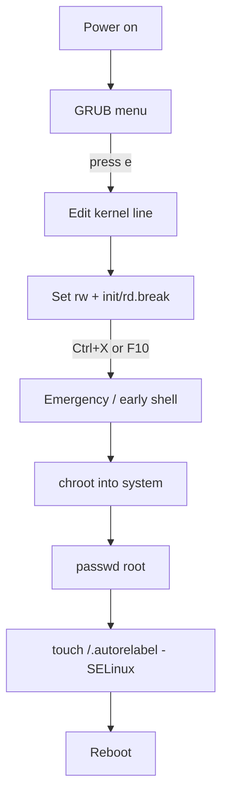

# Reset Root Password and Protect GRUB Boot Loader

## Overview

This note covers two closely related boot-security tasks:

1. **Recovering a lost root password** by interrupting the boot process and dropping into an early shell — demonstrated for RHEL/CentOS/Fedora (with SELinux) and Kali Linux.
2. **Password-protecting the GRUB boot loader** so an attacker with physical (or console) access cannot edit boot parameters, drop into single-user mode, or otherwise bypass authentication.

These two topics are the mirror image of each other: the same physical/console access that lets a legitimate admin reset a forgotten password also lets an attacker seize root — which is exactly why GRUB should be locked down.

> [!WARNING]
> Password recovery via the boot menu requires physical or console access and grants full root. Treat it as a powerful capability: restrict console access, enable full-disk encryption where feasible, and protect GRUB (Part 2) so this path cannot be abused.

### Boot recovery flow



## Part 1: Reset Root Password

### Step 1: Check SELinux Status

Before changing the root password, confirm the SELinux mode:

```bash
sestatus
```

### Step 2: Configure SELinux (Optional)

Edit `/etc/sysconfig/selinux` to set the desired mode (`enforcing`, `permissive`, or `disabled`):

```bash
vim /etc/sysconfig/selinux
```

Example setting:

```bash
SELINUX=enforcing
```

### Step 3: Boot into Recovery or Single User Mode (RHEL 9 / CentOS / Fedora)

1. Reboot the system and wait for the GRUB boot menu.
2. Select the default boot entry (usually the first), then press `e` to edit the boot parameters.
3. Locate the line starting with `linux` or `linux16`.
4. Modify the line:
    - Change `ro` (read-only) to `rw` (read-write).
    - Append `init=/sysroot/sbin/sh` or `init=/sysroot/bin/bash`.

Example:

```bash
linux /vmlinuz-... root=... rw init=/sysroot/sbin/sh
```

5. Press **F10** or **Ctrl+X** to boot.

> [!NOTE]
> **📸 Screenshot**
> _Capture: GRUB boot menu in edit mode showing the highlighted linux kernel line with ro changed to rw and init parameters appended at the end_

### Step 4: Reset Password in Single User Mode

At the shell prompt, run:

```bash
chroot /sysroot
```

- Set a new root password here

```bash
passwd
```

- Triggers SELinux to relabel files on reboot

```bash
touch /.autorelabel
```

- Hard reboot the system

```bash
reboot -f
```

### Kali Linux Specific

1. At the GRUB menu, press `e` to edit the kernel line.
2. Change `ro` to `rw`, and replace `quiet splash` with `single init=/bin/bash`.
3. Boot by pressing **F10** or **Ctrl+X**.
4. At the prompt:

- Reset root password

```bash
passwd
```

 - Immediately reboot

```bash
reboot -f
```

### Method 1: Reset Root Password (SELinux Enforcing)

1. **Reboot the system.**
    
2. At the **GRUB** menu, highlight the kernel and press **`e`** to edit.
    
3. Find the line starting with:
    

```text
linux
```

or

```text
linuxefi
```

4. At the end of that line, append:
    

```text
rd.break
```

5. Press **Ctrl + X** (or **F10**) to boot.
    
6. You'll be dropped into an emergency shell. Remount the sysroot as read-write:
    

```bash
mount -o remount,rw /sysroot
```

7. Change root into the installed system:

```bash
chroot /sysroot
```

8. Reset the root password:
    

```bash
passwd root
```

Example:

```text
New password:
Retype new password:
passwd: all authentication tokens updated successfully.
```

9. Because SELinux is typically enabled, create the autorelabel file:
    

```bash
touch /.autorelabel
```

10. Exit the chroot:
    

```bash
exit
```

11. Exit again to continue booting:
    

```bash
exit
```

The first boot may take several minutes while SELinux relabels the filesystem.

---

### Method 2: Disable SELinux Temporarily (Alternative)

Instead of `rd.break`, append:

```text
rw init=/bin/bash
```

After booting:

```bash
passwd root
touch /.autorelabel
exec /sbin/reboot -f
```

or

```bash
sync
exec /sbin/init
```

### If `/boot` is encrypted

You'll first be prompted for the LUKS passphrase before reaching the emergency shell.

#### Verify

After reboot:

```bash
su -
```

or log in directly as:

```text
Username: root
Password: <new password>
```

#### Check SELinux status after boot

```bash
getenforce
```

Expected output:

```text
Enforcing
```

> [!NOTE]
> The GRUB menu and recovery parameters differ slightly between releases (CentOS Linux 7, CentOS Stream 8/9/10, and RHEL/Fedora). Confirm whether your entry uses `linux`, `linux16`, or `linuxefi`, and adjust the appended parameters accordingly.

## Part 2: Protect GRUB Boot Loader by Password

### Why Protect GRUB?

Adding a password to GRUB prevents unauthorized users from editing boot parameters or booting into single user mode, which is crucial for securing system access. Without it, anyone at the console can perform the exact recovery steps in Part 1 to obtain root.

### Method 1: Using `grub2-mkpasswd-pbkdf2` and editing `/etc/grub.d/10_linux`

1. Generate a hashed password:

```bash
grub2-mkpasswd-pbkdf2
```

- Enter your desired password.

- Copy the generated PBKDF2 hash (starts with `grub.pbkdf2.sha512...`).

2. Edit the GRUB script file:

```bash
vim /etc/grub.d/10_linux
```

3. Add the following lines near the top (adjust username/password hash accordingly):

```bash
cat << EOF
set superusers="Armour"
password_pbkdf2 Armour grub.pbkdf2.sha512.10000.702C1563ADEDA32901A420E554A7F6826EC2728509B1B3AA353AE350C36F5CA452E3DBC8BFB84A6172F4D00D4E875AD5E34699AAF08492BDA20C91D0CEAEE2C9.F15B35E8BE91FCA9811034BB5E30A0BE373236CA11D387FF8B6071CFC5361D11040D462595AC6F32B5BDF6A56705AABFBB2D6E9FC7BBD9566A358C41EEE90D73
EOF
```

4. Regenerate GRUB configuration:

```bash
grub2-mkconfig -o /boot/grub2/grub.cfg
```

5. Reboot to apply changes.

```bash
reboot
```

### Method 2: Directly Editing `/boot/grub2/grub.cfg`

*This method is less preferred because changes will be overwritten by grub2-mkconfig.*

1. Open the GRUB config file:
```bash
vim /boot/grub2/grub.cfg
```

2. Add at the top or end:
```bash
set superusers="Armour"
password_pbkdf2 Armour grub.pbkdf2.sha512.10000.702C1563ADEDA32901A420E554A7F6826EC2728509B1B3AA353AE350C36F5CA452E3DBC8BFB84A6172F4D00D4E875AD5E34699AAF08492BDA20C91D0CEAEE2C9.F15B35E8BE91FCA9811034BB5E30A0BE373236CA11D387FF8B6071CFC5361D11040D462595AC6F32B5BDF6A56705AABFBB2D6E9FC7BBD9566A358C41EEE90D73
```

3. Save and reboot.

```bash
reboot
```

> [!WARNING]
> Hand edits to `/boot/grub2/grub.cfg` are overwritten the next time `grub2-mkconfig` runs (kernel update, `grubby`, etc.). Prefer Method 1 or Method 3 for changes that persist.

### Method 3: Using `grub2-setpassword` (Recommended)

1. Run the following command to set a password interactively:

```bash
grub2-setpassword
```

2. Enter and confirm the password when prompted.

3. This creates/updates `/boot/grub2/user.cfg` with the hashed password.

4. Confirm `/boot/grub2/grub.cfg` contains:

```bash
vim /boot/grub2/grub.cfg
```

```bash
if [ -f ${prefix}/user.cfg ]; then
  source ${prefix}/user.cfg
  if [ -n "${GRUB2_PASSWORD}" ]; then
    set superusers="root"
    export superusers
    password_pbkdf2 root ${GRUB2_PASSWORD}
  fi
fi
```

5. Reboot to enable password protection.

6. To remove the password later if needed:

```bash
rm -f /boot/grub2/user.cfg
```

### GRUB protection methods compared

| Method | Persists across `grub2-mkconfig` | Effort | Recommended |
| :-- | :-- | :-- | :-- |
| `grub2-mkpasswd-pbkdf2` + `/etc/grub.d/10_linux` | Yes | Manual hash entry | For custom superuser names |
| Direct edit of `/boot/grub2/grub.cfg` | No (overwritten) | Low | Avoid |
| `grub2-setpassword` | Yes (`user.cfg`) | Lowest | Yes — preferred |

## Best Practices

- **Protect GRUB on every server** that could be reached physically or via out-of-band console (IPMI/iLO/iDRAC). This closes the single-user-mode root path shown in Part 1.
- **Prefer `grub2-setpassword`** — it stores the hash in `/boot/grub2/user.cfg`, which survives configuration regeneration, and avoids pasting hashes by hand.
- **Use full-disk encryption (LUKS)** so that even boot-level access cannot read data at rest without the passphrase.
- **Combine controls.** GRUB passwords, a BIOS/UEFI supervisor password, Secure Boot, and disabling boot from external media together defend the boot chain (aligned with CIS Benchmark boot-loader recommendations).
- **Record recovery procedures** and the GRUB credentials in a secure secrets store — a lost GRUB password can block legitimate maintenance.

## Security Considerations

- **SELinux relabel**: After resetting the root password on an SELinux-enabled system, creating `/.autorelabel` ensures proper file contexts are restored on reboot. Skipping it can leave files with the wrong context and break login.
- **A GRUB password helps prevent**:
    - Unauthorized kernel or init parameter edits.
    - Booting into single-user mode without proper authentication.
    - Tampering with boot entries.
- **GRUB passwords are not a substitute for encryption.** They stop menu edits but do not protect data if the disk is removed and mounted elsewhere — use LUKS for confidentiality.
- **Physical access is root access** unless the full boot chain is hardened. Treat console/IPMI access as equivalent to administrative access and audit it.

## Troubleshooting

| Symptom | Likely cause | Resolution |
| :-- | :-- | :-- |
| Cannot type at emergency shell | `/sysroot` still read-only | `mount -o remount,rw /sysroot` before `chroot` |
| Login fails after password reset | SELinux contexts stale | Ensure `/.autorelabel` was created; allow the relabel boot to finish |
| GRUB password change lost after kernel update | Edited `grub.cfg` directly | Use `grub2-setpassword` or `/etc/grub.d/10_linux` + `grub2-mkconfig` |
| First boot after reset is very slow | SELinux relabeling the filesystem | Expected — let it complete; it runs once |
| Prompted for a passphrase before the shell | `/boot` or root is LUKS-encrypted | Enter the LUKS passphrase to continue |

## Summary Table

| Task | Commands / Files Involved |
| :-- | :-- |
| Reset root password (RHEL/CentOS) | Modify GRUB boot entry → `chroot /sysroot` → `passwd` |
| Reset root password (Kali) | Modify kernel line with `single init=/bin/bash` → `passwd` |
| Generate GRUB password hash | `grub2-mkpasswd-pbkdf2` |
| Configure GRUB password (manual) | Edit `/etc/grub.d/10_linux`, then recreate grub.cfg |
| Configure GRUB password (easy) | `grub2-setpassword` → auto-manages config |
| Relabel for SELinux | `touch /.autorelabel` |

## References

- `man grub2-setpassword`, `man grub2-mkpasswd-pbkdf2`, `man grub2-mkconfig`.
- Red Hat Enterprise Linux — Managing, monitoring, and updating the kernel / boot loader documentation.
- CIS Benchmarks — boot loader password and single-user-mode authentication controls.

## Related

- [Sudo](../Users-Groups-and-Permissions/Sudo.md) — privileged access after recovery.
- [Shadow-File-Secure-User-Passwords-File](../Users-Groups-and-Permissions/Shadow-File-Secure-User-Passwords-File.md) — where the root password hash lives.
- [Passwd-File-Linux-User-Account-File](../Users-Groups-and-Permissions/Passwd-File-Linux-User-Account-File.md) — the user account database.
- Privilege-Escalation — how physical/boot access leads to root.
- [Linux Administration & Server Hardening](../Readme.md) — Linux administration & server hardening hub.
