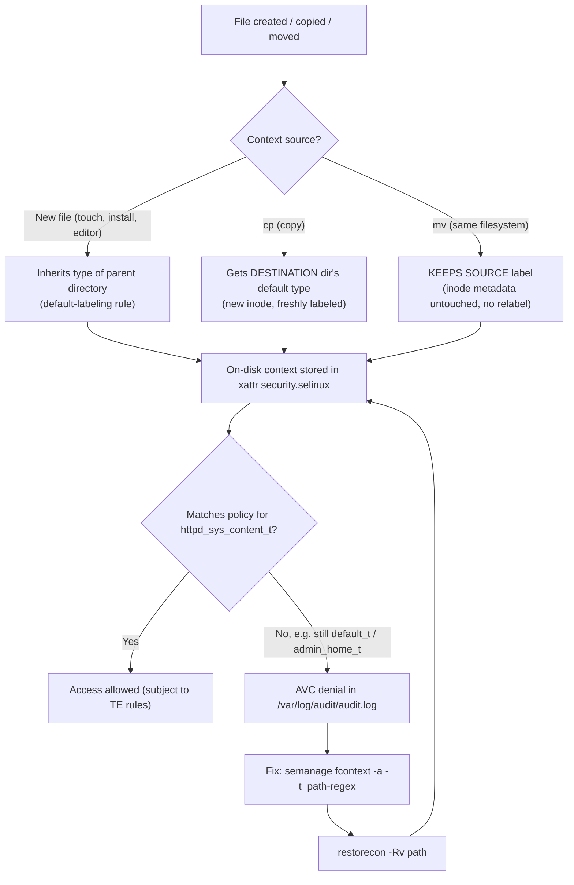

# SELinux Contexts and File Labeling

SELinux enforces its policy not on file paths but on **security contexts** — labels attached to every process and object — so mastering how those labels are read, assigned, and repaired is the difference between a working `httpd_sys_content_t` web root and a permanent stream of `AVC denied` errors.

## Overview

| Aspect | Detail |
|---|---|
| Enforced by | The kernel LSM hook + policy, independent of Discretionary Access Control (DAC/`chmod`) |
| Label format | `user:role:type:level` |
| What matters most | The **type** field — almost all targeted-policy rules are type-enforcement (TE) rules |
| Viewed with | `ls -Z`, `ps -Z`, `id -Z` |
| Set temporarily | `chcon` (survives until next relabel/`restorecon`) |
| Set persistently | `semanage fcontext -a` + `restorecon` |

> [!NOTE]
> This note assumes SELinux is already enabled and in `Enforcing` or `Permissive` mode. For installing/enabling SELinux, mode switching, and the policy model itself, see [SELinux-Fundamentals](SELinux-Fundamentals.md). Debian 12 does **not** ship SELinux enabled by default (AppArmor is the default MAC); enabling it requires the `selinux-basics`/`selinux-policy-default` packages. CentOS Stream 10 and other RHEL-family distributions ship SELinux enabled and `Enforcing` out of the box.

## The Context Format

Every SELinux context is a colon-separated 4-tuple:

```text
user:role:type:level
```

| Field | Meaning | Typical values |
|---|---|---|
| **user** | SELinux user (maps a Linux user to a set of roles) — **not** the same as the Linux/UNIX username | `system_u`, `unconfined_u`, `staff_u` |
| **role** | Groups types a user is permitted to transition into (mainly relevant to processes) | `object_r` (files), `system_r`, `unconfined_r` |
| **type** | The attribute that policy rules actually match against — the field that grants or denies access | `httpd_sys_content_t`, `admin_home_t`, `unconfined_t` |
| **level** (MLS/MCS) | Optional Multi-Level/Multi-Category Security range | `s0`, `s0-s0:c0.c1023` |

> [!IMPORTANT]
> For the targeted policy used by almost every RHEL/CentOS/Fedora install, **type enforcement (TE) is what matters**. Policy rules are written as `allow <source_type> <target_type>:<class> {permissions};` — the user, role, and level fields are largely along for the ride unless you are running MLS policy.

## How It Works



## Viewing Contexts

### Files — `ls -Z`

> Example:

```bash
ls -Z /var/www/html/index.html
```

```text
unconfined_u:object_r:httpd_sys_content_t:s0 /var/www/html/index.html
```

```bash
ls -Z /var/www/html/uploads/report.txt
```

```text
unconfined_u:object_r:default_t:s0 /var/www/html/uploads/report.txt
```

The second file has the wrong type (`default_t` instead of `httpd_sys_content_t`) — Apache will get an `AVC denial` trying to serve it even though normal Linux permissions (`rwx`) are fine.

### Processes — `ps -Z`

> Example:

```bash
ps -eZ | grep httpd
```

```text
system_u:system_r:httpd_t:s0    1842 ?  00:00:00 httpd
system_u:system_r:httpd_t:s0    1843 ?  00:00:00 httpd
```

The running `httpd` process is confined to the `httpd_t` **domain**; policy rules that begin `allow httpd_t ...` govern exactly what that process can touch.

### Current shell / session — `id -Z`

> Example:

```bash
id -Z
```

```text
unconfined_u:unconfined_r:unconfined_t:s0-s0:c0.c1023
```

An interactive login on a targeted-policy box is typically `unconfined_t` — SELinux is largely a no-op for that session, while confined **daemons** like `httpd_t`, `sshd_t`, or `named_t` are tightly restricted.

## Configuration and Commands

### 1. Temporary Relabel — `chcon`

`chcon` changes the context of an existing file directly. It is fast for testing but is **not persistent**: the next full relabel (`restorecon -R /`, a policy reload, or `touch /.autorelabel` + reboot) reverts the file to whatever the policy's file-context database says it should be.

> Example:

```bash
chcon -t httpd_sys_content_t /var/www/html/uploads/report.txt
```

```bash
ls -Z /var/www/html/uploads/report.txt
```

```text
unconfined_u:object_r:httpd_sys_content_t:s0 /var/www/html/uploads/report.txt
```

> [!WARNING]
> `chcon` is a trap for RHCSA/LFCS exams and real production systems alike: the fix "works" until the next relabel event, then silently reverts and the outage reappears. Never use `chcon` as the final fix for a persistent path — use `semanage fcontext` instead.

### 2. Persistent Relabel — `semanage fcontext` + `restorecon`

The correct, durable way to relabel a path is to add a rule to the **file-context database** with `semanage fcontext`, then apply it with `restorecon`. This survives relabels because `restorecon` (and any future full relabel) reads the same database.

> Example — install `semanage` if missing (part of the policy management tools):

```bash
# CentOS Stream 10 / RHEL family
dnf install -y policycoreutils-python-utils
```

```bash
# Debian 12 (if SELinux is enabled)
apt install -y policycoreutils selinux-utils
```

> Example — add a persistent rule and apply it:

```bash
semanage fcontext -a -t httpd_sys_content_t "/var/www/html/uploads(/.*)?"
```

```bash
restorecon -Rv /var/www/html/uploads
```

```text
Relabeled /var/www/html/uploads from unconfined_u:object_r:default_t:s0 to unconfined_u:object_r:httpd_sys_content_t:s0
Relabeled /var/www/html/uploads/report.txt from unconfined_u:object_r:default_t:s0 to unconfined_u:object_r:httpd_sys_content_t:s0
```

| Flag | Meaning |
|---|---|
| `-a` | Add a new file-context mapping |
| `-t <type>` | Target SELinux type to associate with the path pattern |
| `"<regex>"` | POSIX regex path pattern (quote it; `(/.*)?` covers the directory and everything under it recursively) |
| `restorecon -Rv` | Recursively (`-R`) apply the database mapping, verbose (`-v`) output of what changed |

To remove a custom mapping later:

```bash
semanage fcontext -d "/var/www/html/uploads(/.*)?"
```

```bash
restorecon -Rv /var/www/html/uploads
```

### 3. Checking What a Path *Should* Be — `matchpathcon`

`matchpathcon` queries the file-context database (the same one `semanage fcontext` edits) to show what type a path is *supposed to* have, without changing anything — useful for diagnosing drift before running `restorecon`.

> Example:

```bash
matchpathcon /var/www/html/uploads/report.txt
```

```text
/var/www/html/uploads/report.txt system_u:object_r:httpd_sys_content_t:s0
```

```bash
matchpathcon -V /var/www/html/uploads/report.txt
```

```text
/var/www/html/uploads/report.txt has context unconfined_u:object_r:default_t:s0, should be system_u:object_r:httpd_sys_content_t:s0
```

`-V` (verify) compares the on-disk context against the expected one and flags mismatches — effectively a dry-run for `restorecon`.

### 4. Reapplying Defaults — `restorecon`

`restorecon` resets a path's context to whatever the policy's file-context database says it should be. Run it after any `semanage fcontext` change, after moving files onto a filesystem in the wrong context, or as a general "fix the labels" hammer.

```bash
restorecon -Rv /var/www/html/
```

```bash
# Force a full recursive relabel on next boot (heavy-handed, use sparingly)
touch /.autorelabel
reboot   # untested
```

## Why `cp` and `mv` Behave Differently

This trips up nearly everyone the first time they move web content around:

| Operation | Resulting context | Why |
|---|---|---|
| `cp file /var/www/html/` | Gets the **destination directory's** default type (e.g. `httpd_sys_content_t`) | `cp` creates a **new inode**; the kernel applies default-labeling rules for the target directory, same as creating a fresh file there |
| `mv file /var/www/html/` (same filesystem) | **Keeps the source's original type** (e.g. `admin_home_t` from `/root` or `default_t`) | `mv` on the same filesystem is a metadata rename — the inode (and its `security.selinux` xattr) is untouched, so the old label travels with it |
| `mv file /var/www/html/` (across filesystems) | Behaves like `cp` + `rm` — gets the **destination's** default type | Cross-filesystem `mv` cannot just relink the inode; it must copy data and create a new inode, so default labeling applies |

> [!IMPORTANT]
> Rule of thumb: **`cp` relabels, `mv` (same filesystem) does not.** After moving any file into a service's content tree, run `restorecon -Rv` on it as a habit — don't assume the label is correct just because permissions and ownership look fine.

## Worked Example — Serving Content From a Non-Default Web Root

Apache's policy only allows `httpd_t` to read files typed `httpd_sys_content_t` (and a few related types). Pointing `DocumentRoot` at a non-standard directory — say `/data/webroot` instead of `/var/www/html` — breaks that assumption even if `apache`/`www-data` owns the files and `chmod` is correct.

1. Confirm the symptom — a `403 Forbidden` in the browser, and a denial in the audit log:

```bash
grep httpd /var/log/audit/audit.log | tail -5
```

```text
type=AVC msg=audit(...): avc:  denied  { getattr } for  pid=1842 comm="httpd" path="/data/webroot/index.html" dev="dm-0" ino=131074 scontext=system_u:system_r:httpd_t:s0 tcontext=unconfined_u:object_r:default_t:s0 tclass=file
```

`tcontext` shows the file is still `default_t` — the wrong type for `httpd_t` to access.

2. Confirm the current (wrong) label with `ls -Z`:

```bash
ls -Z /data/webroot/index.html
```

```text
unconfined_u:object_r:default_t:s0 /data/webroot/index.html
```

3. Add a **persistent** mapping for the whole tree and apply it:

```bash
semanage fcontext -a -t httpd_sys_content_t "/data/webroot(/.*)?"
```

```bash
restorecon -Rv /data/webroot
```

```text
Relabeled /data/webroot from unconfined_u:object_r:default_t:s0 to unconfined_u:object_r:httpd_sys_content_t:s0
Relabeled /data/webroot/index.html from unconfined_u:object_r:default_t:s0 to unconfined_u:object_r:httpd_sys_content_t:s0
```

4. Verify and reload:

```bash
ls -Z /data/webroot/index.html
```

```text
unconfined_u:object_r:httpd_sys_content_t:s0 /data/webroot/index.html
```

```bash
systemctl reload httpd
```

5. Re-test the page — the `403` should be gone. If Apache is also blocked by a boolean (e.g. following symlinks outside the docroot, or a non-standard port), pair this with the relevant boolean/port change — see [SELinux-Booleans-and-Ports](SELinux-Booleans-and-Ports.md).

## Best Practices

- Prefer `semanage fcontext -a` + `restorecon` over `chcon` for anything that must survive a relabel or reboot — treat `chcon` as a diagnostic/testing tool only.
- Write the path regex to cover the whole tree with `(/.*)?` so new files created later inherit the correct default label automatically.
- Run `restorecon -Rv` (not silent `-R`) so you get a record of exactly what changed — useful for change tickets and rollback.
- After any `mv` into a service directory, immediately `restorecon` the moved path; never assume the label followed the move.
- Use `matchpathcon -V` to audit a tree for drift before committing to a full `restorecon -R /`.
- Keep custom file-context rules under version control or documented — `semanage fcontext -l` dumps the full local customization list for review.

## Security Considerations

> [!WARNING]
> A common "fix" for `AVC denied` errors is disabling SELinux (`setenforce 0` or `SELINUX=disabled`) rather than correcting the label. This removes an entire layer of mandatory access control and is a well-known misconfiguration flagged in CIS Benchmarks and hardening guides — always relabel or adjust policy instead of disabling enforcement.

- Getting labeling wrong in the *permissive* direction (over-broad types, or reusing `httpd_sys_content_t` for writable upload directories that should be `httpd_sys_rw_content_t`) can let a compromised web app write executable content the server will then happily serve.
- Correct labeling is a genuine security boundary: even if DAC permissions or a vulnerable application would otherwise allow a process to read/write a path, SELinux type enforcement provides a second, independent check.
- During incident response, `ls -Z` and `matchpathcon -V` across a content tree quickly reveal files that were dropped with the wrong (or default `unlabeled_t`) context — a useful signal that something bypassed normal deployment tooling.
- Audit `semanage fcontext -l` output on hardened hosts periodically; unexpected custom rules broadening a type's coverage are worth investigating.

## Troubleshooting

| Symptom | Likely cause | Resolution |
|---|---|---|
| `403 Forbidden` despite correct `chmod`/ownership | Wrong SELinux type on content (e.g. `default_t` instead of `httpd_sys_content_t`) | `ls -Z`, then `semanage fcontext -a -t httpd_sys_content_t "<regex>"` + `restorecon -Rv` |
| Fix "works" then breaks again after a reboot/update | Used `chcon` instead of `semanage fcontext` | Redo the fix with `semanage fcontext -a` so it's persistent |
| Files moved into web root still denied | `mv` preserved the source label instead of adopting the destination default | Run `restorecon -Rv` on the moved path |
| `semanage: command not found` | `policycoreutils-python-utils` (RHEL family) / `policycoreutils` (Debian) not installed | Install the package, see Commands section above |
| Context shows `unlabeled_t` | File created while SELinux was disabled, or on a filesystem without label support | `restorecon -Rv` the path; confirm the filesystem is mounted with `context=` support if it's a network share |
| No `AVC` entries in `audit.log` despite a suspected denial | `auditd` not running, or system in `Permissive` mode with denials only in `dmesg` | `journalctl -t setroubleshoot`, `ausearch -m avc -ts recent`, or check `dmesg | grep avc` — see [SELinux-Troubleshooting](SELinux-Troubleshooting.md) |

## References

- [`man 8 restorecon`](https://man7.org/linux/man-pages/man8/restorecon.8.html)
- [`man 8 chcon`](https://man7.org/linux/man-pages/man8/chcon.1.html)
- [`man 8 semanage-fcontext`](https://man7.org/linux/man-pages/man8/semanage-fcontext.8.html)
- [`man 8 matchpathcon`](https://man7.org/linux/man-pages/man8/matchpathcon.8.html)
- [Red Hat Enterprise Linux — Using SELinux guide](https://docs.redhat.com/en/documentation/red_hat_enterprise_linux/9/html/using_selinux/index)
- [Debian Wiki — SELinux](https://wiki.debian.org/SELinux)

## Related
- [SELinux-Fundamentals](SELinux-Fundamentals.md) — modes (Enforcing/Permissive/Disabled), policy model, and enabling SELinux
- [SELinux-Booleans-and-Ports](SELinux-Booleans-and-Ports.md) — runtime policy toggles and non-standard port labeling that often accompany a file-context fix
- [SELinux-Troubleshooting](SELinux-Troubleshooting.md) — reading AVC denials, `audit2allow`, and `sealert`/`setroubleshoot`
- [Linux-Permissions](../Users-Groups-and-Permissions/Linux-Permissions.md) — how DAC (`chmod`/`chown`) and SELinux MAC layers interact and differ
- [Security, Firewall & Monitoring](Readme.md) — module hub
- [Linux Administration & Server Hardening](../Readme.md)
