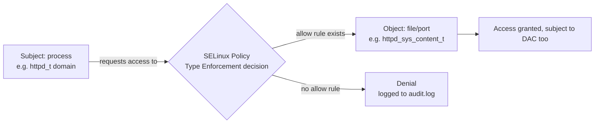

# SELinux Fundamentals

**SELinux** (Security-Enhanced Linux) is a kernel security module that enforces **Mandatory Access Control (MAC)** on top of the traditional Linux permission model, confining every process to only the actions its security policy explicitly allows — even when that process is running as root.

## Overview

| Aspect | Detail |
| :-- | :-- |
| **Mechanism** | Linux Security Modules (LSM) hook into the kernel; SELinux is the default LSM on RHEL-family distributions |
| **Model** | Mandatory Access Control (MAC) — policy-defined, not owner-defined |
| **Common policy** | `targeted` — confines specific daemons/processes; unconfined domains run under standard DAC only |
| **Modes** | `Enforcing`, `Permissive`, `Disabled` |
| **Default on** | RHEL, CentOS Stream, Rocky, Alma, Fedora |
| **Default on Debian/Ubuntu** | AppArmor (path-based MAC), not SELinux |

> [!NOTE]
> **DAC vs MAC**
> Standard Linux permissions (owner/group/other, `rwx`) are **Discretionary Access Control (DAC)** — the *owner* of a resource decides who can access it, and a process running as `root` can bypass DAC checks entirely. **Mandatory Access Control (MAC)**, as implemented by SELinux, is enforced centrally by the **kernel policy**, not by resource owners. Even a process running as `root` is confined to what its SELinux **domain** is permitted to do. DAC and MAC are evaluated together: a request must pass **both** checks — DAC first, then SELinux — to succeed.

## How It Works: Type Enforcement

SELinux's `targeted` policy is built primarily on **Type Enforcement (TE)**. Every process runs in a security **domain**, and every object (file, socket, port, device) is labeled with a **type**. Access is granted only if the policy contains an explicit **allow rule** connecting that domain to that type for the requested operation — everything else is denied by default (default-deny).



Labels take the form `user:role:type:level` (e.g. `system_u:object_r:httpd_sys_content_t:s0`). For the `targeted` policy, the **type** field is what almost all allow rules key on — this is why relabeling a file (changing its type) so often fixes a denial.

## The Three Modes

| Mode | Behavior |
| :-- | :-- |
| **Enforcing** | Policy is loaded and actively enforced; denied actions are blocked and logged. Production default. |
| **Permissive** | Policy is loaded but **not enforced** — denials are only logged, not blocked. Used for debugging/tuning policy. |
| **Disabled** | SELinux is fully off; no labeling, no enforcement, no logging. Not recommended — going back to Enforcing later requires a full relabel. |

## Commands

### Check Current Status

> Example:

```bash
getenforce
```

```text
Enforcing
```

`sestatus` gives a fuller picture — current mode, the mode set on next boot, the loaded policy name, and the policy version.

```bash
sestatus
```

```text
SELinux status:                 enabled
SELinuxfs mount:                /sys/fs/selinux
SELinux root directory:         /etc/selinux
Loaded policy name:             targeted
Current mode:                   enforcing
Mode from config file:          enforcing
Policy MLS status:              enabled
Policy deny_unknown status:     allowed
Memory protection checking:     actual (secure)
Max kernel policy version:      33
```

### Change the Mode at Runtime

`setenforce` toggles between Enforcing and Permissive **immediately**, but the change does not survive a reboot and cannot set `disabled` — that requires editing the config file.

```bash
setenforce 0   # switch to Permissive
```

```bash
setenforce 1   # switch back to Enforcing
```

> [!IMPORTANT]
> `setenforce` only accepts `0` (Permissive) and `1` (Enforcing). You cannot use it to disable SELinux — that transition is a **boot-time** decision made via `/etc/selinux/config` (or a `selinux=0` kernel parameter), because the kernel needs to know before it starts labeling processes.

## Configuration: /etc/selinux/config

The persistent (boot-time) mode and policy type are set in `/etc/selinux/config`. This file is read at boot and takes effect on the **next** boot after being edited.

```bash
vim /etc/selinux/config
```

```conf
# This file controls the state of SELinux on the system.
# SELINUX= can take one of these three values:
#     enforcing - SELinux security policy is enforced.
#     permissive - SELinux prints warnings instead of enforcing.
#     disabled - No SELinux policy is loaded.
SELINUX=enforcing
# SELINUXTYPE= can take one of these three values:
#     targeted - Targeted processes are protected,
#     minimum - Modification of targeted policy. Only selected processes are protected.
#     mls - Multi Level Security protection.
SELINUXTYPE=targeted
```

| Directive | Purpose |
| :-- | :-- |
| `SELINUX=` | Persistent mode: `enforcing`, `permissive`, or `disabled` |
| `SELINUXTYPE=` | Policy variant loaded: `targeted` (default, confines specific daemons), `minimum`, or `mls` (Multi-Level Security) |

## Switching Disabled → Enforcing: Forcing a Relabel

When SELinux has been `disabled`, files are created and modified with **no SELinux labels** at all. If you then flip `SELINUX=enforcing` and reboot, every file on disk has a missing or stale type — the kernel will deny almost everything until labels are corrected. You must force a full filesystem **relabel** before, or as part of, that transition.

1. Edit `/etc/selinux/config` and set the mode.

> Example:

```bash
sed -i 's/^SELINUX=.*/SELINUX=enforcing/' /etc/selinux/config
```

2. Force a relabel on the next boot by creating the flag file (the kernel/init scripts check for this at startup):

```bash
touch /.autorelabel
```

3. Reboot. The relabel pass walks the entire filesystem restoring correct types (this can take several minutes on a large disk) and reboots again automatically when done.

```bash
reboot
```

Alternatively, without a reboot cycle, `fixfiles` can trigger the same relabel:

```bash
fixfiles onboot   # untested — schedules /.autorelabel for next boot, same effect as step 2
```

```bash
fixfiles -f relabel   # untested — relabels immediately while still permissive/enforcing; run from single-user or with SELINUX=permissive to avoid a storm of denials mid-relabel
```

> [!TIP]
> Going the *other direction* (Enforcing → Disabled) needs no relabel — labels are simply ignored while disabled. It is the **Disabled → Enforcing** transition that is dangerous without a relabel, because the kernel will suddenly start enforcing against labels that were never maintained.

## SELinux vs AppArmor by Distribution

| Distribution family | Default MAC framework |
| :-- | :-- |
| RHEL, CentOS Stream, Rocky Linux, Alma Linux, Fedora | **SELinux** (`targeted` policy, Enforcing by default) |
| Debian, Ubuntu | **AppArmor** (path-based profiles, not label-based) |

> [!NOTE]
> AppArmor confines processes by **filesystem path** rather than by label, and profiles are typically simpler to author but less granular than SELinux type enforcement. The two are not interchangeable and generally not run together — pick the framework your distribution ships and stay within it. On Debian, `aa-status` is the rough equivalent of `sestatus`.

```bash
aa-status   # untested — Debian/Ubuntu equivalent status check for AppArmor
```

## Best Practices

- Never leave production RHEL-family hosts in `disabled` mode — use `Permissive` temporarily for debugging so denials are still logged, then return to `Enforcing`.
- Prefer fixing the **label** (`restorecon`) or a **boolean** over disabling SELinux to solve an access problem — see [SELinux-Contexts-and-File-Labeling](SELinux-Contexts-and-File-Labeling.md) and [SELinux-Booleans-and-Ports](SELinux-Booleans-and-Ports.md).
- Always create `/.autorelabel` (or run `fixfiles onboot`) whenever transitioning from `disabled` to `enforcing`/`permissive`.
- Audit denials with `ausearch`/`sealert` before changing policy — see [SELinux-Troubleshooting](SELinux-Troubleshooting.md) for the full workflow.
- Treat `SELINUXTYPE=mls` as a specialized, high-assurance configuration; `targeted` is correct for the vast majority of servers.

## Security Considerations

> [!WARNING]
> **Disabling SELinux removes a real control**
> Setting `SELINUX=disabled` is a common but risky "quick fix" for access-denied errors. It removes an entire layer of confinement that limits blast radius from a compromised service (e.g. a web server exploited via a vulnerable application can no longer be contained to `httpd_t`). Prefer `Permissive` for diagnosis and targeted policy fixes over permanently disabling enforcement.

- A process compromised while confined by SELinux is still bound by its domain's allow rules — this is a meaningful barrier against privilege escalation and lateral movement, even for root-owned daemons.
- `Permissive` mode is *not* a safe production state long-term: it logs denials but enforces nothing, giving a false sense of "SELinux is on."
- During a pentest/assessment, check `getenforce` early — a target running `Permissive` or `Disabled` has effectively lost this control, which changes the risk calculus for any local exploit or misconfiguration found afterward.

## Troubleshooting

| Symptom | Likely cause | Resolution |
| :-- | :-- | :-- |
| Service fails to start / access denied after `disabled` → `enforcing` | Filesystem was never labeled while SELinux was off | `touch /.autorelabel` and reboot, or `fixfiles -f relabel` |
| `setenforce 0`/`1` has no lasting effect after reboot | `setenforce` only changes the runtime mode | Edit `SELINUX=` in `/etc/selinux/config` for a persistent change |
| `setenforce: SELinux is disabled` error | Kernel booted with SELinux fully disabled | Enable via config file + `/.autorelabel`, then reboot (cannot be enabled live) |
| Application works in Permissive but fails in Enforcing | A missing allow rule / wrong file context | Review `ausearch -m avc`, fix labels or booleans — see [SELinux-Troubleshooting](SELinux-Troubleshooting.md) |
| `getenforce` reports `Disabled` even though config says `enforcing` | Kernel command line has `selinux=0`, overriding the config file | Check `/proc/cmdline` and GRUB kernel parameters |

## References

- [SELinux User's and Administrator's Guide (Red Hat)](https://docs.redhat.com/en/documentation/red_hat_enterprise_linux/9/html/using_selinux/index)
- `man selinux` — overview of concepts and modes
- `man selinux_config` — `/etc/selinux/config` file format
- `man getenforce`, `man setenforce`, `man sestatus` — status/mode command references
- [Fedora SELinux Project Documentation](https://docs.fedoraproject.org/en-US/quick-docs/selinux-getting-started/)

## Related

- [SELinux-Contexts-and-File-Labeling](SELinux-Contexts-and-File-Labeling.md) — labels, `restorecon`, `chcon`, and context management
- [SELinux-Booleans-and-Ports](SELinux-Booleans-and-Ports.md) — tunable policy switches and port labeling
- [SELinux-Troubleshooting](SELinux-Troubleshooting.md) — reading AVC denials, `ausearch`, `audit2allow`
- [Firewalld](Firewalld.md) — companion host-hardening control alongside SELinux
- [Linux-Permissions](../Users-Groups-and-Permissions/Linux-Permissions.md) — the underlying DAC layer SELinux sits on top of
- [Security, Firewall & Monitoring](Readme.md) — module hub
- [Linux Administration & Server Hardening](../Readme.md) — course hub
