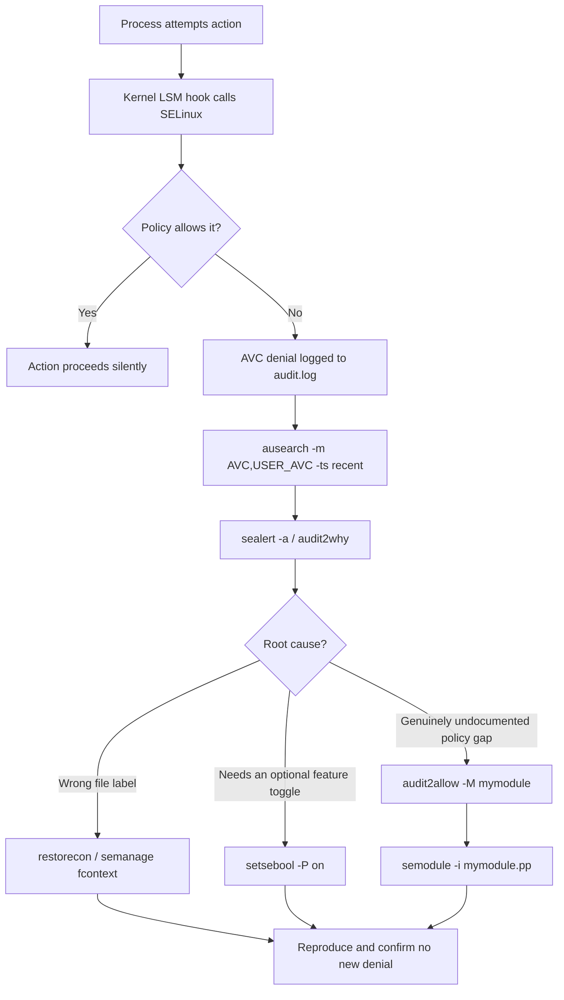

# SELinux Troubleshooting

SELinux Troubleshooting is the systematic process of finding, reading, and resolving **AVC (Access Vector Cache) denials** — the kernel-level refusals that SELinux logs when a confined process attempts an action its policy does not permit. Knowing this workflow is what separates "just disable SELinux" from actually keeping mandatory access control enforced in production.

## Overview

| Tool / Path | Purpose |
|---|---|
| `/var/log/audit/audit.log` | Raw audit trail; every AVC denial is recorded here as `type=AVC` |
| `ausearch` | Query/filter the audit log by event type, time window, PID, etc. |
| `setroubleshoot-server` / `sealert` | Human-readable explanation of a denial plus suggested fixes |
| `audit2why` | Translates raw AVC records into a plain-English reason |
| `audit2allow` | Generates a custom policy module from denials (last resort) |
| `semanage permissive -a` | Puts a **single domain** into permissive mode without disabling SELinux globally |

> [!NOTE]
> SELinux is enforcing by default on RHEL-family systems (CentOS Stream 10, Rocky, Alma, Fedora). Debian 12 ships **AppArmor** as its default MAC system; SELinux is available but must be installed and switched on explicitly (`apt install selinux-basics selinux-policy-default policycoreutils setroubleshoot-server` then `selinux-activate` and a reboot). Commands below are shown for both once SELinux is the active LSM.

## How It Works

Every denial follows the same path from kernel decision to policy fix. The goal of troubleshooting is to work through this chain without reaching for `setenforce 0`.



## Commands

### Step 1: Reproduce the Denied Action

Trigger the exact operation that is failing (start the service, load the web page, run the script) so a fresh, timestamped AVC record lands in the audit log.

> Example:

```bash
systemctl restart httpd
```

### Step 2: Search the Audit Log for the Denial

Filter the audit log to just AVC and USER_AVC events in the recent window rather than scrolling the whole file.

> Example:

```bash
ausearch -m AVC,USER_AVC -ts recent
```

| Flag | Meaning |
|---|---|
| `-m AVC,USER_AVC` | Only kernel AVC and userspace AVC (e.g. dbus-mediated) denials |
| `-ts recent` | Events from roughly the last 10 minutes (accepts `today`, `boot`, or `MM/DD/YYYY HH:MM:SS`) |
| `-i` | (add) Interpret numeric UID/SID fields as names |

### Step 3: Read a Human-Readable Explanation

`setroubleshoot-server` runs a daemon (`sedispatch`) that watches the audit log and produces plain-English alerts; `sealert` reads them back.

> Example, CentOS Stream 10:

```bash
dnf install -y setroubleshoot-server policycoreutils-python-utils
```

> Example, Debian 12 (after SELinux is active):

```bash
apt install -y setroubleshoot-server policycoreutils
```

Then, on either distro, list every stored alert or explain one denial directly from the raw log:

```bash
sealert -a /var/log/audit/audit.log
```

`audit2why` gives the same "why" without the setroubleshoot daemon, straight from `ausearch` output:

```bash
ausearch -m AVC,USER_AVC -ts recent | audit2why
```

### Step 4: Decide the Fix — Boolean, Label, or Module

Read the `audit2why`/`sealert` output carefully; it usually tells you which category the denial falls into (see the decision table below). Prefer the smallest, most targeted change.

- **Wrong file context (most common cause):**

```bash
restorecon -Rv /var/www/html
```

```bash
semanage fcontext -a -t httpd_sys_content_t "/srv/web(/.*)?"
```

```bash
restorecon -Rv /srv/web
```

- **Policy exposes an optional feature via a boolean:**

```bash
getsebool -a | grep httpd_can_network_connect
```

```bash
setsebool -P httpd_can_network_connect on
```

### Step 5: Build a Custom Module (last resort)

Only when `sealert`/`audit2why` shows there is no boolean and the label is already correct — meaning the denial reflects a genuine gap between policy and a legitimate, intentional action — generate and load a local module.

```bash
ausearch -m AVC,USER_AVC -ts recent | audit2allow -M mymodule
```

```bash
semodule -i mymodule.pp
```

> [!IMPORTANT]
> `audit2allow -M` writes both `mymodule.te` (the human-readable rule) and `mymodule.pp` (the compiled policy package). **Always read the `.te` file before loading the `.pp`.** `audit2allow` grants exactly what was denied, with no judgment about whether that access is safe — it will happily generate a rule allowing a web server to read `/etc/shadow` if that's what was logged.

### Step 6 (diagnostic only): Permissive a Single Domain

If a denial's root cause is unclear, temporarily put **only that domain** into permissive mode instead of running `setenforce 0` system-wide. The domain will log would-be denials but not block them, letting you watch what happens next without leaving the whole host unprotected.

```bash
semanage permissive -a httpd_t
```

```bash
semanage permissive -l
```

```bash
semanage permissive -d httpd_t
```

## Examples

Sample `sealert` output for a mislabeled web root:

```text
SELinux is preventing /usr/sbin/httpd from getattr access on the file /srv/web/index.html.

*****  Plugin restorecon (99.5 confidence) suggests   **********************

If you want to fix the label,
Then execute:
Do
# /sbin/restorecon -v /srv/web/index.html
```

Matching `audit2why` explanation:

```text
type=AVC msg=audit(...): avc:  denied  { getattr } for  pid=1234 comm="httpd"
        path="/srv/web/index.html" dev="dm-0" ino=131074
        scontext=system_u:system_r:httpd_t:s0
        tcontext=unconfined_u:object_r:default_t:s0 tclass=file permissive=0

        Was caused by:
        Missing type enforcement (TE) allow rule.
        The file /srv/web/index.html is mislabeled (default_t instead of httpd_sys_content_t).
        This is a labeling problem, not a policy gap — fix with restorecon/semanage fcontext, not audit2allow.
```

## Boolean vs Label vs Module — Decision Guide

| `tcontext` in the denial | Root cause | Correct fix |
|---|---|---|
| A generic/default type (`default_t`, `var_t`, `usr_t`) on your own content | File/dir was never relabeled after creation or copy | `restorecon -Rv` (or `semanage fcontext -a` + `restorecon` for a new path pattern) |
| Correct type, but denial mentions a well-known optional feature (network connect, NFS home dirs, CGI scripts) | Vendor policy ships a boolean for exactly this case | `setsebool -P <boolean> on` |
| Correct type, no matching boolean exists, action is legitimate and expected | Genuine, narrow policy gap | `audit2allow -M` + `semodule -i` (review the `.te` first) |
| Repeated, hard-to-isolate denials from one service during development | Root cause still unclear | `semanage permissive -a <domain>` temporarily, observe, then fix and re-enforce |

## Best Practices

- Always **reproduce → read the denial → fix the smallest thing** (label or boolean) before considering a custom module.
- Search `sepolicy` upstream / vendor bug trackers for the exact denial text — most "missing" booleans already exist under a different name (`getsebool -a | grep <keyword>`).
- Never leave a domain in `semanage permissive` state after diagnosis is done; remove it with `semanage permissive -d` once the real fix (label or boolean) is applied and verified.
- Keep custom `.pp` modules under version control and named for the app they cover (`myapp-custom.pp`), not generic names like `mymodule.pp`, so audits can trace policy provenance.
- Re-run the reproducing action after every fix and confirm `ausearch -m AVC -ts recent` returns nothing new before closing the ticket.

## Security Considerations

> [!WARNING]
> `audit2allow` output is a transcription of the denial, not a security review. Blindly loading every generated `.pp` module gradually erodes the policy back toward "allow everything the process ever tried," defeating the purpose of SELinux. Treat each `.te` file as a code-review diff, not a rubber stamp.

- Prefer `semanage fcontext`/`restorecon` and `setsebool` over custom modules whenever possible — they use policy the vendor already tested and maintains.
- Scope permissive mode to the single offending domain with `semanage permissive -a`; global `setenforce 0` disables protection for every confined process on the host, not just the one you're debugging.
- Audit `semodule -l` periodically on production hosts and remove modules tied to decommissioned applications.
- Treat a sudden burst of AVC denials from a previously quiet domain as a potential indicator of compromise or a misconfigured deployment, not just noise to silence.

## Troubleshooting

| Symptom | Likely cause | Resolution |
|---|---|---|
| `ausearch` returns "no matches" but the action clearly failed | `auditd` not running, or SELinux is in `disabled` mode | `systemctl status auditd`; check `getenforce` is not `Disabled` |
| `sealert -a` shows nothing new | `setroubleshoot` daemon not running / not installed | `dnf install setroubleshoot-server` (or `apt install` on Debian) then retry |
| Fix applied but denial repeats | Wrong domain permissive'd, or label reverted by a later file operation (e.g. `cp` without `--preserve=context`) | Re-check `ls -Z`; re-run `restorecon -Rv` after any file copy/move |
| `audit2allow -M` produces an empty/near-empty module | No AVC records in the window piped to it | Re-run `ausearch -m AVC,USER_AVC -ts recent` immediately after reproducing, before the window ages out |
| `semodule -i mymodule.pp` fails | Module name collision or syntax error in `.te` | `semodule -l | grep mymodule`; remove old version with `semodule -r mymodule` first |
| Permissive domain never gets set back to enforcing | `semanage permissive -d` skipped after diagnosis | `semanage permissive -l` to audit; `semanage permissive -d <domain>` to restore enforcement |

## References

- [Red Hat SELinux User's and Administrator's Guide](https://docs.redhat.com/en/documentation/red_hat_enterprise_linux/9/html/using_selinux/index)
- `man ausearch` — audit log search syntax
- `man audit2allow`, `man audit2why` — policy generation and denial explanation
- `man semanage-permissive` — per-domain permissive mode
- [Debian Wiki: SELinux](https://wiki.debian.org/SELinux) — enabling SELinux on Debian 12

## Related
- [SELinux-Fundamentals](SELinux-Fundamentals.md) — modes, contexts, and the core enforcing model this troubleshooting workflow builds on
- [SELinux-Contexts-and-File-Labeling](SELinux-Contexts-and-File-Labeling.md) — the `restorecon`/`semanage fcontext` labeling fixes used here
- [SELinux-Booleans-and-Ports](SELinux-Booleans-and-Ports.md) — the `setsebool`/`semanage port` toggles used before reaching for a custom module
- [TCPDump-Command](TCPDump-Command.md) — capturing traffic to correlate with network-related AVC denials
- [Security, Firewall & Monitoring](Readme.md) — module hub
- [Linux Administration & Server Hardening](../Readme.md)
