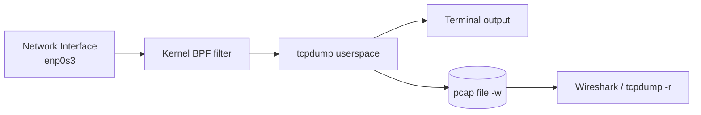

# TCPDump Command

## Overview

`tcpdump` is a powerful command-line packet analyzer used to capture, monitor, and inspect network traffic in real time. It intercepts and displays packets transmitted or received on a chosen network interface, and supports rich Berkeley Packet Filter (BPF) expressions to narrow captures by IP address, port, or protocol. Because it is lightweight, scriptable, and available on virtually every UNIX-like system, `tcpdump` is a core tool for network troubleshooting, security analysis, and forensics.

> [!NOTE]
> `tcpdump` reads raw frames off the wire, which requires elevated privileges (`root` or `CAP_NET_RAW`). Run it with `sudo` when your account lacks those capabilities.

## Concepts

- **Live capture vs. offline analysis** — capture directly from an interface, or read/write the portable `pcap` file format for later analysis in tools such as Wireshark.
- **BPF filter expressions** — a compact filter language (`tcp`, `udp`, `port 53`, `host 192.168.1.1`, `net 192.168.1.0/24`) that the kernel applies before packets ever reach userspace, keeping captures efficient.
- **Detailed decoding** — output includes timestamps, source/destination IPs, ports, protocol type, packet length, flags, and optionally payload.
- **Cross-platform** — runs on Linux, BSD, and macOS; the Windows port is distributed as WinDump.

> [!NOTE]
> BPF filters run in the kernel. Filtering at capture time (rather than after) reduces CPU load and prevents dropped packets on busy links.

### Typical usage syntax

```bash
tcpdump [options] [filter expression]
```

For example, to capture packets on interface `eth0`:

```bash
tcpdump -i eth0
```

## Installation

Install `tcpdump` on an RPM-based system using `yum`:

```bash
yum install tcpdump
```

Verify the installation and print the version:

```bash
tcpdump --version
```

## Commands

### Discovery and help

View available options and usage instructions:

```bash
tcpdump -h
```

Display network interfaces available for packet capture:

```bash
tcpdump -D
```

Equivalent long form:

```bash
tcpdump --list-interfaces
```

### Common options reference

| Option | Purpose |
| :-- | :-- |
| `-i <iface>` | Capture on the named interface (e.g. `enp0s3`, `eth0`) |
| `-n` | Do not resolve host names — show numeric IP addresses |
| `-nn` | Do not resolve host names or port numbers |
| `-v`, `-vv`, `-vvv` | Increase output verbosity |
| `-c <count>` | Stop after capturing `<count>` packets |
| `-w <file>` | Write raw packets to a `pcap` file |
| `-r <file>` | Read packets from a saved `pcap` file |
| `-D` | List interfaces available for capture |
| `-e` | Print link-layer (Ethernet) headers |
| `-X` | Print packet contents in hex and ASCII |

> [!NOTE]
> **📸 Screenshot**
> _Capture: tcpdump running on enp0s3 showing a live scrolling list of captured packets with timestamps, source and destination IP:port pairs, TCP flags, and sequence numbers_

## Capturing Packets

Capture packets on a specific interface. To capture on `enp0s3`:

```bash
tcpdump -i enp0s3
```

Capture only TCP packets on `enp0s3`:

```bash
tcpdump -i enp0s3 tcp
```

Capture only UDP packets on `enp0s3`:

```bash
tcpdump -i enp0s3 udp
```

Capture packets without resolving hostnames (display numeric IP addresses only):

> For TCP packets:

```bash
tcpdump -n -i enp0s3 tcp
```

> For UDP packets:

```bash
tcpdump -n -i enp0s3 udp
```

### Capture pipeline



## Filtering by Port

Capture TCP packets on specific ports.

> Port 443 (HTTPS):

```bash
tcpdump -i enp0s3 tcp port 443
```

> Port 8080:

```bash
tcpdump -i enp0s3 tcp port 8080
```

> Capture TCP packets on `eth0` for port 8080:

```bash
tcpdump -i eth0 tcp port 8080
```

Capture UDP packets on specific ports.

> Port 53 (DNS queries):

```bash
tcpdump -i enp0s3 udp port 53
```

## Advanced Filtering

### By source or destination host

Capture packets from a specific source IP:

```bash
tcpdump -i enp0s3 src host 192.168.1.1
```

```bash
tcpdump -n -i enp0s3 src host 192.168.1.1
```

Capture packets destined for a specific IP:

```bash
tcpdump -i enp0s3 dst host 192.168.1.1
```

```bash
tcpdump -n -i enp0s3 dst host 192.168.1.1
```

### By network

Capture traffic for a subnet (e.g. `192.168.1.0/24`):

```bash
tcpdump -i enp0s3 net 192.168.1.0/24
```

```bash
tcpdump -i enp0s3 net 192.168.1.0/24
```

## Saving and Reading Packet Captures

Save captured packets to a file. To capture UDP packets on port 53 and save them to `dnsdump.pcap` for later analysis:

```bash
tcpdump -v -n -i enp0s3 udp port 53 -w dnsdump.pcap
```

Read captured packets back from the saved file:

```bash
tcpdump -r dnsdump.pcap
```

## Additional Options

Capture packets with detailed (verbose) output:

```bash
tcpdump -vv -i enp0s3
```

Limit the capture to a specific count — capture only 10 packets and stop:

```bash
tcpdump -c 10 -i enp0s3
```

## Best Practices

- **Filter at capture time.** Prefer BPF expressions (`tcp port 443`, `host 10.0.0.5`) over post-capture filtering to reduce packet loss on busy links.
- **Cap the volume.** Use `-c <count>` for quick spot checks and `-w` with log rotation (`-C <size>` / `-G <seconds>`) for long-running captures to avoid filling the disk.
- **Suppress DNS lookups.** Use `-n` (or `-nn`) to prevent `tcpdump` from generating its own reverse-DNS traffic, which both speeds output and avoids polluting the capture.
- **Save raw, analyze later.** Write to `pcap` with `-w`, then open in Wireshark or re-read with `-r` — this keeps the capture host lightweight and preserves the original data.

## Security Considerations

> [!WARNING]
> Packet capture can expose sensitive data. Unencrypted protocols (HTTP, Telnet, FTP, SNMP, plain SMTP/POP3/IMAP) transmit credentials and payloads in cleartext that `tcpdump` will record verbatim.

- **Least privilege.** Grant `CAP_NET_RAW` to a dedicated capture account instead of running everything as `root`. Restrict who can read the resulting `pcap` files (`chmod 600`).
- **Legal and policy scope.** Capturing traffic you are not authorized to inspect may violate law or policy. Confine captures to systems and networks you own or are explicitly authorized to monitor.
- **Handle captures as sensitive artifacts.** A `pcap` may contain session tokens, passwords, and PII. Store, transfer, and dispose of capture files accordingly.
- **Detect suspicious traffic.** `tcpdump` is equally useful defensively — use it to spot beaconing, unexpected outbound connections, and cleartext credential leakage.

## Troubleshooting

| Symptom | Likely cause | Resolution |
| :-- | :-- | :-- |
| `tcpdump: <iface>: You don't have permission to capture` | Not running as root / missing `CAP_NET_RAW` | Run with `sudo` or grant the capability to the binary |
| No packets appear | Wrong interface, or filter too narrow | List interfaces with `tcpdump -D`; loosen the filter |
| Hostnames stall output | Slow reverse DNS | Add `-n` (or `-nn`) to disable name resolution |
| `packets dropped by kernel` on exit | Capture buffer overrun on a busy link | Tighten the BPF filter; increase buffer with `-B` |
| Only sees local traffic on a switch | Switched network isolates ports | Use a SPAN/mirror port or a network TAP |

## References

- `man tcpdump` — full option and filter-expression reference.
- `man pcap-filter` — the BPF filter expression syntax.
- The Tcpdump Group — <https://www.tcpdump.org/>

## Related

- [Network-Diagnostics-Commands](../Network-Configuration/Network-Diagnostics-Commands.md) — related network troubleshooting tools.
- [Network-Monitoring-netstat-and-ss-Commands](../Network-Configuration/Network-Monitoring-netstat-and-ss-Commands.md) — socket and connection monitoring companion.
- [Linux-Network-Configuration](../Network-Configuration/Linux-Network-Configuration.md) — configuring the interfaces `tcpdump` captures on.
- Network-Reconnaissance-Scanning — packet capture during reconnaissance.
- [Linux Administration & Server Hardening](../Readme.md) — Linux administration & server hardening hub.
