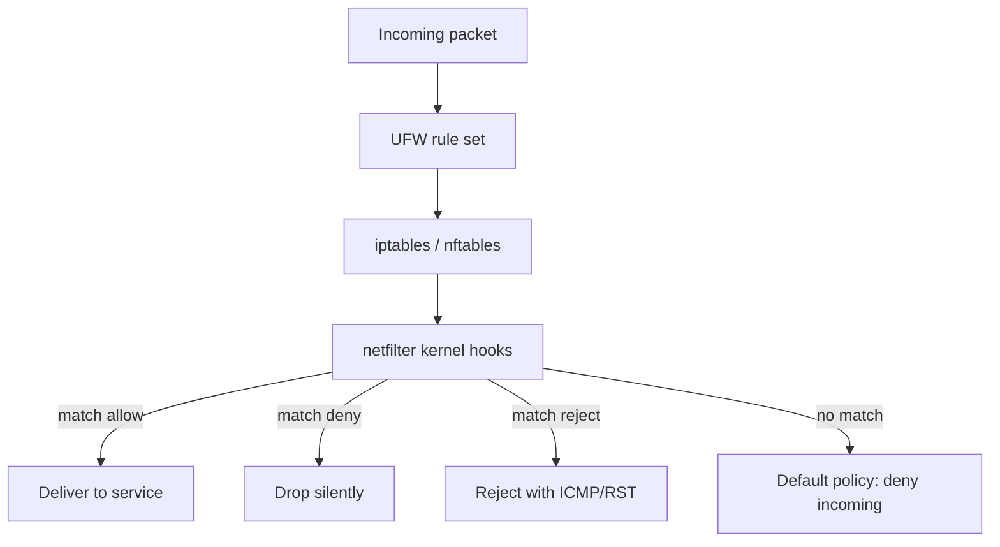

# Uncomplicated Firewall (UFW)

## Overview

Uncomplicated Firewall (UFW) is a user-friendly command-line front end for managing firewall rules on Linux. It sits on top of the kernel's `netfilter` subsystem and translates the complexity of raw `iptables`/`nftables` commands into simple, readable syntax. UFW makes host-based firewalling approachable for newcomers while still offering enough flexibility for experienced administrators, and it is the default firewall management tool on many Debian-based distributions such as Ubuntu.

## Concepts

### Key features

- Simplified rule definition for allowing or denying traffic based on ports, protocols, IP addresses, or application profiles.
- Default secure policies that deny all incoming connections and allow all outgoing connections, providing a secure baseline.
- Support for both IPv4 and IPv6 traffic management.
- Preconfigured application profiles for common services to ease firewall rule creation.
- Easy rule management: enabling/disabling the firewall, viewing rules, deleting specific rules, and resetting all rules.
- Integration with `systemd` for automatic startup and status monitoring.
- Logging capabilities to track firewall activity.
- Well-suited for host-based firewalls on servers and workstations.

### Rule actions

| Action | Behaviour | Sender feedback |
| :-- | :-- | :-- |
| `allow` | Permit matching traffic | Connection succeeds |
| `deny` | Silently drop matching traffic | No response (appears filtered) |
| `reject` | Refuse matching traffic | ICMP/RST returned (appears closed) |
| `limit` | Allow, but rate-limit repeated attempts | Throttles brute-force sources |

> [!TIP]
> Use `deny` (drop) to make a port look invisible to scanners, and `reject` when a client should get an immediate, honest "connection refused" instead of hanging.

### Architecture



## Installing UFW

Update package lists:

```bash
apt update
```

Install UFW:

```bash
apt install ufw
```

Install ncat (useful for testing that rules behave as expected):

```bash
apt install ncat
```

Check the UFW version:

```bash
ufw version
```

## Checking and Enabling UFW

Check UFW status:

```bash
ufw status
```

Enable UFW:

```bash
ufw enable
```

Show added rules:

```bash
ufw show added
```

> [!WARNING]
> Enabling UFW on a remote server before allowing SSH can lock you out. Run `ufw allow ssh` (or the port your SSH daemon listens on) **before** `ufw enable`.

> [!NOTE]
> **📸 Screenshot**
> _Capture: Output of ufw status verbose showing default policies deny incoming / allow outgoing and a numbered list of active allow rules for SSH, HTTPS, and custom ports_

## Allowing Common Services

UFW ships application profiles that map well-known service names to their standard ports.

| Command | Service | Port |
| :-- | :-- | :-- |
| `ufw allow ssh` | SSH | 22/tcp |
| `ufw allow https` | HTTPS | 443/tcp |
| `ufw allow telnet` | Telnet | 23/tcp |
| `ufw allow smtp` | SMTP | 25/tcp |
| `ufw allow pop3` | POP3 | 110/tcp |
| `ufw allow imap` | IMAP | 143/tcp |

Allow SSH (port 22):

```bash
ufw allow ssh
```

Allow HTTPS (port 443):

```bash
ufw allow https
```

Allow Telnet (port 23):

```bash
ufw allow telnet
```

Allow SMTP (port 25):

```bash
ufw allow smtp
```

Allow POP3 (port 110):

```bash
ufw allow pop3
```

Allow IMAP (port 143):

```bash
ufw allow imap
```

> [!WARNING]
> Telnet (23) and plain POP3/IMAP/SMTP transmit credentials in cleartext. Prefer their TLS equivalents (SSH, POP3S/995, IMAPS/993, SMTPS/465 or submission/587) and open the legacy ports only when a legacy system genuinely requires them.

## Allowing Specific Ports

Allow TCP port 8080:

```bash
ufw allow 8080/tcp
```

Allow TCP port 8088:

```bash
ufw allow 8088/tcp
```

Allow TCP port 2200:

```bash
ufw allow 2200/tcp
```

Allow UDP port 53 (DNS):

```bash
ufw allow 53/udp
```

Allow UDP port 25:

```bash
ufw allow 25/udp
```

## Managing UFW Service

Check the UFW service status:

```bash
systemctl status ufw.service
```

Enable the UFW service on boot:

```bash
systemctl enable ufw.service
```

Start the UFW service:

```bash
systemctl start ufw.service
```

Show numbered rules (the number is used when deleting a rule):

```bash
ufw status numbered
```

Delete a rule by number:

```bash
ufw delete 12
```

## Allow Rules for Ranges and IPs

Allow TCP ports 80 to 90:

```bash
ufw allow 80:90/tcp
```

Allow TCP port 22 from a specific IP:

```bash
ufw allow from 192.168.1.52 to any port 22 proto tcp
```

Allow TCP port 30 to a specific IP:

```bash
ufw allow to 192.168.1.37 port 30 proto tcp
```

Allow TCP port 31 from one IP to another:

```bash
ufw allow from 192.168.1.52 to 192.168.1.44 port 31 proto tcp
```

## Rejecting or Dropping Traffic

Reject TCP port 110:

```bash
ufw reject 110/tcp
```

Deny TCP port 111:

```bash
ufw deny 111/tcp
```

Deny TCP port 22 to a specific IP:

```bash
ufw deny to 192.168.1.34 port 22 proto tcp
```

Reject TCP port 22 to a specific IP:

```bash
ufw reject to 192.168.1.33 port 22 proto tcp
```

Deny TCP port 22 from a specific IP:

```bash
ufw deny from 192.168.1.6 to any port 22 proto tcp
```

Deny all traffic from a specific IP:

```bash
ufw deny from 192.168.1.52
```

Deny TCP port 22 from a specific IP:

```bash
ufw deny from 192.168.1.52 to any port 22 proto tcp
```

Deny TCP port 80 from a subnet:

```bash
ufw deny from 20.20.20.0/24 to any port 80 proto tcp
```

## Resetting UFW

Delete all rules and reset UFW to its installed defaults:

```bash
ufw reset
```

> [!WARNING]
> `ufw reset` disables the firewall and removes every rule. On a remote host this can drop your session — re-establish your SSH allow rule and re-enable UFW immediately afterwards.

## Best Practices

- **Deny by default.** Keep the default inbound policy at `deny` and open only the ports each host actually serves (principle of least privilege, aligned with CIS Benchmarks).
- **Protect SSH first.** Allow SSH before enabling UFW, and consider `ufw limit ssh` to rate-limit brute-force attempts.
- **Scope rules by source.** Where possible, restrict management ports (SSH, database, admin panels) to trusted source IPs or subnets rather than `any`.
- **Enable logging.** Turn on logging (`ufw logging on`) so denied connections are recorded for incident review.
- **Review regularly.** Audit `ufw status numbered` periodically and remove stale rules to minimise attack surface.

## Security Considerations

- UFW is a **host-based** firewall; it complements — but does not replace — perimeter/network firewalls and secure service configuration.
- Denying a port with UFW does not fix a vulnerable service behind it. Patch and harden services in addition to filtering.
- Overly broad `allow ... to any` rules undermine segmentation. Prefer narrow source/destination scoping.
- Because UFW writes `iptables`/`nftables` rules, verify the effective rule set after complex changes to ensure ordering does what you intend.

## Troubleshooting

| Symptom | Likely cause | Resolution |
| :-- | :-- | :-- |
| Locked out after `ufw enable` | SSH not allowed before enabling | Access via console; `ufw allow ssh` |
| Rule has no effect | Wrong protocol or an earlier rule matches first | Check ordering with `ufw status numbered` |
| Service still reachable after `deny` | A broader `allow` rule precedes it | Delete/reorder the conflicting rule |
| Cannot delete a rule | Referencing it by spec instead of number | Use `ufw status numbered`, then `ufw delete <n>` |
| No denied-traffic records | Logging disabled | `ufw logging on`; inspect `/var/log/ufw.log` |

## References

- `man ufw` — full command reference.
- Ubuntu Server Guide — UFW: <https://ubuntu.com/server/docs/firewalls>
- CIS Benchmarks — host firewall configuration guidance.

## Related

- [Firewall-Network-Security-Barrier](Firewall-Network-Security-Barrier.md) — firewall concepts overview.
- [IPTables-Configuration-and-Management](IPTables-Configuration-and-Management.md) — the underlying netfilter layer UFW drives.
- [Firewalld](Firewalld.md) — alternative firewall manager.
- [Linux Administration & Server Hardening](../Readme.md) — Linux administration & server hardening hub.
