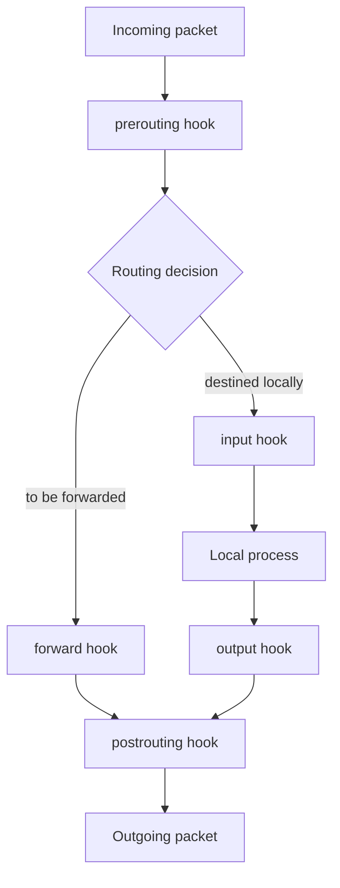

# nftables Configuration and Management

**nftables** is the Linux kernel's current packet-filtering and classification subsystem, built on the same **netfilter** hooks as the older `iptables`/`ip6tables`/`arptables`/`ebtables` tools but replacing them with a single unified utility, syntax, and kernel interface.

## Overview

Where iptables needed separate binaries per protocol family and a fixed set of built-in chains, nftables uses one command (`nft`), a scripting language, and **user-defined tables and chains** you build from scratch. Rules are compiled into an efficient in-kernel representation, and sets/maps let you match against large lists (IPs, ports) without one rule per entry.

| Concept | Description |
| :-- | :-- |
| **Table** | Top-level container for chains, scoped to an address **family**. Deleting a table removes everything inside it. |
| **Chain** | Ordered list of rules. **Base chains** attach to a netfilter hook (`type`/`hook`/`priority`/`policy`); **regular chains** are only reached via a `jump`/`goto` from another chain. |
| **Rule** | A match expression plus a statement/verdict (`accept`, `drop`, `reject`, `jump`, `counter`, `log`, ...), evaluated top-to-bottom. |
| **Set** | Named, typed collection (IPs, ports, ...) usable inline (`{ 22, 80, 443 }`) or as a persistent, updatable object (`nft add element`). |
| **Map** | Like a set but each element maps a key to a value — used for DNAT/port-forward tables and verdict dispatch. |

| Family | Scope |
| :-- | :-- |
| `ip` | IPv4 only |
| `ip6` | IPv6 only |
| `inet` | **IPv4 and IPv6 together** — the recommended default for host firewalls |
| `arp` | ARP traffic |
| `bridge` | Traffic crossing a Linux bridge (layer 2) |
| `netdev` | Ingress hook, tied to a specific interface (DDoS/XDP-adjacent filtering) |

> [!NOTE]
> **One ruleset, three front-ends**
> Since RHEL 8, **firewalld** renders its zones as nftables rules by default, and current **ufw** releases on Debian/Ubuntu can do the same. `nft list ruleset` shows the effective, merged rules regardless of which front-end wrote them — see [Firewalld](Firewalld.md) and [Uncomplicated-Firewall(ufw)](Uncomplicated-Firewall(ufw).md).

## Architecture

A packet crosses netfilter hooks in a fixed order; base chains attach to exactly one hook and fire when the packet passes it.



| Hook | Fires for | Typical named priority |
| :-- | :-- | :-- |
| `prerouting` | Every packet, before routing decision | `raw` (-300), `mangle` (-150), `dstnat` (-100) |
| `input` | Packets destined for the local host | `filter` (0) |
| `forward` | Packets routed through the host | `filter` (0) |
| `output` | Packets generated locally | `filter` (0) |
| `postrouting` | Every packet, after routing, before leaving | `srcnat` (100) |
| `ingress` | Raw device ingress (netdev family, pre-conntrack) | `filter` (0), earliest possible point |

Lower priority numbers run **first**; chains at the same hook run in priority order.

## Configuration

### Step 1: Install and check the package

> Example (CentOS Stream 10):

```bash
dnf install -y nftables
```

> Example (Debian 12):

```bash
apt install -y nftables
```

Both ship the `nft` binary and a `nftables.service` unit; verify with:

```bash
nft --version
```

### Step 2: Create a table

Tables are created empty; `inet` covers both IPv4 and IPv6 with one ruleset.

> Example:

```bash
nft add table inet filter
```

### Step 3: Create a base chain

A base chain must declare `type`, `hook`, and `priority`; `policy` sets the default verdict when no rule matches. Statements inside `{ }` are separated with `;` — escape it as `\;` when typing directly on the shell.

> Example:

```bash
nft add chain inet filter input { type filter hook input priority 0 \; policy drop \; }
```

```bash
nft add chain inet filter forward { type filter hook forward priority 0 \; policy drop \; }
```

```bash
nft add chain inet filter output { type filter hook output priority 0 \; policy accept \; }
```

> [!IMPORTANT]
> `policy drop` on an empty `input` chain drops **everything**, including your own SSH session, the instant the chain is created. Add the loopback and established/related rules in the same session — or work from an nft script (`nft -f`) applied atomically — before you disconnect.

### Step 4: Add rules

> Example — allow loopback and already-established traffic:

```bash
nft add rule inet filter input iif lo accept
```

```bash
nft add rule inet filter input ct state established,related accept
```

> Example — allow SSH/HTTP/HTTPS via an inline set:

```bash
nft add rule inet filter input tcp dport { 22, 80, 443 } accept
```

> Example — allow ICMP echo (ping) and drop invalid connection states:

```bash
nft add rule inet filter input icmp type echo-request accept
```

```bash
nft add rule inet filter input ct state invalid drop
```

### Step 5: List and verify

```bash
nft list ruleset
```

```bash
nft list table inet filter
```

```bash
nft -a list chain inet filter input
```

`-a` shows internal rule **handles** — needed to delete or replace a specific rule without flushing the whole chain:

```bash
nft delete rule inet filter input handle 7
```

### Step 6: Persist configuration

nftables does not auto-save runtime state; rules live only in the kernel until you write them to a ruleset file the service loads at boot.

Dump the running config into the file the service reads:

```bash
nft list ruleset > /etc/nftables.conf
```

> Example (Debian 12) — the packaged `/etc/nftables.conf` is the file `nftables.service` loads directly via `nft -f`:

```bash
cat /etc/nftables.conf
```

> Example (CentOS Stream 10) — the service loads `/etc/sysconfig/nftables.conf`, which by convention `include`s per-purpose files under `/etc/nftables/`:

```conf
# /etc/sysconfig/nftables.conf
include "/etc/nftables/main.nft"
```

Enable and start the service on either distro:

```bash
systemctl enable --now nftables
```

```bash
systemctl reload nftables
```

### Step 7: Atomic reloads with `nft -f`

Loading a full ruleset file replaces the previous one **atomically** — either the whole file applies or none of it does, avoiding the "half-applied policy" window that plagued iptables restore scripts.

> Example:

```bash
nft -f /etc/nftables.conf
```

```bash
nft -c -f /etc/nftables.conf
```

`-c` (check) validates syntax without loading it — always run it before pushing a config to a remote box.

## Examples

### A minimal, persistent host firewall

```conf
#!/usr/sbin/nft -f

flush ruleset

table inet filter {
    set allowed_tcp_ports {
        type inet_service
        elements = { 22, 80, 443 }
    }

    chain input {
        type filter hook input priority 0; policy drop;
        iif lo accept
        ct state established,related accept
        ct state invalid drop
        icmp type echo-request accept
        icmpv6 type echo-request accept
        tcp dport @allowed_tcp_ports accept
    }

    chain forward {
        type filter hook forward priority 0; policy drop;
    }

    chain output {
        type filter hook output priority 0; policy accept;
    }
}
```

```bash
nft -c -f /etc/nftables.conf
```

```bash
nft -f /etc/nftables.conf
```

### Dynamic sets (simple blocklist with timeout)

```bash
nft add set inet filter blocklist { type ipv4_addr\; flags timeout\; }
```

```bash
nft add element inet filter blocklist { 203.0.113.7 timeout 1h }
```

```bash
nft insert rule inet filter input ip saddr @blocklist drop
```

### Migrating from iptables with `iptables-translate`

`iptables-translate` mirrors `iptables` syntax but prints the equivalent `nft` command instead of applying it — a fast way to port existing rulesets.

```bash
iptables-translate -A INPUT -p tcp --dport 22 -j ACCEPT
```

Output (translated command, not executed):

```text
nft add rule ip filter INPUT tcp dport 22 counter accept
```

### Coexistence: `iptables-nft`

On modern Debian and RHEL-family systems, the `iptables` command itself is normally the `iptables-nft` compatibility binary — it accepts classic iptables syntax but programs the **same nftables kernel tables**, so `nft list ruleset` shows rules written with either tool.

```bash
iptables --version
```

```text
iptables v1.8.10 (nf_tables)
```

If that output instead says `(legacy)`, the host is running the old `iptables-legacy` backend and will **not** share state with `nft` — switch with the distro's alternatives system:

```bash
update-alternatives --config iptables
```

## nftables vs iptables

| Aspect | iptables (legacy) | nftables |
| :-- | :-- | :-- |
| Binaries | Separate per family (`iptables`, `ip6tables`, `arptables`, `ebtables`) | Single `nft` for all families |
| Chains | Fixed built-in chains (`INPUT`, `FORWARD`, `OUTPUT`, ...) | User-defined tables/chains, hooked explicitly |
| Rule updates | Sequential syscalls; `iptables-restore` non-atomic across versions | Native atomic transactions (`nft -f`) |
| Large lists | One rule per IP/port, or separate `ipset` tool | Built-in sets/maps, kernel-efficient |
| Ruleset dump/restore | `iptables-save` / `iptables-restore` | `nft list ruleset` / `nft -f` |
| Kernel status | Frozen; maintained for compatibility via `iptables-nft` | Actively developed, default on current RHEL/Debian/Ubuntu |

## Best Practices

- Prefer the **`inet`** family for host firewalls so one ruleset covers IPv4 and IPv6 — avoids the classic "forgot the v6 rule" gap.
- Build and validate rulesets as **files** (`nft -c -f`) rather than one-off `nft add` commands in production; treat `/etc/nftables.conf` as the source of truth.
- Use `flush ruleset` at the top of your script so re-applying it is idempotent instead of stacking duplicate rules.
- Prefer **sets** (`{ 22, 80, 443 }`, named sets) over many near-identical rules — fewer rules, faster kernel matching.
- Always run `nft -c -f <file>` before `nft -f <file>` on a remote host, and test disruptive `policy drop` changes with an out-of-band console or a rollback timer.
- Use `nft -a list ruleset` to get rule **handles** for precise deletes/inserts instead of flushing and rebuilding a whole chain.

## Security Considerations

> [!WARNING]
> **Default policy and lockout risk**
> Applying `policy drop` on `input` before adding a `ct state established,related accept` rule (or an SSH-allow rule) will sever your own remote session immediately. Always apply firewall changes from a script or an atomic `nft -f` load that includes the allow rules, never rule-by-rule over an SSH connection you can't recover.

- Verify which backend `iptables` is actually programming (`iptables --version` → `nf_tables` vs `legacy`); mixed backends on one host can produce silently inconsistent policy.
- Treat `/etc/nftables.conf` (and any included files under `/etc/nftables/`) as security-critical — restrict write access to root and version-control changes.
- Rate-limit and log dropped traffic on internet-facing chains with `log prefix "nft-drop: "` before the `drop` statement, so denies are visible for detection and incident response.
- Dynamic sets with `flags timeout` are convenient for automated blocklists (e.g., from fail2ban-style tooling) but should be reviewed periodically — stale or attacker-influenced entries can create denial-of-service or bypass conditions.

## Troubleshooting

| Symptom | Likely cause | Resolution |
| :-- | :-- | :-- |
| Locked out immediately after enabling `policy drop` | No allow rule for the active session/loopback before drop took effect | Reconnect via console; load a script with `iif lo accept` and `ct state established,related accept` first |
| `nft: Error: Could not process rule: No such file or directory` | Table or chain referenced doesn't exist yet | Create the table/chain first, or check spelling of family/table/chain names |
| Rules applied but service doesn't survive reboot | Ruleset never written to the file the unit loads, or service not enabled | `nft list ruleset > /etc/nftables.conf`; `systemctl enable --now nftables` |
| `iptables` rules don't show in `nft list ruleset` | Host is on `iptables-legacy`, a separate kernel path from nftables | Check `iptables --version`; switch with `update-alternatives --config iptables` |
| Ruleset reload fails midway with a partial policy applied | Manually re-running `nft add`/`delete` piecemeal instead of atomic load | Always apply via `nft -f <file>` (validated first with `nft -c -f`) |
| Set element expected but rule doesn't match | Element expired (`timeout`) or wrong set type | `nft list set inet filter <name>`; confirm type matches the field being matched (`ipv4_addr`, `inet_service`, ...) |

## References

- [nftables wiki (nftables.org)](https://wiki.nftables.org/wiki-nftables/index.php/Main_Page)
- [Netfilter project](https://www.netfilter.org/)
- `man nft` — command syntax and expression reference
- `man nftables` — ruleset file format and libnftables overview
- [Debian nftables wiki page](https://wiki.debian.org/nftables)
- [Red Hat: Getting started with nftables](https://access.redhat.com/documentation/en-us/red_hat_enterprise_linux/9/html/configuring_firewalls_and_packet_filters/getting-started-with-nftables_firewall-packet-filters)

## Related

- [IPTables-Configuration-and-Management](IPTables-Configuration-and-Management.md) — the legacy tool nftables replaces, and the `iptables-nft` compatibility layer
- [Firewalld](Firewalld.md) — front-end that now renders its zones as nftables rules on RHEL-family hosts
- [Uncomplicated-Firewall(ufw)](Uncomplicated-Firewall(ufw).md) — Debian/Ubuntu front-end increasingly backed by nftables
- [Firewall-Network-Security-Barrier](Firewall-Network-Security-Barrier.md) — general firewall concepts this note builds on
- [Security, Firewall & Monitoring](Readme.md) — module index
- [Linux Administration & Server Hardening](../Readme.md) — course hub
