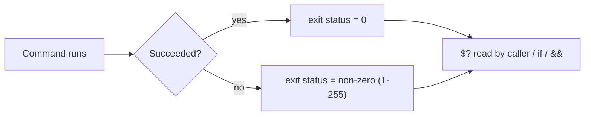

# Exit status

## Overview

Every command a shell runs finishes by returning a small integer to its parent called the **exit status** (or return code). This value is how one command tells the next whether it succeeded, and it is the mechanism behind [if statements](IF-Statement.md), `&&`/`||` chaining, and [comparison tests](Comparison-Operators.md). In automation and hardening scripts, checking exit status is what separates "it ran" from "it worked".

The convention is fixed and universal on Linux:

- **`0` = success.**
- **Any non-zero value (1–255) = failure**, where the specific number often encodes *why* it failed.

## Concepts

### Reading the previous exit status

The special variable `$?` holds the exit status of the **most recently completed** command. Read it immediately — any command in between (even `echo`) overwrites it.

```bash
# command

# echo $?
```

> [!IMPORTANT]
> `$?` reflects the *previous* command only. If you need to inspect it more than once, capture it first: `rc=$?` — then test `$rc` as many times as you like.

### Semantics

> [!NOTE]
> - `$?` gives the return value of the previous command. This return value is called the **exit status**.
> - If the command exits successfully, the exit status will be `0`, otherwise some non-zero value.
> - Exit a script explicitly using the `exit` command (`exit N` sets the script's own status to `N`).

### Setting a script's own exit status

A script returns the status of its last executed command unless you call `exit N` explicitly. Returning a meaningful code lets callers (cron, systemd, CI, a parent script) react correctly.



### Interactive exploration

Running these in order shows how `$?` tracks each command's result — including how a bad assignment produces a non-zero status.

```bash
$ echo $0

$ echo $?

$ echo Armour Infosec

$ echo $?

$ NAME=Armour Infosec

$ echo $?
```

> [!TIP]
> `NAME=Armour Infosec` fails because the shell treats `Infosec` as a command to run with `NAME` set in its environment — and there is no such command. Quoting fixes it: `NAME="Armour Infosec"`. The failing form leaves a non-zero `$?`.

## Examples

### Exiting a script early (`exit.sh`)

Because the script calls `exit 1` after the first `echo`, execution stops there — the lines after it never run.

```bash
#!/bin/bash
VAR=value
echo $VAR
exit 1
MY_MESSAGE="Hello World"
echo $MY_MESSAGE
exit 2
```

Check the returned status right after running it:

```bash
$ echo $?
```

## Best Practices

> [!TIP]
> - `set -e` makes a script abort on the first command that returns non-zero — good for fail-fast automation.
> - `set -o pipefail` makes a pipeline return the status of the first failing stage, not just the last command.
> - Capture status once (`rc=$?`) before reusing it.
> - Exit with distinct, documented codes so callers can distinguish failure modes.

### Common exit codes

| Code | Meaning |
|------|---------|
| `0` | Success |
| `1` | General/catch-all error |
| `2` | Misuse of shell builtin (e.g. bad option) |
| `126` | Command found but not executable (permission) |
| `127` | Command not found |
| `128+N` | Terminated by signal `N` (e.g. `130` = SIGINT/Ctrl-C) |
| `255` | Exit status out of range |

## Security Considerations

- **Never ignore exit status on security-relevant steps.** A `firewall-cmd`, `iptables`, `chmod`, or key-generation command that silently fails can leave a host in an insecure state while the script "succeeds". Test `$?` (or use `set -e`) after every such step.
- Reserve a clear failure code for validation/authorization checks so monitoring can alert on it distinctly from ordinary errors.
- Do not encode secrets in exit codes; they are visible to any parent process.

## Related

- [Shell-Scripting](Shell-Scripting.md) — parent guide for shell language constructs
- [Comparison-Operators](Comparison-Operators.md) — tests resolve to an exit status
- [IF-Statement](IF-Statement.md) — branches on the exit status of a command
- [Functions](Functions.md) — functions return an exit status via `return`
- [Linux Administration & Server Hardening](../Readme.md) — Linux administration & server hardening hub
