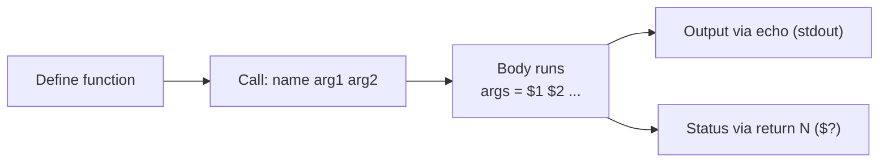

# Functions

## Overview

Functions in Bash scripting are a great option to reuse code. A Bash function can be defined as a set of commands which can be called several times within a Bash script. The purpose of a function in Bash is to help you make your scripts more readable and avoid writing the same code again and again. It also allows developers to break complicated and lengthy code into small parts which can be called whenever required. Functions can be called anytime and repeatedly, which enables us to reuse, optimize, and minimize the code.

A function must be **defined before it is called**, because Bash reads a script top to bottom. Once defined, a function behaves like a lightweight command: it takes its own positional [arguments](Arguments.md), runs its body, and returns an [exit status](Exit-status.md).



## Concepts

### Syntax

There are two equivalent ways to declare a function, plus a compact single-line form.

```bash
function_name () {
  commands
}
```

```bash
function function_name {
  commands
}
```

Single line version:

```bash
function_name () { commands; }
```

> [!NOTE]
> The trailing semicolon in the single-line form is required — `{ commands; }` — otherwise Bash reports a syntax error at the closing brace.

### Arguments and return values

| Mechanism | How it works |
|-----------|--------------|
| Passing input | Call as `name arg1 arg2`; read inside via `$1`, `$2`, `$@`, `$#` |
| `return N` | Sets the function's **exit status** (0–255), read afterward with `$?` — not for data |
| `echo` + capture | Print a result to stdout and capture it: `x="$(name)"` — this is how you return *data* |
| `local var` | Scopes a variable to the function so it does not leak into the global namespace |

> [!IMPORTANT]
> `return` only sets a numeric **status code**, not a value. To return a string or number as *data*, `echo` it and capture the output with command substitution (`$(...)`). Confusing the two is the most common function bug in Bash.

## Examples

### Simplest function (`hello_world.sh`)

```bash
#!/bin/bash

hello_world () {
   echo 'hello, world'
}

hello_world
```

### Returning a status code (`return_values.sh`)

`return 55` sets the exit status; `echo $?` reads it back after the call.

```bash
#!/bin/bash

my_function () {
  echo "some result"
  return 55
}

my_function
echo $?
```

### Returning data via stdout (`return_values2.sh`)

Here the result is captured as a string using command substitution, and `local` keeps `func_result` from leaking out of the function.

```bash
#!/bin/bash

my_function () {
  local func_result="some result"
  echo "$func_result"
}

func_result="$(my_function)"
echo $func_result
```

### Passing arguments (`passing_arguments.sh`)

```bash
#!/bin/bash

greeting () {
  echo "Hello $1"
}

greeting "Rahul"
```

### Locals, arguments, and scope (`addition.sh`)

Note how `FIRST` and `SECOND` are `local` inside `addition`, so the `let FIRST++` / `let SECOND++` increments never affect the outer variables of the same name — and `RESULT`, being global, is visible after the call.

```bash
#!/bin/bash

function addition {
  local FIRST=$1
  local SECOND=$2
  let RESULT=FIRST+SECOND
  echo "Result is: $RESULT"
  let FIRST++
  let SECOND++
}

#do the addition of two numbers
echo -n "Enter first number: "
read FIRST
echo -n "Enter second number: "
read SECOND
addition $FIRST $SECOND

echo "Printing variables:"
echo "FIRST: $FIRST"
echo "SECOND: $SECOND"
echo "RESULT: $RESULT"
```

## Best Practices

> [!TIP]
> - **Always declare working variables `local`.** Unscoped variables silently overwrite globals of the same name and cause action-at-a-distance bugs.
> - Define functions before their first call; group definitions near the top of the script.
> - Return *status* with `return` (0 = success) and return *data* with `echo` + `$(...)`.
> - Validate `$#` inside the function before using `$1`, `$2`, … so a misuse fails loudly.
> - Prefer descriptive `snake_case` names and keep each function to a single responsibility.

## Security Considerations

- Treat function arguments as untrusted, exactly like script [arguments](Arguments.md): quote every expansion (`"$1"`) and validate before use to avoid word-splitting and injection.
- Because unscoped variables are global, a function that forgets `local` can clobber a security-relevant variable (a path, a permission mask, a credential) set elsewhere. Scoping is a correctness *and* safety measure.
- Avoid `eval` inside functions on any argument-derived string; it re-introduces shell injection.

## Troubleshooting

| Symptom | Likely cause | Fix |
|---------|--------------|-----|
| `command not found` for the function | Called before it was defined | Move the definition above the call |
| Returned "value" is always 0–255 or wrong | Used `return` to pass data | `echo` the result and capture with `$(...)` |
| Outer variable changed unexpectedly | Function modified a non-`local` variable | Declare it `local` inside the function |
| `syntax error near unexpected token '}'` | Missing `;` in single-line form | Use `{ commands; }` |

## Related

- [Shell-Scripting](Shell-Scripting.md) — parent guide for shell language constructs
- [Arguments](Arguments.md) — functions consume positional arguments
- [Variables](Variables.md) — local vs global variable scope in functions
- [Exit-status](Exit-status.md) — functions signal success via return code
- [Linux Administration & Server Hardening](../Readme.md) — Linux administration & server hardening hub
