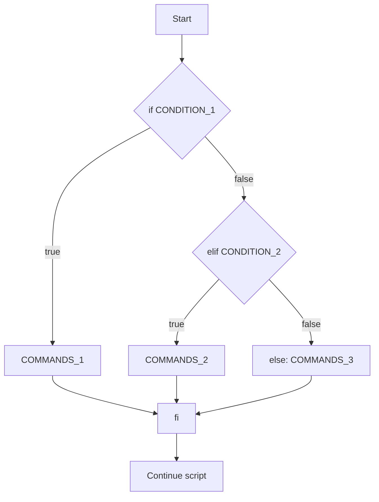

# IF Statement

## Overview

The `if` statement is the fundamental branching construct in shell scripting. It evaluates a command (or a test expression) and runs a block of code only when that command returns a **success exit status** (`0`). Every conditional in Bash ultimately hinges on exit codes, not on a boolean type — this is the single most important idea to internalise before writing hardening scripts, health checks, or automation guards.

> [!NOTE]
> In the shell, "true" means an exit status of `0` and "false" means any non-zero status. The `[` used in tests is actually the `test` command, so `if [ ... ]` is `if test ...`.

## Concepts

- **Condition = a command.** `if CONDITION` runs `CONDITION` and branches on its exit status.
- **`then` / `fi` delimiters.** The body starts after `then` and the whole block is closed by `fi` (`if` reversed).
- **`test` / `[ ]`.** The classic test builtin. Requires spaces around brackets and operands: `[ "$a" = "$b" ]`.
- **`[[ ]]`.** The Bash conditional expression — safer with unquoted variables, supports pattern matching (`==`) and regex (`=~`). Prefer it in Bash scripts.
- **Chaining.** `elif` adds additional mutually exclusive branches; `else` is the catch‑all fallthrough.
- **Negation.** `!` inverts the truth of a condition.

### Decision flow



## Syntax

### if statement

The minimal form runs the body only when the condition succeeds.

```bash
if CONDITION
then
  COMMANDS
fi
```

The condition and `then` can share a line by separating them with a semicolon:

```bash
if [ CONDITION ]; then
  COMMANDS
```

> [!WARNING]
> The second snippet is deliberately shown without its closing `fi` to mirror the study source. A real script **must** close every `if` with `fi`, or Bash will report `syntax error: unexpected end of file`.

### if … else statement

Add an `else` branch to handle the failure case.

```bash
if CONDITION
then
  COMMANDS_1
else
  COMMANDS_2
fi
```

### if … elif … else statement

Chain multiple conditions; the first branch whose condition succeeds wins, and the rest are skipped.

```bash
if CONDITION_1
then
  COMMANDS_1
elif CONDITION_2
then
  COMMANDS_2
else
  COMMANDS_3
fi
```

### Nested if statement

An `if` block may contain another `if` block, letting you test a second condition only after the first has passed.

```bash
if CONDITION_1
then
 if CONDITION_2
 then
   COMMANDS_1
 else
   COMMANDS_2
 fi
else
 COMMANDS_3
fi
```

### Negating a condition

Both forms below invert the test. `[ ! CONDITION ]` negates **inside** the test command; `! [ CONDITION ]` negates the **result** of the whole command.

```bash
if [ ! CONDITION ]; then
	COMMANDS
```

```bash
if ! [ CONDITION ]; then
	COMMANDS
```

## Examples

### Equality and inequality (`if.sh`)

Reads two values and reports whether they are equal, then separately whether they differ.

```bash
#!/bin/bash
echo "Enter the Two Value "
read a
read b

if [ $a == $b ]
then
	echo "a is equal to b"
fi

if [ $a != $b ]
then
	echo "a is not equal to b"
fi
```

### Two-way branch (`if_else.sh`)

A single `if … else` collapses the two tests above into one mutually exclusive decision.

```bash
#!/bin/bash
echo "Enter the Two Value "
read a
read b

if [ $a == $b ]
then
	echo "a is equal to b"
else
	echo "a is not equal to b"
fi
```

### Multi-way branch (`if_elif_else.sh`)

Numeric comparison operators (`-gt`, `-lt`) drive a three-way decision with a catch-all `else`.

```bash
#!/bin/bash
echo "Enter Two Value"
read a
read b

if [ $a == $b ]
	then
		echo "a is equal to b"
	elif [ $a -gt $b ]
		then
			echo "a is greater than b"
	elif [ $a -lt $b ]
		then
			echo "a is less than b"
		else
			echo "None of the condition met"
fi
```

> [!NOTE]
> **📸 Screenshot**
> _Capture: Terminal running if_elif_else.sh: user enters 5 and 3, script prints "a is greater than b"_

### Comparison operators reference

| Operator | Context | Meaning |
| --- | --- | --- |
| `-eq` | numeric | equal to |
| `-ne` | numeric | not equal to |
| `-gt` | numeric | greater than |
| `-lt` | numeric | less than |
| `-ge` | numeric | greater than or equal to |
| `-le` | numeric | less than or equal to |
| `=` / `==` | string | strings are equal |
| `!=` | string | strings are not equal |
| `-z` | string | string is empty (zero length) |
| `-n` | string | string is non-empty |
| `-f` | file | regular file exists |
| `-d` | file | directory exists |
| `-r` / `-w` / `-x` | file | readable / writable / executable |

## Best Practices

- **Always quote variables** in tests: `[ "$a" = "$b" ]`. An unquoted empty variable turns `[ $a = $b ]` into a syntax error and can be abused for injection.
- **Prefer `[[ ]]` in Bash.** It does not word-split or glob-expand its operands, eliminating a whole class of bugs.
- **Use `-eq`/`-lt` for numbers and `=`/`!=` for strings.** Mixing them silently produces wrong results.
- **Close every block.** Match each `if` with exactly one `fi`; run `bash -n script.sh` to syntax-check without executing.
- **Fail loudly.** Start hardening scripts with `set -euo pipefail` so an unhandled failing condition aborts rather than continuing in a broken state.

## Security Considerations

> [!WARNING]
> Never build a test from unsanitised input. `if [ $USER_INPUT = admin ]` with `USER_INPUT="x = x -o 1"` can be manipulated into an always-true condition. Quote every expansion and prefer `[[ ]]` so the shell does not re-parse attacker-controlled tokens.

- Treat any value that reaches a privileged branch (e.g. "grant access", "run as root") as untrusted; validate it against an explicit allowlist rather than a negative check.
- Log the branch taken in security-relevant scripts so decisions are auditable (CIS logging guidance).

## Troubleshooting

| Symptom | Likely cause | Fix |
| --- | --- | --- |
| `[: too many arguments` | Unquoted variable containing spaces | Quote it: `[ "$a" = "$b" ]` |
| `[: ==: unary operator expected` | Variable is empty/unset | Quote the operand or default it: `[ "${a:-}" = ... ]` |
| `syntax error: unexpected end of file` | Missing `fi` | Close each `if` with `fi`; check with `bash -n` |
| Wrong branch on numbers | Used `=`/`==` on integers | Use `-eq`, `-gt`, `-lt` for numeric comparison |

## References

- Bash Reference Manual — Conditional Constructs
- `man test` / `man bash` (`CONDITIONAL EXPRESSIONS`)
- ShellCheck (<https://www.shellcheck.net/>) — static analysis for shell scripts

## Related

- [Shell-Scripting](Shell-Scripting.md) — parent guide for shell language constructs
- [Comparison-Operators](Comparison-Operators.md) — operators used inside the test condition
- [Exit-status](Exit-status.md) — the condition evaluates an exit status
- [Variables](Variables.md) — conditions test variable values
- [Linux Administration & Server Hardening](../Readme.md) — Linux administration & server hardening hub
