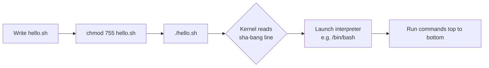

# Shell Scripting

## Overview

A shell script is nothing more than a sequence of system commands saved in a file, glued together with control flow — loops, conditionals, variables, arguments, and functions. Instead of typing the same commands repeatedly, you capture them once and run them on demand or on a schedule. Shell scripting is the backbone of Linux automation: provisioning, hardening, backups, log rotation, and health checks are almost always shell driven.

Reference: <https://www.shellscript.sh/>

> [!TIP]
> Scripting turns a one-off manual procedure into a repeatable, auditable, version-controlled artifact — the foundation of reproducible server hardening.

## Concepts

### What is a script?

Nothing more than a sequence of system commands pasted in a file with the bits of help of `for` loops, conditionals, variables, arguments, and more.

### The Sha-bang (Shebang)

The first line of a script may begin with `#!`, called the **sha-bang** (or shebang). It tells the kernel which interpreter should execute the file.

Reference: <https://en.wikipedia.org/wiki/Shebang_(Unix)>

| Symbol | Name |
| --- | --- |
| `#` | sharp (as in C#) |
| `!` | bang |
| `#!` | sha-bang |

The syntax is:

```text
#!interpreter [optional-arg]
```

Common interpreters you will place after the sha-bang:

| Sha-bang line | Interpreter / effect |
| --- | --- |
| `#!/bin/sh` | POSIX shell (portable, minimal features) |
| `#!/bin/bash` | Bash (arrays, `[[ ]]`, richer syntax) |
| `#!/usr/bin/pwsh` | PowerShell Core |
| `#!/usr/bin/env python3` | Python 3, resolved via `PATH` |
| `#!/bin/false` | Refuses to run — used to disable execution |

```bash
#!/bin/sh
#!/bin/bash
#!/usr/bin/pwsh
#!/usr/bin/env python3
#!/bin/false
```

> [!NOTE]
> `#!/usr/bin/env python3` uses `env` to locate the interpreter on `PATH`, making the script portable across systems where the binary lives in different directories. Hardcoding `#!/bin/bash` is fine when you control the target platform.

### Execution flow



## Configuration

### Making a script executable

A freshly written script is just a text file. Give it execute permission, then invoke it by path.

```bash
# chmod 755 hello.sh
```

```bash
# ./hello.sh
```

> [!NOTE]
> `755` grants the owner read/write/execute and everyone else read/execute. For scripts that need not be shared, `700` (owner-only) is the tighter, CIS-aligned choice.

## Examples

### hello.sh — comments and echo

Comments begin with `#` and run to the end of the line; they may appear after a command too.

```bash
#!/bin/sh
# This is a comment!
echo Hello World	# This is a comment, too!
```

### hello2.sh — quoting behaviour

Quoting controls word-splitting, whitespace preservation, globbing (`*`), and command substitution (`` ` ``). Compare each line to understand how the shell interprets it.

```bash
#!/bin/sh
# This is a comment!
echo "Hello      World"	      # This is a comment, too!
echo "Hello World"
echo "Hello * World"
echo Hello * World
echo Hello      World
echo "Hello" World
echo Hello "     " World
echo "Hello \"*\" World"
echo `hello` world
echo 'hello' world
```

> [!TIP]
> Key takeaways from the quoting examples:
> - **Double quotes** preserve internal whitespace and suppress globbing but still allow `$variable` and `` `command` `` expansion.
> - **Single quotes** are fully literal — no expansion of any kind.
> - **Unquoted `*`** is expanded by the shell into matching filenames before `echo` ever sees it.

## Best Practices

- Start every Bash script with `#!/bin/bash` (or `#!/usr/bin/env bash`) and `set -euo pipefail` for safe failure semantics.
- Quote all variable expansions (`"$var"`) to prevent word-splitting and glob surprises.
- Keep scripts idempotent where possible so re-running them is safe.
- Validate with `bash -n script.sh` (syntax) and `shellcheck script.sh` (linting) before deployment.
- Store scripts in version control; the auto-committed vault is itself an example of this discipline.

## Security Considerations

> [!WARNING]
> Scripts frequently run with elevated privileges (cron as root, systemd units, CI runners). A single unquoted variable or unsanitised input can escalate into command injection. Treat every external input — arguments, environment variables, file contents, network data — as hostile.

- Set restrictive permissions on scripts that contain secrets or run privileged actions (`chmod 700`, owned by root).
- Never embed plaintext credentials; source them from a protected file or a secrets manager.
- Prefer absolute paths for critical binaries in privileged scripts to defeat `PATH` hijacking.
- Use `#!/bin/false` (or remove the execute bit) to positively disable scripts that should not run.

## Troubleshooting

| Symptom | Likely cause | Fix |
| --- | --- | --- |
| `Permission denied` | Missing execute bit | `chmod +x script.sh` |
| `bad interpreter: No such file or directory` | Wrong sha-bang path or Windows CRLF line endings | Fix the path; run `dos2unix script.sh` |
| `command not found` when run as `script.sh` | Not on `PATH` | Invoke as `./script.sh` or add its directory to `PATH` |
| Globbing prints filenames instead of `*` | Unquoted `*` | Quote it: `echo "Hello * World"` |

## References

- <https://www.shellscript.sh/> — Steve Parker's Shell Scripting Tutorial
- <https://en.wikipedia.org/wiki/Shebang_(Unix)> — Sha-bang overview
- GNU Bash Reference Manual — <https://www.gnu.org/software/bash/manual/>
- ShellCheck — <https://www.shellcheck.net/>

## Related

- [Variables](Variables.md) — storing and referencing data in scripts
- [Functions](Functions.md) — structuring reusable script logic
- [IF-Statement](IF-Statement.md) — conditional control flow
- [Arguments](Arguments.md) — passing positional parameters to scripts
- [getopts](getopts.md) — parsing command-line options
- [Linux Administration & Server Hardening](../Readme.md) — Linux administration & server hardening hub
- Remote-Code-Execution-to-Reverse-shell — bash one-liners and reverse shells in practice
