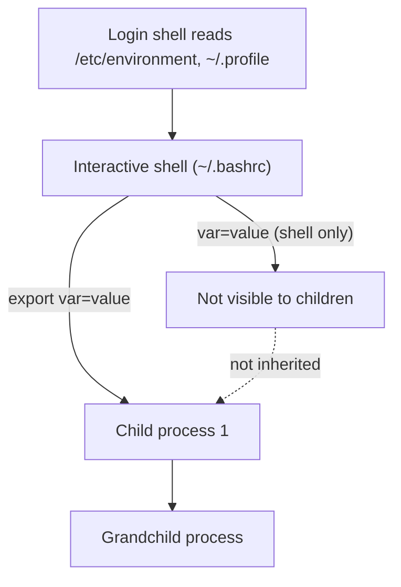

# Linux Environment Variables

## Overview

Environment variables are dynamic named values that influence the behavior of processes on a Linux system. The shell and the applications it launches read them to discover configuration such as the current user, the executable search path, locale settings, the home directory, and terminal capabilities. Because child processes inherit exported variables from their parent, environment variables are the primary mechanism for passing configuration down a process tree without hard-coding it.

This note covers how to view, create, export, persist, and remove variables, and the crucial distinction between a **shell variable** (local to one shell) and an **environment variable** (inherited by children).

## Concepts

Two kinds of variable share the same syntax but have very different scope:

| Type | Scope | Created with | Inherited by children? |
|---|---|---|---|
| Shell variable | Current shell only | `var=value` | No |
| Environment variable | Current shell + descendants | `export var=value` | Yes |
| Persistent variable | Every future session | Written to a config file | Yes (after next login/source) |



> [!NOTE]
> Variable **names** are case-sensitive. By convention, environment variables are UPPERCASE (`PATH`, `HOME`) and local script variables are lowercase, though this is a style choice, not a rule.

## Commands — Viewing Environment Variables

- Display the current executable search path:

```bash
echo $PATH
```

- Show the current logged-in user:

```bash
echo $USER
```

- Print the current working directory:

```bash
echo $PWD
```

- Display the user's home directory:

```bash
echo $HOME
```

- Display the shell currently in use:

```bash
echo $SHELL
```

- Display the terminal type:

```bash
echo $TERM
```

## Configuration — Creating and Using Custom Variables

- Assign a value to a shell variable:

```bash
var1="My Demo var"
```

- Display the variable value:

```bash
echo $var1
```

- Alternative syntax (brace-delimited, safer when concatenating):

```bash
echo "${var1}"
```

> [!NOTE]
> A shell variable exists only in the current shell session and is not automatically inherited by child processes. Assign with **no spaces** around `=` — `var1 = "x"` is parsed as a command named `var1`.

## Configuration — Exporting Variables for Subshells

- Export a variable so child processes can access it:

```bash
export target=192.168.1.1
```

- Verify the variable:

```bash
echo $target
```

- Use the exported variable:

```bash
ping -c 4 $target
```

- View exported variables only:

```bash
export
```

## Commands — Listing Environment Variables

- List all environment variables:

```bash
env
```

- Alternative method:

```bash
printenv
```

- Display a specific environment variable:

```bash
printenv PATH
```

## Concepts — Common Environment Variables

|Variable|Description|
|---|---|
|`PATH`|Search path used to locate executable commands|
|`HOME`|Home directory of the current user|
|`USER`|Current logged-in username|
|`LOGNAME`|Login name of the current user|
|`PWD`|Present working directory|
|`OLDPWD`|Previous working directory|
|`SHELL`|Current shell being used|
|`LANG`|Language and locale settings|
|`TERM`|Terminal type and capabilities|
|`MAIL`|User mailbox location|
|`HOSTNAME`|System hostname|
|`SSH_CLIENT`|SSH client IP address and port information|
|`SSH_TTY`|Terminal device associated with the SSH session|
|`LS_COLORS`|Color definitions used by `ls`|
|`XDG_*`|Desktop and session-related variables|
|`DEBUGINFOD_URLS`|Debug symbol server URLs|
|`target`|User-defined exported variable|

## Commands — Viewing Shell vs. Environment Variables

- Show all shell variables and functions:

```bash
set
```

- Show exported environment variables only:

```bash
env
```

### Difference

|Command|Shows|
|---|---|
|`set`|Shell variables, environment variables, and functions|
|`env`|Environment variables only|
|`export`|Exported variables and functions|

## Commands — Unsetting Variables

- Remove a shell or environment variable:

```bash
unset target
```

- Verify removal (prints an empty line):

```bash
echo $target
```

## Configuration — Making Environment Variables Persistent

### Per-User Variables

Add the variable to the user's shell startup file so it is set for every new session.

**Bash:**

```bash
vim ~/.bashrc
```

- Add:

```bash
export MY_VAR="persistent value"
```

- Reload the configuration:

```bash
source ~/.bashrc
```

- Verify:

```bash
echo $MY_VAR
```

### Login Shells

You can also place variables in a login profile:

```bash
~/.bash_profile
```

- or

```bash
~/.profile
```

> [!TIP]
> Use a login profile (`~/.profile`, `~/.bash_profile`) for variables that must be present in graphical sessions and SSH logins, and `~/.bashrc` for variables you only need in interactive terminals. Placing an `export` in both is a common, safe pattern.

### System-Wide Variables

- Edit:

```bash
vim /etc/environment
```

- Add:

```bash
MY_VAR="persistent value"
```

> [!WARNING]
> Do not use the `export` keyword inside `/etc/environment`. That file is read by PAM (`pam_env`), not by a shell, so it accepts only plain `KEY=value` lines — an `export` prefix will be treated as part of the value or ignored.

- After logging in again:

```bash
echo $MY_VAR
```

### Temporarily Setting a Variable for a Single Command

- Run a command with a temporary environment variable:

```bash
MY_VAR=test env
```

- Or:

```bash
MY_VAR=test bash
```

The variable exists only for that command and its child processes; the calling shell is unaffected.

## Configuration — Appending a Directory to PATH

- Temporarily (current session only):

```bash
export PATH=$PATH:/opt/tools
```

- Verify:

```bash
echo $PATH
```

- Persistently:

```bash
echo 'export PATH=$PATH:/opt/tools' >> ~/.bashrc
source ~/.bashrc
```

## Commands — Useful Commands Summary

```bash
echo $VAR          # Display variable value
env                # Show environment variables
printenv           # Show environment variables
printenv PATH      # Show specific variable
export VAR=value   # Export variable
unset VAR          # Remove variable
set                # Show shell variables and functions
source ~/.bashrc   # Reload shell configuration
```

## Best Practices

- **Quote values that contain spaces or shell metacharacters:** `export MSG="hello world"`.
- **Prefer `${VAR}` over `$VAR`** when a variable is adjacent to other text, e.g. `${VAR}_backup`.
- **Keep `PATH` minimal and predictable** — appending untrusted directories is a security risk (see below).
- **Persist system-wide config in `/etc/environment` or `/etc/profile.d/*.sh`,** not by editing every user's dotfiles.

## Security Considerations

- **Never put a writable or current-directory entry in `PATH`.** A `PATH` containing `.` or a world-writable directory lets an attacker drop a malicious binary that runs instead of the real command — a classic privilege-escalation vector. CIS Benchmarks explicitly flag `.` and empty (`::`) entries in `PATH`.
- **Environment variables are readable by the process owner and root.** Do not pass secrets as inline command-line variables on a shared host; they can appear in `/proc/<pid>/environ` and in shell history.
- **`LD_PRELOAD` / `LD_LIBRARY_PATH` are attack surface.** Inherited by SUID-unaware programs they can hijack library loading; `sudo` and SUID binaries deliberately scrub them. Be cautious exporting them globally.
- **Sanitize inherited environment for daemons.** Services started from a polluted shell environment can behave unpredictably; systemd units define their own clean environment for this reason.

## Troubleshooting

| Symptom | Likely cause | Fix |
|---|---|---|
| Variable set but empty in child process | Assigned without `export` | Re-assign with `export VAR=value` |
| `VAR = value: command not found` | Spaces around `=` | Remove spaces: `VAR=value` |
| Persistent var not applied | Config file not reloaded / wrong file | `source` the file or re-login; confirm login vs. non-login shell |
| `/etc/environment` change ignored | Used `export` keyword | Use plain `KEY=value` |
| `PATH` changes lost on new terminal | Set only in current session | Add the export to `~/.bashrc` or `~/.profile` |

## Concepts — Key Difference

- **Shell Variable** → available only in the current shell.
- **Environment Variable** → exported and inherited by child processes.
- **Persistent Variable** → stored in configuration files such as `~/.bashrc`, `~/.profile`, or `/etc/environment` and available across sessions.

## References

- `man 1 bash` (Parameters, Environment sections)
- `man 5 environment`, `man 8 pam_env`
- `man 1 export`, `man 1 env`, `man 1 printenv`

## Related

- [Shells-in-Linux](Shells-in-Linux.md) — shells expose and use environment variables.
- [Zsh-Shell](Zsh-Shell.md) — sets variables in its own rc files.
- [Fish-Shell](Fish-Shell.md) — uses `set`/`set -x` instead of `export`.
- [Enhance-Bash-with-grc](Enhance-Bash-with-grc.md) — uses `GRC_ALIASES` and other env-driven config.
- [Linux Administration & Server Hardening](../Readme.md) — Linux administration & server hardening hub.
