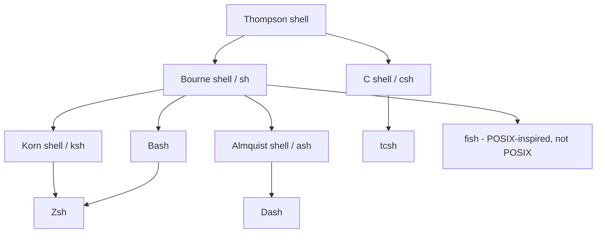

# Shells in Linux

## Overview

A **shell** is a command-line interpreter that provides an interface between the user and the Linux kernel. It reads commands, launches programs, manages processes, expands variables, and enables automation through scripts. Every interactive session, SSH login, and cron job runs inside some shell, which makes shell literacy foundational to Linux administration, software development, incident response, and day-to-day command-line work.

This note surveys the common shells shipped with Linux, shows how to inspect and change the active shell, and maps the configuration files each shell reads at startup.

> [!NOTE]
> The shell is a userspace program — it is *not* part of the kernel. You can install, switch between, and remove shells freely without touching the operating system core.

## Concepts

A shell performs several distinct roles in a single process:

- Executes commands entered interactively by the user.
- Launches external programs, built-ins, and scripts.
- Manages environment variables and passes them to child processes.
- Supports input/output redirection and pipelines (`>`, `<`, `|`).
- Provides command history, tab completion, and job control.
- Automates repetitive tasks through shell scripts.

### Login vs. Non-Login and Interactive vs. Non-Interactive

Which startup files a shell reads depends on *how* it was invoked:

| Invocation | Example | Typical startup files (Bash) |
|---|---|---|
| Login, interactive | Console/SSH login | `/etc/profile` → `~/.bash_profile` → `~/.profile` |
| Non-login, interactive | New terminal tab | `~/.bashrc` |
| Non-interactive | `bash script.sh` | `$BASH_ENV` (if set) |

> [!TIP]
> A common mistake is putting environment variables only in `~/.bashrc`; non-login shells read it, but many login flows do not. For variables that must exist everywhere, prefer `/etc/environment` or a login profile. See [Linux-Environment-Variables](Linux-Environment-Variables.md).

## Architecture

Most modern shells descend from either the **Bourne shell** (`sh`) or the **C shell** (`csh`) lineage. Understanding the family tree explains why Bash, Zsh, and Dash share syntax while `tcsh` differs.



## Commands — Common Shells in Linux

### sh — Bourne Shell

The Bourne Shell (`sh`) is one of the original Unix shells and the foundation for many modern shells. On most Linux distributions `/bin/sh` is a symlink to a lightweight POSIX shell (often Dash or Bash in POSIX mode).

- Start the Bourne Shell:

```bash
sh
```

- or

```bash
/usr/bin/sh
```

Features: portable across Unix-like systems, supports scripting and automation, minimal interactive features, POSIX-compliant.

### bash — Bourne Again Shell

Bash is the default shell on most Linux distributions and the most widely used shell today.

- Start Bash:

```bash
bash
```

- or

```bash
/bin/bash
```

> Verify Bash location:

```bash
which bash
```

Features: command history, tab completion, aliases, job control, and powerful scripting capabilities.

- Check Bash version:

```bash
bash --version
```

### ksh — Korn Shell

The Korn Shell combines features from the Bourne Shell and C Shell.

- Start Korn Shell:

```bash
ksh
```

Features: advanced scripting, arithmetic operations, improved performance, command history.

- Check version:

```bash
ksh --version
```

### tcsh — TENEX C Shell

An enhanced version of the C Shell (`csh`).

- Start tcsh:

```bash
tcsh
```

Features: command-line editing, command completion, spelling correction, history support.

### zsh — Z Shell

Zsh is a highly customizable shell with advanced interactive features. See the dedicated [Zsh-Shell](Zsh-Shell.md) note for installation and configuration.

- Start Zsh:

```bash
zsh
```

Features: plugin support, themes, shared history, advanced completion, spell checking, and compatibility with most Bash scripts.

- Check version:

```bash
zsh --version
```

### fish — Friendly Interactive Shell

Fish focuses on user-friendliness and ease of use. See the dedicated [Fish-Shell](Fish-Shell.md) note.

- Start Fish:

```bash
fish
```

Features: syntax highlighting, autosuggestions, web-based configuration, user-friendly scripting syntax.

> [!WARNING]
> Fish is **not** POSIX-compliant. Its scripting syntax differs from `sh`/Bash, so `#!/bin/sh` scripts and copy-pasted Bash one-liners may fail under Fish. Keep system scripts in a POSIX shell.

- Check version:

```bash
fish --version
```

### dash — Debian Almquist Shell

Dash is a lightweight POSIX-compliant shell commonly used for system scripts.

- Start Dash:

```bash
dash
```

Features: fast startup time, low memory usage, POSIX compliance, and commonly linked to `/bin/sh` on Debian-based systems.

## Commands — Viewing Shell Information

- Display current login shell:

```bash
echo $SHELL
```

> Example output:

```text
/bin/bash
```

- Display current running shell:

```bash
echo $0
```

> Example output:

```text
bash
```

- Display shell process information:

```bash
ps -p $$ -o pid,ppid,cmd
```

> Example:

```text
PID  PPID CMD
1234 1000 -bash
```

- Display shell process ID:

```bash
echo $$
```

- View available login shells:

```bash
cat /etc/shells
```

> Example:

```text
/bin/sh
/bin/bash
/bin/zsh
/usr/bin/fish
```

- Display the user's default login shell:

```bash
getent passwd $USER
```

> Example:

```text
user:x:1000:1000::/home/user:/bin/bash
```

## Commands — Environment Variables Related to Shells

- Display search path:

```bash
echo $PATH
```

- Display current user:

```bash
echo $USER
```

- Display home directory:

```bash
echo $HOME
```

- Display current working directory:

```bash
echo $PWD
```

## Configuration — Changing the Default Shell

- Locate the shell binary (example for Zsh):

```bash
which zsh
```

> Output:

```text
/usr/bin/zsh
```

- Change default shell:

```bash
chsh -s $(which zsh)
```

> Example:

```bash
chsh -s /usr/bin/zsh
```

- Verify the shell change:

```bash
getent passwd $USER
```

- or

```bash
grep "^$USER:" /etc/passwd
```

> Example:

```text
user:x:1000:1000::/home/user:/usr/bin/zsh
```

> [!IMPORTANT]
> `chsh` only accepts shells listed in `/etc/shells`. If the target shell is missing from that file, add its absolute path first or `chsh` will reject it.

### Start a New Shell Session Immediately

Instead of logging out or rebooting, replace the current shell process:

```bash
exec zsh
```

- or

```bash
exec bash
```

### Temporarily Switch Between Shells

- Start Bash:

```bash
bash
```

- Start Zsh:

```bash
zsh
```

- Start Fish:

```bash
fish
```

- Start Dash:

```bash
dash
```

- Return to the previous shell:

```bash
exit
```

## Configuration — Shell Configuration Files

> [!NOTE]
> **📸 Screenshot**
> _Capture: Terminal showing echo $SHELL output and cat /etc/shells listing the available login shells_

### Bash Configuration

- User-specific configuration:

```bash
~/.bashrc
```

- System-wide configuration:

```bash
/etc/bashrc
```

- or

```bash
/etc/profile
```

> Edit:

```bash
vim ~/.bashrc
```

- Reload:

```bash
source ~/.bashrc
```

### Zsh Configuration

- User-specific configuration:

```bash
~/.zshrc
```

> Edit:

```bash
vim ~/.zshrc
```

- Reload:

```bash
source ~/.zshrc
```

### Fish Configuration

- User-specific configuration:

```bash
~/.config/fish/config.fish
```

> Edit:

```bash
vim ~/.config/fish/config.fish
```

- Reload:

```bash
source ~/.config/fish/config.fish
```

## Commands — Useful Shell Commands

| Command | Description |
|----------|-------------|
| `echo $SHELL` | Display default login shell |
| `echo $0` | Display current running shell |
| `echo $$` | Display shell process ID |
| `cat /etc/shells` | Show available login shells |
| `which bash` | Locate Bash executable |
| `which zsh` | Locate Zsh executable |
| `which fish` | Locate Fish executable |
| `chsh -s SHELL_PATH` | Change default shell |
| `source ~/.bashrc` | Reload Bash configuration |
| `source ~/.zshrc` | Reload Zsh configuration |
| `exit` | Exit current shell |

## Best Practices

- **Use Bash or `sh` for portable scripts.** Interactive shells like Zsh and Fish are for humans; system scripts should target a POSIX shell so they run anywhere.
- **Keep interactive customizations out of scripts.** Aliases and prompt tweaks belong in `~/.bashrc`/`~/.zshrc`, not in automation.
- **Test a new default shell before committing.** Run it with `exec zsh` and confirm it works before `chsh`, so a broken rc file cannot lock you out of a clean login.
- **Document per-host shell choices.** On shared servers, an unexpected default shell can silently break other admins' scripts.

## Security Considerations

- **Restricted shells** (`rbash`, `rksh`) limit what a user can do — no `cd`, no changing `PATH`, no absolute-path commands. Useful for kiosk or jump-host accounts, but treat them as a speed bump, not a jail: escapes are common.
- **`nologin` / `false` as a shell** — service accounts should have `/usr/sbin/nologin` or `/bin/false` in `/etc/passwd` so they cannot obtain an interactive session. This aligns with CIS Benchmark guidance to disable login for non-user accounts.
- **Audit `/etc/shells` and `/etc/passwd`.** Unexpected entries (e.g., a shell added to enable a backdoor account) are a classic persistence technique. Review these files during hardening reviews.
- **History files leak secrets.** Commands with inline passwords or tokens land in `~/.bash_history` / `~/.zsh_history`. Prefer `HISTCONTROL=ignorespace` and avoid passing credentials on the command line.

## Troubleshooting

| Symptom | Likely cause | Fix |
|---|---|---|
| `chsh: shell not found in /etc/shells` | Shell path missing from `/etc/shells` | Append the absolute path, then re-run `chsh` |
| New shell not active after `chsh` | Change applies at next login | Log out/in, or run `exec <shell>` |
| Aliases/prompt missing in SSH but present locally | Config in `~/.bashrc` not read by login shell | Source `~/.bashrc` from `~/.bash_profile` |
| Script works in Bash, fails in Fish | Non-POSIX syntax under Fish | Add a correct shebang and run with the intended interpreter |

## References

- `man 1 bash`, `man 1 zsh`, `man 1 dash`
- `man 5 shells` — the `/etc/shells` file format
- CIS Distribution Independent Linux Benchmark — account and shell hardening

## Related

- [Zsh-Shell](Zsh-Shell.md) — install and configure the Z shell.
- [Fish-Shell](Fish-Shell.md) — install and configure the friendly interactive shell.
- [Enhance-Bash-with-grc](Enhance-Bash-with-grc.md) — colorize command output in Bash.
- [Linux-Environment-Variables](Linux-Environment-Variables.md) — how shells expose and use environment variables.
- [Standard-Data-Streams](../Linux-Basic-Commands/Standard-Data-Streams.md) — stdin/stdout/stderr and redirection.
- [Linux Administration & Server Hardening](../Readme.md) — Linux administration & server hardening hub.
