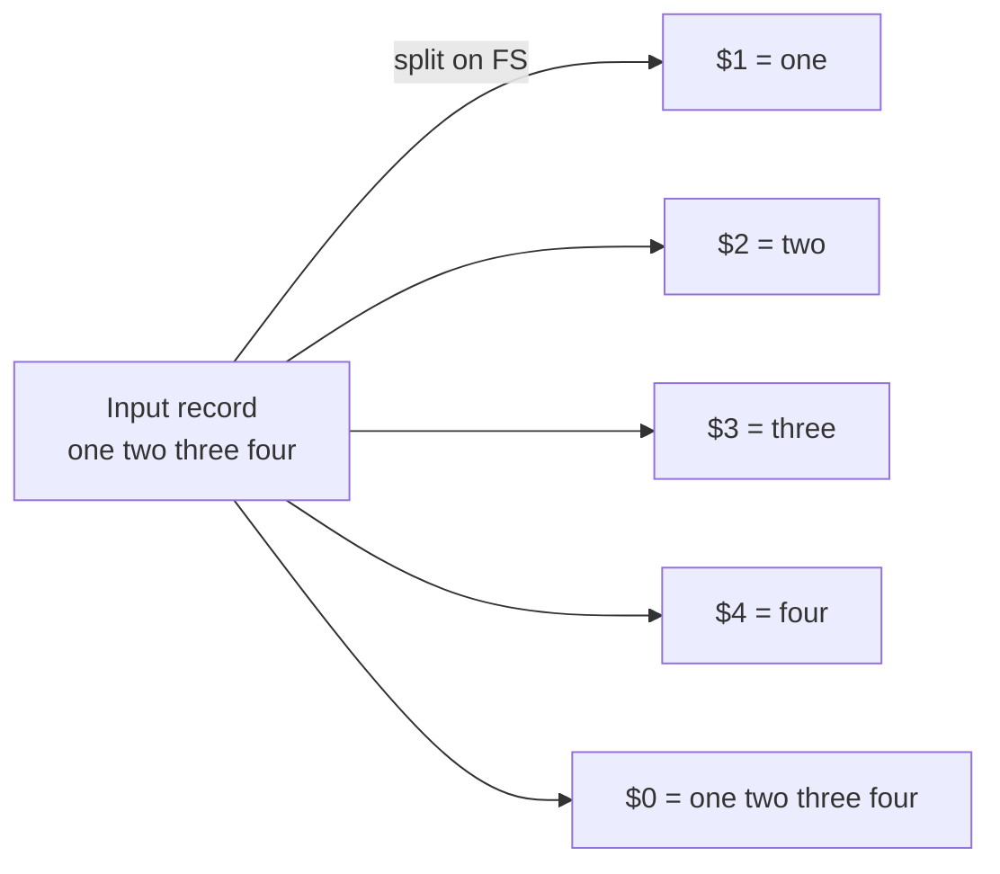

# $1 $2 Dollars everywhere

## Overview

In AWK, the dollar-sign variables (`$1`, `$2`, `$3`, …) are **field references**. When AWK reads a line (a *record*), it automatically splits that line into fields using the current field separator and exposes each piece through a numbered variable. This is the single most-used feature of AWK and the foundation of nearly every one-liner you will write for log parsing, `/etc/passwd` auditing, and interface enumeration.

> [!NOTE]
> `$0` is the whole record. `$1` … `$NF` are the individual fields. Assigning to a field (e.g. `$1="ARMOUR"`) rebuilds `$0` from the fields — a useful side effect covered below.

## Concepts

| Variable | Refers to | Notes |
|---|---|---|
| `$0` | The entire input line (record) | Rebuilt automatically when any field is modified |
| `$1` | First field | |
| `$2` | Second field | |
| `$3` | Third field | |
| `$NF` | Last field | `NF` = Number of Fields |
| `$(NF-1)` | Second-to-last field | Arithmetic is allowed inside `$( )` |

> Fields are separated by runs of spaces and/or tabs **by default**. Change this with `FS` or the `-F` option (see [Field-Separator](Field-Separator.md)).



## Commands

### Printing fields

- Prints the full line including all fields (`$0` is the entire line).

```bash
echo "one two three four" | awk '{print $0}'
```

- Prints the first field (`$1`).

```bash
echo "one two three four" | awk '{print $1}'
```

- Prints the second field (`$2`).

```bash
echo "one two three four" | awk '{print $2}'
```

- Prints the third field (`$3`).

```bash
echo "one two three four" | awk '{print $3}'
```

### Combining fields

The way you glue fields together controls the output spacing. Concatenation (fields side by side) produces no separator; a comma inserts the **output field separator** (`OFS`, a space by default); a quoted string inserts literal text.

- Prints first and second fields concatenated without space.

```bash
echo "one two three four" | awk '{print $1$2}'
```

- Prints first and second fields with the default space separator.

```bash
echo "one two three four" | awk '{print $1, $2}'
```

- Prints first and second fields with an explicit space.

```bash
echo "one two three four" | awk '{print $1 " " $2}'
```

- Prints fields with `/` as a custom delimiter.

```bash
echo "one two three four" | awk '{print $1 "/" $2}'
```

- Prints with a newline between fields.

```bash
echo "one two three four" | awk '{print $1,"\n",$2}'
```

- Prints with a tab separator.

```bash
echo "one two three four" | awk '{print $1,"\t",$2}'
```

- Prints fields with a dash between them.

```bash
echo "one two three four" | awk '{print $1 "-" $2}'
```

- Prints fields with an underscore between them.

```bash
echo "one two three four" | awk '{print $1 "_" $2}'
```

- Prints fields with custom text between them.

```bash
echo "one two three four" | awk '{print $1 " test " $2}'
```

### Field manipulation

- Replace the first field with a custom word.

```bash
echo "Armour Infosec" | awk '{$1="ARMOUR"; print $1,$2}'
```

- Replace the first field and print the entire modified line.

```bash
echo "Armour Infosec" | awk '{$1="ARMOUR"; print $0}'
```

> [!TIP]
> Assigning to any field forces AWK to rebuild `$0`, re-joining the fields with `OFS`. This is a handy trick for normalising whitespace in a line.

### Conditional filtering

A pattern placed before the `{ … }` action runs the action only for records that match. Combining a field test with `$0` output is a compact way to grep-and-print.

- Only show lines where the first field is `inet`.

```bash
ifconfig | awk '$1=="inet" {print $0}'
```

- Show only the second field for matching lines.

```bash
ifconfig | awk '$1=="inet" {print $2}'
```

## Examples

### AWK with `/etc/passwd`

`/etc/passwd` is colon-delimited, so `-F:` maps fields to columns: `$1`=username, `$3`=UID, `$6`=home directory, `$7`=login shell.

- Print username and home directory.

```bash
awk -F: '{print $1,$6}' /etc/passwd
```

- Print with a custom label.

```bash
awk -F: '{print $1, "home at", $6}' /etc/passwd
```

- Filter users where UID is greater than or equal to `1000`.

```bash
awk -F: '$3>=1000 {print $0}' /etc/passwd
```

- Print only usernames for those users.

```bash
awk -F: '$3>=1000 {print $1}' /etc/passwd
```

> [!NOTE]
> On most modern distributions, UIDs `>= 1000` are regular (human) accounts, while UIDs below `1000` are system/service accounts. Filtering on `$3` is a fast way to enumerate real users during a host review.

### Inline AWK script

```bash
awk 'BEGIN {print "Passwd File"} {print $1, "home at", $6} END {print "END Passwd File"}' /etc/passwd
```

- Using `:` as the field separator.

```bash
awk -F: 'BEGIN {print "Passwd File"} {print $1, "home at", $6} END {print "END Passwd File"}' /etc/passwd
```

### AWK script from a file

For anything longer than a one-liner, store the program in a file and run it with `-f`.

- Create an AWK script file.

```bash
vim test.txt
```

```awk
BEGIN {

	print "Passwd File"

}

{
	print $1, "home at", $6
}

END {

	print "END Passwd File"

}
```

- Run the script file.

```bash
awk -f test.txt -F: /etc/passwd
```

### Formatted output with headers

- Create another AWK script.

```bash
vim test2.txt
```

```awk
BEGIN {print "Passwd File"} {print $1, "home at", $6} END {print "END Passwd File"}
```

- Run the script.

```bash
awk -f test2.txt -F: /etc/passwd
```

### Formatted table output

Setting `FS` inside `BEGIN` keeps the delimiter with the program instead of passing `-F` on the command line — convenient for self-contained report scripts.

- Create a formatted AWK script.

```bash
vim test3.txt
```

```awk
BEGIN {

        print "User and their corresponding home"

        print "User Name \t \t Home Path"

        print "-------------\t \t--------------"

	FS=":"

}

{
        print $1 "\t \t \t" $6
}

END{

      print "END The FILE"

}
```

- Run the script.

```bash
awk -f test3.txt /etc/passwd
```

> [!NOTE]
> **📸 Screenshot**
> _Capture: Terminal showing awk -f test3.txt /etc/passwd rendering a two-column User Name / Home Path table with a dashed header rule_

## Best Practices

> [!TIP]
> - Use `$1, $2` (comma) for readable, space-separated output; use string concatenation (`$1 "-" $2`) only when you need an exact custom separator.
> - Prefer running `awk … file` over `cat file | awk …` — it avoids a needless `cat` process and lets AWK see the filename.
> - Reference the last field with `$NF` instead of hard-coding a number, so scripts survive variable-width input.
> - Store multi-line programs in a `.awk`/`.txt` file and invoke with `-f` for readability and reuse.

## Troubleshooting

| Symptom | Likely cause | Fix |
|---|---|---|
| All fields print as one blob | Wrong `FS` — input not split as expected | Set the correct separator with `-F` or `BEGIN{FS=…}` |
| `$6` is empty on `/etc/passwd` | Forgot `-F:` (default splits on spaces) | Add `-F:` |
| Output columns misaligned | Mixed tabs/spaces in the record | Normalise by assigning a field to rebuild `$0` with `OFS` |
| Numeric compare never matches | Field compared as a string | Force numeric context, e.g. `$3+0 >= 1000` |

## References

- GNU AWK User's Guide — Fields: <https://www.gnu.org/software/gawk/manual/html_node/Fields.html>
- POSIX `awk` specification: <https://pubs.opengroup.org/onlinepubs/9699919799/utilities/awk.html>

## Related
- [awk-Command](awk-Command.md) — awk language overview
- [Field-Separator](Field-Separator.md) — defines what $1, $2 split on
- [Number-of-Fields](Number-of-Fields.md) — NF and field counting
- [print-BEGIN{}-{}-END{}](print-BEGIN{}-{}-END{}.md) — printing fields with BEGIN/END blocks
- [String-Processing](String-Processing.md) — text-processing hub
- [Linux Administration & Server Hardening](../Readme.md) — Linux administration & server hardening hub
