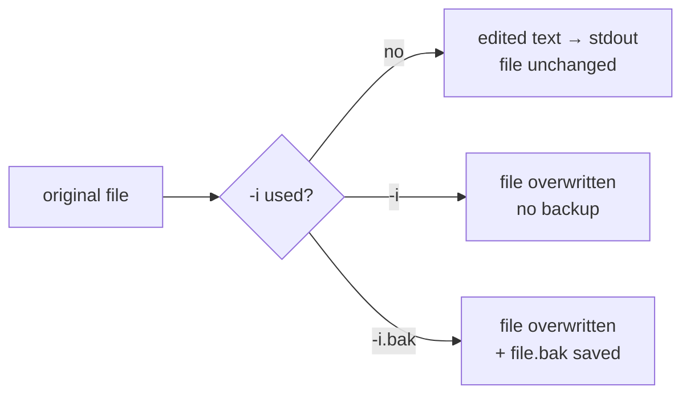

# `-i` Option — Edit Files In-Place

## Overview

By default `sed` is non-destructive: it reads a file, applies its commands, and writes the result to **standard output**, leaving the original untouched. The `-i` (in-place) option changes that behaviour — `sed` writes the edited stream **back into the original file**. This makes `-i` ideal for automation (config updates, log cleanup, bulk substitutions) and equally dangerous, because there is no undo.

General syntax:

```bash
sed -i 'command' file
```

> [!WARNING]
> `-i` permanently modifies the file. Always run the command **without** `-i` first to preview the output, and prefer the backup form `-i.bak` so a copy of the original survives.

## Concepts

| Form | Effect | Safety |
|---|---|---|
| `sed 'cmd' file` | Prints result to stdout; file unchanged | Safe — always test here first |
| `sed -i 'cmd' file` | Overwrites `file` in place | No backup — destructive |
| `sed -i.bak 'cmd' file` | Overwrites `file`, saves original as `file.bak` | Recommended — recoverable |
| `sed -i -e 'c1' -e 'c2' file` | Applies multiple commands in place | Combine with `-e` |



## Commands

### Create a backup before editing

- Edit the file in-place and keep a backup copy.

```bash
sed -i.bak '/armour/a Armour User' user-list.txt
```

> This creates:

```text
user-list.txt.bak
```

> [!TIP]
> The suffix after `-i` is arbitrary — `-i.bak`, `-i.orig`, or a timestamped `-i.$(date +%F)` all work. The original is saved with that suffix appended before the edit is applied.

### Insert lines in-place

- Insert dashes before lines matching `armour`.

```bash
sed -i '/armour/i ------------' user-list.txt
```

### Append lines in-place

- Append `Armour User` after matching `armour` entries in `passwd`.

```bash
sed -i '/armour/a Armour User' passwd
```

### Combine multiple commands with `-i`

- Append `AI` after matching `armour`.
- Insert `Infosec` before matching `armour`.
- Save all changes directly to `user-list.txt`.

```bash
sed -i -e '/armour/a AI' -e '/armour/i Infosec' user-list.txt
```

> [!IMPORTANT]
> The `passwd` example above targets a local working copy named `passwd`, **not** the system `/etc/passwd`. Never run an untested `sed -i` against `/etc/passwd`, `/etc/shadow`, or other critical system files — a bad expression can lock out logins. Edit a copy, verify, then move it into place.

## Best Practices

- Preview first: run the exact command without `-i`, confirm the output, then add `-i`.
- Prefer `-i.bak` (or another suffix) so every in-place edit leaves a recoverable original.
- For critical system files, edit a copy and swap it in, or use a purpose-built tool (`visudo`, `usermod`) instead of `sed -i`.
- In scripts, check the exit status after an in-place edit before proceeding.
- Keep the working directory under version control where possible, so edits are diffable and revertible.

## Security Considerations

> [!WARNING]
> In-place edits driven by untrusted input are a classic injection risk. If a filename or pattern comes from user input, quote it and validate it — a crafted value can make `sed` touch unintended files. Restrict who can run automation that edits privileged files, and log every change.

## Troubleshooting

| Symptom | Likely cause | Fix |
|---|---|---|
| No backup created | Used bare `-i` | Re-run with `-i.bak` next time; restore from VCS if possible |
| `sed: can't read file` | Wrong path or no write permission | Check path and file ownership/permissions |
| Change not persisted | Forgot `-i` (output went to stdout) | Add `-i` (with a backup suffix) |
| System login broken after edit | Edited `/etc/passwd` in place with a bad command | Restore from `.bak`/backup; edit copies in future |

## References

- GNU sed Manual — Invoking sed (`-i`): <https://www.gnu.org/software/sed/manual/sed.html#Command_002dLine-Options>

## Related
- [sed](sed.md) — parent sed command
- [s-(substitute-command)](s-(substitute-command).md) — substitutions written back with -i
- [c-(change-command)](c-(change-command).md) — line edits made permanent with -i
- [-e-option-Run-multiple-sed-commands](-e-option-Run-multiple-sed-commands.md) — chain several commands into one -i pass
- [String-Processing](String-Processing.md) — text-processing hub
- [Linux Administration & Server Hardening](../Readme.md) — Linux administration & server hardening hub
