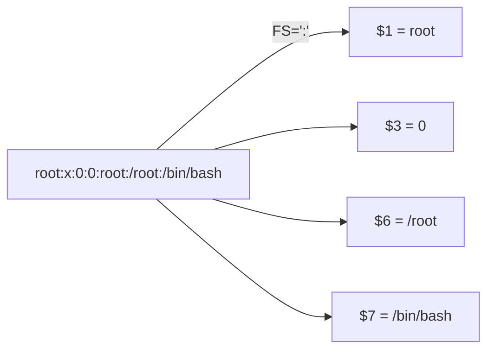

# Field Separator

## Overview

The `FS` (Field Separator) built-in variable tells `awk` **how to split each input line into fields**. Getting `FS` right is the difference between `$1` meaning "the username" and `$1` meaning "the whole line". By default AWK splits on runs of whitespace (spaces and tabs); real-world data — `/etc/passwd` (colon), CSV (comma), logs (custom delimiters) — needs an explicit separator.

You can set the separator two ways:

- `BEGIN {FS="separator"}` — inside the program, before any line is read.
- `-F "separator"` — a command-line shortcut for the same thing.

> [!NOTE]
> `$0` always holds the complete input line regardless of `FS`. Only the numbered fields (`$1`, `$2`, …) are affected by the separator.

## Concepts

| Item | Meaning |
|---|---|
| `FS` | Field separator variable; controls how lines are split |
| Default `FS` | Whitespace (spaces and/or tabs) |
| `-F "x"` | Command-line shortcut equivalent to `BEGIN{FS="x"}` |
| `$0` | The entire input line (never split away) |
| `$1`, `$2`, `$3` … | Individual fields produced by splitting on `FS` |
| `NF` | Number of fields on the current line (see [Number-of-Fields](Number-of-Fields.md)) |



## Commands

### Basic `FS` examples

- Sets `"two"` as the field separator.

```bash
echo "one two three four" | awk 'BEGIN{FS="two"} {print $1 " " $2}'
```

- Prints the **first field** using `"two"` as separator.

```bash
echo "one two three four" | awk 'BEGIN{FS="two"} {print $1}'
```

- Prints the **second field** using `"two"` as separator.

```bash
echo "one two three four" | awk 'BEGIN{FS="two"} {print $2}'
```

- Uses **hyphen (`-`)** as field separator.

```bash
echo "one - two - three - four" | awk 'BEGIN{FS="-"} {print $1 " " $2}'
```

- Uses **space** as field separator.

```bash
echo "one two three four" | awk 'BEGIN{FS=" "} {print $1,$2}'
```

- Prints the **entire line** using hyphen (`-`) as field separator.

> `$0` always stores the complete input line.

```bash
echo "One - two - three - four" | awk 'BEGIN{FS="-"} {print $0}'
```

> [!TIP]
> When `FS` is a single space, AWK treats it specially: leading/trailing whitespace is stripped and fields split on any run of spaces or tabs. To split on a *literal single space only*, use a regex like `FS="[ ]"`.

## Examples

### AWK with `/etc/passwd`

The `/etc/passwd` file uses `:` as the field separator, mapping cleanly to columns: `$1`=username, `$6`=home directory, `$7`=login shell.

- Sets **colon (`:`)** as field separator and prints **username** (`$1`) and **shell** (`$7`).

```bash
cat /etc/passwd | awk 'BEGIN{FS=":"} {print $1 " " $7}'
```

- Same as above using the `-F` option.

```bash
cat /etc/passwd | awk -F ":" '{print $1 " " $7}'
```

- Preferred syntax without `cat`.

```bash
awk -F ":" '{print $1 " " $7}' /etc/passwd
```

- Prints the **username** and **home directory**.

```bash
awk -F ":" '{print $1 " " $6}' /etc/passwd
```

- Prints the **entire line**.

```bash
awk -F ":" '{print $0}' /etc/passwd
```

> [!TIP]
> Prefer `awk -F ":" '…' /etc/passwd` over `cat /etc/passwd | awk …`. The former avoids a redundant `cat` process and gives AWK the filename (useful for `FILENAME` and `FNR`). This is the "useless use of cat" pattern to avoid.

## Best Practices

- Set `FS` in a `BEGIN` block (or via `-F`) **before** the first record is processed; changing `FS` mid-stream only affects lines read afterward.
- Use `-F` for quick one-liners; use `BEGIN{FS=…}` inside `-f` script files so the delimiter travels with the program.
- Remember the default whitespace behaviour differs from a literal single space — pick the form that matches your data.
- Pair `FS` with `OFS` (output field separator) when you want the printed output re-joined with a specific delimiter.

## Troubleshooting

| Symptom | Likely cause | Fix |
|---|---|---|
| `$6`/`$7` empty on `/etc/passwd` | Forgot `-F:` — default splits on whitespace | Add `-F ":"` or `BEGIN{FS=":"}` |
| Whole line lands in `$1` | Wrong separator for the data | Match `FS` to the actual delimiter |
| Extra empty fields | Multiple adjacent delimiters counted separately | Use a regex `FS` (e.g. `FS="+"` → `FS="[+]+"`) as needed |
| `FS` change had no effect | Set after the first line was read | Set inside `BEGIN` or with `-F` |

## References

- GNU AWK User's Guide — Field Separators: <https://www.gnu.org/software/gawk/manual/html_node/Field-Separators.html>
- POSIX `awk` specification: <https://pubs.opengroup.org/onlinepubs/9699919799/utilities/awk.html>

## Related
- [awk-Command](awk-Command.md) — awk language overview
- [Record-Separator](Record-Separator.md) — complementary RS setting
- [$1-$2-Dollars-everywhere]($1-$2-Dollars-everywhere.md) — fields produced by the separator
- [Number-of-Fields](Number-of-Fields.md) — NF depends on the separator
- [String-Processing](String-Processing.md) — text-processing hub
- [Linux Administration & Server Hardening](../Readme.md) — Linux administration & server hardening hub
