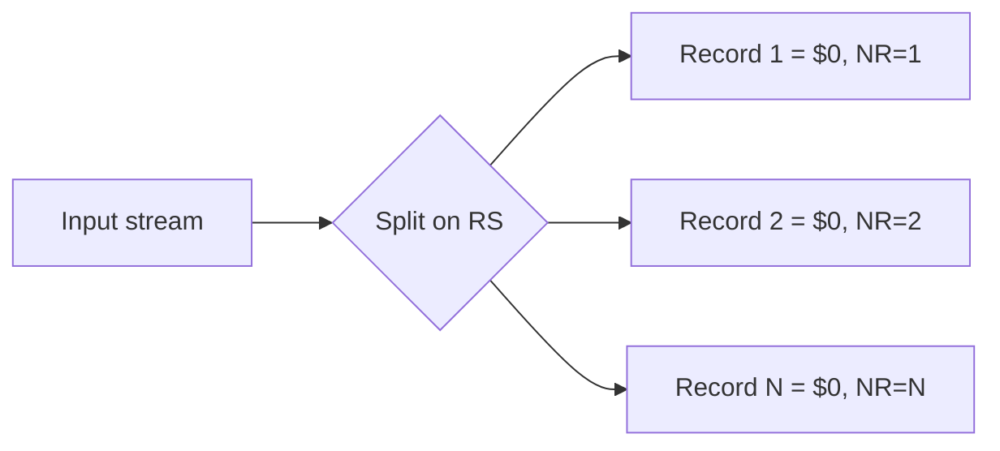

# Record Separator

## Overview

The `RS` (Record Separator) built-in variable in `awk` defines **how input data is split into records**. By default `awk` reads its input one line at a time, so `RS` is the newline character (`\n`) and each line becomes a single record. Overriding `RS` lets you re-slice input on any delimiter — a colon, a comma, a blank line, or even a multi-character string — which is invaluable when parsing structured files such as `/etc/passwd` or flattening delimited data.

> [!NOTE]
> `RS` controls **record** boundaries (how many "rows" `awk` sees), while `FS` controls **field** boundaries (how each record is split into columns). The two are independent and are frequently changed together. See [Field-Separator](Field-Separator.md).

## Concepts

| Variable | Meaning | Default | Set in |
|----------|---------|---------|--------|
| `RS` | Record Separator — splits input into records | Newline (`\n`) | `BEGIN{}` block |
| `NR` | Number of Records processed so far | — | Read-only |
| `$0` | The entire current record | — | Read-only |

- `RS` stands for **Record Separator**.
- The default value of `RS` is a newline (`\n`).
- Changing `RS` changes how the input stream is divided into records.
- `$0` always represents the current record, whatever `RS` is set to.
- `NR` counts records **based on the current `RS` value**, so it changes when you change `RS`.



## Commands

### Default Record Separator (`RS="\n"`)

- Counts total number of line-separated records.

```bash
cat /etc/passwd | awk 'END{print NR}'
```

- Explicitly sets newline as the record separator.

```bash
cat /etc/passwd | awk 'BEGIN{RS="\n"} END{print NR}'
```

- Prints each record using the default newline separator.

```bash
cat /etc/passwd | awk 'BEGIN{RS="\n"} {print $0}'
```

- Preferred syntax without `cat`.

```bash
awk 'END{print NR}' /etc/passwd
```

> [!TIP]
> Prefer passing the filename directly to `awk` instead of piping `cat file | awk`. The `cat` process is unnecessary (a "useless use of cat") and `awk` can open files natively.

### Change Record Separator to `:` (Colon)

When `RS=":"`, `awk` treats every colon-separated value as a new record.

- Splits records using colon (`:`).

```bash
cat /etc/passwd | awk 'BEGIN{RS=":"} {print $0}'
```

- Counts total number of colon-separated records.

```bash
cat /etc/passwd | awk 'BEGIN{RS=":"} END{print NR}'
```

- Prints record number along with each colon-separated record.

```bash
cat /etc/passwd | awk 'BEGIN{RS=":"} {print NR, $0}'
```

### Using Custom Record Separators

- Uses comma (`,`) as record separator.

```bash
echo "one,two,three,four" | awk 'BEGIN{RS=","} {print $0}'
```

- Uses hyphen (`-`) as record separator.

```bash
echo "one-two-three-four" | awk 'BEGIN{RS="-"} {print $0}'
```

## Examples

- Splitting a colon-delimited string into one record per line:

```bash
echo "a:b:c" | awk 'BEGIN{RS=":"} {print $0}'
```

Output:

```text
a
b
c
```

## Best Practices

- Set `RS` in the `BEGIN{}` block so it applies before the first record is read.
- Remember that changing `RS` changes what `NR` counts — verify with a quick `END{print NR}`.
- When you re-slice on a non-newline `RS`, records may still contain embedded newlines; combine with a suitable `FS` if you need clean fields.
- For simple key/value splitting on well-known separators, prefer `RS`/`FS` over chained `cut`/`tr` pipelines for clarity.

## Summary

| Setting | Behavior |
|---------|----------|
| `RS="\n"` | Default behavior — each line is a record. |
| `RS=":"` | Colon-separated values become records. |
| `RS=","` | Comma-separated values become records. |

## Related
- [awk-Command](awk-Command.md) — awk language overview and structure
- [Field-Separator](Field-Separator.md) — complementary `FS` setting for splitting fields
- [Number-of-Records](Number-of-Records.md) — `NR` depends on record splitting
- [$1-$2-Dollars-everywhere]($1-$2-Dollars-everywhere.md) — field references within each record
- [String-Processing](String-Processing.md) — text-processing toolkit overview
- [Linux Administration & Server Hardening](../Readme.md) — Linux administration & server hardening hub
