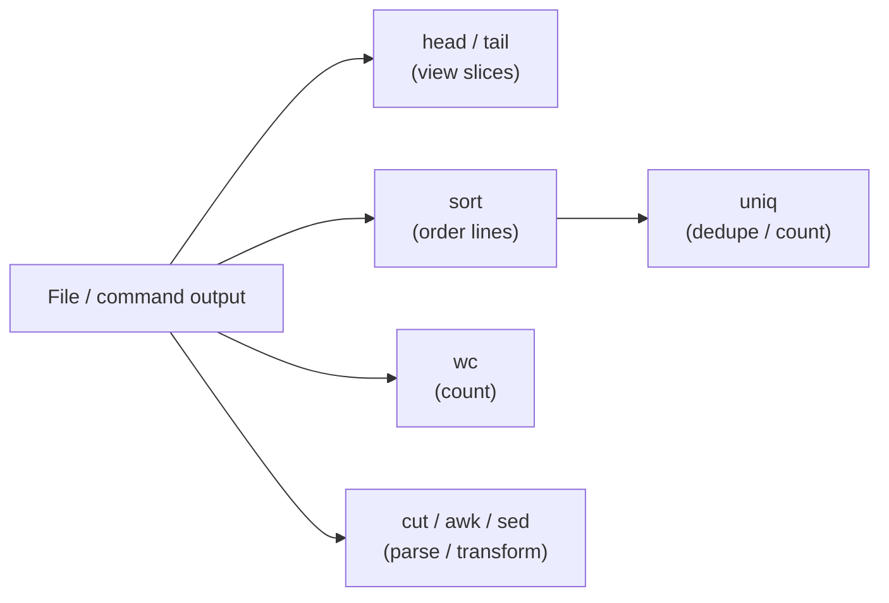

# String Processing

## Overview

**String processing** in Linux refers to the manipulation, transformation, and analysis of text (string) data using command-line utilities. These tools are especially useful when working with log files, configuration files, data files, or the output of other commands. They help in filtering, sorting, counting, and displaying specific parts of text — the everyday work of administering and auditing a Linux system.

Because almost everything in Linux is exposed as text (via files under `/etc`, logs under `/var/log`, and command output), a small toolkit of string-processing commands composed through pipes (`|`) can answer a surprising range of questions without ever writing a full script.

## Concepts

Common use-cases for string processing:

- Viewing parts of files (`head`, `tail`)
- Counting words / lines (`wc`)
- Sorting data (`sort`)
- Filtering duplicates (`uniq`)
- Repeating a command (`watch` for monitoring)
- Parsing and transforming text (`cut`, `awk`, `sed`)

| Command | Purpose | Example Use |
|---|---|---|
| `head` | Shows beginning lines or bytes of file | `head -n 10 file.txt` |
| `tail` | Shows end lines or bytes of file | `tail -n 20 /var/log/syslog` |
| `wc` | Counts lines, words, and characters | `wc -l /etc/passwd` |
| `sort` | Sorts lines in text | `sort -n data.txt` |
| `uniq` | Removes or counts duplicate lines | `sort file.txt \| uniq -c` |
| `watch` | Periodically runs a command | `watch -n 1 uptime` |



## Commands

### Head

The `head` command displays the first few lines or bytes of one or more files.

#### Examples

- Print the first 10 lines of `/etc/passwd`:

```bash
head /etc/passwd
```

- Print the first 10 lines of `/var/log/messages`:

```bash
head /var/log/messages
```

- View `/etc/passwd` with line numbers:

```bash
cat -n /etc/passwd
```

- View first 10 lines of `messages`:

```bash
head messages
```

- Print first 5 lines of `messages`:

```bash
head -n 5 messages
```

- Print first 150 lines of `messages`:

```bash
head -n 150 messages
```

- Print first 4 lines of multiple system files:

```bash
head -n 4 /etc/passwd /etc/shadow /etc/group /etc/gshadow
```

- Verbose mode with filename headers:

```bash
head -v -n 4 /etc/passwd
```

- Display first 500 bytes of `/etc/shadow`:

```bash
head -c 500 /etc/shadow
```

- Display first 5 bytes of two files:

```bash
head -c 5 /etc/shadow /etc/passwd
```

- Display first 4 bytes of four system files:

```bash
head -c 4 /etc/passwd /etc/shadow /etc/group /etc/gshadow
```

- Display first 40 bytes of multiple system files:

```bash
head -c 40 /etc/passwd /etc/shadow /etc/group /etc/gshadow
```

### Tail

The `tail` command displays the last few lines or bytes of files. It is especially helpful for reading logs in real time with the `-f` (follow) option.

#### Examples

- View `/etc/passwd` with line numbers:

```bash
cat -n /etc/passwd
```

- Display last 10 lines of `/etc/passwd`:

```bash
tail /etc/passwd
```

- Display last 10 lines of `/var/log/messages`:

```bash
tail /var/log/messages
```

- View last 20 lines of `messages`:

```bash
tail -n 20 /var/log/messages
```

- View last 5 lines of multiple system files:

```bash
tail -n 5 /etc/passwd /etc/shadow /etc/group /etc/gshadow
```

- Tail multiple files:

```bash
tail /etc/passwd /etc/shadow
```

- Verbose file name output:

```bash
tail -v /var/log/messages
```

- Tail with verbose output on multiple files:

```bash
tail -n 5 -v /etc/passwd /etc/shadow
```

- Verbose mode with 3 lines from end:

```bash
tail -v -n 3 /var/log/messages
```

- Read last 500 bytes of a file:

```bash
tail -c 500 /etc/passwd
```

- Read last 50 bytes with verbose output:

```bash
tail -c 50 -v /etc/passwd /etc/shadow
```

- Follow live updates to log file:

```bash
tail -f /var/log/messages
```

- Follow Apache access logs:

```bash
tail -f /var/log/apache2/access.log
```

- Follow HTTPD access logs:

```bash
tail -f /var/log/httpd/access_log
```

> [!TIP]
> `tail -f` streams new lines as they are written — the fastest way to watch authentication attempts or web-server hits during an engagement or while debugging.

### WC (Word Count)

The `wc` command prints the number of lines, words, and characters in a file.

#### Examples

- Count lines, words, and characters in `/etc/passwd`:

```bash
wc /etc/passwd
```

- Count in log file:

```bash
wc /var/log/messages
```

- Line count only:

```bash
wc -l /var/log/messages
```

- Word count only:

```bash
wc -w /var/log/messages
```

- Character count only:

```bash
wc -c /var/log/messages
```

- Multiple files:

```bash
wc /etc/passwd /etc/shadow /etc/group /etc/gshadow
```

- All `.conf` files in `/etc`:

```bash
wc /etc/*.conf
```

- All files in current directory:

```bash
wc *
```

- Line count for all files:

```bash
wc -l *
```

- Count files/folders in current directory:

```bash
ls | wc -l
```

- Files in `/etc`:

```bash
ls /etc/ | wc -l
```

- Include hidden files:

```bash
ls -a /etc/ | wc -l
```

- One entry per line:

```bash
ls -a1 | wc -l
```

- Processes running:

```bash
ps -aux | wc -l
```

### Sort

The `sort` command sorts lines from text files.

#### Input File Examples

```bash
vim test.txt
```

- Contains fruits, numbers, names, and mixed-case entries for sorting tests.

```text
banana  
apple  
cherry  
date  
elderberry  
fig  
grape  
20  
5  
100  
45  
2  
8  
90  
Banana  
apple  
Cherry  
date  
Elderberry  
Fig  
grape  
John 25  
Alice 30  
Bob 22  
Eve 35  
Charlie 28  
Diana 30  
John,25,Engineer  
Alice,30,Manager  
Bob,22,Intern  
Eve,35,Director  
Charlie,28,Analyst  
Diana,30,Consultant  
March  
January  
February  
December  
November  
April  
apple  
banana  
apple  
cherry  
banana  
date  
cherry
```

```bash
vim datafile.txt
```

```text
John 25
Alice 30
Bob 22
Eve 35
Charlie 28
Diana 30
```

```bash
vim datafile2.txt
```

```text
John,25,Engineer
Alice,30,Manager
Bob,22,Intern
Eve,35,Director
Charlie,28,Analyst
Diana,30,Consultant
```

```bash
vim month-name.txt
```

```text
March
January
February
December
November
April
```

```bash
vim duplicates.txt
```

```text
apple
banana
apple
cherry
banana
cherry
```

#### Sort Options Reference

| Option | Meaning |
|--------|---------|
| `-n` | Numeric sort |
| `-h` | Human-readable numeric sort (e.g. `2K`, `1G`) |
| `-d` | Dictionary order (only blanks and alphanumerics) |
| `-r` | Reverse the result order |
| `-u` / `--unique` | Output only the first of equal lines |
| `-R` | Random shuffle |
| `-M` | Sort by month name |
| `-k N` | Sort by key/column `N` |
| `-t C` | Use character `C` as the field delimiter |

#### Basic Sort Commands

- Sort default:

```bash
sort test.txt
```

- Human-readable number sort:

```bash
sort -h test.txt
```

- Dictionary order sort:

```bash
sort -d test.txt
```

- Numeric sort:

```bash
sort -n test.txt
```

- Reverse sort:

```bash
sort -r test.txt
```

- Reverse numeric:

```bash
sort -r -n test.txt
```

- Human-readable reverse sort:

```bash
sort -hr test.txt
```

- Unique numeric sort:

```bash
sort -u -n test.txt
```

- Alternative unique numeric:

```bash
sort -un test.txt
```

- Reverse human-readable sort:

```bash
sort -r -h test.txt
```

- Unique sort from file:

```bash
sort --unique -n test.txt
```

- Random sort:

```bash
sort -R test.txt
```

#### Sort with Column and Delimiter

- Sort by numeric value in column 1:

```bash
sort -h -k 1 datafile.txt
```

- Sort by numeric value in column 2:

```bash
sort -h -k 2 datafile.txt
```

- Sort comma-separated entries by name:

```bash
sort datafile2.txt
```

- Use `,` as delimiter:

```bash
sort -t ',' datafile2.txt
```

- Sort by age (2nd column):

```bash
sort -t ',' -k 2 datafile2.txt
```

- Sort by designation (3rd column):

```bash
sort -t ',' -k 3 datafile2.txt
```

- Sort by name (1st column):

```bash
sort -k 1 -t ',' datafile2.txt
```

- Sort by numeric age:

```bash
sort -k 2 -t ',' datafile2.txt
```

- Human-readable sort on 3rd column:

```bash
sort -h -k 3 -t ',' datafile2.txt
```

- Regular sort on 3rd column:

```bash
sort -k 3 -t ',' datafile2.txt
```

#### Month Sort

- Default alphabetical:

```bash
sort month-name.txt
```

- Human readable:

```bash
sort -h month-name.txt
```

- Dictionary order:

```bash
sort -d month-name.txt
```

- By actual month order:

```bash
sort -M month-name.txt
```

#### Sort and Remove Duplicates

- Sort:

```bash
sort duplicates.txt
```

- Unique entries only:

```bash
sort -u duplicates.txt
```

- Direct use of `uniq`:

```bash
uniq duplicates.txt
```

- Sort then remove duplicates:

```bash
sort duplicates.txt | uniq
```

- Sort, then count duplicates:

```bash
sort duplicates.txt | uniq -c
```

- Using `sort -u` with piped input:

```bash
cat no.txt | sort -u
```

- Another method:

```bash
sort -u no.txt
```

- Sort and remove duplicates:

```bash
sort no.txt | uniq
```

- Count repeated lines:

```bash
cat no.txt | sort | uniq -c
```

> [!IMPORTANT]
> `uniq` only collapses **adjacent** duplicate lines, so the input must be sorted first. `sort file | uniq` (or `sort -u file`) is the reliable idiom for de-duplicating unsorted data.

### Watch

The `watch` command re-runs a command at a fixed interval for real-time monitoring.

#### Examples

- Refresh `w` every 5 seconds:

```bash
watch -n 5 w
```

- Monitor GPU usage every 0.01 seconds:

```bash
watch -n 0.01 nvidia-smi
```

## Best Practices

- Compose small tools with pipes (`|`) rather than reaching for a script — `sort | uniq -c | sort -rn` is a classic frequency-count idiom.
- Prefer passing filenames directly to a command over `cat file | command` where the command can open files itself.
- Use `head`/`tail` to sample large files before running heavier processing, and `wc -l` to gauge dataset size first.

## Related
- [awk-Command](awk-Command.md) — field-based text processing
- [sed](sed.md) — stream editing and substitution
- [cut-Command](cut-Command.md) — extract columns from lines
- [paste-Command](paste-Command.md) — merge lines of files side by side
- [grep-Command](grep-Command.md) — search text for patterns
- [Linux Administration & Server Hardening](../Readme.md) — Linux administration & server hardening hub
