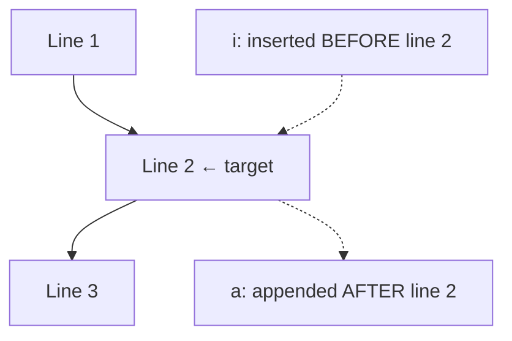

# a (Append) and i (Prepend)

## Overview

The `a` (append) and `i` (insert) commands are two of `sed`'s line-editing operations. They add **whole new lines** of text to the stream relative to a matched line or line number — `a` places text **after** the target, `i` places it **before**. Unlike the substitute command (`s`), they do not modify existing content; they only inject additional lines. This is useful for stamping headers, footers, separators, or annotation lines into files and command output.

> [!NOTE]
> By default `sed` writes to standard output and does **not** modify the source file. Add the `-i` flag to edit the file in place (see [-i-option-Changing-files-for-sure](-i-option-Changing-files-for-sure.md)).

## Concepts

| Command | Action | Position |
|---------|--------|----------|
| `a` | Append text | **After** the matched line / line number |
| `i` | Insert (prepend) text | **Before** the matched line / line number |

- `a` → **append text after** the matched line or line number.
- `i` → **insert text before** the matched line or line number.



## Commands

### Append After Matching Pattern

- Append **`ARMOUR User`** after the line containing `armour`.

```bash
sed '/armour/a ARMOUR User' user-list.txt
```

### Insert Before Matching Pattern

- Insert **`ARMOUR User`** before the line containing `armour`.

```bash
sed '/armour/i ARMOUR User' user-list.txt
```

### Append After Specific Line Number

- Append **`ARMOUR user`** after line `2`.

```bash
sed '2a ARMOUR user' user-list.txt
```

- Append **`ARMOUR USER`** after line `7`.

```bash
sed '7a ARMOUR USER' user-list.txt
```

### Insert Before Specific Line Number

- Insert **`ARMOUR USER`** before line `2`.

```bash
sed '2i ARMOUR USER' user-list.txt
```

- Insert **`ARMOUR USER`** before line `1`.

```bash
sed '1i ARMOUR USER' user-list.txt
```

- Insert **`ARMOUR user`** before line `5`.

```bash
sed '5i ARMOUR user' user-list.txt
```

### Append After Line 1

- Append **`ARMOUR USER`** after line `1`.

```bash
sed '1a ARMOUR USER' user-list.txt
```

### Append Separator Lines

- Append a line of dashes after line `1`.

```bash
sed '1a ----------------------------------------------------------------------' user-list.txt
```

- Append a line of dashes after each line from line `1` to `3`.

```bash
sed '1,3a ----------------------------------------------------------------------' user-list.txt
```

- Append a line of dashes after every line in the file.

```bash
sed '1,$a ----------------------------------------------------------------------' user-list.txt
```

### Insert Separator Lines

- Insert a line of dashes before every line in the file.

```bash
sed '1,$i ----------------------------------------------------------------------' user-list.txt
```

- Insert a line of dashes before each line from line `1` to `3`.

```bash
sed '1,3i ----------------------------------------' user-list.txt
```

## Best Practices

- Preview changes to standard output first; only add `-i` once the result is confirmed correct.
- The range `1,$` means "from line 1 to the last line" — use it to apply an operation to the entire file.
- `a` and `i` add lines; use `c` to **replace** a line instead (see [c-(change-command)](c-(change-command).md)), and `d` to **remove** one (see [d-(delete-command)](d-(delete-command).md)).

> [!WARNING]
> `sed -i` overwrites the target file with no undo. Keep a backup (`sed -i.bak ...`) or work on a copy when editing important configuration files.

## Related
- [sed](sed.md) — parent sed stream editor
- [c-(change-command)](c-(change-command).md) — replaces lines vs appending
- [d-(delete-command)](d-(delete-command).md) — opposite line-editing operation
- [-i-option-Changing-files-for-sure](-i-option-Changing-files-for-sure.md) — edit files in place
- [String-Processing](String-Processing.md) — text-processing hub
- [Linux Administration & Server Hardening](../Readme.md) — Linux administration & server hardening hub
