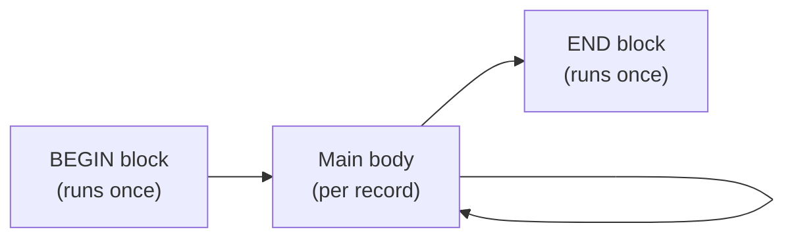

# awk Command

## Overview

`awk` is a powerful **pattern-scanning and data-processing language** used to extract and transform text from files with structured content. It reads input one record (line) at a time, automatically splits each record into fields, and runs user-supplied rules against them. Named after its authors (Aho, Weinberger, Kernighan), `awk` sits alongside `sed` and `grep` as one of the core Unix text-processing tools — but its field awareness and built-in arithmetic and formatting make it the tool of choice for column-oriented data such as `/etc/passwd`, `ps` output, and `ifconfig` output.

## Concepts

`awk` programs are built from three optional blocks that execute at different phases of processing:

| Block | Runs | Typical use |
|-------|------|-------------|
| `BEGIN { }` | Once, **before** any input is read | Print headers, set `FS`/`RS`, initialise variables |
| `{ }` (main body) | Once **per input record** | Match patterns, print/transform fields |
| `END { }` | Once, **after** all input is read | Print footers, totals, summaries |



### AWK Structure

```awk
awk 'BEGIN { code_in_BEGIN_section }        # Executed once before input

     { code_in_Main_Body_section }          # Executed for every line

     END { code_in_END_section }'           # Executed once after input
```

> [!NOTE]
> Example:

```bash
awk 'BEGIN{print "START PRINT"} {print $0} END{print "END PRINT"}' file.txt
```

## Commands

### Basic Printing

- Prints all lines from `/etc/passwd`.

```bash
awk '{print $0}' /etc/passwd
```

- Prints all lines from both `/etc/passwd` and `/etc/shadow`.

```bash
awk '{print $0}' /etc/passwd /etc/shadow
```

### Using Field Separator (-F)

> [!TIP]
> `-F:` tells `awk` to split each record on the colon character. Fields are then referenced as `$1`, `$2`, … and the whole record as `$0`. See [Field-Separator](Field-Separator.md) and [$1-$2-Dollars-everywhere]($1-$2-Dollars-everywhere.md).

- Prints the first field (username) using colon `:` as the delimiter.

```bash
awk -F: '{print $1}' /etc/passwd
```

- Prints username and full name (fields 1 and 5).

```bash
awk -F: '{print $1,$5}' /etc/passwd
```

- Prints username, full name, and home directory (fields 1, 5, and 6).

```bash
awk -F: '{print $1,$5,$6}' /etc/passwd
```

### Pattern Matching

- Prints lines from `/etc/passwd` that contain `root`.

```bash
awk -F: '/root/{print $0}' /etc/passwd
```

### Using AWK with ifconfig

- Prints all lines from `ifconfig`.

```bash
ifconfig | awk '{print $0}'
```

- Prints only the first field.

```bash
ifconfig | awk '{print $1}'
```

- Prints only the second field.

```bash
ifconfig | awk '{print $2}'
```

- Prints only the third field.

```bash
ifconfig | awk '{print $3}'
```

- Prints the first and second fields.

```bash
ifconfig | awk '{print $1,$2}'
```

- Prints lines that contain `inet`.

```bash
ifconfig | awk '/inet/{print $0}'
```

- Prints the second field from lines that contain `inet`.

```bash
ifconfig | awk '/inet/{print $2}'
```

- Filters strictly `inet` lines with a space and prints the second field.

```bash
ifconfig | awk '/inet /{print $2}'
```

- Prints MAC addresses from lines containing `ether`.

```bash
ifconfig | awk '/ether/{print $2}'
```

## Examples

### AWK Structure with BEGIN, Main Body, and END

- Prints headers, processes each line, and prints a footer.

```bash
awk 'BEGIN { print "Start Processing..." }
     { print "Line:", NR, "Content:", $0 }
     END { print "Processing Finished!" }' file.txt
```

- Adds a header before IP addresses and a footer after processing.

```bash
ifconfig | awk 'BEGIN{ print "=== IP Add ==="} /inet /{print $2} END{print "=============="}'
```

### Simple One-Liners

- Prints a literal string through `BEGIN`, main body, and `END`.

```bash
echo "one two three four" | awk 'BEGIN{print "demo"} {print "demo1"} END{print "demo2"}'
```

- Prints only the `BEGIN` block message.

```bash
echo "one two three four" | awk 'BEGIN{print "demo"}'
```

- Prints only the `END` block message.

```bash
echo "one two three four" | awk 'END{print "demo2"}'
```

- Prints a formatted header, body, and footer for the input line.

```bash
echo "one two three four" | awk 'BEGIN{print "====== Title ======"} {print $0} END{print "-------------------"}'
```

- Processes `/etc/passwd` with a heading and footer.

```bash
awk 'BEGIN{print "====== Passwd File ======"} {print $0} END{print "-------------------"}' /etc/passwd
```

## Best Practices

- Set `FS` and `RS` in the `BEGIN{}` block (or via `-F`) so they take effect before the first record is read.
- Pass filenames directly to `awk` rather than piping `cat file | awk` — it saves a process and reads more clearly.
- Use `NR` for a running record count and the `END{}` block for totals and summaries.
- Quote the entire `awk` program in single quotes so the shell does not expand `$1`, `$2`, etc.

## Related
- [String-Processing](String-Processing.md) — text-processing toolkit overview
- [Field-Separator](Field-Separator.md) — controls field splitting (`FS` / `-F`)
- [Record-Separator](Record-Separator.md) — controls record splitting (`RS`)
- [print-BEGIN{}-{}-END{}](print-BEGIN{}-{}-END{}.md) — core output construct
- [Searching-Pattern](Searching-Pattern.md) — pattern-matching with awk
- [$1-$2-Dollars-everywhere]($1-$2-Dollars-everywhere.md) — field references
- [Number-of-Records](Number-of-Records.md) — the `NR` built-in variable
- [Number-of-Fields](Number-of-Fields.md) — the `NF` built-in variable
- [sed](sed.md) — companion stream editor
- [Linux Administration & Server Hardening](../Readme.md) — Linux administration & server hardening hub
