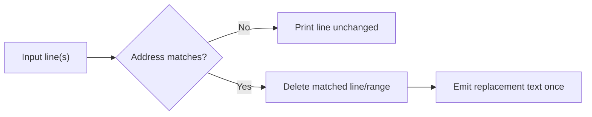

# `c` (Change Command) in `sed`

## Overview

The `c` (change) command in `sed` replaces the **entire matched line or line range** with new content. Unlike `s` (substitute), which edits *part* of a line, `c` discards the whole line (or range) and emits the replacement text in its place. It is the fastest way to overwrite a header, swap out a matching record, or collapse a block of lines into a single canonical line.

> [!NOTE]
> `c` operates on whole lines only. There is no partial-line change — for in-line edits use the [s (substitute) command](s-(substitute-command).md).

## Concepts

| Behaviour | Description |
|---|---|
| Line replacement | The matched line is deleted and replaced with the supplied text |
| Range collapse | A range (`1,4c`) replaces **all** lines in the range with **one** line |
| Address forms | Works with line numbers (`1c`), ranges (`1,4c`), and patterns (`/regex/c`) |
| Non-destructive by default | Output goes to stdout; the source file is unchanged unless `-i` is used |



## Commands

### Change Lines Matching a Pattern

- Change the entire line containing `armour` to `ARMOUR User`.

```bash
sed '/armour/c ARMOUR User' user-list.txt
```

- Change the line containing `armour` to `Armour`.

```bash
sed '/armour/c Armour' user-list.txt
```

### Change Specific Line Numbers

- Replace line `1` with `ARMOUR`.

```bash
sed '1c ARMOUR' user-list.txt
```

### Change a Range of Lines

- Replace lines `1` to `4` with a single line: `ARMOUR`.

```bash
sed '1,4c ARMOUR' user-list.txt
```

## Best Practices

- Preview first: run the command without `-i` to confirm the replacement is correct before writing changes in place.
- Remember that a range collapses to **one** line — if you need to keep each line, iterate or use `s` instead.
- Keep replacement text simple; multi-line `c` replacements require a trailing `\` on GNU `sed` and are easy to get wrong.

## Security Considerations

> [!WARNING]
> When editing system files (for example `/etc/passwd` or a service config) with `sed -i`, always take a backup first (`sed -i.bak …`). A mis-scoped address can silently overwrite critical records, and `c` gives no partial-match safety net because it replaces the whole line.

## Troubleshooting

| Symptom | Cause | Fix |
|---|---|---|
| Replacement text not applied | Address (pattern/line number) never matched | Verify the pattern with `sed -n '/regex/p' file` first |
| Whole range became one line | Expected behaviour of `c` with a range | Use `s` per line, or `a`/`i` to add lines |
| `sed: -e expression … unterminated` | Missing quote or stray delimiter | Wrap the script in single quotes and check escaping |

## Related
- [sed](sed.md) — parent `sed` command reference
- [a (append) and i (insert)](a-(append)-and-i(prepand).md) — add new lines around a match instead of replacing
- [d (delete)](d-(delete-command).md) — delete a line versus changing it
- [s (substitute)](s-(substitute-command).md) — in-line substitution alternative
- [String-Processing](String-Processing.md) — text-processing toolkit hub
- [Linux Administration & Server Hardening](../Readme.md) — Linux administration & server hardening hub
